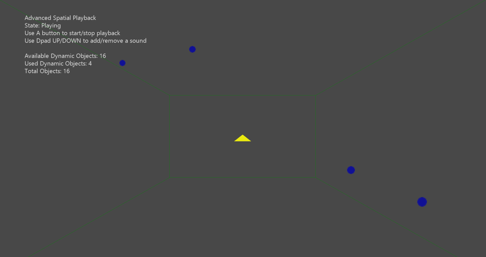

# 高度な空間音響サンプル

*このサンプルは、Microsoft ゲーム開発キットのプレビュー (2019 年 11 月)
に対応しています。*

# 説明

このサンプルは、ISpatialAudioClient を使用して、Windows Sonic
テクノロジを使用して静的および動的な位置のオーディオを再生する方法を示しています。
静的ベッドは起動時に再生され、ランダム
パスに従う動的サウンドを追加および削除できます

# サンプルの作成

Xbox One の devkit を使用している場合は、アクティブなソリューション
プラットフォームを Gaming.Xbox.XboxOne.x64 に設定します。

Project Scarlett を使用している場合は、アクティブなソリューション
プラットフォームを Gaming.Xbox.Scarlett.x64 に設定します。

*詳細については、*GDK ドキュメントの
「サンプルの実行」を参照してください。

# サンプルの使用

| 実施  |  コ ントローラー  |
|------------------------------------------------------|---------------|
| 再生の開始/停止                                      |  A ボタン      |
| 動的サウンドを追加  |  方 向パッドの上  |
| 動的サウンドを削除  |  方 向パッドの下  |
| 終了  |  \[表示\]ボタン        |

# 実装に関する注意事項

このサンプルは、ISpatialAudioClient
を使用して、空間テクノロジを使用して静的および動的な位置のサウンドを再生する方法を示しています。
ISpatialAudioClient
が初期化されて開始されると、コールバックを使用してバッファ
フレームを要求します。

# 更新履歴

初期リリース: 2019 年 3 月
