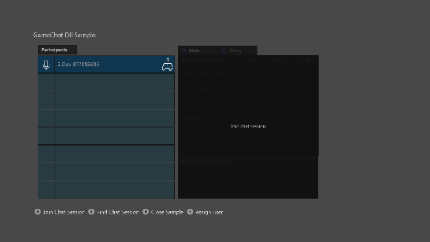
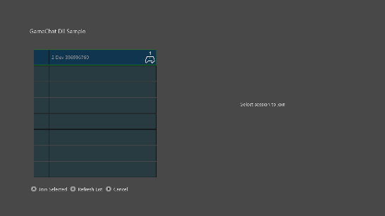
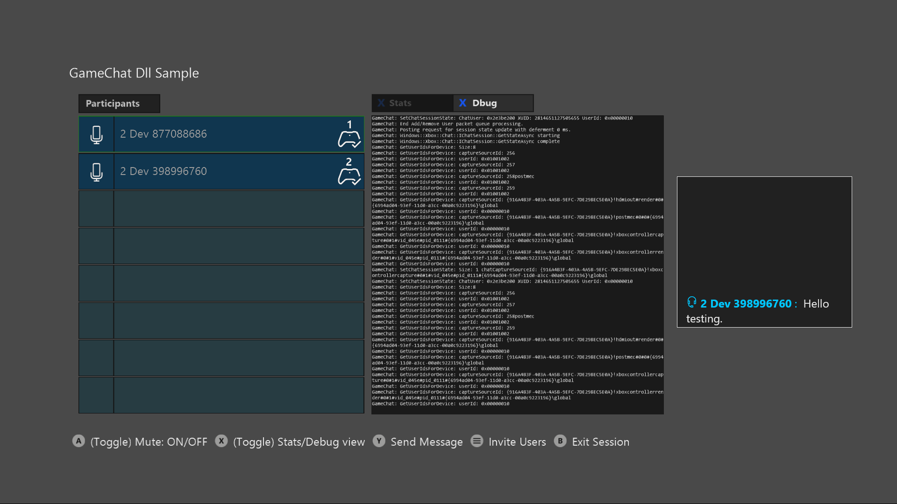

  

#   InGameChat Sample

*This sample is compatible with the Microsoft Game Development Kit
(March 2022)*

# 

# Description

The InGameChat sample provides a working example of integrating the
GameChat2 library into an Xbox title. It brings together the pieces
needed to demonstrate in-title VOIP communications: GameChat,
Multiplayer Sessions, and Peer Networking.

# Building the sample

If using an Xbox One devkit, set the active solution platform to `Gaming.Xbox.XboxOne.x64`.

If using Project Scarlett, set the active solution platform to `Gaming.Xbox.Scarlett.x64`.

If using Windows Desktop, set the active solution platform to `x64`.

*For more information, see* __Running samples__, *in the GDK documentation.*

# Using the sample

You will need at least two Xbox One kits each with a microphone and
speaker. These can be Kinect, mono and stereo headsets, TV speakers,
etc. You will need a valid Xbox Live user for each kit and it helps if
they are friends. The Xboxes and user accounts should be configured for
the XDKS.1 sandbox.

## Local Lobby

| Action                                           |  Gamepad           |
|--------------------------------------------------|-------------------|
| Start your own chat session where you can invite users or they can join you |  A button |
| Search for open chat sessions in your social graph |  X button |

## Select A Session

| Action                                          |  Gamepad            |
|-------------------------------------------------|--------------------|
| Select between list items                       |  D-Pad Up/Down      |
| Refresh the list                                |  X button           |
| Go back                                         |  B button           |

## Chat Session

| Action                                 |  Gamepad                     |
|----------------------------------------|-----------------------------|
| Select a user in the list              |  D-Pad Up/Down               |
| Toggle mute for selected user          |  A button                    |
| Toggle between Stats panel and Debug panel |  X button |
| Send a text message                    |  Y button                    |
| Invite users                           |  Menu button                 |
| Go back                                |  B button                    |

# Implementation notes

The main purpose of this sample is to demonstrate integrating GameChat2
into your title. GameChat2 is controlled through the
xbox::services::game_chat_2::chat_manager::singleton_instance() class.
This class is wrapped up into the GameChatManager. The manager is the
interface between GameChat and your title. It handles interfacing with
the peer network and multiplayer session members.

The GameChatManager.cpp/.h files are called out to aid in understanding
and should be the primary focus of the sample.

The remaining code is there to facilitate end-to-end VOIP. It was
written to be simple and straightforward rather than performant or
production ready. We do not recommend using other parts of the sample
directly or to use it as a canonical example for things other than its
intended purpose.

# Update history

June, 2019 -- Created

November, 2020 -- Updated to use PlayFab Party for networking

June, 2022 -- Updated to use March GDK 2022 and MicrosoftGameConfig.mgc
