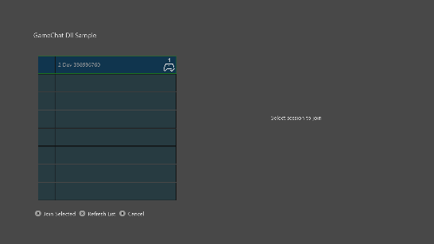

  

#   InGameChat 샘플

*이 샘플은 Microsoft 게임 개발 키트 미리 보기와 호환됩니다(2019년
11월).*

# 

# 설명

InGameChat 샘플에서는 GameChat2 라이브러리를 Xbox 타이틀에 통합하는
작업을 수행하는 예제를 제공합니다. 타이틀 내 VOIP 통신을 보여 주는 데
필요한 요소를 한데 모읍니다. 여기에는 GameChat, 멀티 플레이어 세션, 피어
네트워킹이 포함됩니다.

# 샘플 빌드하기

Xbox One devkit을 사용하는 경우 활성 솔루션 플랫폼을
Gaming.Xbox.XboxOne.x64로 설정하세요.

Project Scarlett을 사용하는 경우 활성 솔루션 플랫폼을
Gaming.Xbox.Scarlett.x64로 설정하세요.

*자세한 내용은 GDK 문서에서* 샘플 실행하기*를 참조하세요.*

# 샘플 사용하기

마이크와 스피커가 포함된 두 개 이상의 Xbox One 키트가 필요합니다.
Kinect, 모노, 스테레오 헤드셋, TV 스피커 등이 있습니다. 각 키트에 유효한
Xbox Live 사용자가 필요하며 둘이 친구면 도움이 됩니다. XDKS.1 샌드박스에
맞게 Xbox와 사용자 계정을 구성해야 합니다.

## 로컬 로비

| 작업                                             |  게임패드          |
|--------------------------------------------------|-------------------|
| 사용자를 초대할 수 있거나 사용자가 참여할 수 있는 나만의 채팅 세션을 시작 |  A 버튼 |
| 소셜 그래프에서 열린 채팅 세션 검색              |  X 버튼            |

## 세션 선택

| 작업                                            |  게임패드           |
|-------------------------------------------------|--------------------|
| 목록 항목 간 선택                               |  D-패드 위/아래로   |
| 목록 새로 고침                                  |  X 버튼             |
| 뒤로 가기                                       |  B 버튼             |

## 채팅 세션

| 작업                                   |  게임패드                    |
|----------------------------------------|-----------------------------|
| 목록에서 사용자 선택                   |  D-패드 위/아래로            |
| 선택한 사용자에 대한 음소거 설정/해제  |  A 버튼                      |
| 통계 패널과 디버그 패널 간 전환        |  X 버튼                      |
| 문자 메시지 보내기                     |  Y 버튼                      |
| 사용자 초대                            |  메뉴 버튼                   |
| 뒤로 가기                              |  B 버튼                      |

# 구현 참고 사항

이 샘플의 주요 목적은 GameChat2를 타이틀에 통합하는 방법을 보여 주는
것입니다. GameChat2는
xbox::services::game_chat_2::chat_manager::singleton_instance() 클래스를
통해 제어됩니다. 이 클래스는 GameChatManager에 래핑됩니다. 관리자는
GameChat과 타이틀 사이의 인터페이스입니다. 피어 네트워크 및 멀티
플레이어 세션 멤버와의 상호 작용을 처리합니다.

GameChatManager.cpp/.h 파일은 이해를 돕기 위해 호출되며, 샘플의 주요
포커스여야 합니다.

나머지 코드는 엔드투엔드 VOIP를 용이하게 하기 위한 것입니다. 잘
작동하거나 제작 준비가 되도록 작성되었다고 하기보다 단순하고 쉽게
작성되었습니다. 샘플의 다른 부분을 직접 사용하거나 의도된 목적 외의
목적으로 표준 예제로 사용하지 않는 것이 좋습니다.

# 업데이트 기록

2019년 6월 - 생성됨
