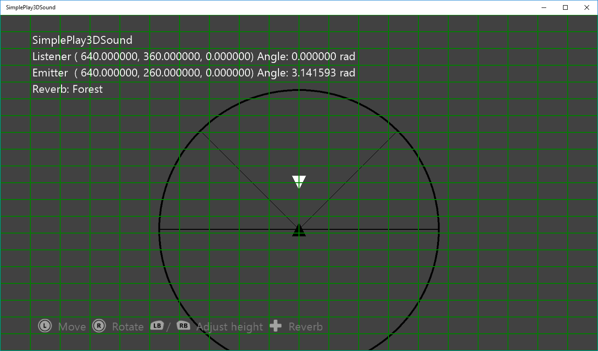

# 단순 3D 음향 재생 샘플

*이 샘플은 Microsoft 게임 개발 키트(2020년 6월)와 호환 가능합니다.*

# 설명

이 샘플은 XAudio2 및 X3DAudio를 사용하여 Xbox One에서 위치 오디오를 재생하는 방법을 보여줍니다. 수신기는 정적(흰 삼각형으로 표시)이며, 송신기(검은 삼각형으로 표시)는 3D 공간에서 이동할 수 있지만, 보기는 위에서 아래로 이동합니다. 수신기 주위의 원은 수신기의 원뿔 내부 및 외부 범위를 나타내는 선이 있는 감쇠 곡선의 끝을 나타냅니다. [일반적인 오디오 개념](https://msdn.microsoft.com/en-us/library/windows/desktop/ee415692%28v=vs.85%29.aspx)에서 이러한 용어에 대한 세부 정보를 알아보세요.

# 샘플 빌드

Xbox One 개발 키트를 사용하는 경우 활성 솔루션 플랫폼을 `Gaming.Xbox.XboxOne.x64`(으)로 설정합니다.

Project Scarlett을 사용하는 경우 활성 솔루션 플랫폼을 `Gaming.Xbox.Scarlett.x64`(으)로 설정합니다.

*GDK 설명서의* __샘플 실행__에서 *자세한 내용을 알아보세요.*

# 샘플 사용

| 동작 | Gamepad |
|---|---|
| 송신기 이동 | 왼쪽 엄지스틱 |
| 송신기 회전 | 오른쪽 엄지스틱 |
| 송신기 높이 조정 | 왼쪽/오른쪽 어깨 버튼 |
| 송신기 위치 초기화 | 왼쪽/오른쪽 엄지스틱 |
| 반향 유형 변경 | 방향 패드 위/아래 |

# 구현 참고 사항

이 샘플은 X3DAudio와 함께 XAudio2를 사용하여 위치 사운드를 재생하는 방법을 보여줍니다. XAudio2가 초기화되면 반향을 위한 하위 믹스 채널이 추가되고, wav 파일이 무한 반복으로 재생됩니다. 각 업데이트는 송신기의 현재 위치를 사용하여 위치와 방향을 고려한 X3DAudio DSP 설정을 계산합니다.

# 개인정보처리방침

샘플을 컴파일하고 실행하는 경우 샘플 사용량을 추적할 수 있도록 샘플 실행 파일의 파일 이름이 Microsoft에 전송됩니다. 이 데이터 수집을 옵트아웃하려면 Main.cpp에서 "샘플 사용량 원격 분석"이라는 레이블이 지정된 코드 블록을 제거할 수 있습니다.

일반적인 Microsoft의 개인 정보 정책에 대한 자세한 내용은 [Microsoft 개인정보처리방침](https://privacy.microsoft.com/en-us/privacystatement/)을 참조하세요.

