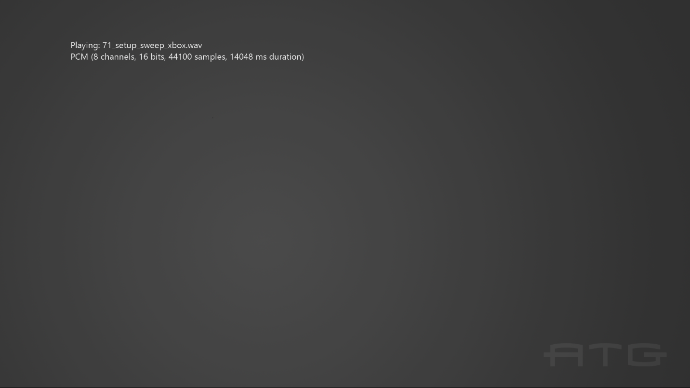

# シンプルな再生サウンドのサンプル

*このサンプルは Microsoft Game Development Kit (2020 年 6 月) と互換性があります*

# 説明

このサンプルでは、Xbox One で XAudio2 を使用して wav ファイルを再生する方法を示します。

# サンプルのビルド

Xbox One 開発キットを使用している場合は、アクティブなソリューション プラットフォームを `Gaming.Xbox.XboxOne.x64` に設定します。

Project Scarlett を使用している場合は、アクティブなソリューション プラットフォームを `Gaming.Xbox.Scarlett.x64` に設定します。

*詳細については、* *GDK ドキュメント*の「__サンプルの実行__」を参照してください。

# サンプルの使用方法

サンプルには、[表示] ボタンを使用して終了する以外のコントロールはありません。 各ファイルが完了すると、サンプルの wav ファイルが自動的に進みます。

# 実装メモ

このサンプルでは、PCM、ADPCM、xWMA、XMA2 形式の wav ファイルを再生する方法を示します。 これは、*ATG T ツール キット* ファイル **WAVFileReader.h/.cpp** のヘルパー コードを使用します。 これにより、サポートされているサウンド形式の再生時間を計算するためのコードと共に、単純な wav ファイル パーサーが実装されます。

# プライバシーにかんするせいめい

サンプルをコンパイルして実行する場合、サンプルの使用状況を追跡するために、サンプルの実行可能ファイルのファイル名が Microsoft に送信されます。 このデータ コレクションからオプトアウトするには、Main.cpp の "サンプル使用状況テレメトリ" というラベルの付いたコードのブロックを削除します。

Microsoft のプライバシー ポリシー全般の詳細については、「[Microsoft のプライバシーに関する声明](https://privacy.microsoft.com/en-us/privacystatement/)」を参照してください。

