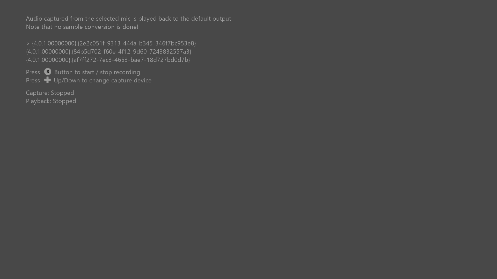

# 単純な WASAPI キャプチャ のサンプル

*このサンプルは Microsoft Game Development Kit (2020 年 6 月) と互換性があります*

# 説明

このサンプルでは、Xbox One で WASAPI を使用してオーディオをキャプチャする方法を示します。

# サンプルのビルド

Xbox One 開発キットを使用している場合は、アクティブなソリューション プラットフォームを `Gaming.Xbox.XboxOne.x64` に設定します。

Project Scarlett を使用している場合は、アクティブなソリューション プラットフォームを `Gaming.Xbox.Scarlett.x64` に設定します。

*詳細については、* *GDK ドキュメント*の「__サンプルの実行__」を参照してください。

# サンプルの使用方法

ゲームパッドを使用してキャプチャ デバイスを選択します。 このサンプルでは、既定のオーディオ レンダリングが自動的に使用されます。 **キャプチャとレンダリングの間にサンプル レート変換がないため、レートが一致しない限り再生は正しく聞こえないことに注意してください。**

# 実装メモ

このサンプルでは、WASAPI を使用してオーディオをキャプチャする方法を示します。 キャプチャされたサンプルは円形バッファーに配置され、サンプルのレンダリングに使用されます。 この例では、レンダラーとキャプチャの間で共有 WASAPI インスタンスも使用します。 WASAPI のより高度な使用方法については、「[Windows WASAPI サンプル](https://code.msdn.microsoft.com/windowsapps/Windows-Audio-Session-22dcab6b)」を参照してください

# 更新履歴

初期リリース 2019 年 5 月

# プライバシーにかんするせいめい

サンプルをコンパイルして実行する場合、サンプルの使用状況を追跡するために、サンプルの実行可能ファイルのファイル名が Microsoft に送信されます。 このデータ コレクションからオプトアウトするには、Main.cpp の "サンプル使用状況テレメトリ" というラベルの付いたコードのブロックを削除します。

Microsoft のプライバシー ポリシー全般の詳細については、「[Microsoft のプライバシーに関する声明](https://privacy.microsoft.com/en-us/privacystatement/)」を参照してください。

