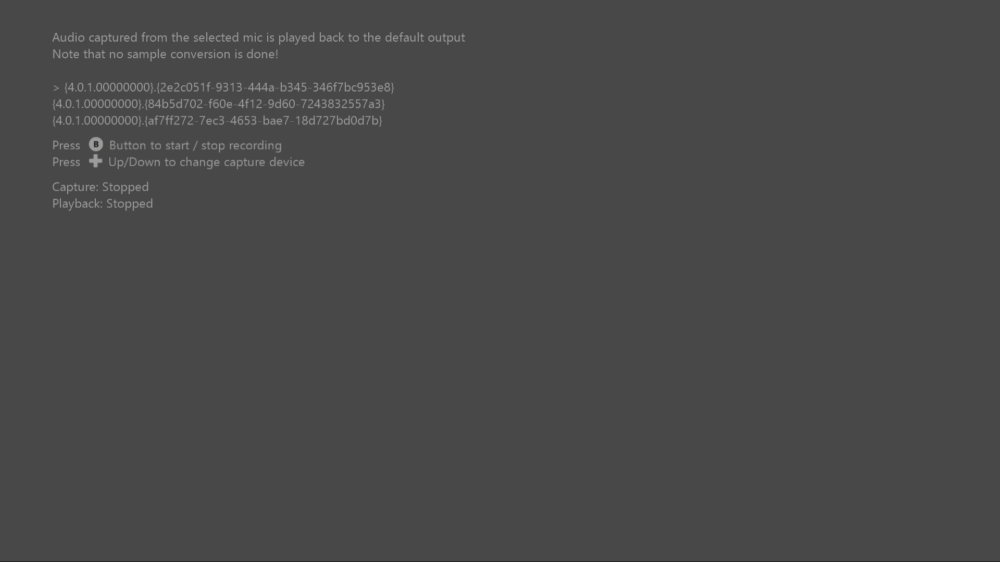

# 简单 WASAPI 捕获示例

*此示例兼容于 Microsoft 游戏开发工具包（2020 年 6 月）*

# 说明

此示例演示如何在 Xbox One 上使用 WASAPI 捕获音频。

# 生成示例

如果使用 Xbox One 开发工具包，请将活动解决方案平台设置为 `Gaming.Xbox.XboxOne.x64`。

如果使用 Project Scarlett，请将可用解决方案平台设置为 `Gaming.Xbox.Scarlett.x64`。

*有关详细信息，请参阅* *GDK 文档中的*__运行示例__。&nbsp;

# 使用示例

使用游戏手柄选择捕获设备。 该示例自动使用默认音频呈现。 **请注意，捕获和呈现之间没有采样率转换，因此除非速率匹配，否则播放听起来会不正确。**

# 实现说明

此示例演示如何使用 WASAPI 捕获音频。 捕获的样本放置在循环缓冲区中，然后用于呈现样本。 此示例还使用呈现器和捕获之间的共享 WASAPI 实例。 有关 WASAPI 的更高级用法，请参阅 [Windows WASAPI 示例](https://code.msdn.microsoft.com/windowsapps/Windows-Audio-Session-22dcab6b)

# 更新历史记录

初始版本 2019 年 5 月

# 隐私声明

在编译和运行示例时，将向 Microsoft 发送示例可执行文件的文件名以帮助跟踪示例使用情况。 若要选择退出此数据收集，你可以删除 Main.cpp 中标记为&ldquo;示例使用遥测&rdquo;的代码块。

有关 Microsoft 的一般隐私策略的详细信息，请参阅 [Microsoft 隐私声明](https://privacy.microsoft.com/en-us/privacystatement/)。

