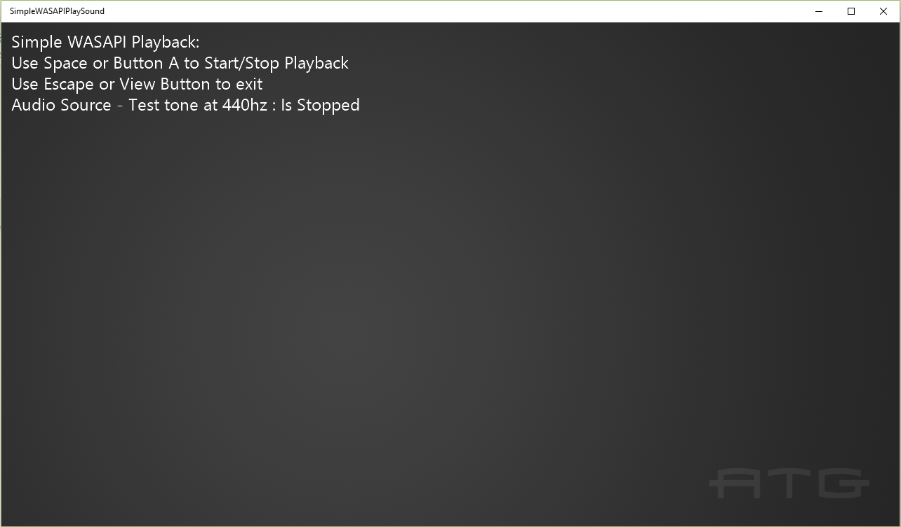

# 간단한 WASAPI 재생 사운드 샘플

*이 샘플은 Microsoft 게임 개발 키트와 호환 가능합니다(2020년 6월).*

# 설명

이 샘플에서는 게임 방법 설정과 Xbox One에서 WASAPI 렌더링 엔드포인트에 간단한 소리(사인 톤)을 재생하는 방법을 보여 줍니다.

# 샘플 빌드

Xbox One 개발 키트를 사용하는 경우 활성 솔루션 플랫폼을 `Gaming.Xbox.XboxOne.x64`(으)로 설정합니다.

Project Scarlett을 사용하는 경우 활성 솔루션 플랫폼을 `Gaming.Xbox.Scarlett.x64`(으)로 설정합니다.

*GDK 설명서의* __샘플 실행__에서 *자세한 내용을 알아보세요.*

# 샘플 사용

키보드의 스페이스바 또는 게임 패드의 버튼 A를 사용하여 재생을 시작하고 중지합니다. 키보드 또는 보기 버튼에서 Escape를 사용하여 앱을 종료합니다.

# 구현 참고 사항

WASAPI에 대한 자세한 내용은 [MSDN](https://msdn.microsoft.com/en-us/library/windows/desktop/dd371455.aspx)을 참조하세요.

# 개인정보처리방침

샘플을 컴파일하고 실행하는 경우 샘플 사용량을 추적할 수 있도록 샘플 실행 파일의 파일 이름이 Microsoft에 전송됩니다. 이 데이터 수집을 옵트아웃하려면 Main.cpp에서 "샘플 사용량 원격 분석"이라는 레이블이 지정된 코드 블록을 제거할 수 있습니다.

일반적인 Microsoft의 개인 정보 정책에 대한 자세한 내용은 [Microsoft 개인정보처리방침](https://privacy.microsoft.com/en-us/privacystatement/)을 참조하세요.

