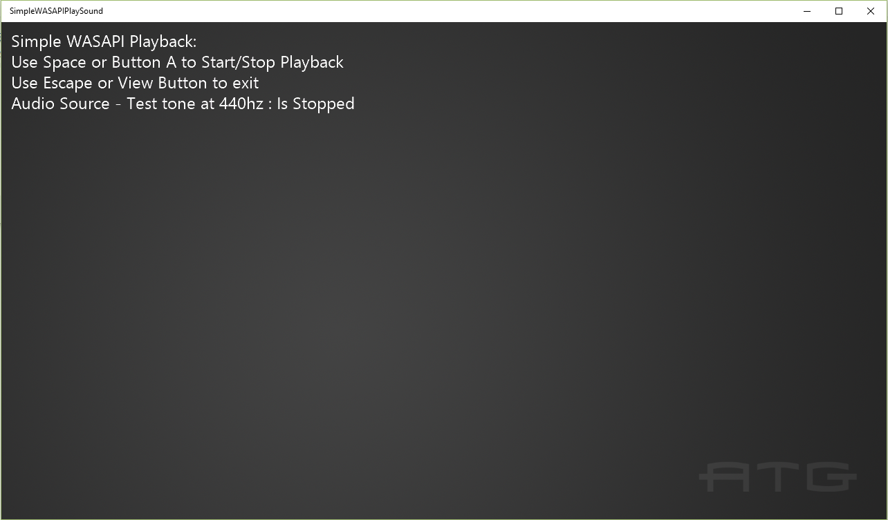

# 简单的 WASAPI 播放声音样本

*此示例可用于 Microsoft 游戏开发工具包（2020 年 6 月）*

# 说明

此示例演示如何在 Xbox One 上的 WASAPI 渲染终结点播放设置和播放简单声音(正弦音)。

# 生成示例

如果使用 Xbox One 开发工具包，请将活动解决方案平台设置为 `Gaming.Xbox.XboxOne.x64`。

如果使用 Project Scarlett，请将可用解决方案平台设置为 `Gaming.Xbox.Scarlett.x64`。

*有关详细信息，请参阅* *GDK 文档中的*__运行示例__。&nbsp;

# 使用示例

使用键盘上的空格键或游戏手柄上的按钮 A 启动和停止播放。 使用键盘上的 ESC 键或使用&ldquo;视图&rdquo;按钮退出应用。

# 实现说明

有关 WASAPI 的详细信息，请参阅 [MSDN](https://msdn.microsoft.com/en-us/library/windows/desktop/dd371455.aspx)。

# 隐私声明

在编译和运行示例时，将向 Microsoft 发送示例可执行文件的文件名以帮助跟踪示例使用情况。 若要选择退出此数据收集，你可以删除 Main.cpp 中标记为&ldquo;示例使用遥测&rdquo;的代码块。

有关 Microsoft 的一般隐私策略的详细信息，请参阅 [Microsoft 隐私声明](https://privacy.microsoft.com/en-us/privacystatement/)。

