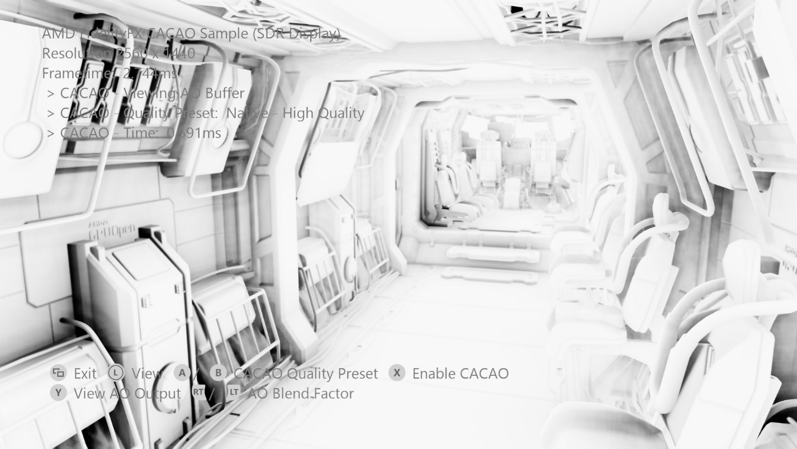
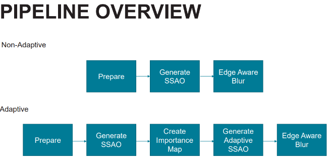

# AMD FidelityFX アンビエント オクルージョン (CACAO)

*このサンプルは、Microsoft Game Development Kit と互換性があります (2022 年 3 月)*

# 説明

結合アダプティブ コンピューティング アンビエント オクルージョン (CACAO) は、高度に最適化されたアダプティブ サンプリング アンビエント オクルージョンの実装です。&nbsp;このサンプルにはさまざまな品質のプリセットが含まれ、環境のニーズに合わせて調整することができます。

GPUOpen の詳細については、 <https://gpuopen.com/fidelityfx-cacao/>

# サンプルのビルド

Windows デスクトップを使用している場合は、アクティブなソリューション プラットフォームを `Gaming.Desktop.x64` に設定します。

Xbox Series X|S を使用している場合は、アクティブなソリューション プラットフォームを `Gaming.Xbox.Scarlett.x64` に設定します。

Xbox One を使用している場合は、アクティブなソリューション プラットフォームを `Gaming.Xbox.XboxOne.x64` に設定します。

Windows デスクトップを実行する場合は、最新のグラフィックス ドライバーがインストールされていることを確認します。

*詳細については、* *GDK ドキュメント*の「__サンプルの実行__」を参照してください。

# サンプルの使用方法

| 操作 | ゲームパッド |
|---|---|
| 回転ビュー | 左サムスティック |
| Exit | ビュー ボタン |
| CACAO のオン/オフ | X ボタン |
| CACAO 品質プリセット | A/B ボタン |
| CACAO バッファーの表示 | Y ボタン |
| AO バッファー複合ブレンド係数 | 右/左トリガー |

# 実装メモ

CACAO は、Intel ASSAO (Adaptive Screen Space Ambient Occlusion) 実装の高度に最適化された適応です。 低、低、中、高、アダプティブの 5 つの品質レベルを提供します。

 

## 統合

この統合サンプルは、GDKX および Xbox 固有の DX12 ヘッダーで使用するために変更された GPUOpen 上の D3D12 PC 実装のバージョンを提供します。 このサンプルでは、すべてのシェーダーの順列が生成され、カスタム ビルド ステップで事前構築されます。 事前構築済みのシェーダーは、C++ と互換性のあるヘッダー ファイルに、対応する DXIL バイト コードが含まれています。

このカスタム ビルド ステップには、Xbox ターゲットに固有の最適化されたオプションがあります。

このサンプルでは、非常に単純な複合演算を、可変量のブレンディング係数で使用して、シーン内でどのように見えるかを示します。 エンジンの統合では、環境光の計算で CACAO からの出力バッファーを使用することをお勧めします。

サンプル フレームワークでは、ffx_cacao_impl_gdkx.cpp で定義されている次の関数を使用します。

- FFX_CACAO_D3D12GetContextSize

- FFX_CACAO_D3D12InitContext

- FFX_CACAO_D3D12DestroyContext

- FFX_CACAO_D3D12InitScreenSizeDependentResources

- FFX_CACAO_D3D12DestroyScreenSizeDependentResources

- FFX_CACAO_D3D12UpdateSettings

- FFX_CACAO_D3D12Draw

これらは直接呼び出すことができます。または、例として関数を使用してエンジン リソース処理と統合するための作業をさらに行うことができます。

CACAO を動作させるには、法線と深度リソースと組み合わせた 2 つのマトリックス (射影、normalsToView) が必要です。 出力は、DXGI_FORMAT_R8_UNORM 型の UAV です。

## 品質モード

このサンプルでは、品質プリセットを公開し、ダウンサンプリングされた解像度で動作します。 これらは、CACAO.h 内で定義 FFX_CACAO_PRESETS 構造体で提供されます。

| 既定値 | radius = 1.2f shadowMultiplier = 1.0f shadowPower = 1.50f shadowClamp = 0.98f horizonAngleThreshold = 0.06f fadeOutFrom = 20.0f fadeOutTo = 40.0f adaptiveQualityLimit = 0.75f sharpness = 0.98f detailShadowStrength = 0.5f generateNormals = FFX_CACAO_FALSE bilateralSigmaSquared = 5.0f bilateralSimilarityDistanceSigma = 0.1f |
|---|---|
| アダプティブ品質ネイティブ解像度 | qualityLevel = FFX_CACAO_QUALITY_HIGHEST blurPassCount = 2 |
| 高品質のネイティブ解像度 | qualityLevel = FFX_CACAO_QUALITY_HIGH blurPassCount = 2 |
| 中程度の品質のネイティブ解像度 | qualityLevel = FFX_CACAO_QUALITY_MEDIUM blurPassCount = 2 |
| 低品質のネイティブ解像度 | qualityLevel = FFX_CACAO_QUALITY_LOW blurPassCount = 6 |
| 最も低品質のネイティブ解像度 | qualityLevel = FFX_CACAO_QUALITY_LOWEST blurPassCount = 6 |
| アダプティブ品質のダウンサンプリングされた解像度 | qualityLevel = FFX_CACAO_QUALITY_HIGHEST blurPassCount = 2 |
| 高品質のダウンサンプリングされた解像度 | qualityLevel = FFX_CACAO_QUALITY_HIGH blurPassCount = 2 |
| 中品質のダウンサンプリングされた解像度 | qualityLevel = FFX_CACAO_QUALITY_MEDIUM blurPassCount = 3 fourSigmaSquared = 5.0f fourSimilarityDistanceSigma = 0.2f |
| 低品質のダウンサンプリングされた解像度 | qualityLevel = FFX_CACAO_QUALITY_LOW blurPassCount = 6 bilateralSigmaSquared = 8.0f bilateralSimilarityDistanceSigma = 0.8f |
| 低品質のダウンサンプリングされた解像度 | qualityLevel = FFX_CACAO_QUALITY_LOWEST blurPassCount = 6 bilateralSigmaSquared = 8.0f bilateralSimilarityDistanceSigma = 0.8f |

# 更新履歴

このサンプルは 2021 年 9 月に作成されました。

# プライバシーに関する声明

サンプルをコンパイルして実行する場合、サンプルの使用状況を追跡するために、サンプルの実行可能ファイルのファイル名が Microsoft に送信されます。 このデータ コレクションからオプトアウトするには、Main.cpp の "サンプル使用状況テレメトリ" というラベルの付いたコードのブロックを削除します。

Microsoft のプライバシー ポリシー全般の詳細については、「[Microsoft のプライバシーに関する声明](https://privacy.microsoft.com/en-us/privacystatement/)」を参照してください。

# 免責事項

ここに記載されている情報は情報提供のみを目的としており、予告なしに変更される場合があります。 このドキュメントの準備段階ではすべての予防措置が講じられていますが、技術的な不正確さ、省略、文字体裁上の誤りが含まれている可能性があり、AMD は、この情報を更新または修正する義務を負いません。 Advanced Micro Devices, Inc. は、本ドキュメントの内容の正確性または完全性に関して一切の表明または保証を行いません。また、AMD ハードウェア、ソフトウェア、またはここに記載されているその他の製品の運用または使用に関して、特定の目的に対する非侵害、商品性、適合性に関する暗黙の保証を含め、いかなる種類の責任も負いません。 このドキュメントでは、いかなる知的財産権に対しても、黙示的または禁反言によるライセンスは付与されません。 AMD 製品の購入または使用に適用される使用条件と制限は、両当事者間の署名済み契約または AMD の標準販売条件に記載されています。

AMD、AMD Arrow ロゴ、Radeon、RDNA、Ryzen、およびその組み合わせは Advanced Micro Devices, Inc. の商標です。 この文書で使用されるその他の製品名は、識別のみを目的としており、それぞれの会社の商標である可能性があります。

Windows は、米国およびその他の国における Microsoft Corporation の商標です。

Xbox は、米国およびその他の国における Microsoft Corporation の商標です。

© 2021 Advanced Micro Devices, Inc. All rights reserved.

