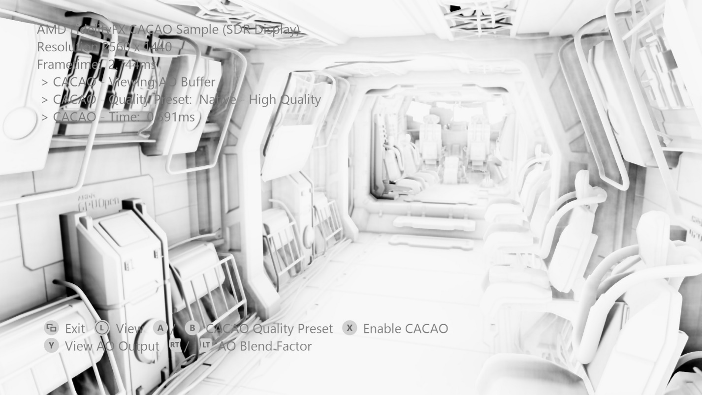
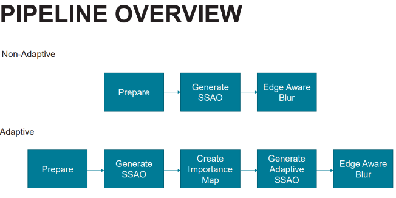

# FidelityFX 环境遮挡 (CACAO)

*此示例可用于 Microsoft 游戏开发工具包（2022 年 3 月）*

# 说明

组合自适应计算环境遮挡 （CACAO） 是高度优化的自适应采样环境遮挡实现。&nbsp;此示例中包含各种质量预设，可以根据环境的需求进行优化。

有关详细信息，请参阅 GPUOpen：<https://gpuopen.com/fidelityfx-cacao/>

# 生成示例

如果使用 Windows 桌面，请将活动解决方案平台设置为 `Gaming.Desktop.x64`。

如果使用 Xbox Series X|S，请将活动解决方案平台设置为 `Gaming.Xbox.Scarlett.x64`。

如果使用 Xbox One，请将活动解决方案平台设置为 `Gaming.Xbox.XboxOne.x64`。

运行 Windows 桌面版时，请确保安装了最新的图形驱动程序。

*有关详细信息，请参阅* *GDK 文档中的*&ldquo;__运行示例__&rdquo;。

# 使用示例

| 操作 | 游戏板 |
|---|---|
| 旋转视图 | 左控制杆 |
| 退出 | &ldquo;视图&rdquo;按钮 |
| CACAO 开/关 | X 按钮 |
| CACAO 质量预设 | A / B 按钮 |
| 查看 CACAO 缓冲 | Y 按钮 |
| AO 缓冲复合混合因子 | 右/左扳机键 |

# 实现说明

CACAO 是 Intel ASSAO（自适应屏幕空间环境遮挡）实现的高度优化适应。 提供 5 个质量级别 - LOWEST、LOW、MEDIUM、HIGH、ADAPTIVE。

 

## 集成

此集成示例提供 GPUOpen 上 D3D12 电脑实现的一个版本，该版本已修改为与 GDKX 和特定于 Xbox 的 DX12 标头一起使用。 在此示例中，所有着色器排列都是在自定义生成步骤中生成和预生成。 预生成的着色器位于 C++ 兼容的标头文件中，包括相应的 DXIL 字节代码。

此自定义生成步骤具有特定于 Xbox 目标的优化选项。

在此示例中，使用了一个非常简单的复合操作，并考虑了可变数量的混合因素，以指示它在场景中的外观。 对于引擎集成，建议在环境照明计算中使用 CACAO 的输出缓冲。

示例框架使用在 ffx_cacao_impl_gdkx.cpp 中定义的以下函数：

- FFX_CACAO_D3D12GetContextSize

- FFX_CACAO_D3D12InitContext

- FFX_CACAO_D3D12DestroyContext

- FFX_CACAO_D3D12InitScreenSizeDependentResources

- FFX_CACAO_D3D12DestroyScreenSizeDependentResources

- FFX_CACAO_D3D12UpdateSettings

- FFX_CACAO_D3D12Draw

可以直接调用它们，也可以使用函数作为示例来完成与引擎资源处理集成的进一步工作。

CACAO 需要两个矩阵（投影、法线ToView）以及法线和深度资源才能运行。 输出是 DXGI_FORMAT_R8_UNORM 类型的 UAV。

## 质量模式

此示例公开了质量预设，并在降采样分辨率下运行。 它们以 CACAO.h 中定义的结构 FFX_CACAO_PRESETS 提供。

| 默认值 | radius = 1.2f shadowMultiplier = 1.0f shadowPower = 1.50f shadowClamp = 0.98f horizonAngleThreshold = 0.06f fadeOutFrom = 20.0f fadeOutTo = 40.0f adaptiveQualityLimit = 0.75f sharpness = 0.98f detailShadowStrength = 0.5f generateNormals = FFX_CACAO_FALSE bilateralSigmaSquared = 5.0f bilateralSimilarityDistanceSigma = 0.1f |
|---|---|
| 自适应质量本机分辨率 | qualityLevel = FFX_CACAO_QUALITY_HIGHEST blurPassCount = 2 |
| 高质量本机分辨率 | qualityLevel = FFX_CACAO_QUALITY_HIGH blurPassCount = 2 |
| 中等质量本机分辨率 | qualityLevel = FFX_CACAO_QUALITY_MEDIUM blurPassCount = 2 |
| 低质量本机分辨率 | qualityLevel = FFX_CACAO_QUALITY_LOW blurPassCount = 6 |
| 最低质量本机分辨率 | qualityLevel = FFX_CACAO_QUALITY_LOWEST blurPassCount = 6 |
| 自适应质量降采样分辨率 | qualityLevel = FFX_CACAO_QUALITY_HIGHEST blurPassCount = 2 |
| 高质量降采样分辨率 | qualityLevel = FFX_CACAO_QUALITY_HIGH blurPassCount = 2 |
| 中等质量降采样分辨率 | qualityLevel = FFX_CACAO_QUALITY_MEDIUM blurPassCount = 3 bilateralSigmaSquared = 5.0f bilateralSimilarityDistanceSigma = 0.2f |
| 低质量降采样分辨率 | qualityLevel = FFX_CACAO_QUALITY_LOW blurPassCount = 6 bilateralSigmaSquared = 8.0f bilateralSimilarityDistanceSigma = 0.8f |
| 最低质量降采样分辨率 | qualityLevel = FFX_CACAO_QUALITY_LOWEST blurPassCount = 6 bilateralSigmaSquared = 8.0f bilateralSimilarityDistanceSigma = 0.8f |

# 更新历史记录

此示例编写于 2021 年 9 月。

# 隐私声明

在编译和运行示例时，将向 Microsoft 发送示例可执行文件的文件名以帮助跟踪示例使用情况。 若要选择退出此数据收集，你可以删除 Main.cpp 中标记为&ldquo;示例使用遥测&rdquo;的代码块。

有关 Microsoft 的一般隐私策略的详细信息，请参阅 [Microsoft 隐私声明](https://privacy.microsoft.com/en-us/privacystatement/)。

# 免责声明

此处包含的信息仅用于信息性目的，且可能发生更改，恕不另行通知。 尽管本文档的准备工作中已采取每个预防措施，但它可能包含技术不准确、遗漏和类型错误，并且 AMD 没有义务更新或以其他方式更正此信息。 Advanced Micro Devices, Inc. 不就本文档内容的准确性或完整性做出任何表示或保证，并且不承担任何类型的责任，包括针对此处所述的 AMD 硬件、软件或其他产品的操作或使用情况的不侵权、适销性或适用性的隐含保证。 本文档不授予任何知识产权的许可，包括默示的或由禁止反言引起的许可。 双方签署的协议或 AMD 的标准销售条款和条件中规了适用于购买或使用 AMD 产品的条款和条件。

AMD、AMD 箭头徽标、Radeon、RDNA、Ryzen 及其组合是 Advanced Micro Devices, Inc. 的商标。 本出版物中使用的其他产品名称仅用于识别目的，可能是其各自公司的商标。

Windows 是 Microsoft Corporation 在美国和/或其他国家/地区的注册商标。

Xbox 是 Microsoft Corporation 在美国和/或其他国家/地区的注册商标。

© 2021 Advanced Micro Devices, Inc. 保留所有权利。

