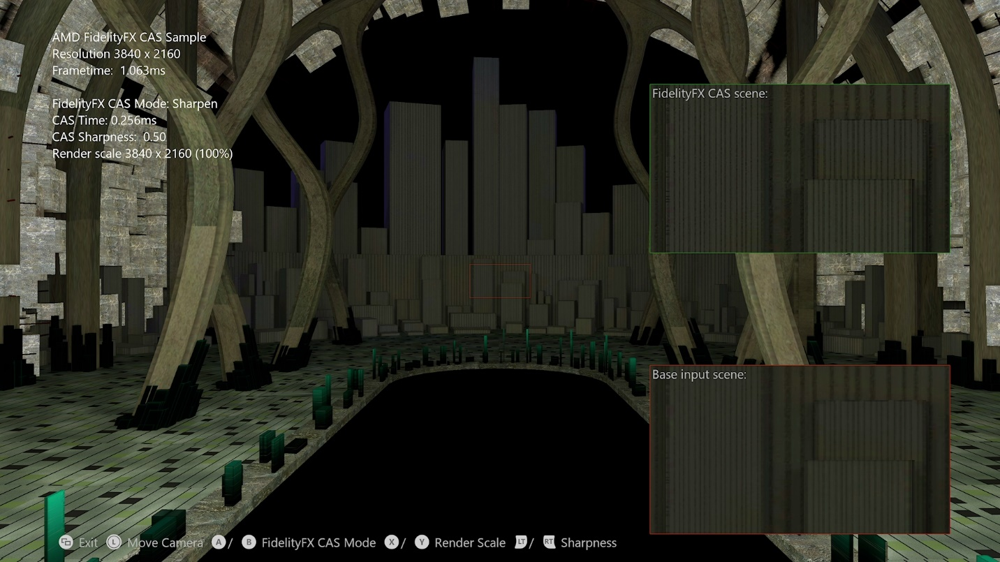

 <br/><br/><br/><br/><br/>

# FidelityFX CAS(Contrast Adaptive Sharpening) 샘플

*이 샘플은 Microsoft 게임 개발 키트(2022년 3월)와 호환됩니다.*

# 설명

이 샘플에서는 AMD의 FIdelityFX CAS(Contrast Adaptive Sharpening)를 현장에서 활용하는 다양한 방법을 보여줍니다.



# 샘플 빌드

Windows 데스크톱을 사용하는 경우 활성 솔루션 플랫폼을 `Gaming.Desktop.x64`(으)로 설정합니다.

Xbox One 개발 키트를 사용하는 경우 활성 솔루션 플랫폼을 `Gaming.Xbox.XboxOne.x64`(으)로 설정합니다.

Xbox Series X|S를 사용하는 경우 활성 솔루션 플랫폼을 `Gaming.Xbox.Scarlett.x64`(으)로 설정합니다.

*자세한 내용은* *GDK 설명서의* __샘플 실행을__ 참조하세요.&nbsp;

# 샘플 사용

| 동작 | Gamepad |
|---|---|
| CAS 모드 사이클 | A 버튼 / B 버튼 |
| 업스케일링 모드를 위한 주기 렌더링 크기 조정 | X 버튼 / Y 버튼 |
| 뷰 회전 | 왼쪽 엄지스틱 |
| 보기 다시 설정 | 왼쪽 엄지스틱(클릭) |
| 선명도 양 증가 | 오른쪽 트리거 |
| 선명도 양 줄이기 | 왼쪽 트리거 |
| 끝내기 | 보기 버튼 |

# 구현 참고 사항

CAS(Contrast Adaptive Sharpening)는 이미지를 선명하게 하고 선택적으로 크기를 조정할 수 있는 혼합 기능을 제공합니다. 알고리즘은 픽셀당 선명도를 조정하여 이미지 전체의 균일한 선명도 수준을 목표로 합니다. 이미 선명한 입력 이미지 영역은 덜 선명하게 하고 디테일이 부족한 영역은 더 선명하게 합니다. 이것은 더 적은 아티팩트로 더 높은 전반적인 자연스러운 시각적 선명도를 허용합니다.

CAS는 기존 TAA(Temporal Anti-Aliasing) 솔루션의 품질을 높이는 데 도움이 되도록 설계되었습니다. TAA는 종종 시간적 피드백으로 인해 다양한 양의 블러를 발생시킵니다. CAS에서 제공하는 적응형 선명도 조정 기능은 TAA 이후에 생성된 이미지의 디테일을 복원하는 데 이상적입니다.

CAS의 선택적 크기 조정 기능은 DRS(동적 해상도 크기 조정)를 지원하도록 설계되었습니다. DRS는 프레임마다 렌더링 해상도를 변경하므로 고정 해상도 UI(사용자 인터페이스)를 합성하기 전에 크기 조정이 필요합니다. CAS는 선명도 조정 기능을 적용하는 동일한 단일 패스에서 업 샘플링 및 다운 샘플링을 모두 지원합니다.

선명화 및 업스케일링 알고리즘에 대한 추가 구현 세부 정보는 <https://gpuopen.com/fidelityfx-cas/>에서, <https://gpuopen.com/wp-content/uploads/2019/07/FidelityFX-CAS.pptx>에서 심층 프레젠테이션을 통해 확인할 수 있습니다.

## 통합

선명도 조정 기능은 기존 포스트 TAA 선명도 조정 패스만을 대체할 수 있습니다.

선명도 조정+ 업샘플링은 단일 패스에서 동적 해상도 스케일링에 사용할 수 있습니다.

CAS 이전에 발생하는 필름 세분화의 양을 줄이는 것이 좋습니다(CAS가 세분화를 증폭하므로).

대안은 CAS 뒤에 세분화를 추가하는 것입니다.

톤 매핑 후 CAS를 실행하는 것이 가장 좋습니다.

CAS는 UI에 약간 영향을 미칠 수 있으므로 이전에 적용하는 것이 좋습니다.

일반적인 권장 사항 -- 포스트 프로세스 체인 후, 필름 그레인 전 및 UI 전

CAS는 컴퓨팅 셰이더로 실행되도록 설계되었습니다.

Fp32 형식은 하나의 {64,1,1} 스레드 그룹을 통해 8x8 타일에서 작동합니다. CAS는 이 샘플에서 구현된 4방향 언롤과 함께 항상 언롤 루프를 실행하도록 설계되었습니다.

## CPU 측 설정

입력 해상도, 출력 해상도, 선명도 스케일을 포함하여 CAS 통과에 필요한 모든 정보를 인코딩하는 두 개의 int4 상수가 필요합니다.

이러한 상수는 제공되는 CasSetup 함수로 업데이트할 수 있습니다.

```cpp
XMUINT4 const0;
XMUINT4 const1;

CasSetup(const0, const1
&nbsp;        0.5f,&nbsp;&nbsp;&nbsp;&nbsp;&nbsp;&nbsp;&nbsp;&nbsp;&nbsp;&nbsp;&nbsp;&nbsp; // **Sharpness tuning knob** (0.0 to 1.0).
         1920.0f,1080.0f,&nbsp; // Example input size.
&nbsp;        2560.0f,1440.0f); // Example output size.
```


CasSetup에 대한 정의는 A_CPU를 정의하고 ffx_a.h 및 ffx_cas.h 헤더 파일을 포함하여 C++ 소스에 포함될 수 있습니다.

```cpp
#define A_CPU
#include "ffx_a.h"
#include "ffx_cas.h"
```


# 업데이트 기록

이 샘플은 2020년 10월에 작성되었습니다.

# 개인정보처리방침

샘플을 컴파일하고 실행하는 경우 샘플 사용량을 추적할 수 있도록 샘플 실행 파일의 파일 이름이 Microsoft에 전송됩니다. 이 데이터 수집을 옵트아웃하려면 Main.cpp에서 "샘플 사용량 원격 분석"이라는 레이블이 지정된 코드 블록을 제거할 수 있습니다.

일반적인 Microsoft의 개인 정보 정책에 대한 자세한 내용은 [Microsoft 개인정보처리방침](https://privacy.microsoft.com/en-us/privacystatement/)을 참조하세요.

# 고지 사항

여기에 포함된 정보는 정보 제공의 목적으로만 제공되며 예고 없이 변경될 수 있습니다. 이 문서를 준비하는 동안 모든 예방 조치를 취했지만 기술적인 부정확성, 누락 및 인쇄상의 오류가 포함될 수 있으며 AMD는 이 정보를 업데이트하거나 수정할 의무가 없습니다. Advanced Micro Devices, Inc.는 여기에 설명된 AMD 하드웨어, 소프트웨어 또는 기타 제품의 작동 또는 사용과 관련하여 비침해, 상품성 또는 특정 목적에의 적합성에 대한 묵시적 보증을 포함하여 이 문서 내용의 정확성 또는 완전성과 관련하여 어떠한 진술이나 보증도 하지 않으며 어떤 종류의 책임도 지지 않습니다. 묵시적이거나 금반언에 의해 발생하는 것을 포함하여 이 문서에서는 지적 재산권에 대한 라이선스를 부여하지 않습니다. AMD 제품의 구매 또는 사용에 적용되는 약관 및 제한 사항은 당사자 간의 서명된 계약 또는 AMD의 표준 판매 약관에 명시되어 있습니다.

AMD, AMD Arrow 로고, Radeon, RDNA, Ryzen 및 이들의 조합은 Advanced Micro Devices, Inc.의 상표입니다. 이 간행물에 사용된 기타 제품 이름은 식별 목적으로만 사용되었으며 해당 회사의 상표일 수 있습니다.

Windows는 미국 및/또는 기타 국가에서 Microsoft Corporation의 등록 상표입니다.

Xbox는 미국 및/또는 기타 국가에서 Microsoft Corporation의 등록 상표입니다.

© 2020 Advanced Micro Devices, Inc. All rights reserved.


