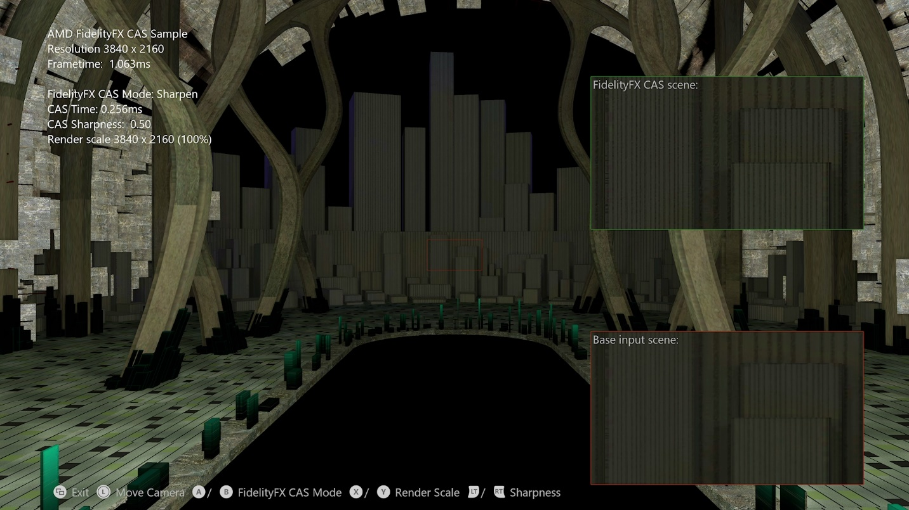

 <br/><br/><br/><br/><br/>

# FidelityFX 对比度自适应锐化 (CAS) 示例

*此示例可用于 Microsoft 游戏开发工具包 (2022 年 3 月)*

# 说明

本示例展示了将 AMD 的 FidelityFX 对比度自适应锐化 (CAS) 应用于场景的不同方法。



# 生成示例

如果使用 Windows 桌面，请将活动解决方案平台设置为 `Gaming.Desktop.x64`。

如果使用 Xbox One 开发工具包，请将活动解决方案平台设置为 `Gaming.Xbox.XboxOne.x64`。

如果使用 Xbox Series X|S，请将活动解决方案平台设置为 `Gaming.Xbox.Scarlett.x64`。

*有关详细信息，请参阅* __运行示例__，*在 GDK 文档中。*

# 使用示例

| 操作 | 游戏板 |
|---|---|
| 循环 CAS 模式 | A 按钮/B 按钮 |
| 用于升级缩放模式的循环渲染缩放 | X 按钮/Y 按钮 |
| 旋转视图 | 左控制杆 |
| 重置视图 | 左控制杆（单击） |
| 增加锐度量 | 右扳机键 |
| 降低锐度量 | 左扳机键 |
| 退出 | &ldquo;视图&rdquo;按钮 |

# 实现说明

对比度自适应锐化 (CAS) 提供了一种混合功能来锐化图像并选择性地缩放图像。 该算法会调整每个像素的锐化量，以使整个图像达到均匀的锐度级别。 输入图像已锐化区域的锐度较低，而缺少详细信息的区域的锐度则较高。 这样一来，整体自然锐度就会较高，伪像就会较少。

CAS 旨在帮助提高现有临时抗锯齿 (TAA) 解决方案的质量。 由于临时反馈，TAA 通常会引入一定的模糊程度。 CAS 提供的自适应锐化非常适合用于还原 TAA 之后生成的图像中的细节。

CAS 的可选缩放功能旨在支持动态解析缩放 (DRS)。 DRS 会更改每一帧的渲染分辨率，这需要在撰写固定分辨率用户界面 (UI) 之前进行缩放。 CAS 支持在应用锐化的同一单一通道中进行向上采样和向下采样。

有关锐化和升级算法的进一步实现详细信息，请参阅 <https://gpuopen.com/fidelityfx-cas/>， 其中的 <https://gpuopen.com/wp-content/uploads/2019/07/FidelityFX-CAS.pptx> 提供了全面深入的讲解

## 集成

锐化只能替代现有的 TAA 后的锐化通道。

锐化和向上采样可用于单一通道中的动态分辨率缩放。

最好减少 CAS 之前产生的胶片颗粒数量（因为 CAS 会放大颗粒）。

另一种方法是在 CAS 之后添加颗粒。

最好在色调映射后运行 CAS。

CAS 可能会轻微影响用户界面，因此建议先应用它。

一般建议（后处理链之后，胶片颗粒和用户界面之前）

CAS 旨在作为计算着色器运行。

Fp32 窗体通过一个 {64，1，1} 线程组在 8x8 磁贴上工作。 CAS 旨在始终运行展开的循环，并在此示例中执行 4 向展开。

## CPU 端设置

需要两个 int4 常量来编码 CAS 通道所需的所有信息，包括输入分辨率、输出分辨率和锐化程度。

可以使用提供的 CasSetup 函数更新这些常量：

```cpp
XMUINT4 const0;
XMUINT4 const1;

CasSetup(const0, const1
&nbsp;        0.5f,&nbsp;&nbsp;&nbsp;&nbsp;&nbsp;&nbsp;&nbsp;&nbsp;&nbsp;&nbsp;&nbsp;&nbsp; // **Sharpness tuning knob** (0.0 to 1.0).
         1920.0f,1080.0f,&nbsp; // Example input size.
&nbsp;        2560.0f,1440.0f); // Example output size.
```


可通过定义 A_CPU 并添加 ffx_a.h 和 ffx_cas.h 标头文件，从而在 C++ 源中添加 CasSetup 定义：

```cpp
#define A_CPU
#include "ffx_a.h"
#include "ffx_cas.h"
```


# 更新历史记录

此示例编写于 2020 年 10 月。

# 隐私声明

在编译和运行示例时，将向 Microsoft 发送示例可执行文件的文件名以帮助跟踪示例使用情况。 若要选择退出此数据收集，你可以删除 Main.cpp 中标记为&ldquo;示例使用遥测&rdquo;的代码块。

有关 Microsoft 的一般隐私策略的详细信息，请参阅 [Microsoft 隐私声明](https://privacy.microsoft.com/en-us/privacystatement/)。

# 免责声明

此处包含的信息仅用于信息性目的，且可能发生更改，恕不另行通知。 尽管本文档的准备工作中已采取每个预防措施，但它可能包含技术不准确、遗漏和类型错误，并且 AMD 没有义务更新或以其他方式更正此信息。 Advanced Micro Devices, Inc. 不就本文档内容的准确性或完整性做出任何表示或保证，并且不承担任何类型的责任，包括针对此处所述的 AMD 硬件、软件或其他产品的操作或使用情况的不侵权、适销性或适用性的隐含保证。 本文档不授予任何知识产权的许可，包括默示的或由禁止反言引起的许可。 双方签署的协议或 AMD 的标准销售条款和条件中规了适用于购买或使用 AMD 产品的条款和条件。

AMD、AMD 箭头徽标、Radeon、RDNA、Ryzen 及其组合是 Advanced Micro Devices, Inc. 的商标。 本出版物中使用的其他产品名称仅用于识别目的，可能是其各自公司的商标。

Windows 是 Microsoft Corporation 在美国和/或其他国家/地区的注册商标。

Xbox 是 Microsoft Corporation 在美国和/或其他国家/地区的注册商标。

© 2020 Advanced Micro Devices, Inc. 保留所有权利。


