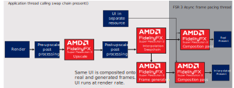

<br/><br/><br/><br/><br/>
# FidelityFX Super Resolution 3.1.3

*This sample is compatible with the Microsoft Game Development Kit (March 2024 - Update 1).*

# Description

This sample demonstrates the use of AMD FidelityFX Super Resolution 3.1.3 for upscaling and frame generation.


# Building the sample

<span style="color:grey">If using Windows Desktop, set the active solution platform to `x64`.</span> (Coming soon)

If using Xbox Series X|S, set the active solution platform to `Gaming.Xbox.Scarlett.x64`.

If using Xbox One, set the active solution platform to `Gaming.Xbox.XboxOne.x64`.

When running Windows Desktop, ensure you have the latest graphics drivers for your system installed.

*For more information, see* __Running samples__*, in the GDK documentation.*

# Using the sample

### Global Controls
| Action                                |  Gamepad                      |
|---------------------------------------|-------------------------------|
| Exit                                  |  View Button                  |
| Rotate View                           |  Left Thumbstick              |
| Move Magnifier                        |  Right Thumbstick             |
| Reset Camera                          |  Left Thumbstick (click)      |
| Toggle Magnifier                      |  Right Thumbstick (click)     |
| Toggle Input Controls                 |  Menu Button                  |

### Frame Interpolation Controls
| Action                                |  Gamepad                      |
|---------------------------------------|-------------------------------|
| Frame Interpolation On/Off            |  A Button                     |
| Frame Interpolation Only On/Off       |  B Button                     |
| Draw Tear Lines On/Off                |  X Button                     |
| Draw Debug View On/Off                |  Y Button                     |
| Async Compute On/Off                  |  Dpad Up Button               |
| Doulbe Buffer UI Internally On/Off    |  Dpad Down Button             |
| Frame Generation Callback On/Off      |  Left Shoulder Button         |
| Async Compute Presentation On/Off     |  Right Shoulder Button        |
| UI Composition Mode                   |  Dpad Left / Right Buttons    |

### Upscaler Controls
| Action                                |  Gamepad                      |
|---------------------------------------|-------------------------------|
| Sharpening On/Off                     |  Dpad Up Button               |
| Exposure Value                        |  Left / Right Triggers        |
| Quality Mode                          |  A / B Buttons                |
| Sharpness Value                       |  Left / Right Shoulder Buttons|
| Reactive Mask On/Off                  |  Dpad Down Button             |
| LOD Bias Value                        |  Dpad Left / Right Buttons    |

# Sample notes

If a HDR display is available on the Xbox Series X|S and XboxOne platforms, the sample runs in HDR mode. On Desktop platforms, the sample will run in SDR mode only.

This sample is implemented in a dynamic-resolution style, whereby target resolution resources are used and rendered into using a smaller resolution viewport before upscaling.

AMD recommends only using frame interpolation when the title can maintain a 60 fps average and is attached to a high refresh rate capable monitor (> 120Hz). While it can be used with lower frame rates and refresh rates, this may result in visual artifacting and fluidity issues.

# Implementation notes -- FSR 3.1.3

## How it works

AMD FidelityFX Super Resolution 3.1.3 (FSR3.1.3) combines resolution upscaling with frame generation.

It uses new and improved temporal upscaling, along with a new optical flow implementation to reproject samples from 2 rendered frames to generate an additional frame in between. FSR3.1.3 also implements a swapchain proxy, which is used to schedule interpolation workloads. On Desktop configurations, the swapchain proxy is also used to handle frame pacing for DirectX12 presentation.

The most up to date information on FidelityFX Super Resolution can be
found on GPUOpen at <https://gpuopen.com/fidelityfx-super-resolution-3/>.


## Integration Guidelines

### HLSL

- `CS_6_2`
- `CS_6_6†` is used on some hardware which supports 64-wide wavefronts.

### Quick start checklist

* (<b>Xbox</b>) Integrate using the new FidelityFX API libraries.
* (<b>Desktop</b>) Integrate using the new FidelityFX API using the single FidelityFX DLL, prebuilt and signed by AMD.
* It is recommended to first implement upscaling only, before frame generation
* Ensure a high-quality upscaling implementation:
  * Correct use of jittering pattern
  * Correct placement of post-process operations
  * Correct use of reactive mask
  * Correct use of transparency & composition mask
  * Correct setting of mip-bias for samplers
* For frame generation
  * Add two new contexts for frame generation and resource sharing
  * (<b>Xbox</b>) Set frame interval and period to needed values
  * (<b>Xbox</b>) Register callbacks for presentation
  * (<b>Xbox</b>) (Optional) Register callbacks for resource allocation/destruction and GPU job execution
  * Add frame generation prepare dispatch
  * Add frame generation configure call
  * Double buffer where required
  * Modify UI rendering - choose one of the following 3 options to handle the UI:
    * Render the UI inside a callback function
      * This function will get called once for every presented frame and needs to be able to render asynchronously while the next frame is being rendered 
      * Rendering the UI twice will have a performance cost, but the benefit is that the UI (including effects like film grain) can be updated at display frequency and with little latency
    * Render the UI to a separate texture which will then be composed on top of the final frames
      * This should still be pretty straight forward to integrate in most applications
      * Compared to the 3rd option, this will result in the UI appearing to be rendered at lower frequency than the main scene
      * (<b>Xbox</b>) This is the preferred composition option as coupled with async compute + async presentation will allow frame interpolation to be fully executed on the compute queue and overlap ongoing graphics work
    * Provide a HUD-less texture to frame interpolation for automatic detection and composition of the UI onto the interpolated frame
      * This is probably the easiest method to implement for most applications, but may result in minor artifacts in semi-transparent parts of the UI
  * Frame generation can run synchronously or asynchronously
    * An asynchronous implementation may run faster on some applications and hardware, but may require some additional effort

### Walkthrough

The following deals primarily with the Xbox version of FidelityFX FSR3.1.3. [For Desktop version walkthrough, please refer to the online documentation](https://github.com/GPUOpen-LibrariesAndSDKs/FidelityFX-SDK/blob/main/docs/techniques/super-resolution-interpolation.md).

#### Add upscaling through FSR3 interface

Note: if an FSR2 or FSR 3.0 upscaling implementation is already present and working correctly, please refer to the [migration guide](https://github.com/GPUOpen-LibrariesAndSDKs/FidelityFX-SDK/blob/main/ffx-api/migration.md) for the new interface.

Include the [`ffx_fsr3.h`](../../../Kits/AMDTK/fidelityfx/include/FidelityFX/host/ffx_fsr3.h) header:

```C++
#include <FidelityFX/host/ffx_fsr3.h>
```

Create the `FfxInterface` for upscaling.

```C++
const size_t scratchBufferSize = ffxGetScratchMemorySizeDX12(FFX_FSR3_CONTEXT_COUNT);
void* scratchBuffer = calloc(scratchBufferSize, 1);
FfxErrorCode errorCode = ffxGetInterfaceDX12(&m_ffxFsr3Backends[FSR3_BACKEND_UPSCALING], m_deviceResources->GetD3DDevice(), scratchBuffer, scratchBufferSize, FFX_FSR3_CONTEXT_COUNT);
```

Create the `FfxFsr3Context` for upscaling by filling out the `FfxFsr3ContextDescription` structure with the required arguments.

```C++
m_fsr3ContextDescription.backendInterfaceUpscaling  = m_ffxFsr3Backends[FSR3_BACKEND_UPSCALING];
m_fsr3ContextDescription.maxRenderSize.width = resourceSizeWidth;
m_fsr3ContextDescription.maxRenderSize.height = resourceSizeHeight;
m_fsr3ContextDescription.maxUpscaleSize.width = resourceSizeWidth;
m_fsr3ContextDescription.maxUpscaleSize.height = resourceSizeHeight;
m_fsr3ContextDescription.displaySize.width = resourceSizeWidth;
m_fsr3ContextDescription.displaySize.height = resourceSizeHeight;
m_fsr3ContextDescription.flags = FFX_FSR3_ENABLE_AUTO_EXPOSURE | FFX_FSR3_ENABLE_HIGH_DYNAMIC_RANGE |
                                 FFX_FSR3_ENABLE_DEPTH_INVERTED | FFX_FSR3_ENABLE_DEPTH_INFINITE;

if (m_allowAsyncCompute)
{
    m_fsr3ContextDescription.flags |= FFX_FSR3_ENABLE_ASYNC_WORKLOAD_SUPPORT;
}

// create the FSR3 context
{
    switch (m_deviceResources->GetFrameBackBufferFormat())
    {
    case DXGI_FORMAT_R8G8B8A8_UNORM_SRGB:
    case DXGI_FORMAT_R8G8B8A8_UNORM:
        m_fsr3ContextDescription.backBufferFormat = FFX_SURFACE_FORMAT_R8G8B8A8_UNORM;
        break;
    case DXGI_FORMAT_B8G8R8A8_UNORM_SRGB:
    case DXGI_FORMAT_B8G8R8A8_UNORM:
        m_fsr3ContextDescription.backBufferFormat = FFX_SURFACE_FORMAT_B8G8R8A8_UNORM;
        break;
    case DXGI_FORMAT_R9G9B9E5_SHAREDEXP:
        m_fsr3ContextDescription.backBufferFormat = FFX_SURFACE_FORMAT_R9G9B9E5_SHAREDEXP;
        break;
    case DXGI_FORMAT_R10G10B10A2_UNORM:
        m_fsr3ContextDescription.backBufferFormat = FFX_SURFACE_FORMAT_R10G10B10A2_UNORM;
        break;
    default:
        FFX_ASSERT_MESSAGE(false, "Unhandled format");
        break;
    }

    // create the context.
    errorCode = ffxFsr3ContextCreate(&m_fsr3Context, &m_fsr3ContextDescription);
```

##### Apply camera jitter

To get camera jitter phase count and offset parameters, use `ffxFsr3GetJitterPhaseCount` and `ffxFsr3GetJitterOffset`.

```C++
auto const displaysize = m_deviceResources->GetOutputSize();
static int32_t jitterIndex = 0;
const int32_t jitterPhaseCount = ffxFsr3GetJitterPhaseCount((int32_t)width, displaysize.right);
ffxFsr3GetJitterOffset(&m_jitterX, &m_jitterY, jitterIndex, jitterPhaseCount);
jitterIndex++; // increate jitter index for next frame
```
See the [related section of the upscaler documentation](https://github.com/GPUOpen-LibrariesAndSDKs/FidelityFX-SDK/blob/main/docs/techniques/super-resolution-upscaler.md#camera-jitter) for more information about the underlying implementation and how to apply the jitter during rendering.

##### Dispatch upscaling

To dispatch, call `ffxFsr3ContextDispatchUpscale` with a description of type `FfxFsr3DispatchUpscaleDescription`.
The structure is declared as follows:

```C
typedef struct FfxFsr3DispatchUpscaleDescription {

    FfxCommandList      commandList;                        ///< The <c><i>FfxCommandList</i></c> to record FSR2 rendering commands into.
    FfxResource         color;                              ///< A <c><i>FfxResource</i></c> containing the color buffer for the current frame (at render resolution).
    FfxResource         depth;                      ///< A <c><i>FfxResource</i></c> containing 32bit depth values for the current frame (at render resolution).
    FfxResource         motionVectors;              ///< A <c><i>FfxResource</i></c> containing 2-dimensional motion vectors (at render resolution if <c><i>FFX_FSR2_ENABLE_DISPLAY_RESOLUTION_MOTION_VECTORS</i></c> is not set).
    FfxResource         exposure;                   ///< A optional <c><i>FfxResource</i></c> containing a 1x1 exposure value.
    FfxResource         reactive;                   ///< A optional <c><i>FfxResource</i></c> containing alpha value of reactive objects in the scene.
    FfxResource         transparencyAndComposition; ///< A optional <c><i>FfxResource</i></c> containing alpha value of special objects in the scene.
    FfxResource         upscaleOutput;              ///< A <c><i>FfxResource</i></c> containing the output color buffer for the current frame (at presentation resolution).
    FfxFloatCoords2D    jitterOffset;               ///< The subpixel jitter offset applied to the camera.
    FfxFloatCoords2D    motionVectorScale;          ///< The scale factor to apply to motion vectors.
    FfxDimensions2D     renderSize;                 ///< The resolution that was used for rendering the input resources.
    FfxDimensions2D     upscaleSize;                ///< The resolution that the upscaler will output.
    bool                enableSharpening;           ///< Enable an additional sharpening pass.
    float               sharpness;                  ///< The sharpness value between 0 and 1, where 0 is no additional sharpness and 1 is maximum additional sharpness.
    float               frameTimeDelta;             ///< The time elapsed since the last frame (expressed in milliseconds).
    float               preExposure;                ///< The pre exposure value (must be > 0.0f)
    bool                reset;                      ///< A boolean value which when set to true, indicates the camera has moved discontinuously.
    float               cameraNear;                 ///< The distance to the near plane of the camera.
    float               cameraFar;                  ///< The distance to the far plane of the camera. This is used only used in case of non infinite depth.
    float               cameraFovAngleVertical;     ///< The camera angle field of view in the vertical direction (expressed in radians).
    float               viewSpaceToMetersFactor;    ///< The scale factor to convert view space units to meters
    uint32_t            flags;                      ///< combination of FfxFsr3UpscalingFlags
    uint64_t            frameID;                    ///< Identifier for the current frame
} FfxFsr3DispatchUpscaleDescription;
```

Details about inputs, outputs and placement in the frame are described in relevant sections of the [upscaler documentation](https://github.com/GPUOpen-LibrariesAndSDKs/FidelityFX-SDK/blob/main/docs/techniques/super-resolution-upscaler.md#integration-guidelines).

Snippet from the AMD FidelityFX FSR3FrameInterpolation sample for Xbox:

```C++
auto size = m_deviceResources->GetOutputSize();
auto scaledSize = GetScaledRect(size);
float inWidth = static_cast<float>(scaledSize.right);
float inHeight = static_cast<float>(scaledSize.bottom);

FfxFsr3DispatchUpscaleDescription dispatchParametersUpscaling = {};
dispatchParametersUpscaling.frameID = m_frame;
dispatchParametersUpscaling.commandList     = ffxGetCommandListDX12(commandList);
dispatchParametersUpscaling.color           = GetFfxResourceFromD3D12(m_gltfScene.Get(),            L"FSR3Upscaler_InputColor",         FFX_RESOURCE_STATE_COMPUTE_READ);
dispatchParametersUpscaling.depth           = GetFfxResourceFromD3D12(m_motionVectorDepth.Get(),    L"FSR3Upscaler_InputDepth",         FFX_RESOURCE_STATE_COMPUTE_READ);
dispatchParametersUpscaling.motionVectors   = GetFfxResourceFromD3D12(m_motionVectors.Get(),        L"FSR3Upscaler_InputMotionVectors", FFX_RESOURCE_STATE_COMPUTE_READ);
dispatchParametersUpscaling.exposure        = GetFfxResourceFromD3D12(nullptr,                      L"FSR3Upscaler_InputExposure",      FFX_RESOURCE_STATE_COMPUTE_READ);
dispatchParametersUpscaling.upscaleOutput   = GetFfxResourceFromD3D12(m_upsampleOutput.Get(),       L"FSR3_UpsampledOutput",            FFX_RESOURCE_STATE_COMPUTE_READ);
dispatchParametersUpscaling.flags = 0;

if (m_useFSRReactiveMask)
{
    dispatchParametersUpscaling.reactive = GetFfxResourceFromD3D12(m_reactive.Get(), L"FSR3Upscaler_InputReactiveMap",   FFX_RESOURCE_STATE_COMPUTE_READ);
}
else
{
    dispatchParametersUpscaling.reactive = GetFfxResourceFromD3D12(nullptr, L"FSR3Upscaler_EmptyInputReactiveMap", FFX_RESOURCE_STATE_COMPUTE_READ);
}

// Sample does not make use of T&C mask
dispatchParametersUpscaling.transparencyAndComposition = GetFfxResourceFromD3D12(nullptr, L"FSR3Upscaler_EmptyTransparencyAndCompositionMap", FFX_RESOURCE_STATE_COMPUTE_READ);

dispatchParametersUpscaling.jitterOffset.x      = m_jitterX;
dispatchParametersUpscaling.jitterOffset.y      = m_jitterY;
dispatchParametersUpscaling.motionVectorScale.x = inWidth;
dispatchParametersUpscaling.motionVectorScale.y = inHeight;
dispatchParametersUpscaling.reset               = m_renderScaleChanged;
dispatchParametersUpscaling.enableSharpening    = m_rcasEnable;
dispatchParametersUpscaling.sharpness           = m_rcasSharpness;

// frame time in milliseconds
dispatchParametersUpscaling.frameTimeDelta      = (float)m_deltaTime;

dispatchParametersUpscaling.preExposure         = 1.0f;
dispatchParametersUpscaling.renderSize.width    = (unsigned int)inWidth;
dispatchParametersUpscaling.renderSize.height   = (unsigned int)inHeight;
dispatchParametersUpscaling.upscaleSize.width   = (unsigned int)size.right;
dispatchParametersUpscaling.upscaleSize.height  = (unsigned int)size.bottom;

dispatchParametersUpscaling.cameraFovAngleVertical = XM_PIDIV4;
dispatchParametersUpscaling.cameraFar           = FLT_MAX;
dispatchParametersUpscaling.cameraNear          = 0.1f;

FfxErrorCode errorCode = ffxFsr3ContextDispatchUpscale(&m_fsr3Context, &dispatchParametersUpscaling);
FFX_ASSERT(errorCode == FFX_OK);
```

The full code can be found in [`FSR3FrameInterpolation.cpp`](./FSR3FrameInterpolation.cpp#L1277).

#### Enable FSR3's proxy frame generation swapchain

For ease of integration, FSR3 provides a frame generation swapchain (`FfxSwapchain`). This class handles dispatching the frame generation and UI composition workloads, as well as preparing parameters for presentation. It is handled as part of a context with its own lifecycle, separate from the frame generation context.

The frame generation swapchain also supports a passthrough mode with minimal overhead so that frame generation can be easily disabled without the need to recreate the swapchain.

Snippet from the AMD FidelityFX FSR3FrameInterpolation sample for Xbox:

Frame generation swap chain creation
```C++
#include <FidelityFX/host/backends/gdk/ffx_gdk.h>

FfxPresentXFunc presentFunc = &PresentXCallback;
FfxCommandQueue ffxGameQueue = ffxGetCommandQueueDX12(m_commandQueue.Get());
FfxCommandQueue ffxComputeQueue = ffxGetCommandQueueDX12(m_asyncComputeQueue.Get());
FfxCommandQueue ffxPresentQueue = ffxGetCommandQueueDX12(m_asyncComputeQueue.Get());

ffxCreateFrameinterpolationSwapchainX(ffxGameQueue, ffxComputeQueue, ffxPresentQueue, presentFunc, reinterpret_cast<void *>(this), m_ffxSwapChain);
```

How to `Present` with the frame generation swap chain
```C++
FfxResourceDescription realFrameDesc = ffxGetResourceDescriptionDX12(m_frameRenderTargets[m_backBufferIndex].Get());
FfxResourceDescription interpolatedFrameDesc = ffxGetResourceDescriptionDX12(m_interpolatedRenderTargets[m_backBufferIndex].Get());
FfxResourceDescription uiFrameDesc = ffxGetResourceDescriptionDX12(m_uiRenderTargets[m_backBufferIndex].Get());

FfxResource realFrame = ffxGetResourceDX12(m_frameRenderTargets[m_backBufferIndex].Get(), realFrameDesc, L"Real Back Buffer Present Resource", FFX_RESOURCE_STATE_PRESENT);
FfxResource interpolatedFrame = ffxGetResourceDX12(m_interpolatedRenderTargets[m_backBufferIndex].Get(), interpolatedFrameDesc, L"Interpolated Back Buffer Present Resource", FFX_RESOURCE_STATE_PRESENT);
FfxResource uiFrame = ffxGetResourceDX12(m_uiRenderTargets[m_backBufferIndex].Get(), uiFrameDesc, L"UI Back Buffer Present Resource", FFX_RESOURCE_STATE_PRESENT);

// Update the back buffer index before calling ffxPresentX because
//      1. It might call UI callback immediately
//      2. It might call UI callback on the other thread
// and the UI callbacks would need to access 'Real' or 'Interpolated' back buffer of the current frame
// so we advance the index to make sure the index is identical
m_backBufferIndex = (m_backBufferIndex + 1) % m_backBufferCount;

// call frame interpolation present - if frame interpolation is disabled, this will just call through to our PresentX callback
// after doing specified UI composition
FFX_ASSERT(FFX_OK == ffxPresentX(m_ffxSwapChain, m_framePipelineToken, realFrame, interpolatedFrame, uiCompositionMode == PresentUiCompositionMode::kUseUiBackBuffer ? uiFrame : FfxResource({})));
```

How to `WaitForOrigin` with the frame generation swap chain
```C++
// when frame interpolation is enabled, we have to allow the backend to perform frame interpolation presentation + token acquisition
// before starting to wait on the next frame origin token
// when frame interpolation is disabled, this function will immediately return
ffxWaitForPresentX(m_ffxSwapChain);

// Wait until frame start is signaled
m_framePipelineToken = D3D12XBOX_FRAME_PIPELINE_TOKEN_NULL;
ThrowIfFailed(m_d3dDevice->WaitFrameEventX(
    D3D12XBOX_FRAME_EVENT_ORIGIN,
    INFINITE,
    nullptr,
    D3D12XBOX_WAIT_FRAME_EVENT_FLAG_NONE,
    &m_framePipelineToken));
```

After this, the application should run the same as before. Frame generation is not yet enabled.

#### Create additional backends for FSR3

Similar to backend creation for upscaling, create additional `FfxInterface` backends for frame interpolation and resource sharing. These will be set on the `FfxFsr3ContextDescription`. 

```C++
if (!m_ffxBackendInitialized)
{
    FfxErrorCode errorCode = 0;

    int effectCounts[] = { 1, 1, 2 };
    for (auto i = 0u; i < FSR3_BACKEND_COUNT; i++)
    {
        const size_t scratchBufferSize = ffxGetScratchMemorySizeDX12(size_t(effectCounts[i]));
        void* scratchBuffer = calloc(scratchBufferSize, 1);
        memset(scratchBuffer, 0, scratchBufferSize);
        FfxErrorCode localErr = ffxGetInterfaceDX12(&m_ffxFsr3Backends[i], m_deviceResources->GetD3DDevice(), scratchBuffer, scratchBufferSize, size_t(effectCounts[i]));

        FFX_ASSERT_MESSAGE(m_ffxFsr3Backends[i].fpGetSDKVersion(&m_ffxFsr3Backends[i]) ==
            FFX_SDK_MAKE_VERSION(1, 1, 2), "FidelityFX Frame Interpolation sample requires linking with a 1.1.2 version SDK backend");

        errorCode |= localErr;
    }

    m_ffxBackendInitialized = (errorCode == FFX_OK);
    FFX_ASSERT(m_ffxBackendInitialized);

    m_fsr3ContextDescription.backendInterfaceSharedResources    = m_ffxFsr3Backends[FSR3_BACKEND_SHARED_RESOURCES];
    m_fsr3ContextDescription.backendInterfaceUpscaling          = m_ffxFsr3Backends[FSR3_BACKEND_UPSCALING];
    m_fsr3ContextDescription.backendInterfaceFrameInterpolation = m_ffxFsr3Backends[FSR3_BACKEND_FRAME_INTERPOLATION];
}
```
#### Call initial frame generation configuration

Configure the `FfxFsr3Context` for frame interpolation by filling out the `FfxFrameGenerationConfig` structure with the required arguments and calling `ffxFsr3ConfigureFrameGeneration`.

```C++
// Composition modes: 
// - 0 (none)
// - 1 (UITexture)
// - 2 (UICallback)
// - 3 (Pre-UI Backbuffer)
FfxResource hudlessResource = (m_compositionMode == COMP_MODE_HUDLESS_TEXTURE)
                            ? GetFfxResourceFromD3D12(m_uiRenderTargets[m_currentUITarget].Get(), L"UI Hudless Resource", FFX_RESOURCE_STATE_UNORDERED_ACCESS)
                            : GetFfxResourceFromNull();

// Configure frame generation            
FfxSwapchain ffxSwapChain = m_deviceResources->GetFFXSwapChain();

m_frameGenerationConfig.frameGenerationEnabled = false;
m_frameGenerationConfig.frameGenerationCallback = [](const FfxFrameGenerationDispatchDescription* desc, void*) -> FfxErrorCode { return ffxFsr3DispatchFrameGeneration(desc); };
if (m_compositionMode == COMP_MODE_CALLBACK)
{
    m_frameGenerationConfig.presentCallback = RenderUI_FrameInterpolationCallback;
    m_frameGenerationConfig.presentCallbackContext = this;
}
else
{
    m_frameGenerationConfig.presentCallback = nullptr;
    m_frameGenerationConfig.presentCallbackContext = nullptr;
}
m_frameGenerationConfig.swapChain = ffxSwapChain;
m_frameGenerationConfig.HUDLessColor = hudlessResource;

errorCode = ffxFsr3ConfigureFrameGeneration(&m_fsr3Context, &m_frameGenerationConfig);
FFX_ASSERT(errorCode == FFX_OK);
```

#### Configure frame generation

Configure frame generation by filling out the `FfxFrameGenerationConfig` structure with the required arguments and calling `ffxFsr3ConfigureFrameGeneration`.

This must be called once per frame. The frame ID must increment by exactly 1 each frame. Any other difference between consecutive frames will reset frame generation logic.

```C++
FfxResource hudlessResource = (m_compositionMode == COMP_MODE_HUDLESS_TEXTURE)
                                ? GetFfxResourceFromD3D12(m_uiRenderTargets[m_currentUITarget].Get(), L"UI Hudless Resource", FFX_RESOURCE_STATE_UNORDERED_ACCESS)
                                : GetFfxResourceFromNull();

// Update frame generation config
m_frameGenerationConfig.swapChain = m_deviceResources->GetFFXSwapChain();
m_frameGenerationConfig.frameGenerationEnabled = m_frameInterpolation;
m_frameGenerationConfig.flags = 0;
m_frameGenerationConfig.flags |= m_drawDebugTearLines ? FFX_FSR3_FRAME_GENERATION_FLAG_DRAW_DEBUG_TEAR_LINES : 0;
m_frameGenerationConfig.flags |= m_drawDebugView ? FFX_FSR3_FRAME_GENERATION_FLAG_DRAW_DEBUG_VIEW : 0;
m_frameGenerationConfig.HUDLessColor = hudlessResource;
m_frameGenerationConfig.allowAsyncWorkloads = m_allowAsyncCompute;
m_frameGenerationConfig.allowAsyncPresent = m_asyncComputePresent;
if (m_compositionMode == COMP_MODE_CALLBACK)
{
    m_frameGenerationConfig.presentCallback = RenderUI_FrameInterpolationCallback;
    m_frameGenerationConfig.presentCallbackContext = this;
}
else
{
    m_frameGenerationConfig.presentCallback = nullptr;
    m_frameGenerationConfig.presentCallbackContext = nullptr;
}

// assume symmetric letterbox (change this to allow letterboxing)
m_frameGenerationConfig.interpolationRect.left = 0;
m_frameGenerationConfig.interpolationRect.top = 0;
m_frameGenerationConfig.interpolationRect.width = size.right;
m_frameGenerationConfig.interpolationRect.height = size.bottom;
m_frameGenerationConfig.frameID = m_frame;

if (m_frameGenerationCallback)
{
    m_frameGenerationConfig.frameGenerationCallback = [](const FfxFrameGenerationDispatchDescription* desc, void*) -> FfxErrorCode { return ffxFsr3DispatchFrameGeneration(desc); };
}
else
{
    m_frameGenerationConfig.frameGenerationCallback = nullptr;
}
m_frameGenerationConfig.onlyPresentInterpolated = m_presentInterpolatedOnly;

ffxFsr3ConfigureFrameGeneration(&m_fsr3Context, &m_frameGenerationConfig);
```

If using the frame generation callback, the swapchain will call the callback with appropriate parameters. Otherwise, the application is responsible for calling the frame generation dispatch and setting parameters itself. In that case, the frame ID must be equal to the frame ID used in configuration. The command list and output texture can be queried from the `FfxPresentCallbackDescription`. See the [sample code](./FSR3FrameInterpolation.cpp#L1844) for an example.

When `allowAsyncWorkloads` is set to `false` the main graphics queue will be used to execute the Optical Flow and Frame Generation workloads. When `allowAsyncPresent` is set to `false`, presentation will also occur on the main graphics queue. It is strongly advised to profile, if significant performance benefits can be gained from asynchronous compute usage and presentation. Not using asynchronous compute will result in a lower memory overhead.


When `allowAsyncWorkloads` is set to `true`, the Optical Flow and Frame Generation workloads will run on an asynchronous compute queue and overlap with workloads of the next frame on the main game graphics queue. This can improve performance depending on the GPU and workloads.


When both `allowAsyncWorkloads` and `allowAsyncPresent` are set to `true`, the Optical Flow and Frame Generation workloads and Presentation will run on an asynchronous compute queue. When paired with `Texture UI Composition`, the entirety of the Frame Interpolation effect and presentation can overlap with workloads of the next frame on teh main game graphics queue.

#### UI Composition

For frame interpolation the user interface will require some special treatment, otherwise very noticeable artifacts will be generated which can impact readability of the interface. 

To prohibit those artifacts FSR3 supports various options to handle the UI:

The preferred method is to use the `presentCallback`. The function provided in this parameter will get called once for every frame presented and allows the application to schedule the GPU workload required to render the UI. By using this function the application can reduce UI input latency and render effects that do not work well with frame generation (e.g. film grain).

The UI composition callback function will be called for every frame (real or generated) to allow rendering the UI separately for each presented frame, so the UI can get rendered at presentation rate to achieve smooth UI animations.

```C++
FfxErrorCode Sample::RenderUI_FrameInterpolationCallback(const FfxPresentCallbackDescription* params, void* pContext)
{
    Sample* pSampleInstance = reinterpret_cast<Sample*>(pContext);

    if (pSampleInstance->m_compositionMode != COMP_MODE_CALLBACK)
    {
        return FFX_ERROR_INVALID_ARGUMENT;
    }

    // get the command list (just need to cast it)
    ID3D12GraphicsCommandList* commandList = reinterpret_cast<ID3D12GraphicsCommandList*>(params->commandList);

    pSampleInstance->RenderUI_WithCallback(commandList, params);

    return FFX_OK;
}
```


If frame generation is disabled `presentCallback` will still get called on present.


The second option to handle the UI is to render the UI into a dedicated surface that will be blended onto the interpolated and real backbuffer before present. Composition of this surface can be done automatically or manually in the `presentXCallback`. This method allows to present an UI unaffected by frame interpolation, however the UI will only be rendered at render rate. For applications with a largely static UI this might be a good solution without the additional overhead of rendering the UI at presentation rate.



If frame generation is disabled and the UI Texture is provided, UI composition will still get executed by the frame interpolation swapchain.


In that case the surface needs to be passed to the `ffxPresentX` function each frame.

```C++
FfxResource uiFrame = ffxGetResourceDX12(m_uiRenderTargets[m_backBufferIndex].Get(), uiFrameDesc, L"UI Back Buffer Present Resource", FFX_RESOURCE_STATE_PRESENT);

// Update the back buffer index before calling ffxPresentX because
//      1. It might call UI callback immediately
//      2. It might call UI callback on the other thread
// and the UI callbacks would need to access 'Real' or 'Interpolated' back buffer of the current frame
// so we advance the index to make sure the index is identical
m_backBufferIndex = (m_backBufferIndex + 1) % m_backBufferCount;

// call frame interpolation present - if frame interpolation is disabled, this will just call through to our PresentX callback
// after doing specified UI composition
FFX_ASSERT(FFX_OK == ffxPresentX(m_ffxSwapChain, m_framePipelineToken, realFrame, interpolatedFrame, uiCompositionMode == PresentUiCompositionMode::kUseUiBackBuffer ? uiFrame : FfxResource({})));
```
The final method to handle the UI is to provide a `HUDLessColor` surface in the `FfxFrameGenerationConfig`. This surface will get used during frame interpolation to detect the UI and avoid distortion on UI elements. This method has been added for compatibility with engines that can not apply either of the other two options for UI rendering.


#### Shutdown

During shutdown, disable UI handling and frame generation in the frame generation swapchain and destroy the contexts:

```C++
FfxSwapchain ffxSwapChain = m_deviceResources->GetFFXSwapChain();

// disable frame generation before destroying contexts
// also unset present callback, HUDLessColor and UiTexture to have the swapchain only present the backbuffer
m_frameGenerationConfig.frameGenerationEnabled = false;
m_frameGenerationConfig.swapChain = ffxSwapChain;
m_frameGenerationConfig.presentCallback = nullptr;
m_frameGenerationConfig.HUDLessColor = FfxResource({});
ffxFsr3ConfigureFrameGeneration(&m_fsr3Context, &m_frameGenerationConfig);

// always destroy fsr3 context
ffxFsr3ContextDestroy(&m_fsr3Context);
```

Finally, destroy the frame interpolation swap chain with `ffxDestroyFrameInterpolationSwapchainX`, and reset pacing with `SetFrameIntervalX` and `ScheduleFrameEventX`.

```C++
// Ensure that the GPU is no longer referencing resources that are about to be destroyed.
WaitForGpu();

// Ensure we present a blank screen before cleaning up resources.
if (m_commandQueue)
{
    std::ignore = m_commandQueue->PresentX(0, nullptr, nullptr);
}


// Frame interpolation swap chain must be released
ffxDestroyFrameinterpolationSwapchainX(m_ffxSwapChain);

//////////////////////////////////////////////////////////////////////////
//
// AMD FidelityFX Super Resolution 3 + Frame Interpolation Guidelines
//
// Once the frame interpolation swapchain has been destroyed, the title should
// change its frame interval length and period back to its original values.
// 
//////////////////////////////////////////////////////////////////////////
ThrowIfFailed(m_d3dDevice->SetFrameIntervalX(
    dxgiOutput.Get(),
    D3D12XBOX_FRAME_INTERVAL_60_HZ,
    m_backBufferCount - 1u /* Allow n-1 frames of latency */,
    D3D12XBOX_FRAME_INTERVAL_FLAG_NONE));

ThrowIfFailed(m_d3dDevice->ScheduleFrameEventX(
    D3D12XBOX_FRAME_EVENT_ORIGIN,
    0U,
    nullptr,
    D3D12XBOX_SCHEDULE_FRAME_EVENT_FLAG_NONE));
```

## The Technique

FSR3 is a container effect consisting of four components. For details on each component, please refer to the dedicated documentation page:

1. [FfxFsr3Upscaler](https://github.com/GPUOpen-LibrariesAndSDKs/FidelityFX-SDK/blob/main/docs/techniques/super-resolution-upscaler.md)
2. [FfxOpticalFlow](https://github.com/GPUOpen-LibrariesAndSDKs/FidelityFX-SDK/blob/main/docs/techniques/optical-flow.md)
3. [FfxFrameinterpolation](https://github.com/GPUOpen-LibrariesAndSDKs/FidelityFX-SDK/blob/main/docs/techniques/frame-interpolation.md)
4. [Frame generation swapchain](https://github.com/GPUOpen-LibrariesAndSDKs/FidelityFX-SDK/blob/main/docs/techniques/frame-interpolation-swap-chain.md)

# Update history

Initial release September 2024

# Privacy Statement

When compiling and running a sample, the file name of the sample
executable will be sent to Microsoft to help track sample usage. To
opt-out of this data collection, you can remove the block of code in
Main.cpp labeled "Sample Usage Telemetry".

For more information about Microsoft's privacy policies in general, see
the [Microsoft Privacy
Statement](https://privacy.microsoft.com/en-us/privacystatement/).

# Disclaimer

The information contained herein is for informational purposes only, and
is subject to change without notice. While every precaution has been
taken in the preparation of this document, it may contain technical
inaccuracies, omissions and typographical errors, and AMD is under no
obligation to update or otherwise correct this information. Advanced
Micro Devices, Inc. makes no representations or warranties with respect
to the accuracy or completeness of the contents of this document, and
assumes no liability of any kind, including the implied warranties of
noninfringement, merchantability or fitness for particular purposes,
with respect to the operation or use of AMD hardware, software or other
products described herein. No license, including implied or arising by
estoppel, to any intellectual property rights is granted by this
document. Terms and limitations applicable to the purchase or use of
AMD's products are as set forth in a signed agreement between the
parties or in AMD\'s Standard Terms and Conditions of Sale.

AMD, the AMD Arrow logo, Radeon, RDNA, Ryzen, and combinations thereof
are trademarks of Advanced Micro Devices, Inc. Other product names used
in this publication are for identification purposes only and may be
trademarks of their respective companies.

Windows is a registered trademark of Microsoft Corporation in the US
and/or other countries.

Xbox is a registered trademark of Microsoft Corporation in the US and/or
Other countries.

© 2022 Advanced Micro Devices, Inc. All rights reserved.
