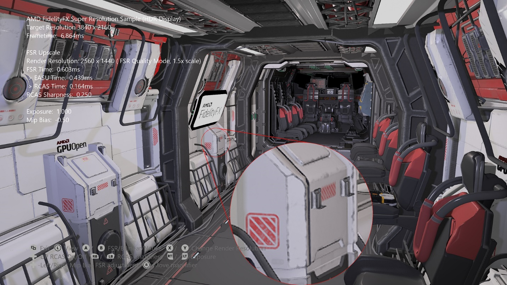

  

#   FidelityFX 超分辨率

*此示例与 Microsoft 游戏开发工具包（2021 年 4 月）兼容*

# 说明

AMD FidelityFX 超分辨率 (FSR)
是一种优化的高质量解决方案，用于从较低分辨率的输入产生较高分辨率的输出。它使用了一系列尖端算法，特别强调创建高质量的边缘，与直接以原始分辨率渲染相比，性能有了很大提升。FSR
可为硬件光线跟踪等成本高昂的渲染运算提供"实用的性能"。

# 此示例演示的是实现 FSR 对于一个场景的影响。有一个可移动的放大镜，用于检查图像质量，同时更改设置以与本地渲染进行比较。

可在 <https://gpuopen.com/fsr> 的 GPUOpen 查找关于 FidelityFX
超分辨率的最新信息。

# 生成示例

如果使用 Windows 桌面，请将活动解决方案平台设置为 Gaming.Desktop.x64。

如果使用 Project Scarlett，请将活动解决方案平台设置为
Gaming.Xbox.Scarlett.x64。

如果使用 Xbox One，请将活动解决方案平台设置为 Gaming.Xbox.XboxOne.x64。

运行 Windows 桌面版时，请确保系统安装了最新的图形驱动程序。

*有关详细信息，请参阅 GDK 文档中的*"运行示例"*。*

# 使用示例

| 操作                                  |  游戏板                       |
|---------------------------------------|------------------------------|
| 旋转视图                              |  左控制杆                     |
| 放大镜位置                            |  右控制杆                     |
| 退出                                  |  视图按钮                     |
| FSR 打开/关闭                         |  A 按钮                       |
| FSR 质量模式                          |  X/Y 按钮                     |
| RCAS 锐度 \[0.0 *(锐度最高)* 至 \> 0.0 *(锐度降低)*\] |  左侧/右侧肩按钮 |
| 启用/禁用 RCAS                        |  方向键向上按钮               |
| 色调图曝光                            |  右/左扳机键                  |
| Mip 偏差调整                          |  方向键向左/向右按钮          |

# 实施说明

## 操作方法

FSR
是一种空间增量程序。它的工作原理是采用当前的抗锯齿帧并对其进行纵向扩展以显示分辨率。FSR
只需要当前帧的数据。而不需要运动向量或帧历史记录。FSR
的核心是一种先进算法，用于从源图像中检测和重新创建高分辨率边缘。这些高分辨率边缘是将当前帧转换为"超分辨率"图像所需的关键元素。FSR
提供一致的增量缩放质量，无论帧是否处于移动状态，与其他类型的增量程序相比，它提供的质量更具优势。

FSR 由两个主要通道组成：

-   一个名为 Edge-Adaptive 空间上采样 (EASU) ()
    的增量扩展通道，用于执行边缘重建。在此通道中，将会分析输入帧以进行渐变反转，旨在了解相邻渐变与一组输入像素的差异有多大。渐变反转强度确定应用于样本的权重，以便在显示器分辨率下重建。

-   一个名为"可靠对比度自适应锐化
    (RCAS)"的锐化通道（提取已增量图像中的像素详细信息）。

在此示例中，两个通道作为计算着色器实现，它们对 gamma2
颜色空间数据进行运算。

如果 HDR 显示器在 Scarlett 和 XboxOne 平台上可用，则在 HDR
模式下运行示例。在桌面平台上，该示例将仅在 SDR 模式下运行。

此示例以动态解析样式实现，通过这种样式，在进行纵向扩展之前，使用目标解析资源并将其渲染为使用较小分辨率视区。

有用于本地目标解析渲染、从可选择的低分辨率进行双线性纵向扩展以及从可选质量模式进行
FSR 纵向扩展的模式。

## 

## 帧中的位置

FSR
在感知色空间中的传递效果最佳，因此应在色调图后集成。在进行纵向扩展后，应渲染向场景引入噪音或其他高频视觉组件的传递，以避免这些噪音组件被放大。

此示例中采用的是以下帧结构：

示例中的色调图传递将 gamma2 输出写入到 EASU 和 RCAS 使用的
R10G10B10A2_UNORM 资源中，然后放大镜传递。 在 SDR 中，颜色转换传道将
gamma2 转换回线性。在 HDR 中，连接 HDR 显示器后，颜色转换通道会将 gamma2
转换为 rec2020。

## 必需常量

处理常量的方式是尽可能简化集成。帮助程序函数填充 4 个整数向量，可在 CPU
或 GPU 上调用。可以将变量添加到现有常量缓冲区，提取这些变量，然后传递给
EASU/RCAS 函数。

在此示例中，在 CPU 上调用帮助程序，而常量则由单个缓冲区提供。

> 结构 FSRConstants
>
> {
>
> DirectX::XMUINT4 Const0;
>
> DirectX::XMUINT4 Const1;
>
> DirectX::XMUINT4 Const2;
>
> DirectX::XMUINT4 Const3;
>
> };
>
> FSRConstants m_fsrConsts;

**EASU**

> FsrEasuCon(
>
> reinterpret_cast\<AU1\*\>(&m_fsrConsts.Const0),
>
> reinterpret_cast\<AU1\*\>(&m_fsrConsts.Const1),
>
> reinterpret_cast\<AU1\*\>(&m_fsrConsts.Const2),
>
> reinterpret_cast\<AU1\*\>(&m_fsrConsts.Const3),
>
> inWidth, inHeight, // 要缩放的输入图像的视区大小（左上角对齐）。
>
> outWidth, outHeight, // 输入图像的大小。
>
> outWidth, outHeight); // 输出分辨率。

上面的示例适用于动态分辨率样式，其中几何图形渲染到较大资源内的视区中。如果渲染到的资源大小与视区相同，我们将会看到以下内容：

> FsrEasuCon(
>
> reinterpret_cast\<AU1\*\>(&m_fsrConsts.Const0),
>
> reinterpret_cast\<AU1\*\>(&m_fsrConsts.Const1),
>
> reinterpret_cast\<AU1\*\>(&m_fsrConsts.Const2),
>
> reinterpret_cast\<AU1\*\>(&m_fsrConsts.Const3),
>
> inWidth, inHeight, // 要缩放的输入图像的视区大小（左上角对齐）。
>
> inWidth, inHeight, // 输入图像的大小。
>
> outWidth, outHeight); // 输出分辨率。

如果输入经过宽屏幕变形处理，并且视区不是左上角对齐，则会提供
FsrEasuConOffset 函数来适应此情况。

> void FsrEasuConOffset(
>
> outAU4 con0,
>
> outAU4 con1,
>
> outAU4 con2,
>
> outAU4 con3,
>
> AF1 inputViewportInPixelsX,
>
> AF1 inputViewportInPixelsY,
>
> AF1 inputSizeInPixelsX,
>
> AF1 inputSizeInPixelsY,
>
> AF1 outputSizeInPixelsX,
>
> AF1 outputSizeInPixelsY,
>
> AF1 inputOffsetInPixelsX,
>
> AF1 inputOffsetInPixelsY)

**RCAS**

> FsrRcasCon(reinterpret_cast\<AU1\*\>(&m_fsrConsts.Const0),
> m_rcasSharpness);

浮点锐度值的刻度如下所示：

> {0.0 := maximum, to N\>0, N 代表锐度减少的停止次数(减半)}

*请注意，缩放与 FidelityFX CAS 的缩放不同*。

## 质量模式

FSR
公开质量模式，以描述要应用于源图像的缩放量，具体取决于所需的质量/性能比。

除了固定缩放，FSR 还可以在"任意缩放"模式下使用。支持介于 1倍和
4倍之间的任意区域缩放系数。此模式通常用于动态解析缩放，因此源解析由固定性能预算确定，以实现最低帧率。

| **FSR 1.0 质量模式**  |  **说明**  |  **缩 放系数**  |  **输入\ 解 决方法** |  **输出\ 解 决方法** |
|-------------|----------------------|-----------|----------|----------|
| **" 超高质量"**  |  ***超高质量**模 式可以生成画质与本地 渲染的几乎无法区分的 图像。当需要最高质量 时，应选择这一模式*  |  每个维度 **1.3 倍** （1.69 倍区 域缩放）  |  1477x831 1 970x1108 26 46x1108\ 2 954x1662  |  1 920x1080 2 560x1440 3 440x1440 3 840x2160 |
| **"质量"**  |  ***"质量"**模式可 以生成质量可以代表本 地渲染的超高分辨率图 像，显著提升性能。*  |  每个维度 **1.5 倍** （2.25 倍区 域缩放）  |  1280x720 1706x960 2293x960 2 560x1440  |  1 920x1080 2 560x1440 3 440x1440 3 840x2160 |
| **"平衡"**  |  ***"平衡"**模式可以 生成质量近似于本地渲 染质量的超高分辨率图 像，与本地模式相比获 得显著的性能增强。*  |  每个维度 **1.7 倍** （2.89 倍区 域缩放）  |  1129x635 1506x847 2024x847 2 259x1270  |  1 920x1080 2 560x1440 3 440x1440 3 840x2160 |
| **"性能"**  |  * **"性能"**模式对图像 质量的影响十分明显， 应仅在一定需要更多性 能的情况下才选择。*  |  每个维度 **2.0 倍** （4 倍区 域缩放）  |  960x540 1280x720 1720x720 1 920x1080  |  1 920x1080 2 560x1440 3 440x1440 3 840x2160 |

## 推荐

**格式、编译器选项和浮点路径选项**

此示例使用 32bpp R10G10B10A2_UNORM 资源作为 FSR
路径，从而获得最高性能。EASU 传递通常与 ALU 绑定，RCAS 则与 MEM 绑定。

当按照本示例实现时，我们推荐以下支持的平台：

| 平台           |  资源类型         |  EASU 推荐      |  RCAS 推荐      |
|----------------|------------------|----------------|----------------|
| **Scarlett**  |  R 10G10B10A2_UNORM |  Wave32、Fp16  |  Wave64、Fp32 |
|  |  R1 6G16B16A16_FLOAT |  Wave32、Fp16  |  Wave32、Fp16 |
| **XboxOne**  |  R 10G10B10A2_UNORM |  Fp32  |  Fp32 |
|  |  R1 6G16B16A16_FLOAT |  Fp32  |  Fp32 |
| **台式设备**  |  R 10G10B10A2_UNORM |  Fp16  |  Fp16 |
|  |  R1 6G16B16A16_FLOAT |  Fp16  |  Fp16 |

如果由于设备支持，本机 fp16 在桌面平台上不可用，则使用 fp32。

**抗锯齿输入**

FSR 1.0 需要抗锯齿输入。如果没有高质量的 AA 可用（如 TAA 或 MSAA
8x），则不建议使用 FSR。此示例中使用基本 TAA。

**MIP 偏差**

对于更高质量的输出，FSR 集成应包括 MIP 偏差更改。此示例应用以下内容：

*MIP 偏差 = -log2（显示器分辨率/源分辨率）*

**颜色空间**

FSR 传递的输入应在感知颜色空间（如 sRGB 或
Gamma2）中。输入中不应有分级，因为这样的分级可能会被放大。

**FSR 动态分辨率**

FSR
非常适合动态解析，此示例演示了如何设置常量以供使用，从而使输入数据成为较大资源的子集。

在动态分辨率呈现为 100% 的特殊情况下，可以跳过 EASU 传递，同时保留 RCAS
以提供无缝体验。

**RCAS 锐化**

RCAS 的锐化衰减值与 CAS 存在的值不同。

使用 RCAS 时，0.0 是最高级别的锐化，N\>0 则会降低应用的锐度级别。

此示例的默认 RCAS 锐化衰减设置为 0.25。

# 更新历史记录

此示例编写于 2021 年 6 月。

# 隐私声明

在编译和运行示例时，将向 Microsoft
发送示例可执行文件的文件名以帮助跟踪示例使用情况。若要选择退出此数据收集，你可以删除
Main.cpp 中标记为"示例使用遥测"的代码块。

有关 Microsoft 的一般隐私策略的详细信息，请参阅 [Microsoft
隐私声明](https://privacy.microsoft.com/en-us/privacystatement/)。

# 免责声明

此处包含的信息仅用于信息性目的，在不通知的情况下可能会发生更改。尽管本文档的准备工作中已采取每个预防措施，但它可能包含技术不准确、遗漏和类型错误，并且
AMD 没有义务更新或以其他方式更正此信息。Advanced Micro Devices, Inc.
不就本文档内容的准确性或完整性做出任何表示或保证，并且不承担任何类型的责任，包括针对此处所述的
AMD
硬件、软件或其他产品的操作或使用情况的不侵权、适销性或适用性的隐含保证。本文档不授予任何知识产权的许可，包括默示的或由禁止反言引起的许可。双方签署的协议或
AMD 的标准销售条款和条件中规了适用于购买或使用 AMD 产品的条款和条件。

AMD、AMD 箭头徽标、Radeon、RDNA、Ryzen 及其组合是 Advanced Micro
Devices, Inc.
的商标。本出版物中使用的其他产品名称仅用于识别目的，可能是其各自公司的商标。

Windows 是 Microsoft Corporation 在美国和/或其他国家/地区的注册商标。

Xbox 是 Microsoft Corporation 在美国和/或其他国家/地区的注册商标。

© 2021 Advanced Micro Devices, Inc.保留所有权利。
