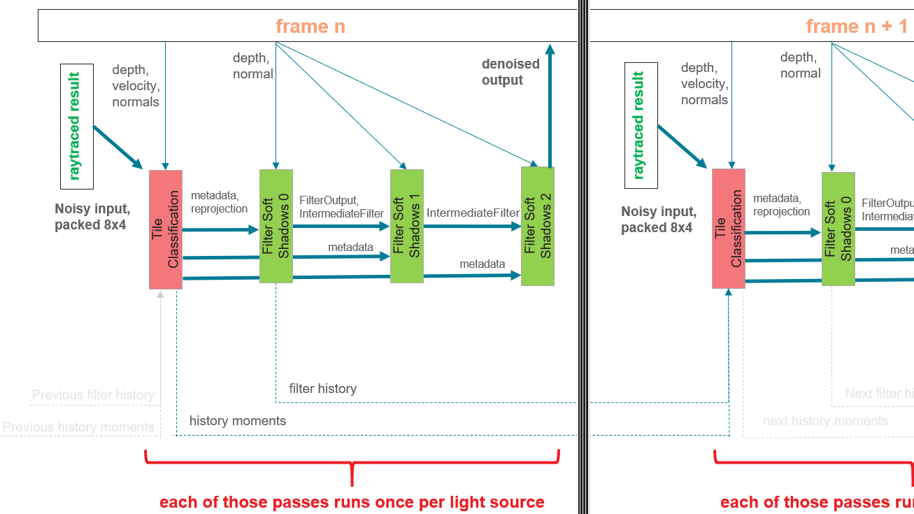

<br/><br/><br/><br/><br/>

# FidelityFX Raytraced Shadow Denoiser Sample

*This sample is compatible with the Microsoft Game Development Kit (March 2022)*

# Description

# This sample shows an implementation of the FidelityFX RT Shadow Denoiser applied against a basic implementation of DXR 1.0 Raytraced Shadows.


# Building the sample

If using Windows Desktop, set the active solution platform to `Gaming.Desktop.x64`.

If using Xbox Series X|S, set the active solution platform to `Gaming.Xbox.Scarlett.x64`.

This sample is not compatible with Xbox One.

*For more information, see* __Running samples__, *in the GDK documentation.*

# Using the sample

| Action                                |  Gamepad                      |
|---------------------------------------|------------------------------|
| Rotate view                           |  Left thumbstick              |
| Reset view                            |  Left thumbstick (click)      |
| Exit                                  |  View Button                  |

# Implementation notes

This sample has a basic single point light implementation of Raytraced
Shadows, using ray randomization within a cone to achieve penumbra. It
is inherently a noisy process, and for performance reasons we do not
want to exceed 1 ray per pixel -- so it requires denoising to be used in
production.

The RT Shadow implementation is not a focus of this sample and has not
been optimized in any way -- it is simply input into the denoiser.

The FidelityFX Raytraced Shadow Denoiser takes the noisy output from
raytracing, and over several passes classifies and filters the shadows
to a form which is acceptable for compositing into a scene.


Noisy RT shadows


Denoised shadows

## Passes

**ffx_denoiser_shadows_prepare**

First, the output from the raytracer is packed into a buffer laid out in
a uint bitmask to represent 8x4 pixel regions. This assists with
bandwidth reduction in later passes. An optimization can be made for a
raytracing pass to work as a group and write these bitmasks directly,
however this is not performed in this sample.

**ffx_denoiser_shadows_tileclassification**

Tile Classification actually performs three major steps;

1.  Local Neighborhood

2.  Disocclusion Mask

3.  Reprojection

**Local Neighborhood** encodes the first two moments of the shading
values (in this case, the noisy shadow values) surrounding a pixel.

Those moments are called respectively:

-   the **mean**, which is the average of the neighboring samples,

-   and the **variance**, which represents an estimation of the amount
    of noise in the image.

These values will be used in the reprojection step so we will see later
how they are used; for now we will focus on how to calculate them.

The FidelityFX RT Shadow Denoiser sets the kernel radius value to 8,
which corresponds to an 17x17 kernel.

Here is a series of renders with various kernel sizes under heavy shadow
motion:


| 5x5 kernel | 17x17 kernel<br/> (default) |  29x29 kernel |
|----------------------|-----------------------|-----------------------|
|  |  |    |

We can see how the shadow quality increases with the size of the kernel;
the 17x17 kernel is selected as a balance between quality and
performance.

However, a 17x17 kernel would require 289 taps per pixel, which is
prohibitively expensive. The solution here is to realize that the
variance calculation kernel is separable, meaning we can perform a
horizontal pass, store the intermediate results and finish with a
vertical pass; this drops the number of per-pixel taps down to 34 across
the two passes.

Utilizing cross lane operations, we can share values that are in
registers of neighboring lanes. Additionally, using a compressed bitmask
for ray hits we can bring the 289 taps down to 18 scalar loads.

The vertical pass is integrated into the temporal reprojection pass
itself to avoid the memory bandwidth requirements of having to write to
and read from an additional intermediate target.

**Disocclusion Mask** determines new areas on the screen. These are
regions that were previously outside of screen-space but are now visible
due to camera motion, or now visible due to occluders moving.

This information is typically referred to as disocclusion and in this
pass we write out a binary mask flagging which pixels were disoccluded
and which were not.

In order to determine which areas are new, we calculate for each pixel
the depth value that it should have had in the previous frame were it
present and compare it with the actual value using the depth buffer from
the last frame; if the depth values do not match, this is a
disocclusion.

To calculate the previous depth value, we use a reprojection matrix that
takes a clip-space position in the current frame and returns the
clip-space position in the previous frame, from which we can retrieve
the desired depth value:

```cpp
reprojection_matrix = view_projection_inverse_matrix * previous_view_projection_matrix;
```


> The disocclusion mask flags the new pixels on screen

In the above image, a larger than 1% depth error is enough to trigger a
disocclusion and while this works well in the general case, it breaks
down for areas of the screen that exhibit large depth variations, which
typically happens at grazing angles.

We fix this is by dynamically changing the threshold value per pixel
based on the surface grazing angle (estimated using the dot product of
the camera forward direction and the surface normal vector):

| Constant depth threshold |  Adaptive depth threshold |
|--------------------------|---------------------------|
|  |  |


Notice the invalid horizontal lines on the floor caused by the large
depth variations, which are removed in the adaptive version.

**Reprojection** uses the Local Neighborhood data, Disocclusion data,
and temporal history buffers provided to perform velocity based
reprojection.

Fist we calculate temporal variance, which is an estimate of the amount
of noise in the image. This value will be used by the spatial passes to
drive the amount of blur needed for denoising:


> Temporal variance

When few temporal samples are available, due to masked disoccluded
regions resetting the per-pixel sample count, the temporal variance is
combined with the spatial one that was described in the Local
Neighborhood section of this pass:

```cpp
if (moments_current.z < 16.0f)
{
    const float variance_boost = max(16.0f -- moments_current.z, 1.0f);
    variance = max(variance, spatial_variance);
    variance \*= variance_boost; // boost variance on first frames
}
```

We boost the value of the variance when few samples are available in
order to get rid of the noise in the regions where temporal reprojection
does not work:

| Without variance boost |  With variance boost             |
|-----------------------------------|-----------------------------------|
|  |  |


Notice how the bottom and far-left parts of the image are much noisier
without applying the variance boost. Increasing the variance value will
mean a more aggressive spatial blur for those pixels that have little to
no temporal history; this is cooled off and disabled as the history
grows longer.

Once moments and variance are calculated, the shader reprojects the
shadow values from the previous frames, from the history buffer, and
re-use the samples for denoising.

One important issue here is that shadows can move, and this motion is
not reflected into the velocity map. So, we need a way to accept or
reject history samples for these cases. This is done by clamping the
reprojected history value to the local neighborhood that was calculated
earlier:

| Naïve blending |  Neighborhood clamping |
|-----------------------------------|-----------------------------------|
|  |  |

Notice how the shadow pretty much disappears as many temporal samples
get incorrectly blended. On the other hand, neighborhood clamping helps
with obtaining a much more responsive filter and preserves the shadow
details under motion.

```cpp
// Compute the clamping bounding box
const float std_deviation = sqrt(local_variance);
const float nmax = local_mean + 0.5f \* std_deviation;
const float nmin = local_mean - 0.5f \* std_deviation;

// Clamp reprojected sample to local neighborhood
const float shadow_previous = SampleHistory(uv - velocity);
const float shadow_clamped = clamp(shadow_previous, nmin, nmax);
```

The neighborhood clamping implementation resembles the above code, and
can be seen towards the end of the FFX_DNSR_Shadows_TileClassification
function.

The clamped history information is finally merged with the current frame
using a simple exponential moving average blend.

However, we need to choose the blend factor where:

-   a low blend factor will mostly keep the current frame value
    resulting in a responsive but unstable filter,

-   a high blend factor will mostly keep the clamped history value
    resulting in a stable but unresponsive filter.

One solution is to choose the blend factor per pixel based on the amount
of history available - where we have little to no history, we will go
for a low blend factor, whereas where we are confident about our
reprojection we will go for a high blend factor:

| Constant blend factor |  Adaptive blend factor |
|-----------------------------------|-----------------------------------|
|  |  |

Notice how the adaptive version produces a more responsive filter,
eliminating most of the temporal bleeding from the initial render.

**ffx_denoiser_shadows_filter**

The final pass of the FidelityFX RT Shadow Denoiser is responsible for
performing the spatial filtering and is run three times. The three
passes have a relatively small region where they sample from so these
run optimized kernels that utilize groupshared memory to cache samples.

It implements the Edge-Avoiding À-Trous Wavelet (EAW) filtering
technique, where blurs are performed repeatedly with increasing radius
values over multiple passes:

| No EAW pass | Single EAW pass | 3 EAW passes        |
|----------------------|-----------------------|-----------------------|
|  |  |  |

Additionally, the variance estimated in the temporal pass is updated
with its filtered value after each subsequent blur pass; this allows to
cool off the amount of blurring where it is not needed anymore:

| Variance after 1 blur pass |  Variance after 2 blur passes |  Variance after 3 blur passes |
|-----------------------|-----------------------|----------------------|
|  |  |  |

Notice how the variance reduces with each subsequent blur pass.

## Integration

There are 4 hlsl shader includes in the ffx_rtshadowdenoiser package:

-   ffx_denoiser_shadows_filter.h

-   ffx_denoiser_shadows_prepare.h

-   ffx_denoiser_shadows_tileclassification.h

-   ffx_denoiser_shadows_util.h

All required data is provided via Get/Read/Write style api functions,
which are to be created by the application.

In this sample, integration is provided via:

-   prepare_shadow_mask_d3d12.hlsl

-   tile_classification_d3d12.hlsl

-   filter_soft_shadows_pass_0\_d3d12.hlsl

-   filter_soft_shadows_pass_1\_d3d12.hlsl

-   filter_soft_shadows_pass_2\_d3d12.hlsl

We have found the filter passes work better in Wave32 mode on Xbox
Series X|S, and that is the default for those passes in this sample. The
Tile Classification pass is faster in Wave64 mode.

The shaders use explicit FP16 and require -enable-16bit-types be passed
to DXC.

**Dataflow**

The sample aims to lay out the code dataflow in as easy a way to follow
as possible, and may not be the most efficient use of resources. Below
is a map of resource use for the various passes.



## 

**TAA**

Temporal anti-aliasing or TAA aims at anti-aliasing a rendered image by
performing temporal reprojection. TAA can further stabilize and clean up
the image after the denoiser has run.

| Without TAA |  With TAA |
|-----------------------------------|-----------------------------------|
|  |      |


Notice how the render without TAA exhibits artifacts at the edges where
the spatial blur fails to find matching samples.

This sample does not implement a final TAA pass, however, if TAA is used
in your title you should experiment with including denoiser output to
make sure it makes sense in your scenes.

Note: The workload timings listed on the UI can vary on Desktop
configurations due to power profiles - for most accurate timing, profile
under PIX.

# Update history

This sample was written in January 2021.

# Privacy Statement

When compiling and running a sample, the file name of the sample
executable will be sent to Microsoft to help track sample usage. To
opt-out of this data collection, you can remove the block of code in
Main.cpp labeled "Sample Usage Telemetry".

For more information about Microsoft's privacy policies in general, see
the [Microsoft Privacy
Statement](https://privacy.microsoft.com/en-us/privacystatement/).

# Disclaimer

The information contained herein is for informational purposes only, and
is subject to change without notice. While every precaution has been
taken in the preparation of this document, it may contain technical
inaccuracies, omissions and typographical errors, and AMD is under no
obligation to update or otherwise correct this information. Advanced
Micro Devices, Inc. makes no representations or warranties with respect
to the accuracy or completeness of the contents of this document, and
assumes no liability of any kind, including the implied warranties of
noninfringement, merchantability or fitness for particular purposes,
with respect to the operation or use of AMD hardware, software or other
products described herein. No license, including implied or arising by
estoppel, to any intellectual property rights is granted by this
document. Terms and limitations applicable to the purchase or use of
AMD's products are as set forth in a signed agreement between the
parties or in AMD\'s Standard Terms and Conditions of Sale.

AMD, the AMD Arrow logo, Radeon, RDNA, Ryzen, and combinations thereof
are trademarks of Advanced Micro Devices, Inc. Other product names used
in this publication are for identification purposes only and may be
trademarks of their respective companies.

Windows is a registered trademark of Microsoft Corporation in the US
and/or other countries.

Xbox is a registered trademark of Microsoft Corporation in the US and/or
Other countries.

© 2021 Advanced Micro Devices, Inc. All rights reserved.
