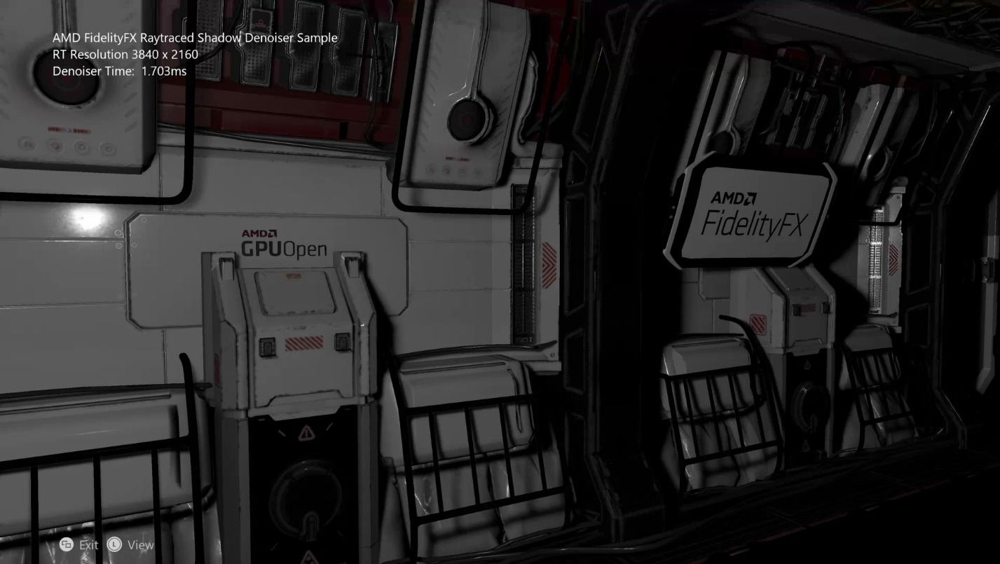
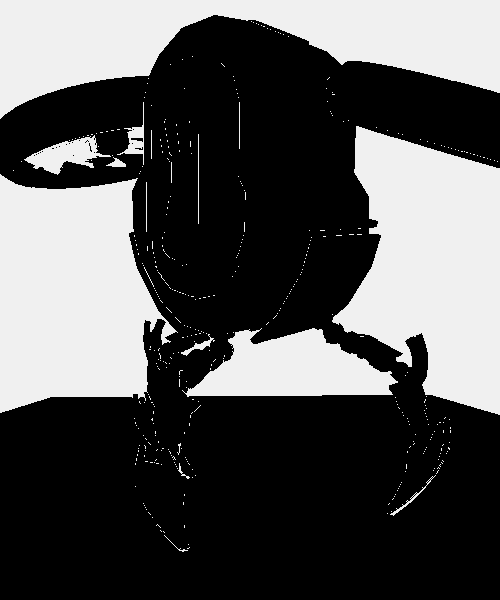

  

#   FidelityFX 레이 트레이싱된 그림자 노이즈 제거기 샘플

*이 샘플은 Microsoft 게임 개발 키트(2021년 2월)*

# 설명

# 이 샘플은 DXR 1.0 레이 트레이싱된 그림자의 기본 구현에 대해 적용된 FidelityFX RT 그림자 노이즈 제거기의 구현을 보여줍니다.

# 샘플 빌드

Windows Desktop을 사용하는 경우 활성 솔루션 플랫폼을
Gaming.Desktop.x64로 설정합니다.

Project Scarlett를 사용하는 경우 활성 솔루션 플랫폼을
Gaming.Xbox.Scarlett.x64로 설정합니다.

이 샘플은 Xbox One과는 호환되지 않습니다.

*자세한 내용은 GDK 설명서에서* 샘플 실행을 *참조하세요.*

# 샘플 사용

| 작업                                  |  게임 패드                    |
|---------------------------------------|------------------------------|
| 보기 회전                             |  왼쪽 엄지스틱                |
| 보기 다시 설정                        |  왼쪽 엄지스틱(클릭)          |
| 끝내기                                |  보기 단추                    |

# 구현 참고 사항

이 샘플에서는 원뿔 안의 광선 임의화를 사용해 반그림자를 구현하는 레이
트레이싱된 그림자의 기본 단일 지점 광원을 구현합니다. 이는 기본적으로
노이즈가 섞인 프로세스이며 성능상의 이유로 인해 픽셀 당 하나의 광선을
초과해 곱계산 단계에서 노이즈 감소를 사용해야 하는 일이 없도록 하고자
합니다.

이 샘플은 RT 그림자 구현에 초점을 두지 않았으며 RT 그림자 구현은 어떤
방식으로든 최적화되지 않아 노이즈 제거기에만 입력되었습니다.

FidelityFX 레이 트레이싱된 그림자 노이즈 제거기는 레이트레이싱으로부터
노이즈가 많은 출력을 가져오고 여러 번의 패스를 통해 그림자를 분류하고
필터링해 장면을 구성할 만한 수준의 형태로 만들어냅니다.

노이즈가 섞인 RT 그림자

노이즈가 제거된 그림자

## 패스

**ffx_denoiser_shadows_prepare**

첫째, 레이트레이서의 출력은 8x4 픽셀 영역을 나타내기 위한 유닛
비트마스크에 레이아웃된 버퍼에 압축됩니다. 이렇게 하면 이어질 패스에서
대역폭을 줄이는 데 도움이 됩니다. 레이트레이싱 패스가 그룹처럼 작동해
직접 이 비트마스크를 기록할 수 있게 최적화할 수도 있지만 이 샘플에서는
수행하지 않습니다.

**ffx_denoiser_shadows_tileclassification**

실제 타일 분류는 세 가지의 주요 단계를 수행합니다.

1.  로컬 환경

2.  디스오클루전 마스크

3.  재투영

**로컬 환경**은 픽셀 주위의 음영 값(여기에서는 노이즈가 섞인 그림자
값)의 처음 두 순간을 인코딩합니다.

해당 순간들은 각각 다음과 같이 불립니다.

-   인접한 샘플들의 평균인 **평균값**

-   그리고 이미지의 노이즈 양을 예상해 나타내는 **차이값**입니다.

이 값들은 재투영 단계에 사용되어 나중에 어떻게 사용되었는지 확인할 수는
있지만 현재 단계에서는 이 값들을 어떻게 계산하는가에 집중하도록 합니다.

FidelityFX RT 그림자 노이즈 제거기는 커널 반지름 값을 17x17 커널에 맞게
8로 설정합니다.

그림자 동작이 많은 상태에서 다양한 커널 크기의 렌더링 시리즈는 다음과
같습니다.

| {width="2.0in" | e8.png){width="2.0in" | 9.png)      |
| > 5x5 커널 |  > 17x17 커널(기본값) |  > 29x29 커널         |
|----------------------|-----------------------|----------------------|
|  |

커널 크기에 따라 그림자의 품질이 어떻게 증가하는지 알 수 있습니다.
품질과 성능의 균형을 이루기 위해 17x17 커널이 선택되었습니다.

그러나 17x17 커널을 사용하면 픽셀당 탭이 289개가 되어야 하므로 지나치게
비용이 많이 듭니다. 여기에서의 해결 방법은 차이값 계산 커널은 분리할 수
있다는 사실을 인식하는 것입니다. 즉, 가로 패스를 수행하고 중간 결과를
저장한 다음 세로 패스로 마무리할 수 있다는 뜻입니다. 이렇게 하면 두 번
패스할 동안에 픽셀당 탭의 개수를 34개까지로 줄일 수 있습니다.

레인 간 연산을 사용하면 인접 레인의 레지스터에 있는 값을 공유할 수
있습니다. 또한, 광선의 적중에 대한 압축 비트마스크를 사용해서 289개의
탭을 스칼라 로드 18개로 줄일 수 있습니다.

세로 패스는 추가적인 중간 대상을 읽고 쓸 메모리 대역폭이 필요하지 않도록
하기 위해 임시 재투영 패스에 통합됩니다.

**디스오클루션 마스크**는 화면에서 새로운 영역을 결정합니다. 이 영역은
원래는 화면 바깥에 있었지만 카메라가 움직이면서 지금은 보이게 되었거나
장애물이 비켜나면서 보이게 된 지역입니다.

이 정보를 일반적으로 디스오클루션이라고 하며 이번 패스에서는 어떤 픽셀이
가려져 있다 드러나고 어떤 픽셀이 그렇지 않은지 플래그를 지정하는 이진
마스크를 작성합니다.

새로운 영역을 결정하기 위해, 각 픽셀에 대해 이전 프레임에 반드시 있어야
하는 깊이 값이 있었는지 계산하고 이 값을 마지막 프레임의 깊이 버퍼를
이용해 실제 값과 비교합니다. 깊이 값이 서로 일치하지 않는 경우라면
디스오클루션이 발생한 것입니다.

이전의 깊이 값을 계산하기 위해 이전 프레임 상의 클립 공간 위치를
차지하는 재투영 매트릭스를 사용합니다. 이전 프레임에서는 다음과 같이
원하는 깊이 값을 검색할 수 있습니다.

reprojection_matrix = view_projection_inverse_matrix \*
previous_view_projection_matrix;

> 디스오클루션 마스크는 화면에 새로 나타난 픽셀에 플래그를 지정합니다.

위의 이미지에서 깊이 오류가 1%보다 크기만 하면 디스오클루션을 일으킬 수
있으며 일반적으로 이것이 제대로 작동하는 동안에는 일반적으로 지표각에서
발생하는 것처럼 화면 상에서 깊이 값이 크게 변화하는 영역이 세분화됩니다.

전면을 향한 카메라의 점곱과 표면 일반 벡터를 이용해 예측한 지표각에
기반한 픽셀당 임계값을 현저하게 변경하여 이러한 문제를 해결합니다.

| {width="3.125in" | edia/image12.png)                   |
| > 상수 깊이 임계값 |  > 증분 깊이 임계값                |
|-----------------------------------|-----------------------------------|
|

깊이 값이 크게 변화함에 따라 유효하지 않게 된 바닥의 가로선은 증분형
버전에서는 삭제됩니다.

**재투영**은 제공된 로컬 환경 데이터, 디스오클루션 데이터, 임시 기록
버퍼를 이용해 속도 기반 재투영을 수행합니다.

먼저 이미지 상의 노이즈 양을 통해 추측해 낸 임시 차이값을 계산합니다. 이
값은 노이즈 감소가 필요한 흐린 부분을 공간 패스가 유도하는 데
사용됩니다.

> 임시 차이값

디스오클루션 마스크로 가려졌던 지역이 픽셀당 샘플 수를 재설정하여 임시
샘플 가운데 사용할 수 있는 것이 거의 없는 경우에는 임시 차이값이 이
패스의 로컬 환경 섹션 부분에 설명되었던 공간 차이값과 결합합니다.

if (moments_current.z \< 16.0f)

{

const float variance_boost = max(16.0f -- moments_current.z, 1.0f);

variance = max(variance, spatial_variance);

차이값 \*= variance_boost; // 첫 번째 프레임의 차이값 증가

}

임시 재투영이 작동하지 않는 지역의 노이즈를 제거하기 위한 샘플이
충분하지 못한 경우에는 차이값을 높입니다.

| {width="3.0in" | /media/image15.png)                   |
| > 차이값을 증가하지 않는 경우 |  > 차이값을 증가하는 경우          |
|-----------------------------------|-----------------------------------|
|

차이값 증가를 적용하지 않으면 이미지의 아래 부분과 왼쪽 끝부분의
노이즈가 훨씬 많아집니다. 차이값을 증가시키면 임시 기록이 거의 없거나
전혀 없는 픽셀의 공간이 더욱 흐려집니다. 이러한 현상은 기록이 늘어남에
따라 안정되고 비활성화됩니다.

순간과 차이값이 계산되면 셰이더는 이전 프레임과 기록 버퍼에서의 그림자
값을 재투영하고 노이즈 제거용 샘플을 다시 사용합니다.

여기서 중요한 점은 그림자를 제거할 수 있으며 이러한 움직임이 속도 맵에는
반영되지 않는다는 점입니다. 그러므로, 이러한 상황에서 기록 샘플을
수락하거나 거부할 방법이 필요합니다. 이는 재투영된 기록 값을 이미 계산된
로컬 환경에 고정하여 해결합니다.

| {width="2.228571741032371in" | .png)                   |
| > 나이브 블렌딩 |  > 환경 클램핑                     |
|-----------------------------------|-----------------------------------|
|

그림자는 다수의 임시 샘플이 부정확하게 블렌딩됨에 따라 대부분
사라집니다. 이와는 달리, 환경 클램핑은 훨씬 반응성이 뛰어난 필터의
획득에 도움이 되며 움직임에 따른 그림자의 세부 정보를 보존합니다.

// 클램핑 경계 상자 계산

const float std_deviation = sqrt(local_variance);

const float nmax = local_mean + 0.5f \* std_deviation;

const float nmin = local_mean - 0.5f \* std_deviation;

// 재투영된 샘플을 로컬 환경에 고정

const float shadow_previous = SampleHistory(uv - velocity);

const float shadow_clamped = clamp(shadow_previous, nmin, nmax);

환경 클램핑 구현은 위 코드와 유사하며
FFX_DNSR_Shadows_TileClassification 함수 마지막 부분에서 확인할 수
있습니다.

고정된 기록 정보는 마지막으로 간단한 지수 이동 평균 블렌딩을 이용해 현재
프레임에 병합됩니다.

단, 다음 경우에는 블렌딩 요소를 선택해야 합니다.

-   낮은 블렌딩 요소가 현재의 프레임 값을 대부분 유지하여 반응성이
    좋지만 불안정한 필터를 생성하는 경우.

-   높은 블렌딩 요소가 고정 기록 값을 대부분 유지하여 안정적이지만
    반응성이 낮은 필터를 생성하는 경우.

한 가지 해결 방법은 사용할 수 있는 기록의 양을 기초로 하여 픽셀당 블렌딩
요소를 선택하는 것입니다. 기록이 거의 없거나 전혀 없는 경우에는 낮은
블렌딩 요소를 선택하고 재투영 결과에 대한 확신이 있다면 높은 블렌딩
요소를 선택하면 됩니다.

| {width="3.2in" | /media/image19.png)                   |
| > 상수 블렌딩 요소 |  > 증분 블렌딩 요소                |
|-----------------------------------|-----------------------------------|
|

증분형이 최초 렌더링으로부터 임시 블리딩을 대부분 제거하면서 보다
반응성이 높은 필터를 생성하는 방식을 확인합니다.

**ffx_denoiser_shadows_filter**

FidelityFX RT 그림자 노이즈 제거기의 마지막 패스는 공간 필터링 수행을
담당하며 세 번 실행됩니다. 이 세 번의 패스에는 샘플링을 통해 그룹 공유된
메모리를 캐시 샘플에 사용하는 최적화된 커널을 실행하도록 하는 상대적으로
작은 영역이 있습니다.

이 영역은 패스가 누적될수록 반지름 값이 커지면서 반복적으로 흐려지도록
하는 EAW(Edge-Avoiding À-Trous Wavelet) 필터링 기술을 구현합니다.

| {width="2.0in" | 21.png){width="2.0in" | 22.png)       |
| > EAW 패스 없음 |  > 단일 EAW 패스 |  > EAW 패스 3개        |
|----------------------|-----------------------|-----------------------|
|  |

또한, 임시 패스에서 추산된 차이값은 흐려짐 패스가 매번 이어질 때마다
필터된 값을 통해 업데이트됩니다. 이를 통해 더 이상 흐려질 필요가 없는
부분을 무마합니다.

| {width="2.0in" | 24.png){width="2.0in" | 5.png)      |
| > 흐려짐 패스 1회 > 뒤의 차이값 |  > 흐려짐 패스 2회 > 뒤의 차이값 |  > 흐려짐 패스 3회 > 뒤의 차이값        |
|-----------------------|-----------------------|----------------------|
|  |

흐려짐 패스가 이어질 때마다 차이값이 어떻게 줄어드는지 확인합니다.

## 통합

ffx_rtshadowdenoiser 패키지에는 다음 네 가지의 hlsl 셰이더가 있습니다.

-   ffx_denoiser_shadows_filter.h

-   ffx_denoiser_shadows_prepare.h

-   ffx_denoiser_shadows_tileclassification.h

-   ffx_denoiser_shadows_util.h

필요한 모든 데이터는 응용 프로그램에서 생성되는 Get/Read/Write 스타일의
api 기능을 통해 제공됩니다.

이 샘플에서는 다음을 통해 통합이 제공됩니다.

-   prepare_shadow_mask_d3d12.hlsl

-   tile_classification_d3d12.hlsl

-   filter_soft_shadows_pass_0\_d3d12.hlsl

-   filter_soft_shadows_pass_1\_d3d12.hlsl

-   filter_soft_shadows_pass_2\_d3d12.hlsl

Scarlett의 Wave32 모드에서 필터 패스가 더욱 작동이 잘되는 점을 발견했고
그것이 이 샘플의 패스 기본값입니다. 타일 분류 패스는 Wave64 모드에서 더
빠르게 작동합니다.

셰이더는 명시적 FP16을 이용하며 DXC에 패스될 16비트 형식이
필요(사용하도록 설정)합니다.

**데이터 흐름**

이 샘플은 최대한 따라하기 쉬운 방식으로 코드 데이터 흐름을 설명하는 것이
목적이며 리소스를 가장 효율적으로 사용하는 방식은 아닐 수 있습니다.
다양한 패스에 대한 리소스 사용 맵은 다음과 같습니다.

## 

**TAA**

TAA(임시 앤티앨리어싱)의 목적은 임시 재투영을 통해 렌더링된 이미지를
앤티앨리어싱하는 것입니다. TAA는 노이즈 제거기가 실행된 후에 이미지를
더욱 안정화하고 정리할 수 있습니다.

| {width="3.125436351706037in" | 8.png)     |
| > TAA 사용하지 않음 |  > TAA 사용                        |
|-----------------------------------|-----------------------------------|
|

흐린 공간이 일치하는 샘플을 찾지 못하는 가장자리에서 TAA를 사용하지 않은
렌더링이 어떤 식으로 아티팩트를 나타내는지 확인합니다.

이 샘플은 최종 TAA 패스를 구현하지는 않지만 TAA를 타이틀에 사용하는
경우에는 해당 장면이 이상하지 않은지 확인하기 위해 노이즈 제거기 출력을
포함한 사항들을 실험해 봐야 합니다.

참고: UI에 표시된 워크로드 타이밍은 전원 프로필로 인한 데스크톱 구성에
따라 차이가 있을 수 있습니다. 시간의 정확성을 위해 PIX에 프로파일합니다.

# 업데이트 기록

이 샘플은 2021년 1월에 작성되었습니다.

# 개인정보처리방침

샘플을 컴파일하고 실행하는 경우 샘플 사용량을 추적할 수 있도록 샘플 실행
파일의 파일 이름이 Microsoft에 전송됩니다. 이 데이터 수집을
옵트아웃하려면 \"샘플 사용량 원격 분석\"으로 레이블이 지정된
Main.cpp에서 코드 블록을 제거할 수 있습니다.

Microsoft의 개인정보 정책에 대한 자세한 내용은 [Microsoft
개인정보처리방침](https://privacy.microsoft.com/en-us/privacystatement/)을
참조하세요.

# 면책사항

여기에 포함된 정보는 정보 제공의 목적으로만 제공되며 예고 없이 변경될 수
있습니다. 이 문서를 준비하는 동안 모든 예방 조치를 취했지만 기술적인
부정확성, 누락 및 인쇄상의 오류가 포함될 수 있으며 AMD는 이 정보를
업데이트하거나 수정할 의무가 없습니다. Advanced Micro Devices, Inc.는
여기에 설명된 AMD 하드웨어, 소프트웨어 또는 기타 제품의 작동 또는 사용과
관련하여 비침해, 상품성 또는 특정 목적에의 적합성에 대한 묵시적 보증을
포함하여 이 문서 내용의 정확성 또는 완전성과 관련하여 어떠한 진술이나
보증도 하지 않으며 어떤 종류의 책임도 지지 않습니다. 묵시적이거나
금반언에 의해 발생하는 것을 포함하여 이 문서에서는 지적 재산권에 대한
라이선스를 부여하지 않습니다. AMD 제품의 구매 또는 사용에 적용되는 약관
및 제한 사항은 당사자 간의 서명된 계약 또는 AMD의 표준 판매 약관에
명시되어 있습니다.

AMD, AMD Arrow 로고, Radeon, RDNA, Ryzen 및 이들의 조합은 Advanced Micro
Devices, Inc.의 상표입니다. 이 간행물에 사용된 기타 제품 이름은 식별
목적으로만 사용되었으며 해당 회사의 상표일 수 있습니다.

Windows는 미국 및/또는 기타 국가에서 Microsoft Corporation의 등록
상표입니다.

Xbox는 미국 및/또는 기타 국가에서 Microsoft Corporation의 등록
상표입니다.

© 2021 Advanced Micro Devices, Inc. All rights reserved.
