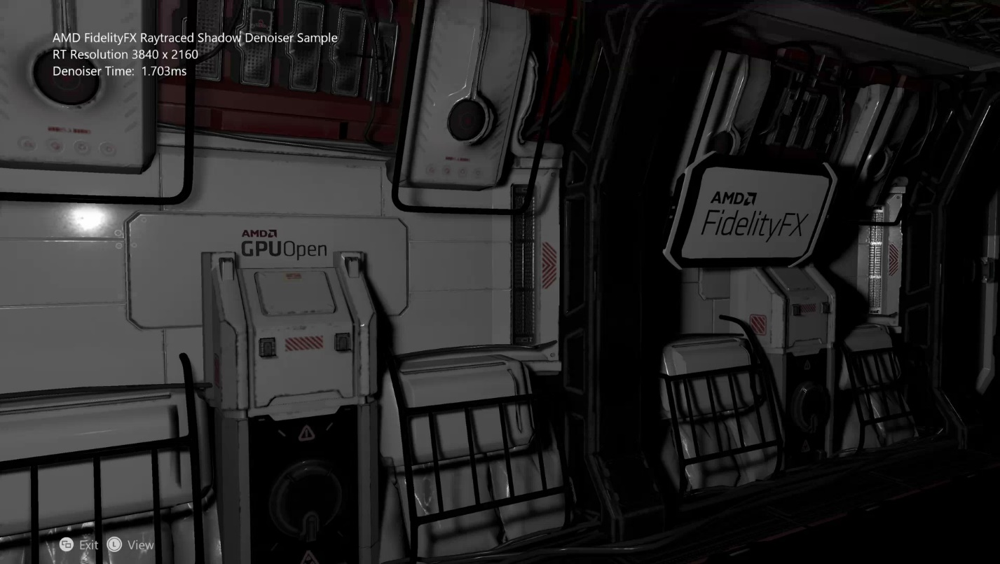
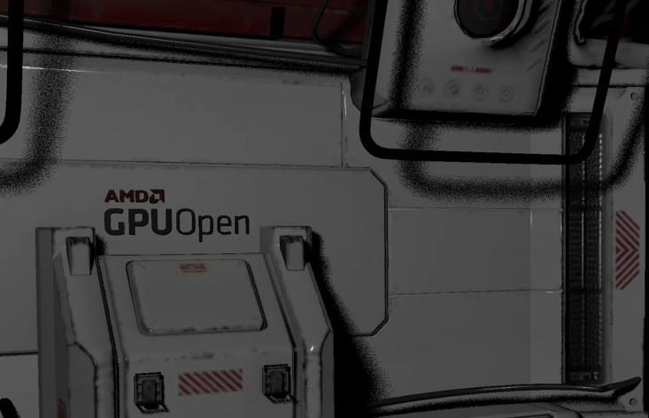
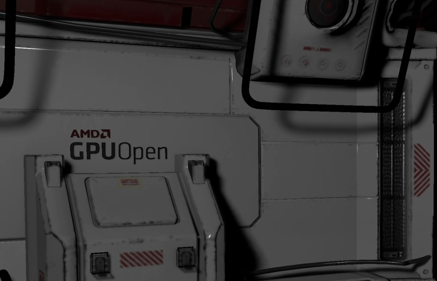
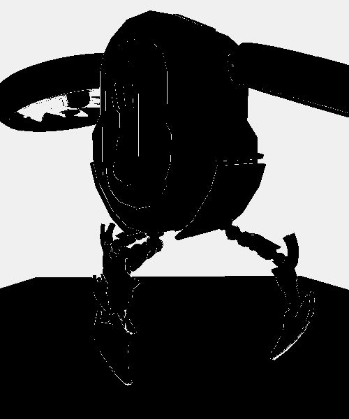
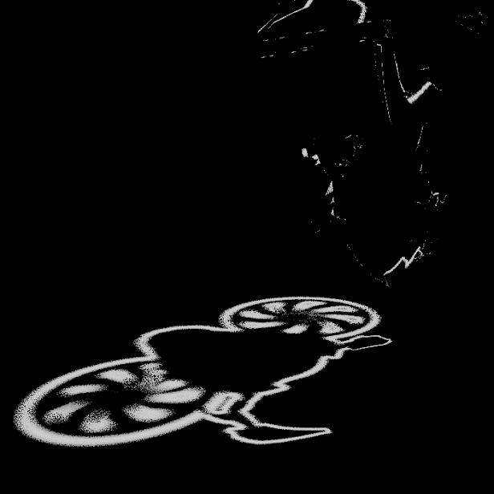
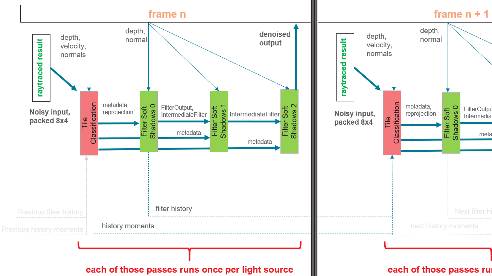

  

#   FidelityFX 光线跟踪阴影去噪器 示例

*此示例兼容于 Microsoft 游戏开发工具包（2021 年 2 月）*

# 说明

# 此示例显示了 FidelityFX RT 底纹去噪器对 DXR 1.0 光线跟踪阴影基本实现的应用。

# 生成示例

如果使用 Windows 桌面，请将活动解决方案平台设置为 Gaming.Desktop.x64。

如果使用 Project Scarlett，请将活动解决方案平台设置为
Gaming.Xbox.Scarlett.x64。

此示例与 Xbox One 不兼容。

*有关详细信息，请参阅 GDK 文档中的*"运行示例"*。*

# 使用示例

| 操作                                  |  游戏板                       |
|---------------------------------------|------------------------------|
| 旋转视图                              |  左控制杆                     |
| 重置视图                              |  左控制杆（单击）             |
| 退出                                  |  视图按钮                     |

# 实施说明

此示例具有光线跟踪阴影的基本单点照明实现，使用圆锥内的光线随机化来实现半影。它本质上是一个有噪音的流程，出于性能原因，我们不希望每像素超过
1 条光线，因此需要在生产环境中去噪。

光线跟踪阴影实现不是此示例的重点，并且尚未以任何方式进行优化，只是将其输入到去噪器中。

FidelityFX
光线跟踪阴影去噪器从光线跟踪中获取噪音输出，通过多次传递对阴影进行分类和筛选，找出构成场景可接受的形式。

有噪音的光线跟踪阴影

去噪的阴影

## 传递

**ffx_denoiser_shadows_prepare**

首先，光线跟踪器的输出打包到 UINT 位掩码中布局的缓冲区中，以表示 8x4
像素区域。这有助于在以后的传递中减少带宽。可以对光线跟踪传递进行优化以作为组工作并直接写入这些位掩码，但此示例中不会执行此操作。

**ffx_denoiser_shadows_tileclassification**

平铺分类实际上执行三个主要步骤：

1.  本地临近区域

2.  非遮挡掩码

3.  重新投影

**本地临近区域**对像素周围的着色值（在本例中为有噪音的阴影值）的前两个矩进行编码。

这些矩分别被称为：

-   **平均值**，即相邻示例的平均值，

-   和**方差**，即图像中噪音量的估计值。

这些值将在重新投影步骤中使用，因此稍后我们将了解它们的使用方式；现在，我们将重点介绍如何计算它们。

FidelityFX 光线跟踪阴影去噪器将内核半径值设置为 8，该值对应于 17x17
内核。

下面是在粗阴影运动下具有各种内核大小的一系列渲染：

| {width="2.0in" | e8.png){width="2.0in" | e9.png)       |
| > 5x5 内核  |  > 17x17 > 内核（默认值） |  > 29x29 内核 |
|----------------------|-----------------------|-----------------------|
|  |

可以看到阴影质量随内核大小的增加而增加；选择 17x17
内核作为质量和性能之间的平衡。

但是，17x17 内核需要每像素 289
次点击，这非常昂贵。此处的解决方案是为了发现，差异计算内核是可分隔的，这意味着我们可以执行水平传递、存储中间结果并使用垂直传递完成；这会在两次传递中将每像素点击数减少到
34 次。

利用交叉通道操作，我们可以共享相邻通道寄存器中的值。此外，使用压缩位掩码进行光线命中，我们可以将
289 次点击降低到 18 次标量加载。

垂直传递集成到临时重新投影传递本身中，以避免内存带宽要求必须写入其他中间目标并从中读取。

**非遮挡掩码**确定屏幕上的新区域。这些区域以前在屏幕空间之外，但现在由于相机运动而可见，或者由于遮挡器移动而可见。

此信息通常称为非遮挡，在此传递中，我们写出一个二进制掩码，用于标记哪些像素已取消遮挡，哪些未取消遮挡。

为了确定哪些区域是新的，我们为每个像素计算它在上一帧中应该具有的深度值（如果存在）并使用上一帧中的深度缓冲区将其与实际值进行比较；如果深度值不匹配，则这是一种非遮挡。

要计算上一个深度值，我们使用重新投影矩阵，该矩阵采用当前帧中的剪辑空间位置，并返回上一帧中的剪辑空间位置，我们可以从中检索所需的深度值：

reprojection_matrix = view_projection_inverse_matrix \*
previous_view_projection_matrix;

> 非遮挡掩码标记屏幕上的新像素

在上图中，大于 1%
的深度错误足以触发非遮挡，尽管这在一般情况下效果良好，但它会针对屏幕中显示较大深度变体的区域进行细分，这通常发生在放射角度。

我们修复此问题的方法是根据表面放射角度动态更改每个像素的阈值（使用相机向前方向和表面普通矢量的点积进行估计）：

| {width="3.125in" | edia/image12.png)                   |
| > 常量深度阈值 |  > 自适应深度阈值                  |
|-----------------------------------|-----------------------------------|
|

请注意，由自适应版本中删除的大型深度变体导致的地面上水平线无效。

**重新投影**使用提供的本地临近区域数据、非遮挡
数据和时间历史记录缓冲区来执行基于速度的重新投影。

首先，我们计算时域方差，它是图像中噪音量的估计值。空间传递将使用此值来驱动去噪需要的模糊程度：

> 时域方差

当少数时间示例可用时，由于屏蔽的非遮挡区域重置了每像素示例数量，因此时域方差与本次传递的"本地邻近"部分中描述的空间方差组合在一起：

if (moments_current.z \< 16.0f)

{

const float variance_boost = max(16.0f -- moments_current.z, 1.0f);

variance = max(variance, spatial_variance);

variance \*= variance_boost; // boost variance on first frames

}

当少数示例可用时，我们会增加方差的值，以便消除时间重新投影不起作用的区域中的噪音：

| {width="3.0in" | /media/image15.png)                   |
| > 无方差增加 |  > 有方差增加                      |
|-----------------------------------|-----------------------------------|
|

请注意，在不应用方差增加的情况下，图像的底部和最左侧部分的噪音更大。增加方差值意味着，对于具有极少到没有时间历史记录的像素而言，会需要更多的空间模糊；随着历史记录的延长，会冷却并禁用。

计算矩和方差后，着色器会从历史记录缓冲区重新投影之前帧中的阴影值，并重新使用示例进行去噪。

此处的一个重要问题是阴影可以移动，并且此运动不会反映到速度图中。因此，我们需要一种方法来接受或拒绝这些案例的历史记录示例。这是通过将重新投影的历史记录值固定到前面计算的本地临近区域来完成的：

| {width="2.228571741032371in" | .png)                   |
| > 纯混合 |  > 临近区域固定                    |
|-----------------------------------|-----------------------------------|
|

请注意，当许多时间示例被错误地混合时，阴影几乎会消失。另一方面，临近区域固定有助于获取响应更快的筛选器，并保留运动下的阴影详细信息。

// 计算固定边界框

const float std_deviation = sqrt(local_variance);

const float nmax = local_mean + 0.5f \* std_deviation;

const float nmin = local_mean - 0.5f \* std_deviation;

// 将重新投影的示例固定到本地临近区域

const float shadow_previous = SampleHistory(uv - velocity);

const float shadow_clamped = clamp(shadow_previous, nmin, nmax);

邻近区域固定实现类似于上述代码，可以在FFX_DNSR_Shadows_TileClassification
函数的末尾看到。

固定的历史记录信息最终使用简单的指数移动平均值混合与当前帧合并。

但是，我们需要选择混合系数，其中：

-   低混合系数通常会保留当前帧值，从而产生具有响应性但不稳定的筛选器，

-   高混合系数通常会保留固定的历史记录值，从而产生稳定但无响应的筛选器。

一种解决方法是根据可用的历史记录量选择每个像素的混合系数，其中，我们几乎没有历史记录，我们将使用低混合系数，而对于重新投影，我们确信要使用高混合系数：

| {width="3.2in" | /media/image19.png)                   |
| > 常量混合系数 |  > 自适应混合系数                  |
|-----------------------------------|-----------------------------------|
|

请留意自适应版本是如何生成响应性更强的筛选器，从而消除初始呈现中的大部分时间溢出。

**ffx_denoiser_shadows_filter**

FidelityFX
光线跟踪阴影去噪器的最后一次传递负责执行空间筛选，并运行三次。这三次传递的采样区域相对较小，因此这几次传递运行优化的内核，这些内核利用组共享内存来缓存示例。

它实施 Edge-Avoiding À-Trous Wavelet (EAW)
筛选技术，在这种技术中，模糊会重复执行，并且通过多次传递增加半径值：

| {width="2.0in" | 21.png){width="2.0in" | 22.png)       |
| > 无 EAW 传递 |  > 单次 EAW 传递 |  > 3 次 EAW 传递       |
|----------------------|-----------------------|-----------------------|
|  |

此外，在每次后续模糊传递后，将使用其筛选值更新时间传递中估计的方差；这样可以冷却不再需要的模糊程度：

| {width="2.0in" | 24.png){width="2.0in" | 5.png)      |
| > 1 > 次模糊传递后的方差 |  > 2 > 次模糊传递后的方差 |  > 3 > 次模糊传递后的方差 |
|-----------------------|-----------------------|----------------------|
|  |

请注意，每次后续模糊传递后方差都会减少。

## 集成

ffx_rtshadowdenoiser 包中包含 4 个 hlsl 着色器：

-   ffx_denoiser_shadows_filter.h

-   ffx_denoiser_shadows_prepare.h

-   ffx_denoiser_shadows_tileclassification.h

-   ffx_denoiser_shadows_util.h

所有必需的数据都通过 Get/Read/Write 样式 API
函数提供，这些函数将由应用程序创建。

在此示例中，集成通过以下方式提供：

-   prepare_shadow_mask_d3d12.hlsl

-   tile_classification_d3d12.hlsl

-   filter_soft_shadows_pass_0\_d3d12.hlsl

-   filter_soft_shadows_pass_1\_d3d12.hlsl

-   filter_soft_shadows_pass_2\_d3d12.hlsl

我们发现，在 Scarlett 上的 Wave32
模式下，筛选器传递效果更好，这是此示例中这些传递的默认值。在 Wave64
模式下，平铺分类传递速度更快。

着色器使用显式 FP16，并要求将 -enable-16bit-types 传递到 DXC。

**数据流**

示例旨在以尽可能简单的方式来布局代码数据流，并且可能不是最高效的资源使用方式。下面是用于各种传递的资源图。

## 

**TAA**

时间抗锯齿或 TAA
旨在通过执行时间重新投影对呈现的图像进行抗锯齿操作。在去噪器运行后，TAA
可以进一步稳定和清理图像。

| {width="3.125436351706037in" | 8.png)     |
| > 没有 TAA |  > 有 TAA                          |
|-----------------------------------|-----------------------------------|
|

请注意，没有 TAA 的呈现在空间模糊无法找到匹配示例的边缘上展示项目。

此示例不实现最终的 TAA 传递，但是，如果在标题中使用
TAA，则应尝试包括去噪器输出，以确保它在场景中有意义。

注意：UI
上列出的工作负荷计时可能因电源状况而在桌面配置上有所不同，如想获得最准确的计时，请参阅
PIX 下的状况。

# 更新历史记录

此示例编写于 2021 年 1 月。

# 隐私声明

在编译和运行示例时，将向 Microsoft
发送示例可执行文件的文件名以帮助跟踪示例使用情况。若要选择退出此数据收集，你可以删除
Main.cpp 中标记为"示例使用遥测"的代码块。

有关 Microsoft 的一般隐私策略的详细信息，请参阅 [Microsoft
隐私声明](https://privacy.microsoft.com/en-us/privacystatement/)。

# 免责声明

此处包含的信息仅用于信息性目的，在不通知的情况下可能会发生更改。尽管本文档的准备工作中已采取每个预防措施，但它可能包含技术不准确、遗漏和类型错误，并且
AMD 没有义务更新或以其他方式更正此信息。Advanced Micro Devices, Inc.
不就本文档内容的准确性或完整性做出任何表示或保证，并且不承担任何类型的责任，包括针对此处所述的
AMD
硬件、软件或其他产品的操作或使用情况的不侵权、适销性或适用性的隐含保证。本文档不授予任何知识产权的许可，包括默示的或由禁止反言引起的许可。双方签署的协议或
AMD 的标准销售条款和条件中规了适用于购买或使用 AMD 产品的条款和条件。

AMD、AMD 箭头徽标、Radeon、RDNA、Ryzen 及其组合是 Advanced Micro
Devices, Inc.
的商标。本出版物中使用的其他产品名称仅用于识别目的，可能是其各自公司的商标。

Windows 是 Microsoft Corporation 在美国和/或其他国家/地区的注册商标。

Xbox 是 Microsoft Corporation 在美国和/或其他国家/地区的注册商标。

© 2021 Advanced Micro Devices, Inc.保留所有权利。
