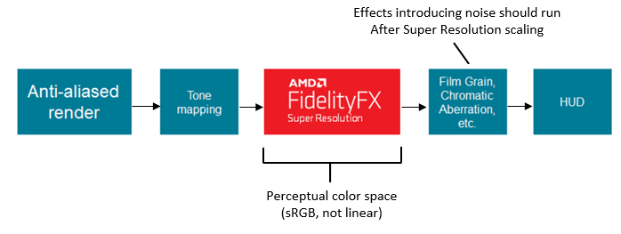
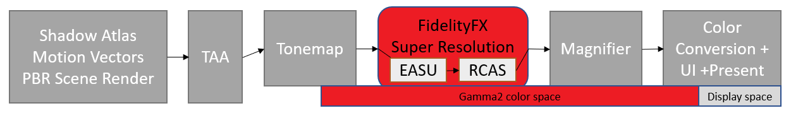

<br/><br/><br/><br/><br/>
# FidelityFX Super Resolution (FSR 2 and FSR 1)

*This sample is compatible with the Microsoft Game Development Kit (March 2024 - Update 1).*

# Description

AMD FidelityFX Super Resolution (FSR) is an optimized, high-quality
solution for producing higher resolution outputs from lower resolution
inputs. FSR enables "practical performance" for costly render
operations, such as hardware ray tracing.

This sample includes examples of using both FSR 2 and FSR 1 within a
scene.

FSR 2 is a temporal solution and requires multiple inputs. It will
replace TAA in any game pipeline, and as such requires perspective
jitter be applied to the scene each frame. FSR 2 provides significantly
higher image quality than FSR 1 at higher upscaling ratios, but the FSR
2 compute passes themselves have a higher cost.

FSR 1 is a spatial solution and requires a single anti-aliased image
input. It uses a collection of cutting-edge algorithms with a particular
emphasis on creating high-quality edges, giving large performance
improvements compared to rendering at native resolution directly.

Both methods are included along with a bilinear upscale and native rendering mode for quality and performance inspection. There is a moveable magnifier to inspect image quality and do pixel-level comparisons.

The most up to date information on FidelityFX Super Resolution can be
found on GPUOpen at <https://gpuopen.com/fsr> .


# Building the sample

If using Windows Desktop, set the active solution platform to `x64`.

If using Xbox Series X|S, set the active solution platform to `Gaming.Xbox.Scarlett.x64`.

If using Xbox One, set the active solution platform to `Gaming.Xbox.XboxOne.x64`.

When running Windows Desktop, ensure you have the latest graphics drivers for your system installed.

*For more information, see* __Running samples__*, in the GDK documentation.*

# Using the sample

| Action                                |  Gamepad                      |
|---------------------------------------|------------------------------|
| Rotate view                           |  Left thumbstick              |
| Magnifier location                    |  Right thumbstick             |
| Exit                                  |  View Button                  |
| Upscale mode                          |  A / B Buttons                |
| FSR Quality Mode                      |  X / Y Buttons                |
| Sharpness value  |  Right / Left Shoulder buttons                      |
| Sharpening Enable/Disable             |  Dpad Up Button               |
| Tonemap Exposure                      |  Right / Left Triggers        |
| Mip Bias Adjustment                   |  Dpad Left / Right Buttons    |
| FSR 2 Reactive Mask input Enable/Disable |  Dpad Down Button |

# Sample notes

If a HDR display is available on the Xbox Series X|S and XboxOne
platforms, the sample runs in HDR mode. On Desktop platforms, the sample
will run in SDR mode only.

This sample is implemented in a dynamic-resolution style, whereby target
resolution resources are used and rendered into using a smaller
resolution viewport before upscaling.

There are modes for native target-resolution rendering, bilinear
upscaling from selectable lower-resolution, and FSR upscaling from
selectable quality modes.

# Implementation notes -- FSR 2

## How it works

*Detailed internal documentation for FSR 2 can be found in the `docs/`
folder of the sample.*

FSR 2 is a temporal upscaler. It works by replacing TAA in the pipeline,
utilizing previous frame data along with current frame data to
anti-alias and perform quality upscaling.

FSR 2 utilizes many new algorithmic tricks to accurately recover thin
features that may be blurred out by other TAA algorithms. It requires
multiple inputs -- scene depth, scene color and motion vectors. There
are also further optional inputs which can increase upscale quality.

When compared to FSR 1, FSR 2 results in higher quality upscaling --
especially at lower resolutions, as shown below. However, the compute
workloads are higher cost.


                                          
## Reactive Mask 

There are two optional inputs which aid situations where there are scene features which do not exist depth and/or motion vectors. This typically occurs with particle effects, or other composition effects such as and reflections. It is strongly recommended that you generate and use these masks within your integration to achieve best quality. 

| Without Reactive Mask | With Reactive Mask |
|-----------------------|---------------------------|
|  |  | 

This sample utilizes the `Reactive Mask` optional input to improve
upscaled quality of particles. The mask is generated by inspecting the
particles which are to be composited, and then writing out a single
value to mask off the areas where particles exist in the current frame.
In this sample, the particles are composited into the scene from a
separate resource, and the following value for reactive mask is used:

> reactive\[did.xy\] = min (1.0f, length(particleInput)\*8.0f);

Generally, you want the reactive mask to cover an area slightly larger
than the area in the scene, which is why the value is multiplied and
clamped.

If your pipeline has an opaque and transparency pass which can provide
pre and post transparency scene contents, there is a utility within the
FSR 2 API which can take these as input and output a reactive mask for
use in FSR 2 -- see `ffxFsr2ContextGenerateReactiveMask` in the main FSR 2
documentation for more information.

## Integration

FSR 2 is provided as an open source library, with an API which is used
to create a context which defines the various parameters for display
size, maximum render size and flags such as inverted and infinite depth
buffer configuration. The main FSR 2 upscale workloads are deployed via
the `ffxFsr2ContextDispatch()` API.

The context takes a set of callbacks, which are filled out by the
ffxFsr2GetInterfaceDX12 function. In this GDKX sample, this is provided
by a custom D3D12X backend, which is a slightly modified version of the
base DX12 backend which is provided in the official FSR2 sources. A
scratch area of memory must be allocated and provided to the
`ffxFsr2GetInterfaceDX12` function.

Example scenarios from this sample:

**Context Create:**

```cpp
m_fsr2_create_params.maxRenderSize.width = resourceSizeWidth;
m_fsr2_create_params.maxRenderSize.height = resourceSizeHeight;
m_fsr2_create_params.displaySize.width = resourceSizeWidth;
m_fsr2_create_params.displaySize.height = resourceSizeHeight;
m_fsr2_create_params.flags =  FFX_FSR2_ENABLE_HIGH_DYNAMIC_RANGE | FFX_FSR2_ENABLE_TEXTURE1D_USAGE |
                              FFX_FSR2_ENABLE_DEPTH_INVERTED | FFX_FSR2_ENABLE_DEPTH_INFINITE |
                              FFX_FSR2_ENABLE_AUTO_EXPOSURE | FFX_FSR2_ENABLE_DYNAMIC_RESOLUTION;

m_fsr2ScratchSize = ffxFsr2GetScratchMemorySizeDX12();
m_fsr2Scratch = malloc(m_fsr2ScratchSize);
ffxFsr2GetInterfaceDX12(&m_fsr2_create_params.callbacks, device, m_fsr2Scratch, m_fsr2ScratchSize);

m_fsr2_create_params.device = device;

ffxFsr2ContextCreate(&m_fsr2Context, &m_fsr2_create_params);
```

**Context Teardown:**

```cpp
if (m_fsr2Scratch)
{
    ffxFsr2ContextDestroy(&m_fsr2Context);
    free(m_fsr2Scratch);
    m_fsr2Scratch = nullptr;
}
```

**Upscale:**

```cpp
m_fsr2DispatchParams.commandList = ffxGetCommandListDX12(commandList);
m_fsr2DispatchParams.color = ffxGetResourceDX12(&m_fsr2Context, m_tonemapperOutput.Get());
m_fsr2DispatchParams.depth = ffxGetResourceDX12(&m_fsr2Context, m_motionVectorDepth.Get());
m_fsr2DispatchParams.motionVectors = ffxGetResourceDX12(&m_fsr2Context, m_motionVectors.Get());
m_fsr2DispatchParams.exposure = ffxGetResourceDX12(&m_fsr2Context, nullptr);
m_fsr2DispatchParams.reactive = ffxGetResourceDX12(&m_fsr2Context, m_reactive.Get());
m_fsr2DispatchParams.transparencyAndComposition = ffxGetResourceDX12(&m_fsr2Context, nullptr);
m_fsr2DispatchParams.output = ffxGetResourceDX12(&m_fsr2Context, m_upsampleOutput.Get());
m_fsr2DispatchParams.jitterOffset.x = m_jitterX;
m_fsr2DispatchParams.jitterOffset.y = m_jitterY;
m_fsr2DispatchParams.frameTimeDelta = (float)m_deltaTime;
m_fsr2DispatchParams.preExposure = 1.0f;
m_fsr2DispatchParams.reset = m_renderScaleChanged;
m_fsr2DispatchParams.motionVectorScale.x = inWidth;
m_fsr2DispatchParams.motionVectorScale.y = inHeight;
m_fsr2DispatchParams.renderSize.width = (unsigned int)inWidth;
m_fsr2DispatchParams.renderSize.height = (unsigned int)inHeight;
m_fsr2DispatchParams.cameraFovAngleVertical = XM_PIDIV4;
m_fsr2DispatchParams.cameraFar = FLT_MAX;
m_fsr2DispatchParams.cameraNear = 0.1f;
m_fsr2DispatchParams.enableSharpening = m_rcasEnable;

// FSR2 uses a different sharpness range than FSR1

m_fsr2DispatchParams.sharpness = 1.0f - m_rcasSharpness;
ffxFsr2ContextDispatch(&m_fsr2Context, &m_fsr2DispatchParams);
```

**Perspective Jitter:**

We also require that the following perspective jitter is used for
correct integration.

```cpp
static int32_t index = 0;
const int32_t jitterPhaseCount = ffxFsr2GetJitterPhaseCount((int32_t)renderWidth, (int32_t)displayWidth);

ffxFsr2GetJitterOffset(&m_jitterX, &m_jitterY, index, jitterPhaseCount);
index++;
```

This can be applied to an existing projection matrix as so:

```cpp
DirectX::XMMATRIX jitterTranslation = XMMatrixTranslation(
    2.0f * m_jitterX / (float)renderWidth, -2.0f * m_jitterY
    (float)renderHeight, 0);

m_proj = m_proj * jitterTranslation;
```

## FSR 2 Quality Modes

In addition to fixed scaling, FSR may be used in \"arbitrary scaling\"
mode. This mode is typically used for Dynamic Resolution Scaling,
whereby source resolution is determined by a fixed performance budget to
achieve a minimum frame rate. Ensure the Dynamic Resolution Scaling flag
is passed to FSR 2 context create in this instance, and the perspective
jitter is correctly calculated for the current scaling factor.

In DRS mode, we recommend 1.5x scale factor -- the "Quality" mode -- be
the lowest possible upscale. If your system scales all the way down to
native 1x, the performance impact of the FSR 2 pass without performing
an upscale can be significant, without any notable quality gains.

| **FSR 2 quality mode**  |  **Description**  |  **Scale factor**  |  **Input resolution**  |  **Output resolution** |
|-------------|----------------------|-----------|----------|----------|
| **"Quality"**  |  **Quality** mode provides an image quality equal or superior to native rendering with a significant performance gain.  |  **1.5x** per dimension (2.25x area scale)  |  1280x720<br/>1706x960<br/>2293x960<br/>2560x1440  |  1920x1080<br/>2560x1440<br/>3440x1440<br/>3840x2160 |
| **"Balanced"**  |  ***Balanced** mode offers an ideal compromise between image quality and performance gains.  |  **1.7x** per dimension (2.89x area scale)  |  1129x635<br/>1506x847<br/>2024x847<br/>2259x1270  |  1920x1080<br/>2560x1440<br/>3440x1440<br/>3840x2160 |
| **"Performance"**  |  **Performance** mode provides an image quality similar to native rendering with a major performance gain.  |  **2 .0x** per dimension (4x area scale)  |  960x540<br/>1280x720<br/>1720x720<br/>1920x1080  |  1920x1080<br/>2560x1440<br/>3440x1440<br/>3840x2160 |
| **"Ultra Performance"**  |  ***Ultra Performance** mode provides the highest performance gain while still maintaining an image quality representative of native rendering.*  |  **3.0x** per dimension (9x area scale)  |  640 x 360<br/>854 x 480<br/>1147 x 480<br/>1280 x 720  |  1920 x 1080<br/>2560 x 1440<br/>3440 x 1440<br/>3840 x 2160     |

*The "Ultra Performance" quality mode is optional.*

## Recommendations

This sample uses the base FSR 2 library and shaders from the GPUOpen
release, however will build them and combine it with a specific
Xbox-optimized D3D12X backend.

**Shader Compilation**

FSR 2 has many different permutations for its compute workloads. These
permutations exist for functionality and performance reasons.

Within the FSR2_GXDK project, there is a BuildShaderPermutations.bat
file. This builds as a custom build step, using specific GDK toolchains
to compile the shaders. This is also done via a FidelityFX Shader
Compiler utility executable: FidelityFX_SC.exe. This utility builds all
permutations and reduces the output by removing duplicates.

On *Xbox Series X|S*, FP16 is enabled for shaders which make use of it.
All workloads are built Wave32.

On *Xbox platforms*, embedded HLSL root signatures are used. For
workloads which use FidelityFX SPD, wave operations are disabled to work
around an issue. There is little to no performance regression using the
workaround.

On *Desktop* platforms, FP16 is enabled and Wave64 will be forced if
Shader Model 6.6 is present.

Note: If XIC is enabled by manually including the definition within the
BuildShaderPermutation.bat custom build rule, this step will take many
minutes to complete. We decided to ship without XIC, as we did not see
any significant performance gains at the time - but this could be useful
for future GDKs with more recent shader compiler versions.

**D3D12X FSR 2 Backend**

The D3D12X backend for FSR 2 is a modified version of the DX12 desktop
backend on GPUOpen. It allows for compilation targeting Xbox platforms
as well as Desktop.

For Xbox Series X|S, we selectively enable DCC on certain internally
managed UAV resources by default. This is found to provide in the order
of 100us performance gain on Series X doing a 1080p-\>4K upscale.

**MIP bias**

For higher quality output, FSR 2 integration should include MIP bias
changes. This sample applies the following:

__*MIP bias = -log2 (display resolution/source resolution) -1*__

> Note: This differs from FSR 1. Using FSR 1 mip bias with FSR 2 will
result in loss of detail.*

**Color space**

FSR 2 recommends a linear RGB color space, however perceptual space may
yield acceptable results. We recommend developers experiment with their
own scenes. PQ/HLG encodings are not appropriate.

**Sharpness**

In FSR 2, the sharpness value differs from FSR 1. The value goes from
0.0 (least sharp) to 1.0 (most sharp).

By default, sharpening is disabled in this sample but can be enabled
from the gamepad.

**FSR for Dynamic Resolution**

In DRS mode, we recommend 1.5x scale factor -- the "Quality" mode -- be
the lowest possible upscale. If your system scales all the way down to
native 1x, the performance impact of the FSR 2 pass without performing
an upscale can be significant, without any notable quality gains.

## Where in the frame

FSR 2 should replace TAA in the game pipeline.


In this sample, TAA is skipped and the jittered low-resolution scene is
passed though tone mapping before being consumed by FSR 2.

## Performance Scaling when comparing FSR 1 to FSR 2

Due to FSR 2 replacing TAA, it is earlier in the post processing
pipeline than FSR 1 as shown below.


This means FSR 2 game pipelines have more post-processing performed at
the higher output resolution and this can impact performance scaling
when comparing the two solutions. This must be considered also in terms
of quality, with those post-upscale post-processing passes performing
operations on output resolution data.

**Editing the FSR 2 shaders for performance**

We understand that some developers may edit the FSR 2 workloads to
unlock further performance at the expense of output quality. We would
recommend this is not done on Desktop platforms, however for console we
understand there is sometimes a need. There are various constants that
can increase performance at the expense of quality, for example
iLanczos2SampleCount in ffx_fsr2_upsample.h. Decreasing this to 12 may
yield acceptable quality for some with a small reduction in FSR 2
run-time.

# Implementation notes -- FSR 1

## How it works

FSR 1 is a spatial upscaler. It works by taking the current anti-aliased
frame and upscaling it to display resolution. FSR only requires the
current frame's data. It does not require motion vectors or frame
history. At the heart of FSR is a cutting-edge algorithm that detects
and recreates high-resolution edges from the source image. Those
high-resolution edges are a critical element required for turning the
current frame into a \"super resolution\" image. FSR provides consistent
upscaling quality regardless of whether the frame is in movement, which
can provide quality advantages compared to other types of upscalers.

FSR 1 is composed of two main passes:

-   An upscaling pass called Edge-Adaptive Spatial Upsampling (EASU)
    that performs edge reconstruction. In this pass, the input frame is
    analyzed for gradient reversals -- looking at how neighboring
    gradients differ from a set of input pixels. Gradient reversal
    intensity determines the weights applied to samples for
    reconstruction at display resolution.

-   A sharpening pass called Robust Contrast-Adaptive Sharpening (RCAS)
    (extracts pixel detail in the upscaled image.


## Integration guidelines

### Shading language and API requirements

#### DirectX 12 + HLSL

- `HLSL`
  - `CS_6_2`

### Expected input

* Image should already be well anti-aliased by a technique like TAA, MSAA etc. 
* Image should be normalized to [0-1] and be in perceptual color space (sRGB, not linear).
    * A negative input to RCAS will output NaN!
* Image should be generated using negative MIP bias to increase texture detail.
* Image should be noise free.  

### Where in the frame



FSR 1 passes work best in perceptual color space and should therefore be
integrated after tone mapping. Passes that introduce noise or other
high-frequency visual components to the scene should be rendered after
upscaling to avoid those noisy components being amplified.

In this sample, the following frame structure applies:



The tonemap pass in the sample writes gamma2 output into a
R10G10B10A2_UNORM resource, which is consumed by EASU and RCAS, then the
magnifier pass. In SDR, the Color Conversion pass converts gamma2 back
to linear. In HDR, with an HDR display connected, the Color Conversion
pass converts gamma2 to rec2020.

### Walkthrough

Include the [`ffx_fsr1.h`](./../../../Kits/AMDTK/fidelityfx/include/FidelityFX/host/ffx_fsr1.h) header:

```C++
#include <FidelityFX/host/ffx_fsr1.h>
```

Query the amount of scratch memory required for the FFX Backend using `ffxGetScratchMemorySizeDX12`:

```C++
const size_t scratchBufferSize = ffxGetScratchMemorySizeDX12(FFX_FSR1_CONTEXT_COUNT);
```

Allocate the scratch memory for the backend and retrieve the interface using `ffxGetInterfaceDX12`:

```C++
const size_t scratchBufferSize = ffxGetScratchMemorySizeDX12(FFX_FSR1_CONTEXT_COUNT);
void* scratchBuffer = calloc(scratchBufferSize, 1);
FfxErrorCode errorCode = ffxGetInterfaceDX12(&m_fsr1ContextDescription.backendInterface, m_deviceResources->GetD3DDevice(), scratchBuffer, scratchBufferSize, FFX_FSR1_CONTEXT_COUNT);
FFX_ASSERT_MESSAGE(errorCode == FFX_OK, "Could not initialize the FidelityFX SDK backend");

FFX_ASSERT_MESSAGE(m_fsr1ContextDescription.backendInterface.fpGetSDKVersion(&m_fsr1ContextDescription.backendInterface) ==
    FFX_SDK_MAKE_VERSION(1, 1, 2), "FidelityFX Super Resolution sample requires linking with a 1.1.2 version SDK backend");
```

Create the `FfxFsr1Context` by filling out the `FfxFsr1ContextDescription` structure with the required arguments:

```C++
FfxFsr1Context m_fsr1Context;
FfxFsr1ContextDescription m_fsr1ContextDescription = {};

m_fsr1ContextDescription.outputFormat = FFX_SURFACE_FORMAT_R10G10B10A2_UNORM; // m_upscaledOutput is DXGI_FORMAT_R10G10B10A2_UNORM
m_fsr1ContextDescription.maxRenderSize.width = resourceSizeWidth;
m_fsr1ContextDescription.maxRenderSize.height = resourceSizeHeight;
m_fsr1ContextDescription.displaySize.width = resourceSizeWidth;
m_fsr1ContextDescription.displaySize.height = resourceSizeHeight;
m_fsr1ContextDescription.flags = FFX_FSR1_ENABLE_HIGH_DYNAMIC_RANGE;

// Create FSR1 context with a possibility to enable RCAS irrespectively of whether 'm_rcasEnable' is set.
m_fsr1ContextDescription.flags |= FFX_FSR1_ENABLE_RCAS;

// Create the FSR1 context
errorCode = ffxFsr1ContextCreate(&m_fsr1Context, &m_fsr1ContextDescription);
FFX_ASSERT(errorCode == FFX_OK);

FFX_ASSERT_MESSAGE(ffxFsr1GetEffectVersion() == FFX_SDK_MAKE_VERSION(1, 2, 0),
    "FidelityFX Super Resolution sample requires linking with a 1.2 version FidelityFX FSR1 library");
```

When the time comes for upscaling, fill out the `FfxFsr1DispatchDescription` structure and call `ffxFsr1ContextDispatch` using it:

```C++
auto size = m_deviceResources->GetOutputSize();
auto scaledSize = GetScaledRect(size);
float inWidth = static_cast<float>(scaledSize.right);
float inHeight = static_cast<float>(scaledSize.bottom);

FfxFsr1DispatchDescription dispatchParameters = {};
dispatchParameters.commandList = ffxGetCommandListDX12(commandList);
dispatchParameters.renderSize.width = (unsigned int)inWidth;
dispatchParameters.renderSize.height = (unsigned int)inHeight;
dispatchParameters.enableSharpening = m_rcasEnable;
dispatchParameters.sharpness = m_rcasSharpness;

dispatchParameters.color = ffxGetResourceDX12(m_tonemapperOutput.Get(),
    ffxGetResourceDescriptionDX12(m_tonemapperOutput.Get()),
    (wchar_t*)L"FSR1_InputColor", FFX_RESOURCE_STATE_COMPUTE_READ);

dispatchParameters.output = ffxGetResourceDX12(m_upsampleOutput.Get(),
    ffxGetResourceDescriptionDX12(m_upsampleOutput.Get()),
    (wchar_t*)L"FSR1_OutputUpscaledColor", FFX_RESOURCE_STATE_COMPUTE_READ);

FfxErrorCode errorCode = ffxFsr1ContextDispatch(&m_fsr1Context, &dispatchParameters);
FFX_ASSERT(errorCode == FFX_OK);
```

During shutdown, destroy the FSR1 context:

```C++
ffxFsr1ContextDestroy(&m_fsr1Context);
```

## FSR 1 Quality modes

FSR 1 exposes quality modes to describe the amount of scaling to apply
to the source image, depending on the quality/performance ratio desired.

In addition to fixed scaling, FSR 1 may be used in \"arbitrary scaling\"
mode. Any area scale factor between 1x and 4x is supported. This mode is
typically used for Dynamic Resolution Scaling, whereby source resolution
is determined by a fixed performance budget to achieve a minimum frame
rate.

| **FSR 1 quality mode**  |  **Description**  |  **Scale factor**  |  **Input resolution**  |  **Output\ resolution** |
|-------------|----------------------|-----------|----------|----------|
| **"Ultra Quality"**  |  **Ultra Quality** mode produces an image with quality virtually indistinguishable from native rendering. It should be selected when the highest quality is desired* |  **1 .3x** per dimension (1.69x area scale)  |  1477x831<br/>1970x1108<br/>2646x1108<br/>2954x1662  |  1920x1080<br/>2560x1440<br/>3440x1440<br/>3840x2160 |
| **"Quality"**  |  **Quality** mode produces a super resolution image with quality representative of native rendering, with a sizeable performance gain.  |  **1 .5x** per dimension (2.25x area scale)  |  1280x720<br/>1706x960<br/>2293x960<br/>2560x1440  |  1920x1080<br/>2560x1440<br/>3440x1440<br/>3840x2160 |
| **"Balanced"**  |  **Balanced** mode produces a super resolution image approximating native rendering quality, with a major performance gain compared to native.  |  **1 .7x** per dimension (2.89x area scale)  |  1129x635<br/>1506x847<br/>2024x847<br/>2259x1270  |  1920x1080<br/>2560x1440<br/>3440x1440<br/>3840x2160 |
| **"Performance"**  |  **Performance** mode visibly impacts image quality and should only be selected in situations where needing additional performance is critical. |  **2.0x** per dimension (4x area scale)  |  960x540<br/>1280x720<br/>1720x720<br/>1920x1080  |  1920x1080<br/>2560x1440<br/>3440x1440<br/>3840x2160 |

We do not recommend FSR 1 uses the higher scale factors. ***FSR 2
performs better at these scales, and even includes an optional "Ultra
Performance" 3.0x scaling mode.***

> FSR 1 Ultra Quality is not supported in this sample.

## Recommendations

**Formats, compiler options and floating-point path choice**

This sample uses 32bpp R10G10B10A2_UNORM resources for the FSR path,
which results in highest performance. The EASU pass is generally ALU
bound, and RCAS is MEM bound.

Our recommendations for the supported platforms, when implemented as per
this sample, are as follows:

| Platform  |  Resource Type  |  EASU recommendation |  RCAS recommendation  |
|----------------|----------------|-----------------|-----------------|
| **Scarlett**  |  R10 G10B10A2_UNORM |  Wave32, Fp16  |  Wave32, Fp16 |
|  |  R16G 16B16A16_FLOAT |  Wave32, Fp16  |  Wave32, Fp16 |
| **XboxOne**  |  R10 G10B10A2_UNORM |  Fp32  |  Fp32 |
|  |  R16G 16B16A16_FLOAT |  Fp32  |  Fp32 |
| **Desktop**  |  R10 G10B10A2_UNORM |  Fp16  |  Fp16 |
|  |  R16G 16B16A16_FLOAT |  Fp16  |  Fp16 |

If native fp16 is not available on the Desktop platform due to device
support, fp32 is used.

**Anti-aliased input**

FSR 1 requires an anti-aliased input. If there is no quality AA
available (such as TAA or MSAA 8x) then FSR use is not recommended. A
basic TAA is used in this sample.

**MIP bias**

For higher quality output, FSR 1 integration should include MIP bias
changes. This sample applies the following:

__*MIP bias = -log2 (display resolution/source resolution)*__

**Color space**

The input to FSR 1 passes should be in perceptual color space such as
sRGB or Gamma2. There should be no banding in the input, as this banding
may be amplified.

**FSR 1 for Dynamic Resolution**

FSR 1 is ideal for dynamic resolution, and this sample shows how to set
up the constants for use whereby the input data is a subset of a larger
resource.

In the special case where dynamic resolution is rendering at 100%, the
EASU pass can be skipped whilst keeping RCAS to provide a seamless
experience.

**RCAS sharpening**

The sharpening attenuation value for RCAS differs from what existed with
CAS.

With RCAS, 0.0 is the highest level of sharpening, with N\>0 reducing
the level of sharpness applied.

The default RCAS sharpening attenuation of this sample is set to 0.25.

# Update history

Updated with FidelityFX SDK 1.1.1 integration guidelines September 2024.

Initial release June 2021

June 2022: Updated with FSR 2

October 2022: Updated to FSR 2.1.2

May 2023: Updated to FSR 2.2.1

# Privacy Statement

When compiling and running a sample, the file name of the sample
executable will be sent to Microsoft to help track sample usage. To
opt-out of this data collection, you can remove the block of code in
Main.cpp labeled "Sample Usage Telemetry".

For more information about Microsoft's privacy policies in general, see
the [Microsoft Privacy
Statement](https://privacy.microsoft.com/en-us/privacystatement/).

# Disclaimer

The information contained herein is for informational purposes only, and
is subject to change without notice. While every precaution has been
taken in the preparation of this document, it may contain technical
inaccuracies, omissions and typographical errors, and AMD is under no
obligation to update or otherwise correct this information. Advanced
Micro Devices, Inc. makes no representations or warranties with respect
to the accuracy or completeness of the contents of this document, and
assumes no liability of any kind, including the implied warranties of
noninfringement, merchantability or fitness for particular purposes,
with respect to the operation or use of AMD hardware, software or other
products described herein. No license, including implied or arising by
estoppel, to any intellectual property rights is granted by this
document. Terms and limitations applicable to the purchase or use of
AMD's products are as set forth in a signed agreement between the
parties or in AMD\'s Standard Terms and Conditions of Sale.

AMD, the AMD Arrow logo, Radeon, RDNA, Ryzen, and combinations thereof
are trademarks of Advanced Micro Devices, Inc. Other product names used
in this publication are for identification purposes only and may be
trademarks of their respective companies.

Windows is a registered trademark of Microsoft Corporation in the US
and/or other countries.

Xbox is a registered trademark of Microsoft Corporation in the US and/or
Other countries.

© 2022 Advanced Micro Devices, Inc. All rights reserved.
