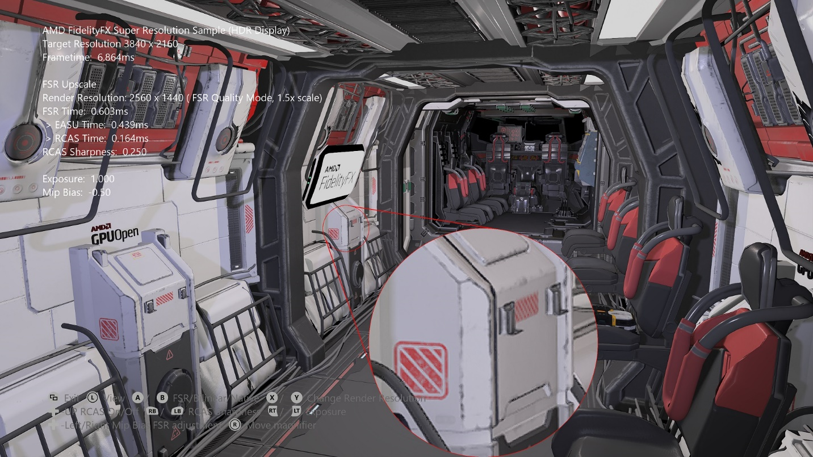
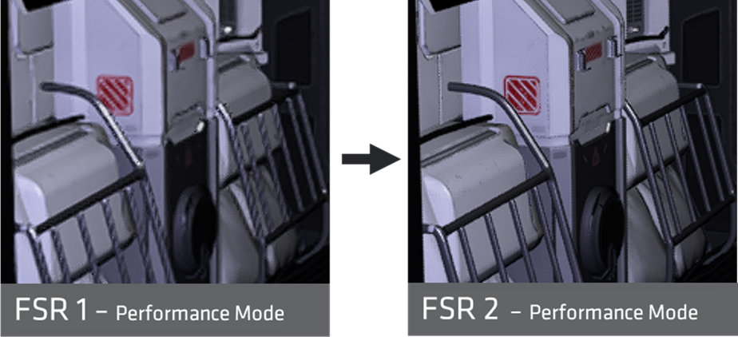
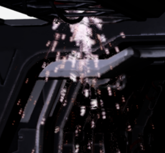
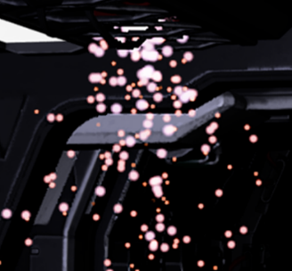
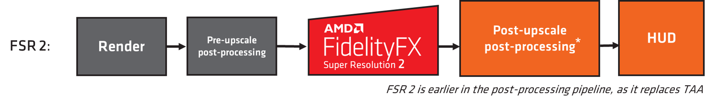
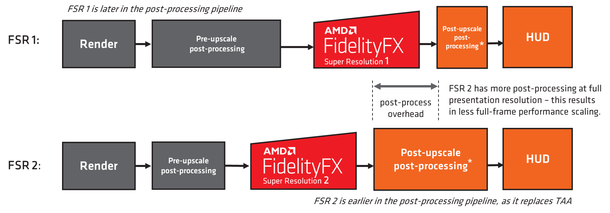
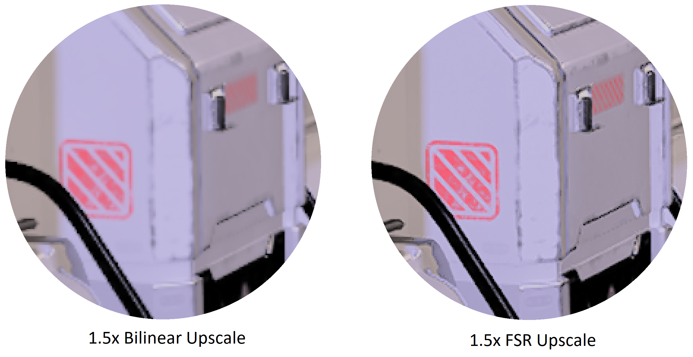
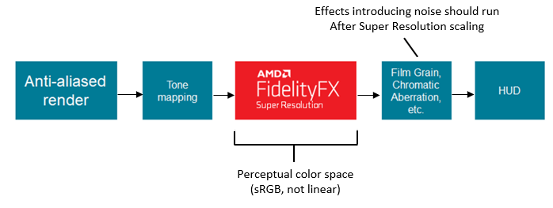
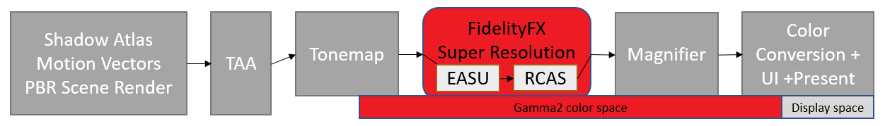

 <br/><br/><br/><br/><br/>
# FidelityFX スーパー解像度 (FSR 2 および FSR 1)

*このサンプルは、Microsoft Game Development Kit と互換性があります (2022 年 3 月)。*

# 説明

AMD FidelityFX スーパー解像度 (FSR) は、解像度の低い入力から解像度の高い出力を生成するための最適化された高品質のソリューションです。 FSR を使用すると、ハードウェア レイ トレーシングなどのコストの高いレンダリング操作について "実践的なパフォーマンス" を実現することができます。

このサンプルには、シーン内で FSR 2 と FSR 1 の両方を使用する例が含まれています。

FSR 2 は一時的なソリューションであり、複数の入力が必要です。 これは、任意のゲーム パイプラインの TAA の代替になるため、各フレームのシーンにパースペクティブ ジッターを適用する必要があります。 FSR 2 は、より高いアップスケール比で FSR 1 よりも大幅に高い画質を提供しますが、FSR 2 コンピューティング パス自体のコストは高くなります。

FSR 1は空間ソリューションであり、アンチエイリアスされた 1 枚の画像入力を必要とします。 これは、高品質のエッジの作成に特に重点を置いた最先端のアルゴリズムのコレクションを使用し、ネイティブ解像度での直接レンダリングと比較してパフォーマンスが大幅に向上します。

どちらの方法も、品質と性能を検査するためのバイリニア アップスケールとネイティブ レンダリング モードとともに含まれています。 移動可能な拡大鏡があり、画質の検査やピクセルレベルでの比較ができます。

FidelityFX スーパー解像度に関する最新情報は、<https://gpuopen.com/fsr> の GPUOpen にあります。



# サンプルのビルド

Windows デスクトップを使用している場合は、アクティブなソリューション プラットフォームを `Gaming.Desktop.x64` に設定します。

Xbox Series X|S を使用している場合は、アクティブなソリューション プラットフォームを `Gaming.Xbox.Scarlett.x64` に設定します。

Xbox One を使用している場合は、アクティブなソリューション プラットフォームを `Gaming.Xbox.XboxOne.x64` に設定します。

Windows Desktop を実行する場合は、ご利用のシステムに最新のグラフィックス ドライバーがインストールされていることを確認します。

*詳細については、**GDK ドキュメント*の「__サンプルの実行__」を参照してください。

# サンプルの使用方法

| 操作 | ゲームパッド |
|---|---|
| 回転ビュー | 左サムスティック |
| 拡大鏡の場所 | 右サムスティック |
| Exit | ビュー ボタン |
| アップスケール モード | A/B ボタン |
| FSR 品質モード | X/Y ボタン |
| シャープネス値 | 右/左ショルダー ボタン |
| シャープニングの有効化/無効化 | 方向パッドの上ボタン |
| トーンマップの露出 | 右/左トリガー |
| ミップ バイアスの調整 | 方向パッドの左/右ボタン |
| FSR 2 のリアクティブ マスク入力の有効化/無効化 | 方向パッドの下ボタン |

# サンプル メモ

プラットフォームでは、サンプルは HDR モードで実行されます。 デスクトップ プラットフォームでは、サンプルは SDR モードでのみ実行されます。 このサンプルは動的解像度スタイルで実装されています。これにより、アップスケーリングの前にターゲット解像度リソースが使用され、より解像度が低いビューポートを使用してレンダリングされます。
| | |
|---|---|
|Xbox Series X|S と XboxOne で HDR ディスプレイが使用可能な場合|


ネイティブ ターゲット解像度レンダリング、選択可能な低解像度からのバイリニア アップスケーリング、選択可能な品質モードからの FSR アップスケーリングのモードがあります。

# 実装に関するメモ -- FSR 2

## しくみ

*FSR 2 の詳細な内部ドキュメントは、サンプルの `docs/` フォルダーにあります。*

FSR 2 は一時的なアップスケーラーです。 パイプラインの TAA を置き換えることで機能し、以前のフレーム データと現在のフレーム データを使用してアンチエイリアスを行い、品質のアップスケーリングを実行します。

FSR 2 は、多くの新しいアルゴリズムのテクニックを利用して、他の TAA アルゴリズムによってぼやける可能性があるわずかなフィーチャを正確に復元します。 シーンの深度、シーンの色、モーション ベクトルなど、複数の入力が必要です。 さらにオプションの入力もあり、アップスケールの品質を向上させることができます。

FSR 1 と比較すると、FSR 2 ではさらなる品質のアップスケールを実現することができます。特に、以下に示すような解像度が低い場合が対象になります。 ただし、コンピューティング ワークロードのコストは高くなります。




## リアクティブ マスク

深度ベクトルやモーション ベクトルが存在しないシーン フィーチャがある場合に役立つ 2 つのオプションの入力があります。 これは通常、パーティクル エフェクトや、反射などのその他のコンポジション エフェクトで発生します。 最高の品質を実現するために、統合内でこれらのマスクを生成して使用することを強くお勧めします。

| リアクティブ マスクなし | リアクティブ マスクあり |
|---|---|
|  |  |

このサンプルでは、オプションの入力 `Reactive Mask` を利用して、パーティクルのアップスケール品質を向上させます。 マスクは、合成するパーティクルを検査し、1 つの値を書き出して、現在のフレームでパーティクルが存在する領域をマスクすることによって生成されます。 このサンプルでは、パーティクルを別のリソースからシーンに合成し、リアクティブ マスクに次の値を使用します。

> reactive\[did.xy\] = min (1.0f, length(particleInput)\*8.0f);

一般的には、リアクティブ マスクでシーン内の領域よりもわずかに大きい領域をカバーする必要があります。そのため、値が乗算され、クランプされます。

パイプラインに透明化前および透明化後のシーン コンテンツを提供可能な不透明パスと透明パスがある場合、これらを入力として受け取り、FSR 2 で使用するためのリアクティブ マスクを出力できるユーティリティが FSR 2 API にあります。詳細については、メインの FSR 2 ドキュメント内の「`ffxFsr2ContextGenerateReactiveMask`」を参照してください。

## 統合

FSR 2 はオープンソース ライブラリとして提供され、表示サイズ、最大レンダリング サイズ、反転バッファーや無限深度バッファー構成などのフラグのさまざまなパラメーターを定義するコンテキストを作成するために使用される API が含まれています。 メインの FSR 2 のアップスケール ワークロードは、`ffxFsr2ContextDispatch()` API を介して展開されます。

コンテキストは、ffxFsr2GetInterfaceDX12 関数によって入力される一連のコールバックを受け取ります。 この GDKX サンプルでは、これはカスタム D3D12X バックエンドによって提供されます。これは、FSR2 の公式ソースで提供されるベース DX12 バックエンドの若干変更されたバージョンです。 メモリのスクラッチ領域を割り当てて、`ffxFsr2GetInterfaceDX12` 関数に提供する必要があります。

このサンプルのシナリオの例:

**コンテキストの作成:**

```cpp
m_fsr2_create_params.maxRenderSize.width = resourceSizeWidth;
m_fsr2_create_params.maxRenderSize.height = resourceSizeHeight;
m_fsr2_create_params.displaySize.width = resourceSizeWidth;
m_fsr2_create_params.displaySize.height = resourceSizeHeight;
m_fsr2_create_params.flags =  FFX_FSR2_ENABLE_HIGH_DYNAMIC_RANGE | FFX_FSR2_ENABLE_TEXTURE1D_USAGE |
                              FFX_FSR2_ENABLE_DEPTH_INVERTED | FFX_FSR2_ENABLE_DEPTH_INFINITE |
                              FFX_FSR2_ENABLE_AUTO_EXPOSURE | FFX_FSR2_ENABLE_DYNAMIC_RESOLUTION;

m_fsr2ScratchSize = ffxFsr2GetScratchMemorySizeDX12();
m_fsr2Scratch = malloc(m_fsr2ScratchSize);
ffxFsr2GetInterfaceDX12(&m_fsr2_create_params.callbacks, device, m_fsr2Scratch, m_fsr2ScratchSize);

m_fsr2_create_params.device = device;

ffxFsr2ContextCreate(&m_fsr2Context, &m_fsr2_create_params);
```


**コンテキストの破棄:**

```cpp
if (m_fsr2Scratch)
{
    ffxFsr2ContextDestroy(&m_fsr2Context);
    free(m_fsr2Scratch);
    m_fsr2Scratch = nullptr;
}
```


**アップスケール:**

```cpp
m_fsr2DispatchParams.commandList = ffxGetCommandListDX12(commandList);
m_fsr2DispatchParams.color = ffxGetResourceDX12(&m_fsr2Context, m_tonemapperOutput.Get());
m_fsr2DispatchParams.depth = ffxGetResourceDX12(&m_fsr2Context, m_motionVectorDepth.Get());
m_fsr2DispatchParams.motionVectors = ffxGetResourceDX12(&m_fsr2Context, m_motionVectors.Get());
m_fsr2DispatchParams.exposure = ffxGetResourceDX12(&m_fsr2Context, nullptr);
m_fsr2DispatchParams.reactive = ffxGetResourceDX12(&m_fsr2Context, m_reactive.Get());
m_fsr2DispatchParams.transparencyAndComposition = ffxGetResourceDX12(&m_fsr2Context, nullptr);
m_fsr2DispatchParams.output = ffxGetResourceDX12(&m_fsr2Context, m_upsampleOutput.Get());
m_fsr2DispatchParams.jitterOffset.x = m_jitterX;
m_fsr2DispatchParams.jitterOffset.y = m_jitterY;
m_fsr2DispatchParams.frameTimeDelta = (float)m_deltaTime;
m_fsr2DispatchParams.preExposure = 1.0f;
m_fsr2DispatchParams.reset = m_renderScaleChanged;
m_fsr2DispatchParams.motionVectorScale.x = inWidth;
m_fsr2DispatchParams.motionVectorScale.y = inHeight;
m_fsr2DispatchParams.renderSize.width = (unsigned int)inWidth;
m_fsr2DispatchParams.renderSize.height = (unsigned int)inHeight;
m_fsr2DispatchParams.cameraFovAngleVertical = XM_PIDIV4;
m_fsr2DispatchParams.cameraFar = FLT_MAX;
m_fsr2DispatchParams.cameraNear = 0.1f;
m_fsr2DispatchParams.enableSharpening = m_rcasEnable;

// FSR2 uses a different sharpness range than FSR1

m_fsr2DispatchParams.sharpness = 1.0f - m_rcasSharpness;
ffxFsr2ContextDispatch(&m_fsr2Context, &m_fsr2DispatchParams);
```


**パースペクティブ ジッター:**

正しい統合には、次のパースペクティブ ジッターを使用する必要もあります。

```cpp
static int32_t index = 0;
const int32_t jitterPhaseCount = ffxFsr2GetJitterPhaseCount((int32_t)renderWidth, (int32_t)displayWidth);

ffxFsr2GetJitterOffset(&m_jitterX, &m_jitterY, index, jitterPhaseCount);
index++;
```


これは、次のように既存のプロジェクション マトリックスに適用できます。

```cpp
DirectX::XMMATRIX jitterTranslation = XMMatrixTranslation(
    2.0f * m_jitterX / (float)renderWidth, -2.0f * m_jitterY
    (float)renderHeight, 0);

m_proj = m_proj * jitterTranslation;
```


## FSR 2 品質モード

固定スケーリングに加えて、FSR は \"任意のスケーリング\" モードで使用できます。 このモードは通常、動的解像度スケーリングに使用されます。これにより、ソース解像度は固定のパフォーマンス予算によって決定され、最小のフレーム レートが実現されます。 このインスタンスで作成された FSR 2 コンテキストに動的解像度スケーリング フラグが渡され、現在のスケーリング係数に対してパースペクティブ ジッターが正しく計算されていることを確認します。

DRS モードでは、1.5 倍のスケール係数 ("品質" モード) を可能な限り最も低いアップスケールとしてお勧めします。 システムがネイティブの 1 倍までダウンスケールする場合、アップスケールを実行することなく FSR 2 パスのパフォーマンスへの影響が大きくなる可能性があり、顕著な品質の向上はありません。

| **FSR 2 品質モード** | **説明** | **スケール係数** | **入力解像度** | **出力解像度** |
|---|---|---|---|---|
| **"品質"** | **品質**モードでは、ネイティブのレンダリングと同等以上の画質が提供され、パフォーマンスが大幅に向上します。 | 1 次元あたり **1.5 倍** (2.25 倍の範囲スケール) | 1280x720<br/>1706x960<br/>2293x960<br/>2560x1440 | 1920x1080<br/>2560x1440<br/>3440x1440<br/>3840x2160 |
| **"バランス"** | ***バランス** モードでは、画質とパフォーマンスの向上の間で理想の妥協点が提供されます。 | 1 次元あたり **1.7 倍** (2.89 倍の範囲スケール) | 1129x635<br/>1506x847<br/>2024x847<br/>2259x1270 | 1920x1080<br/>2560x1440<br/>3440x1440<br/>3840x2160 |
| **"パフォーマンス"** | **パフォーマンス** モードでは、ネイティブ レンダリングと同様の画質が提供されながらもパフォーマンスが大幅に向上します。 | 1 次元あたり **2.0 倍** (4 倍の範囲スケール) | 960x540<br/>1280x720<br/>1720x720<br/>1920x1080 | 1920x1080<br/>2560x1440<br/>3440x1440<br/>3840x2160 |
| **"ウルトラ パフォーマンス"** | ***ウルトラ パフォーマンス** モードでは、ネイティブ レンダリングに匹敵する画質が維持されながらも、最高のパフォーマンス向上を実現します。* | 1 次元あたり **3.0 倍** (9 倍の範囲スケール) | 640 x 360<br/>854 x 480<br/>1147 x 480<br/>1280 x 720 | 1920 x 1080<br/>2560 x 1440<br/>3440 x 1440<br/>3840 x 2160 |

*"ウルトラ パフォーマンス" 品質モードはオプションです。*

## 推奨事項

このサンプルでは GPUOpen リリースからベース FSR 2 ライブラリとシェーダーを使用していますが、それらをビルドし、特定の Xbox 最適化 D3D12X バックエンドと組み合わせます。

**シェーダーのコンパイル**

FSR 2 では、コンピューティング ワークロードのさまざまな組み合わせが用意されています。 これらの組み合わせは、機能とパフォーマンス上の理由から存在します。

FSR2_GXDK プロジェクト内に、BuildShaderPermutations.bat ファイルがあります。 これは、特定の GDK ツールチェーンを使用してシェーダーをコンパイルするカスタム ビルド手順としてビルドされます。 これは、FidelityFX シェーダー コンパイラ ユーティリティの実行可能ファイル (FidelityFX_SC.exe) を使用して行うこともできます。 このユーティリティは、すべての組み合わせをビルドし、重複を削除することで出力を減らします。

すべてのワークロードが Wave32 をビルドしています。 *Xbox プラットフォーム*では、埋め込みの HLSL ルート署名が使用されます。 FidelityFX SPD を使用するワークロードの場合、問題を回避するためにウェーブ操作は無効化されます。 回避策を使用しても、パフォーマンスの低下はほとんどありません。
| | |
|---|---|
|*Xbox Series X|S*では、FP16 を使用するシェーダーに対して FP16 が有効化されます。|


*デスクトップ* プラットフォームでは FP16 が有効化され、シェーダー モデル 6.6 が存在する場合には Wave64 が強制されます。

注: XIC が BuildShaderPermutation.bat カスタム ビルド ルール内に定義を手動で含めることによって有効化されている場合、この手順が完了するまでに数分かかります。 現時点ではパフォーマンスの大幅な改善は見られなかったため XIC なしで出荷することにしましたが、これは、より新しいシェーダー コンパイラ バージョンを持つ将来的な GDK で役に立つ可能性があります。

**D3D12X FSR 2 バックエンド**

FSR 2 の D3D12X バックエンドは、GPUOpen 上の DX12 デスクトップ バックエンドに変更が加えられたバージョンです。 これにより、Xbox プラットフォームやデスクトップを対象としたコンパイルが可能になります。

既定では、マネージド UAV リソースです。 これは、シリーズ X で 1080p-\>4K アップスケールを実行すると、100us のパフォーマンス向上の順序で提供されます。 **MIP バイアス**
| | |
|---|---|
|Xbox Series X|Sの場合、特定の内部で DCC を選択的に有効にします|


品質の高い出力を得る場合、FSR 2 の統合には MIP バイアスの変更が含まれている必要があります。 このサンプルでは、次のことが適用されます。

__*MIP バイアス = -log2 (ディスプレイ解像度/ソース解像度) -1*__

> 注: これは、FSR 1 とは異なります。 FSR 2 で FSR 1 のMIP バイアスを使用すると、
> 最終的に詳細が失われます。*

**色空間**

FSR 2 では、線形 RGB 色空間が推奨されていますが、知覚空間によっても許容される結果が得られる場合があります。 開発者の方には、独自のシーンを使用して実験を行うことをお勧めします。 PQ/HLG エンコードは適切ではありません。

**シャープネス**

FSR 2 では、シャープネスの値は FSR 1 とは異なっています。 値は、0.0 (シャープネスの最小値) から
1.0 (シャープネスの最大値) までです。

このサンプルではシャープネスは既定で無効化されていますが、ゲームパッドから有効にすることができます。

**動的解像度のための FSR**

DRS モードでは、1.5 倍のスケール係数 ("品質" モード) を可能な限り最も低いアップスケールとしてお勧めします。 システムがネイティブの 1 倍までダウンスケールする場合、アップスケールを実行することなく FSR 2 パスのパフォーマンスへの影響が大きくなる可能性があり、顕著な品質の向上はありません。

## フレーム内の場所

FSR 2 は、ゲーム パイプラインの TAA を置き換える必要があります。



このサンプルでは、FSR 2 で使用される前にトーン マッピングを行っても TAA はスキップされ、揺らぎのある低解像度のシーンが渡されます。

## FSR 1 と FSR 2 を比較する際のパフォーマンス スケーリング

FSR 2 が TAA に置き換えられるため、後処理パイプラインでは次に示すように FSR 1 よりもより早くなっています。



つまり、FSR 2 のゲーム パイプラインでは、より高い出力解像度でより多くの後処理が実行されるため、2 つのソリューションを比較する場合、パフォーマンスのスケーリングに影響を与える可能性があります。 これについては品質面でも考慮に入れる必要があります。これらのポストアップスケールの後処理では、出力解像度データに対して操作の実行が渡されます。

**パフォーマンスを向上させるために FSR 2 のシェーダーを編集する**

開発者の中には、FSR 2 のワークロードを編集し、出力品質を犠牲にしてでもさらにパフォーマンスを引き出したい方がいるかと思われます。 これについてはデスクトップ プラットフォームでは実行しないことをお勧めしますが、コンソールの場合には必要な場合もあるはずです。 ffx_fsr2_upsample.h の iLanczos2SampleCount など、品質を犠牲にする代わりにパフォーマンスを向上させることができるさまざまな定数があります。 これを 12 まで減らすと、FSR 2 の実行時間を少し減らすだけである程度許容できる品質が確保できるようになる場合があります。

# 実装に関するメモ -- FSR 1

## しくみ

FSR 1 は、空間アップスケーラーです。 これは、現在のアンチエイリアスされたフレームを取得し、解像度を表示するためにアップスケーリングすることで動作します。 FSR では、現在のフレームのデータのみが必要です。 モーション ベクトルやフレームの履歴は必要ありません。 FSR の中心となるのは、ソースの画像から高解像度のエッジを検出して再作成する最先端のアルゴリズムです。 これらの高解像度のエッジは、現在のフレームを \"スーパー解像度\" の画像へと変換するために必要な重要な要素です。 FSR は、フレームが動いているかどうかに関係なく、一貫したアップスケーリング品質を提供します。これは、他のアップスケーラーと比較しても品質面でメリットがあります。

FSR 1 は、次の 2 つのメイン パスで構成されています。

- エッジの再構築を実行する Edge-Adaptive Spatial Upsampling (EASU) と呼ばれるアップスケーリング パス。 このパスでは、入力フレームがグラデーションの反転について分析され、隣接するグラデーションが一連の入力ピクセルとどのように異なっているのかを確認します。 グラデーション反転強度は、ディスプレイの解像度の再構成のためにサンプルに適用される重みを決定します。

- 堅牢な Edge-Adaptive Spatial Upsampling (RCAS) と呼ばれるシャープニング パス (アップスケールされたイメージ内のピクセルの詳細を抽出します)。

このサンプルでは、2 つのパスがコンピューティング シェーダーとして実装されており、gamma2 色空間データに対して動作します。



## フレーム内の場所



FSR 1 は、知覚色空間で最適な作業を渡すため、トーン マッピングの後に統合する必要があります。 ノイズやその他の高周波ビジュアル コンポーネントをシーンに導入するパスは、アップスケーリング後にレンダリングを行い、ノイズの多いコンポーネントが増幅されないようにする必要があります。

このサンプルでは、次のフレーム構造が適用されます。



サンプル内のトーンマップ パスは gumma2 出力を EASU と RCAS によって使用される R10G10B10A2_UNORM リソースに書き込み、次に拡大鏡パスに書き込みます。 SDR では、色変換パスは gumma2 を線形に変換します。 HDR では、HDR ディスプレイが接続されている状態で、カラー変換パスによって gamma2 が rec2020 に変換されます。

## 必須の定数

定数を処理する方法には、統合を可能な限り簡単にするなどの方法があります。 ヘルパー関数によって設定される 4 つの整数ベクトルがあり、CPU または GPU で呼び出すことができます。 変数は、既存の定数バッファーに追加してから抽出し、EASU/RCAS 関数に渡すことができます。

このサンプルでは、ヘルパーは CPU で呼び出され、定数は 1 つのバッファーによって提供されます。

```cpp
struct FSRConstants
{
    DirectX::XMUINT4 Const0;
    DirectX::XMUINT4 Const1;
    DirectX::XMUINT4 Const2;
    DirectX::XMUINT4 Const3;
};

FSRConstants m_fsrConsts;
```


**EASU**

```cpp
FsrEasuCon(
    reinterpret_cast<AU1*>(&m_fsrConsts.Const0),
    reinterpret_cast<AU1*>(&m_fsrConsts.Const1),
    reinterpret_cast<AU1*>(&m_fsrConsts.Const2),
    reinterpret_cast<AU1*>(&m_fsrConsts.Const3),
    inWidth, inHeight, // Viewport size (top left aligned) in the input image which is to be scaled.
    outWidth, outHeight, // The size of the input image.
    outWidth, outHeight); // The output resolution.
```


上の例は、より大きなリソース内のビューポートにジオメトリがレンダリングされる動的解像度のスタイルを示しています。 レンダリングされるリソースのサイズがビューポートと同じ場合、次のようになります。

```cpp
FsrEasuCon(
    reinterpret_cast<AU1*>(&m_fsrConsts.Const0),
    reinterpret_cast<AU1*>(&m_fsrConsts.Const1),
    reinterpret_cast<AU1*>(&m_fsrConsts.Const2),
    reinterpret_cast<AU1*>(&m_fsrConsts.Const3),
    inWidth, inHeight, // Viewport size (top left aligned) in the input image which is to be scaled.
    inWidth, inHeight, // The size of the input image.
    outWidth, outHeight); // The output resolution.
```


入力がレターボックス化され、ビューポートが左上に揃えられない場合は、これに対応するために FsrEasuConOffset 関数が提供されます。

```cpp
void FsrEasuConOffset(
    outAU4 con0,
    outAU4 con1,
    outAU4 con2,
    outAU4 con3,
    AF1 inputViewportInPixelsX,
    AF1 inputViewportInPixelsY,
    AF1 inputSizeInPixelsX,
    AF1 inputSizeInPixelsY,
    AF1 outputSizeInPixelsX,
    AF1 outputSizeInPixelsY,
    AF1 inputOffsetInPixelsX,
    AF1 inputOffsetInPixelsY)
```

**RCAS**

```cpp
FsrRcasCon(reinterpret_cast<AU1*>(&m_fsrConsts.Const0), m_rcasSharpness);
```

浮動小数点のシャープネスの値のスケールは次のとおりです。

**{0.0 := maximum, to N > 0, N はシャープネスの低下の停止 (半減) の数です}**

> *スケールは FidelityFX CAS および FSR 2 のスケールとは異なりますのでご注意ください。*

## FSR 1 の品質モード

FSR 1 では、必要な品質/パフォーマンス比に応じてソース画像に適用するスケーリングの量を記述する品質モードが公開されています。

固定スケーリングに加えて、FSR 1 は \"任意のスケーリング\" モードで使用できます。 1 倍から 4 倍の範囲スケール係数がサポートされています。 このモードは通常、動的解像度スケーリングに使用されます。これにより、ソース解像度は固定のパフォーマンス予算によって決定され、最小のフレーム レートが実現されます。

| **FSR 1 の品質モード** | **説明** | **スケール係数** | **入力解像度** | **出力\解像度** |
|---|---|---|---|---|
| **"ウルトラ品質"** | **ウルトラ品質** モードでは、ネイティブ レンダリングと実質的に区別できない品質の画像が生成されます。 最高品質が必要な場合に選択する必要があります* | 1 次元あたり **1.3 倍** (1.69 倍の範囲スケール) | 1477x831<br/>1970x1108<br/>2646x1108<br/>2954x1662 | 1920x1080<br/>2560x1440<br/>3440x1440<br/>3840x2160 |
| **"品質"** | **品質**モードでは、ネイティブ レンダリングに匹敵する品質を備えたスーパー解像度の画像が生成され、パフォーマンスが大幅に改善されます。 | 1 次元あたり **1.5 倍** (2.25 倍の範囲スケール) | 1280x720<br/>1706x960<br/>2293x960<br/>2560x1440 | 1920x1080<br/>2560x1440<br/>3440x1440<br/>3840x2160 |
| **"バランス"** | **バランス** モードでは、ネイティブ レンダリング品質に近似したスーパー解像度の画像が生成され、ネイティブと比較してパフォーマンスが大幅に改善されます。 | 1 次元あたり **1.7 倍** (2.89 倍の範囲スケール) | 1129x635<br/>1506x847<br/>2024x847<br/>2259x1270 | 1920x1080<br/>2560x1440<br/>3440x1440<br/>3840x2160 |
| **"パフォーマンス"** | **パフォーマンス** モードは画質に明らかな影響を与えます。追加のパフォーマンスが必要な場合にのみ選択する必要があります。 | 1 次元あたり **2.0 倍** (4 倍の範囲スケール) | 960x540<br/>1280x720<br/>1720x720<br/>1920x1080 | 1920x1080<br/>2560x1440<br/>3440x1440<br/>3840x2160 |

FSR 1 でより大きなスケール係数を使用することはお勧めしません。 ***FSR 2 はこれらのスケールでより優れたパフォーマンスを発揮し、オプションの "ウルトラ パフォーマンス" 3.0 倍スケーリング モードも含まれています。***

> FSR 1 のウルトラ品質は、このサンプルではサポートされていません。

## 推奨事項

**形式、コンパイラ オプション、および浮動小数点パスの選択**

このサンプルでは、FSR パスに 32bpp R10G10B10A2_UNORM リソースを使用します。これにより、最高のパフォーマンスが得られます。 EASU パスは一般的に ALU にバインドされており、RCAS は MEM にバインドされています。

このサンプルに従って実装する場合、サポートされるプラットフォームに関する推奨事項は次のとおりです。

| プラットフォーム | リソースの種類 | EASU の推奨事項 | RCAS の推奨事項 |
|---|---|---|---|
| **Scarlett** | R10 G10B10A2_UNORM | Wave32、Fp16 | Wave32、Fp16 |
|  | R16G 16B16A16_FLOAT | Wave32、Fp16 | Wave32、Fp16 |
| **XboxOne** | R10 G10B10A2_UNORM | Fp32 | Fp32 |
|  | R16G 16B16A16_FLOAT | Fp32 | Fp32 |
| **デスクトップ** | R10 G10B10A2_UNORM | Fp16 | Fp16 |
|  | R16G 16B16A16_FLOAT | Fp16 | Fp16 |

デバイスのサポートが原因でデスクトップ プラットフォームでネイティブの fp16 を使用できない場合、fp32 が使用されます。

**アンチエイリアスされた入力**

FSR 1 には、アンチエイリアスされた入力が必要です。 使用可能な品質 AA (TAA や MSAA の 8 倍など) がない場合は、FSR の使用はお勧めしません。 このサンプルでは、基本的な TAA を使用します。

**MIP バイアス**

品質の高い出力を得る場合、FSR 1 の統合には MIP バイアスの変更が含まれている必要があります。 このサンプルでは、次のことが適用されます。

__*MIP バイアス = -log2 (ディスプレイ解像度/ソース解像度)*__

**色空間**

FSR 1 パスへの入力は、sRGB や Gamma2 などの知覚色空間に配置する必要があります。 このバンディングは増幅される可能性があるため、入力にバンディングは含めないでください。

**動的解像度のための FSR 1**

FSR 1 は動的解像度に最適です。このサンプルでは、使用する定数を設定する方法を示します。これにより、入力データはより大きなリソースのサブセットになります。

動的解像度が 100% でレンダリングされる特殊なケースでは、シームレスなエクスペリエンスを提供するために RCAS を維持しながら EASU パスをスキップできます。

**RCAS のシャープニング**

RCAS のシャープニング減衰値は、CAS に存在するものとは異なります。

RCAS ではシャープネスの最大レベルは 0.0 であり、シャープネスのレベルの低減は N\>0 で適用されます。

このサンプルの既定の RCAS のシャープニング減衰は 0.25 に設定されています。

# 更新履歴

初期リリース: 2021 年 6 月

2022 年 6 月: FSR 2 で更新

2022 年 10 月: FSR 2.1.2 に更新

2023 年 5 月: FSR 2.2.1 に更新

# プライバシーに関する声明

サンプルをコンパイルして実行する場合、サンプルの使用状況を追跡するために、サンプルの実行可能ファイルのファイル名が Microsoft に送信されます。 このデータ コレクションからオプトアウトするには、Main.cpp の "サンプル使用状況テレメトリ" というラベルの付いたコードのブロックを削除します。

Microsoft のプライバシー ポリシー全般の詳細については、「[Microsoft のプライバシーに関する声明](https://privacy.microsoft.com/en-us/privacystatement/)」を参照してください。

# 免責事項

ここに記載されている情報は情報提供のみを目的としており、予告なしに変更される場合があります。 このドキュメントの準備段階ではすべての予防措置が講じられていますが、技術的な不正確さ、省略、文字体裁上の誤りが含まれている可能性があり、AMD は、この情報を更新または修正する義務を負いません。 Advanced Micro Devices, Inc. は、本ドキュメントの内容の正確性または完全性に関して一切の表明または保証を行いません。また、AMD ハードウェア、ソフトウェア、またはここに記載されているその他の製品の運用または使用に関して、特定の目的に対する非侵害、商品性、適合性に関する暗黙の保証を含め、いかなる種類の責任も負いません。 このドキュメントでは、いかなる知的財産権に対しても、黙示的または禁反言によるライセンスは付与されません。 AMD 製品の購入または使用に適用される使用条件と制限は、両当事者間の署名済み契約または AMD の標準販売条件に記載されています。

AMD、AMD Arrow ロゴ、Radeon、RDNA、Ryzen、およびその組み合わせは Advanced Micro Devices, Inc. の商標です。 この文書で使用されるその他の製品名は、識別のみを目的としており、それぞれの会社の商標である可能性があります。

Windows は、米国およびその他の国における Microsoft Corporation の商標です。

Xbox は、米国およびその他の国における Microsoft Corporation の商標です。

© 2022 Advanced Micro Devices, Inc. All rights reserved.


