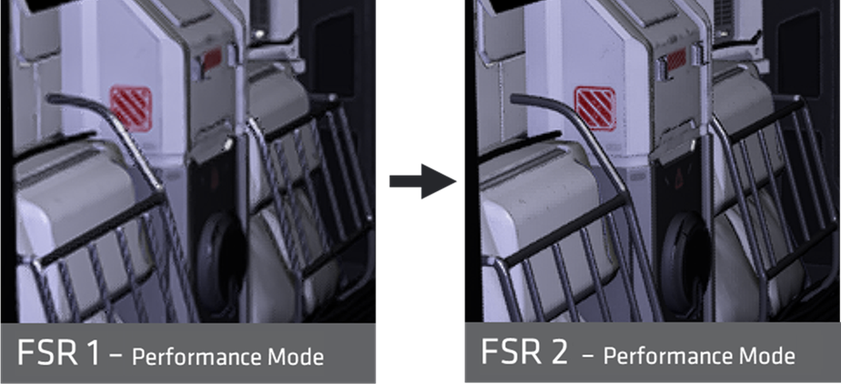
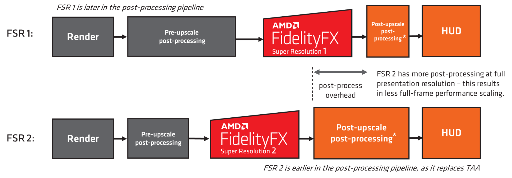

 <br/><br/><br/><br/><br/>
# FidelityFX 슈퍼 해상도(FSR 2 및 FSR 1)

*이 샘플은 Microsoft 게임 개발 키트(2022년 3월)와 호환됩니다.*

# 설명

AMD FidelityFX FSR(슈퍼 해상도)은 낮은 해상도 입력에서 고해상도 출력을 생성하기 위한 최적화된 고품질 솔루션입니다. FSR은 하드웨어 레이 트레이싱과 같은 값비싼 렌더링 작업을 위한 &ldquo;실제적인 성능&rdquo;을 가능하게 합니다.

이 샘플에는 장면 내에서 FSR 2 및 FSR 1을 모두 사용하는 예제가 포함되어 있습니다.

FSR 2는 임시 솔루션이며 여러 입력이 필요합니다. 모든 게임 파이프라인에서 TAA를 대체하므로 각 프레임 장면에 원근 지터를 적용해야 합니다. FSR 2는 높은 업스케일링 비율에서 FSR 1보다 훨씬 높은 이미지 품질을 제공하지만 FSR 2 컴퓨팅 패스 자체가 비용이 더 높습니다.

FSR 1은 공간 솔루션이며 단일 앤티앨리어스 이미지 입력이 필요합니다. 고품질 에지를 만드는 데 특히 중점을 둔 최첨단 알고리즘 컬렉션을 사용하여 기본 해상도에서 직접 렌더링하는 것에 비해 성능이 크게 향상됩니다.

두 방법 모두 품질 및 성능 검사를 위한 쌍선형 업스케일 및 기본 렌더링 모드와 함께 포함됩니다. 이미지 품질을 검사하고 픽셀 수준 비교를 수행하는 이동 가능한 돋보기가 있습니다.

FidelityFX 슈터 해상도에 대한 최신 정보는 GPUOpen <https://gpuopen.com/fsr>에서 찾을 수 있습니다.


# 샘플 빌드

Windows 데스크톱을 사용하는 경우 활성 솔루션 플랫폼을 `Gaming.Desktop.x64`(으)로 설정합니다.

Xbox Series X|S를 사용하는 경우 활성 솔루션 플랫폼을 `Gaming.Xbox.Scarlett.x64`(으)로 설정합니다.

Xbox One을 사용하는 경우 활성 솔루션 플랫폼을 `Gaming.Xbox.XboxOne.x64`(으)로 설정합니다.

Windows Desktop을 실행할 때 시스템에 대한 최신 그래픽 드라이버가 설치되어 있는지 확인합니다.

*자세한 내용은* *GDK 설명서의*__ 샘플 실행을 참조하세요.__

# 샘플 사용

| 동작 | Gamepad |
|---|---|
| 보기 회전 | 왼쪽 엄지스틱 |
| 돋보기 위치 | 오른쪽 엄지스틱 |
| 끝내기 | 보기 버튼 |
| 업스케일 모드 | A/B 단추 |
| FSR 품질 모드 | X/Y 단추 |
| 선명도 값 | 오른쪽/왼쪽 범퍼 버튼 |
| 선명하게 하기 사용/사용 안 함 | Dpad 위쪽 단추 |
| 톤맵 노출 | [오른쪽, 왼쪽] 트리거 |
| MIP 바이어스 조정 | Dpad 왼쪽/오른쪽 단추 |
| FSR 2 Reactive Mask 입력 사용/사용 안 함 | Dpad 아래쪽 단추 |

# 샘플 참고 사항

플랫폼, 샘플은 HDR 모드에서 실행됩니다. 데스크톱 플랫폼에서 샘플은 SDR 모드에서만 실행됩니다. 이 샘플은 동적 해상도 스타일로 구현되어 대상 해상도 리소스가 사용되며 업스케일링 전에 더 작은 해상도 뷰포트를 사용하여 렌더링됩니다.
| | |
|---|---|
|Xbox Series X|S 및 XboxOne|에서 HDR 디스플레이를 사용할 수 있는 경우


기본 대상 해상도 렌더링, 선택 가능한 저해상도에서 바이리니어 업스케일링, 선택 가능한 품질 모드에서 FSR 업스케일링을 위한 모드가 있습니다.

# 구현 참고 사항 -- FSR 2

## 작동 방법

*FSR 2에 대한 자세한 내부 설명서는 샘플의 `docs/` 폴더에서 찾을 수 있습니다.*

FSR 2는 임시 업스케일러입니다. 파이프라인에서 TAA를 대체하여 작동하며, 이전 프레임 데이터와 현재 프레임 데이터를 함께 활용하여 에일리어싱을 방지하고 품질 업스케일링을 수행합니다.

FSR 2는 여러 가지 새로운 알고리즘 트릭을 활용하여 다른 TAA 알고리즘에서 흐릿하게 처리될 수 있는 얇은 피처를 정확하게 복구합니다. 장면 뎁스, 장면 색, 모션 벡터 등 다양한 입력이 필요합니다. 업스케일 품질을 향상시킬 수 있는 추가 옵션 입력도 있습니다.

FSR 1과 비교할 때 FSR 2는 특히 아래와 같이 낮은 해상도에서 더 높은 품질 업스케일링을 수행합니다. 그러나 컴퓨팅 워크로드는 비용이 더 높습니다.




## 반응형 마스크

깊이 및/또는 모션 벡터가 존재하지 않는 장면 기능이 있는 상황을 지원하는 두 가지 옵션 입력이 있습니다. 일반적으로 파티클 효과 또는 리플렉션과 같은 기타 컴퍼지션 효과에서 발생합니다. 최상의 품질을 얻으려면 통합 내에서 이러한 마스크를 생성하고 사용하는 것이 좋습니다.

| 반응형 마스크 없음 | 반응형 마스크 사용 |
|---|---|
|  |  |

이 샘플에서는 `Reactive Mask` 선택적 입력을 활용하여 파티클의 업스케일링된 품질을 개선합니다. 마스크는 합성할 파티클을 검사한 다음 단일 값을 작성하여 파티클이 현재 프레임에 있는 영역을 마스킹하여 생성됩니다. 이 샘플에서는 파티클이 별도의 리소스에서 장면에 합성되었으며, 다음과 같은 반응 마스크 값이 사용되었습니다:

> reactive\[did.xy\] = min (1.0f, length(particleInput)\*8.0f);

일반적으로 반응 마스크가 장면의 영역보다 약간 더 큰 영역을 커버하기를 원하므로 값을 곱하고 고정합니다.

파이프라인에 투명도 전후 장면 콘텐츠를 제공할 수 있는 불투명 및 투명도 패스가 있는 경우, 이를 입력으로 받아 FSR 2에서 사용할 반응 마스크를 출력할 수 있는 유틸리티가 FSR 2 API 내에 있습니다(자세한 내용은 FSR 2 메인 문서 `ffxFsr2ContextGenerateReactiveMask`을(를) 참조하세요).

## 통합

FSR 2는 오픈 소스 라이브러리로 제공되며, API는 표시 크기, 최대 렌더링 크기 및 플래그(예: 반전된 깊이 및 무한 깊이 버퍼 구성)에 대한 다양한 매개 변수를 정의하는 컨텍스트를 만드는 데 사용됩니다. 기본 FSR 2 업스케일 워크로드는 `ffxFsr2ContextDispatch()` API를 통해 배포됩니다.

컨텍스트는 ffxFsr2GetInterfaceDX12 함수에 의해 채워지는 콜백 집합을 사용합니다. 이 GDKX 샘플에서는 공식 FSR2 원본에 제공되는 기본 DX12 백 엔드의 약간 수정된 버전인 사용자 지정 D3D12X 백 엔드에서 제공됩니다. 메모리의 스크래치 영역을 할당하고 `ffxFsr2GetInterfaceDX12` 함수에 제공해야 합니다.

이 샘플의 예제 시나리오:

**컨텍스트 만들기:**

```cpp
m_fsr2_create_params.maxRenderSize.width = resourceSizeWidth;
m_fsr2_create_params.maxRenderSize.height = resourceSizeHeight;
m_fsr2_create_params.displaySize.width = resourceSizeWidth;
m_fsr2_create_params.displaySize.height = resourceSizeHeight;
m_fsr2_create_params.flags =  FFX_FSR2_ENABLE_HIGH_DYNAMIC_RANGE | FFX_FSR2_ENABLE_TEXTURE1D_USAGE |
                              FFX_FSR2_ENABLE_DEPTH_INVERTED | FFX_FSR2_ENABLE_DEPTH_INFINITE |
                              FFX_FSR2_ENABLE_AUTO_EXPOSURE | FFX_FSR2_ENABLE_DYNAMIC_RESOLUTION;

m_fsr2ScratchSize = ffxFsr2GetScratchMemorySizeDX12();
m_fsr2Scratch = malloc(m_fsr2ScratchSize);
ffxFsr2GetInterfaceDX12(&m_fsr2_create_params.callbacks, device, m_fsr2Scratch, m_fsr2ScratchSize);

m_fsr2_create_params.device = device;

ffxFsr2ContextCreate(&m_fsr2Context, &m_fsr2_create_params);
```


**컨텍스트 중단:**

```cpp
if (m_fsr2Scratch)
{
    ffxFsr2ContextDestroy(&m_fsr2Context);
    free(m_fsr2Scratch);
    m_fsr2Scratch = nullptr;
}
```


**업스케일:**

```cpp
m_fsr2DispatchParams.commandList = ffxGetCommandListDX12(commandList);
m_fsr2DispatchParams.color = ffxGetResourceDX12(&m_fsr2Context, m_tonemapperOutput.Get());
m_fsr2DispatchParams.depth = ffxGetResourceDX12(&m_fsr2Context, m_motionVectorDepth.Get());
m_fsr2DispatchParams.motionVectors = ffxGetResourceDX12(&m_fsr2Context, m_motionVectors.Get());
m_fsr2DispatchParams.exposure = ffxGetResourceDX12(&m_fsr2Context, nullptr);
m_fsr2DispatchParams.reactive = ffxGetResourceDX12(&m_fsr2Context, m_reactive.Get());
m_fsr2DispatchParams.transparencyAndComposition = ffxGetResourceDX12(&m_fsr2Context, nullptr);
m_fsr2DispatchParams.output = ffxGetResourceDX12(&m_fsr2Context, m_upsampleOutput.Get());
m_fsr2DispatchParams.jitterOffset.x = m_jitterX;
m_fsr2DispatchParams.jitterOffset.y = m_jitterY;
m_fsr2DispatchParams.frameTimeDelta = (float)m_deltaTime;
m_fsr2DispatchParams.preExposure = 1.0f;
m_fsr2DispatchParams.reset = m_renderScaleChanged;
m_fsr2DispatchParams.motionVectorScale.x = inWidth;
m_fsr2DispatchParams.motionVectorScale.y = inHeight;
m_fsr2DispatchParams.renderSize.width = (unsigned int)inWidth;
m_fsr2DispatchParams.renderSize.height = (unsigned int)inHeight;
m_fsr2DispatchParams.cameraFovAngleVertical = XM_PIDIV4;
m_fsr2DispatchParams.cameraFar = FLT_MAX;
m_fsr2DispatchParams.cameraNear = 0.1f;
m_fsr2DispatchParams.enableSharpening = m_rcasEnable;

// FSR2 uses a different sharpness range than FSR1

m_fsr2DispatchParams.sharpness = 1.0f - m_rcasSharpness;
ffxFsr2ContextDispatch(&m_fsr2Context, &m_fsr2DispatchParams);
```


**원근 지터:**

또한 올바른 통합을 위해 다음 큐브 뷰 지터를 사용해야 합니다.

```cpp
static int32_t index = 0;
const int32_t jitterPhaseCount = ffxFsr2GetJitterPhaseCount((int32_t)renderWidth, (int32_t)displayWidth);

ffxFsr2GetJitterOffset(&m_jitterX, &m_jitterY, index, jitterPhaseCount);
index++;
```


다음과 같이 기존 프로젝션 매트릭스에 적용할 수 있습니다.

```cpp
DirectX::XMMATRIX jitterTranslation = XMMatrixTranslation(
    2.0f * m_jitterX / (float)renderWidth, -2.0f * m_jitterY
    (float)renderHeight, 0);

m_proj = m_proj * jitterTranslation;
```


## FSR 2 품질 모드

고정 스케일링 외에도 FSR을 \"임의 스케일링\" 모드에서 사용할 수 있습니다. 이 모드는 일반적으로 최소 프레임 속도를 달성하기 위해 고정 성능 예산에 따라 원본 해상도가 결정되는 동적 해상도 스케일링에 사용됩니다. 동적 해상도 스케일링 플래그가 이 인스턴스에서 만든 FSR 2 컨텍스트에 전달되고 큐브 뷰 지터가 현재 배율 인수에 대해 올바르게 계산되었는지 확인합니다.

DRS 모드에서는 "품질" 모드인 1.5배 배율 인수를 가능한 가장 낮은 업스케일로 사용하는 것이 좋습니다. 시스템이 기본 1x까지 확장되는 경우, 업스케일링을 수행하지 않고 FSR 2 패스를 사용하면 눈에 띄는 품질 향상 없이도 성능에 상당한 영향을 미칠 수 있습니다.

| **FSR 2 품질 모드** | **Description** | **배율 인수** | **입력 해상도** | **출력 해상도** |
|---|---|---|---|---|
| **"Quality"** | **Quality**&nbsp;모드는 상당한 성능 향상을 통해 기본 렌더링과 동일하거나 우수한 이미지 품질을 제공합니다. | 차원당 **1.5x**(2.25x 면적 스케일) | 1280x720<br/>1706x960<br/>2293x960<br/>2560x1440 | 1920x1080<br/>2560x1440<br/>3440x1440<br/>3840x2160 |
| **"Balanced"** | ***Balanced** 모드는 이미지 품질과 성능 향상 사이에서 이상적인 절충안을 제공합니다. | 차원당 **1.7x**(2.89x 면적 스케일) | 1129x635<br/>1506x847<br/>2024x847<br/>2259x1270 | 1920x1080<br/>2560x1440<br/>3440x1440<br/>3840x2160 |
| **"Performance"** | **Performance**&nbsp;모드는 기본 렌더링과 유사한 이미지 품질을 제공하면서 성능은 크게 향상됩니다. | 차원당 **2.0x**(4x 면적 스케일) | 960x540<br/>1280x720<br/>1720x720<br/>1920x1080 | 1920x1080<br/>2560x1440<br/>3440x1440<br/>3840x2160 |
| **"Ultra Performance"** | ***Ultra Performance** 모드는 기본 렌더링의 이미지 품질을 그대로 유지하면서 최고의 성능 향상을 제공합니다.* | 차원당 **3.0x**(9x 면적 스케일) | 640 x 360<br/>854 x 480<br/>1147 x 480<br/>1280 x 720 | 1920 x 1080<br/>2560 x 1440<br/>3440 x 1440<br/>3840 x 2160 |

*"Ultra Performance" 품질 모드는 선택 사항입니다.*

## 추천 사항

이 샘플에서는 GPUOpen 릴리스의 기본 FSR 2 라이브러리 및 셰이더를 사용하나 빌드하고 특정 Xbox 최적화 D3D12X 백 엔드와 결합합니다.

**셰이더 컴파일**

FSR 2에는 컴퓨팅 워크로드에 대한 다양한 순열이 있습니다. 이러한 순열은 기능 및 성능상의 이유로 존재합니다.

FSR2_GXDK 프로젝트 내에 BuildShaderPermutations.bat 파일이 있습니다. 이 빌드는 특정 GDK 도구 체인을 사용하여 셰이더를 컴파일하는 사용자 지정 빌드 단계로 빌드됩니다. 이는 FidelityFX 셰이더 컴파일러 유틸리티 실행 파일인 FidelityFX_SC.exe를 통해서도 수행됩니다. 이 유틸리티는 모든 순열을 빌드하고 중복 항목을 제거하여 출력을 줄입니다.

모든 워크로드는 Wave32로 빌드됩니다. *Xbox 플랫폼*에서는 포함된 HLSL 루트 서명이 사용됩니다. FidelityFX SPD를 사용하는 워크로드의 경우 웨이브 작업을 사용하지 않도록 설정하여 문제를 해결할 수 있습니다. 해결 방법을 사용하는 성능 회귀는 거의 또는 전혀 없습니다.
| | |
|---|---|
|*Xbox 시리즈 X|S*에서는 FP16을 사용하는 셰이더에 대해 FP16을 사용할 수 있습니다.|


*데스크톱* 플랫폼에서 FP16이 활성화되고 셰이더 모델 6.6이 있는 경우 Wave64가 강제로 적용됩니다.

참고: BuildShaderPermutation.bat 사용자 지정 빌드 규칙 내에 정의를 수동으로 포함하여 XIC를 사용하도록 설정한 경우 이 단계를 완료하는 데 몇 분 정도 걸립니다. XIC 없이 출시하기로 결정했습니다. 당시에는 성능이 크게 향상되지 않았지만 최신 셰이더 컴파일러 버전이 있는 향후 GDK에 유용할 수 있습니다.

**D3D12X FSR 2 백 엔드**

FSR 2용 D3D12X 백 엔드는 GPUOpen에서 DX12 데스크톱 백 엔드의 수정된 버전입니다. 데스크톱뿐만 아니라 Xbox 플랫폼을 대상으로 컴파일할 수 있습니다.

기본적으로 관리되는 UAV 리소스입니다. 이는 1080p-\>4K 업스케일을 수행하는 Series X에서 100us 성능 향상을 제공하는 것으로 확인되었습니다. **MIP 바이어스**
| | |
|---|---|
|Xbox 시리즈 X|S의 경우 내부적으로 특정 DCC를 선택적으로 사용하도록 설정|


고품질 출력을 위해서는 FSR 2 통합에 MIP 바이어스 변경 사항이 포함되어야 합니다. 이 샘플은 다음을 적용합니다.

__*MIP 바이어스 = -log2(디스플레이 해상도/소스 해상도)-1*__

> 참고: FSR 1과 다릅니다. FSR 2에서 FSR 1 mip 바이어스를 사용하면
> 세부 정보가 손실됩니다.*

**색 공간**

FSR 2에서는 선형 RGB 색 공간을 권장합니다. 그러나 인지 공간은 허용 가능한 결과를 얻을 수 있습니다. 개발자는 자신의 장면을 실험하는 것이 좋습니다. PQ/HLG 인코딩은 적절하지 않습니다.

**선명도**

FSR 2에서 선명도 값은 FSR 1과 다릅니다. 값은
0.0(최소 선명도)에서 1.0(가장 선명함)입니다.

기본적으로 이 샘플에서는 선명하게 설정할 수 없지만 게임 패드에서 활성화할 수 있습니다.

**동적 해상도를 위한 FSR**

DRS 모드에서는 "품질" 모드인 1.5배 배율 인수를 가능한 가장 낮은 업스케일로 사용하는 것이 좋습니다. 시스템이 기본 1x까지 확장되는 경우, 업스케일링을 수행하지 않고 FSR 2 패스를 사용하면 눈에 띄는 품질 향상 없이도 성능에 상당한 영향을 미칠 수 있습니다.

## 프레임의 위치

FSR 2는 게임 파이프라인에서 TAA를 대체해야 합니다.


이 샘플에서는 TAA를 건너뛰고 FSR 2에서 사용되기 전에 톤 매핑을 통해 지터링된 저해상도 장면이 전달됩니다.

## FSR 1과 FSR 2를 비교할 때 성능 스케일링

FSR 2가 TAA를 대체하기 때문에 아래와 같이 FSR 1보다 후처리 파이프라인에서 먼저입니다.



즉, FSR 2 게임 파이프라인은 더 높은 출력 해상도에서 더 많은 후처리가 수행되며, 이는 두 솔루션을 비교할 때 성능 스케일링에 영향을 미칠 수 있습니다. 출력 확인 데이터에 대한 작업을 수행하는 사후 업스케일 후처리 패스와 함께 품질 측면에서도 고려해야 합니다.

**성능을 위해 FSR 2 셰이더 편집**

일부 개발자가 출력 품질을 희생하면서까지 성능을 향상시키기 위해 FSR 2 워크로드를 편집할 수 있다는 점을 잘 알고 있습니다. 데스크톱 플랫폼에서는 이 작업을 수행하지 않는 것이 좋지만 콘솔의 경우 때때로 필요한 경우가 있다는 것을 알고 있습니다. 품질을 희생하면서 성능을 향상시킬 수 있는 다양한 상수가 있습니다.(예: ffx_fsr2_upsample.h의 iLanczos2SampleCount). 이 값을 12로 낮추면 FSR 2 런타임을 약간 줄이면서 만족할 만한 화질을 얻을 수 있습니다.

# 구현 참고 사항 -- FSR 1

## 작동 방법

FSR 1은 공간 업스케일러입니다. 현재 앤티앨리어싱된 프레임을 가져와서 해상도를 표시하도록 업스케일링하여 작동합니다. FSR에는 현재 프레임의 데이터만 필요합니다. 동작 벡터 또는 프레임 기록이 필요하지 않습니다. FSR의 핵심은 원본 이미지에서 고해상도 가장자리를 감지하고 다시 만드는 최첨단 알고리즘입니다. 이러한 고해상도 에지는 현재 프레임을 \"슈퍼 해상도\" 이미지로 바꾸는 데 필요한 중요한 요소입니다. FSR은 프레임이 이동 중인지 여부에 관계없이 일관된 업스케일링 품질을 제공하므로 다른 유형의 업스케일러에 비해 품질 이점을 제공할 수 있습니다.

FSR 1은 다음 두 가지 기본 패스로 구성됩니다.

- 에지 재구성을 수행하는 EASU(Edge-Adaptive Spatial Upsampling)라는 업스케일링 패스입니다. 이 패스에서 입력 프레임은 그라데이션 반전에 대해 분석됩니다. 인접 그라데이션이 입력 픽셀 세트와 어떻게 다른지 확인합니다. 그라데이션 반전 강도는 디스플레이 해상도에서 재구성을 위해 샘플에 적용되는 가중치를 결정합니다.

- RCAS(Robust Contrast-Adaptive Sharpening)라고 하는 선명화 패스(업스케일된 이미지에서 픽셀 세부 정보를 추출합니다.

이 샘플에서 두 개의 패스는 컴퓨팅 셰이더로 구현되며 gamma2 색상 공간 데이터에서 작동합니다.


## 프레임의 위치


FSR 1 패스는 지각 색상 공간에서 가장 잘 작동하므로 톤 매핑 후에 통합해야 합니다. 장면에 노이즈 또는 기타 고주파수 시각적 구성 요소를 도입하는 패스는 이러한 노이즈 구성 요소가 증폭되는 것을 방지하기 위해 업스케일링 후에 렌더링되어야 합니다.

이 샘플에서는 다음 프레임 구조가 적용됩니다.


샘플의 톤맵 패스는 gamma2 출력을 R10G10B10A2_UNORM 리소스에 씁니다. 이 리소스는 EASU 및 RCAS에서 소비한 다음 돋보기 패스에서 사용됩니다. SDR에서 색상 변환 패스는 gamma2를 다시 선형으로 변환합니다. HDR에서 HDR 디스플레이가 연결된 상태에서 색상 변환 패스는 gamma2를 rec2020으로 변환합니다.

## 필수 상수

상수가 처리되는 방식은 통합을 가능한 한 간단하게 만드는 것과 같습니다. CPU 또는 GPU에서 호출할 수 있는 도우미 함수로 채워지는 4개의 정수 벡터가 있습니다. 변수를 기존 상수 버퍼에 추가하고 추출한 다음 EASU/RCAS 기능에 전달할 수 있습니다.

이 샘플에서 도우미는 CPU에서 호출되고 상수는 단일 버퍼에서 제공됩니다.

```cpp
struct FSRConstants
{
    DirectX::XMUINT4 Const0;
    DirectX::XMUINT4 Const1;
    DirectX::XMUINT4 Const2;
    DirectX::XMUINT4 Const3;
};

FSRConstants m_fsrConsts;
```


**EASU**

```cpp
FsrEasuCon(
    reinterpret_cast<AU1*>(&m_fsrConsts.Const0),
    reinterpret_cast<AU1*>(&m_fsrConsts.Const1),
    reinterpret_cast<AU1*>(&m_fsrConsts.Const2),
    reinterpret_cast<AU1*>(&m_fsrConsts.Const3),
    inWidth, inHeight, // Viewport size (top left aligned) in the input image which is to be scaled.
    outWidth, outHeight, // The size of the input image.
    outWidth, outHeight); // The output resolution.
```


위의 예는 지오메트리가 더 큰 리소스 내에서 뷰포트로 렌더링되는 동적 해상도 스타일에 대한 것입니다. 렌더링되는 리소스 크기가 뷰포트와 동일하면 다음이 표시됩니다.

```cpp
FsrEasuCon(
    reinterpret_cast<AU1*>(&m_fsrConsts.Const0),
    reinterpret_cast<AU1*>(&m_fsrConsts.Const1),
    reinterpret_cast<AU1*>(&m_fsrConsts.Const2),
    reinterpret_cast<AU1*>(&m_fsrConsts.Const3),
    inWidth, inHeight, // Viewport size (top left aligned) in the input image which is to be scaled.
    inWidth, inHeight, // The size of the input image.
    outWidth, outHeight); // The output resolution.
```


입력이 레터박스 처리되고 뷰포트가 왼쪽 상단에 정렬되지 않은 경우 이를 수용하기 위해 FsrEasuConOffset 함수가 제공됩니다.

```cpp
void FsrEasuConOffset(
    outAU4 con0,
    outAU4 con1,
    outAU4 con2,
    outAU4 con3,
    AF1 inputViewportInPixelsX,
    AF1 inputViewportInPixelsY,
    AF1 inputSizeInPixelsX,
    AF1 inputSizeInPixelsY,
    AF1 outputSizeInPixelsX,
    AF1 outputSizeInPixelsY,
    AF1 inputOffsetInPixelsX,
    AF1 inputOffsetInPixelsY)
```

**RCAS**

```cpp
FsrRcasCon(reinterpret_cast<AU1*>(&m_fsrConsts.Const0), m_rcasSharpness);
```

부동 소수점 선명도 값의 소수 자릿수는 다음과 같습니다.

**{0.0 := 최대값, N>0까지, 여기서 N은 선명도 감소의 정지(으)개수입니다.}**

> *스케일링은 FidelityFX CAS 및 FSR 2와 다릅니다.*

## FSR 1 품질 모드

FSR 1은 원하는 품질/성능 비율에 따라 원본 이미지에 적용할 스케일링의 양을 설명하는 품질 모드를 노출합니다.

고정 스케일링 외에도 FSR 1을 \"임의 스케일링\" 모드에서 사용할 수 있습니다. 1x에서 4x 사이의 모든 영역 배율 인수가 지원됩니다. 이 모드는 일반적으로 최소 프레임 속도를 달성하기 위해 고정 성능 예산에 따라 원본 해상도가 결정되는 동적 해상도 스케일링에 사용됩니다.

| **FSR 1 품질 모드** | **Description** | **배율 인수** | **입력 해상도** | **출력\ 해상도** |
|---|---|---|---|---|
| **"Ultra Quality"** | **Ultra Quality** 모드는 기본 렌더링과 거의 구별할 수 없는 품질로 이미지를 생성합니다. 최고 품질이 필요한 경우 선택해야 합니다. * | 차원당 **1.3x**(1.69x 면적 스케일) | 1477x831<br/>1970x1108<br/>2646x1108<br/>2954x1662 | 1920x1080<br/>2560x1440<br/>3440x1440<br/>3840x2160 |
| **"Quality"** | **Quality**&nbsp;모드는 기본 렌더링의 품질을 나타내는 슈퍼 해상도 이미지를 생성하며, 성능이 크게 향상됩니다. | 차원당 **1.5x**(2.25x 면적 스케일) | 1280x720<br/>1706x960<br/>2293x960<br/>2560x1440 | 1920x1080<br/>2560x1440<br/>3440x1440<br/>3840x2160 |
| **"Balanced"** | **Balanced**&nbsp;모드는 기본 렌더링 품질을 근사하게 만드는 슈퍼 해상도 이미지를 생성하며 기본에 비해 성능이 크게 향상됩니다. | 차원당 **1.7x**(2.89x 면적 스케일) | 1129x635<br/>1506x847<br/>2024x847<br/>2259x1270 | 1920x1080<br/>2560x1440<br/>3440x1440<br/>3840x2160 |
| **"Performance"** | **Performance**&nbsp;모드는 이미지 품질에 눈에 띄게 영향을 줍니다. 추가 성능이 필요한 경우에만 선택해야 합니다. | 차원당 **2.0x**(4x 면적 스케일) | 960x540<br/>1280x720<br/>1720x720<br/>1920x1080 | 1920x1080<br/>2560x1440<br/>3440x1440<br/>3840x2160 |

FSR 1은 더 높은 배율 인수를 사용하지 않는 것이 좋습니다. ***FSR 2는 이러한 배율에서 더 나은 성능을 발휘하며 선택적 "울트라 성능" 3.0x 스케일링 모드도 포함합니다.***

> FSR 1 Ultra Quality는 이 샘플에서 지원되지 않습니다.

## 추천 사항

**형식, 컴파일러 옵션 및 부동 소수점 경로 선택**

이 샘플은 FSR 경로에 32bpp R10G10B10A2_UNORM 리소스를 사용하므로 성능이 가장 높습니다. EASU 패스는 일반적으로 ALU 바운드이고 RCAS는 MEM 바운드입니다.

이 샘플에 따라 구현될 때 지원되는 플랫폼에 대한 권장 사항은 다음과 같습니다.

| 플랫폼 | 리소스 종류 | EASU 권장 사항 | RCAS 권장 사항 |
|---|---|---|---|
| **Scarlett** | R10 G10B10A2_UNORM | Wave32, Fp16 | Wave32, Fp16 |
|  | R16G 16B16A16_FLOAT | Wave32, Fp16 | Wave32, Fp16 |
| **XboxOne** | R10 G10B10A2_UNORM | Fp32 | Fp32 |
|  | R16G 16B16A16_FLOAT | Fp32 | Fp32 |
| **데스크톱** | R10 G10B10A2_UNORM | Fp16 | Fp16 |
|  | R16G 16B16A16_FLOAT | Fp16 | Fp16 |

장치 지원으로 인해 데스크탑 플랫폼에서 기본 fp16을 사용할 수 없는 경우 fp32가 사용됩니다.

**앤티앨리어스 입력**

FSR 1에는 앤티앨리어스 입력이 필요합니다. 사용 가능한 품질 AA가 없는 경우(예: TAA 또는 MSAA 8x) FSR 사용은 권장되지 않습니다. 이 샘플에서는 기본 TAA가 사용됩니다.

**MIP 바이어스**

고품질 출력을 위해서는 FSR 1 통합에 MIP 바이어스 변경 사항이 포함되어야 합니다. 이 샘플은 다음을 적용합니다.

__*MIP 바이어스 = -log2(디스플레이 해상도/소스 해상도)*__

**색 공간**

FSR 1 패스에 대한 입력은 sRGB 또는 Gamma2와 같은 지각 색상 공간에 있어야 합니다. 이 밴딩이 증폭될 수 있으므로 입력에 밴딩이 없어야 합니다.

**동적 해상도를 위한 FSR 1**

FSR 1은 동적 해상도에 이상적이며 이 샘플은 입력 데이터가 더 큰 리소스의 하위 집합인 사용을 위해 상수를 설정하는 방법을 보여줍니다.

동적 해상도가 100%로 렌더링되는 특별한 경우에는 원활한 경험을 제공하기 위해 RCAS를 유지하면서 EASU 패스를 건너뛸 수 있습니다.

**RCAS 샤프닝**

RCAS에 대한 샤프닝 감쇠 값은 CAS에 존재하는 것과 다릅니다.

RCAS에서 0.0은 가장 높은 선명도 수준이며 N\>0은 적용된 선명도 수준을 줄입니다.

이 샘플의 기본 RCAS 선명도 감쇠는 0.25로 설정됩니다.

# 업데이트 기록

2021년 6월 최초 출시

2022년 6월: FSR 2로 업데이트됨

2022년 10월: FSR 2.1.2로 업데이트됨

2023년 5월: FSR 2.2.1로 업데이트됨

# 개인정보처리방침

샘플을 컴파일하고 실행하는 경우 샘플 사용량을 추적할 수 있도록 샘플 실행 파일의 파일 이름이 Microsoft에 전송됩니다. 이 데이터 수집을 옵트아웃하려면 Main.cpp에서 "샘플 사용량 원격 분석"이라는 레이블이 지정된 코드 블록을 제거할 수 있습니다.

일반적인 Microsoft의 개인 정보 정책에 대한 자세한 내용은 [Microsoft 개인정보처리방침](https://privacy.microsoft.com/en-us/privacystatement/)을 참조하세요.

# 고지 사항

여기에 포함된 정보는 정보 제공의 목적으로만 제공되며 예고 없이 변경될 수 있습니다. 이 문서를 준비하는 동안 모든 예방 조치를 취했지만 기술적인 부정확성, 누락 및 인쇄상의 오류가 포함될 수 있으며 AMD는 이 정보를 업데이트하거나 수정할 의무가 없습니다. Advanced Micro Devices, Inc.는 여기에 설명된 AMD 하드웨어, 소프트웨어 또는 기타 제품의 작동 또는 사용과 관련하여 비침해, 상품성 또는 특정 목적에의 적합성에 대한 묵시적 보증을 포함하여 이 문서 내용의 정확성 또는 완전성과 관련하여 어떠한 진술이나 보증도 하지 않으며 어떤 종류의 책임도 지지 않습니다. 묵시적이거나 금반언에 의해 발생하는 것을 포함하여 이 문서에서는 지적 재산권에 대한 라이선스를 부여하지 않습니다. AMD 제품의 구매 또는 사용에 적용되는 약관 및 제한 사항은 당사자 간의 서명된 계약 또는 AMD의 표준 판매 약관에 명시되어 있습니다.

AMD, AMD Arrow 로고, Radeon, RDNA, Ryzen 및 이들의 조합은 Advanced Micro Devices, Inc.의 상표입니다. 이 간행물에 사용된 기타 제품 이름은 식별 목적으로만 사용되었으며 해당 회사의 상표일 수 있습니다.

Windows는 미국 및/또는 기타 국가에서 Microsoft Corporation의 등록 상표입니다.

Xbox는 미국 및/또는 기타 국가에서 Microsoft Corporation의 등록 상표입니다.

© 2022 Advanced Micro Devices, Inc. All rights reserved.


