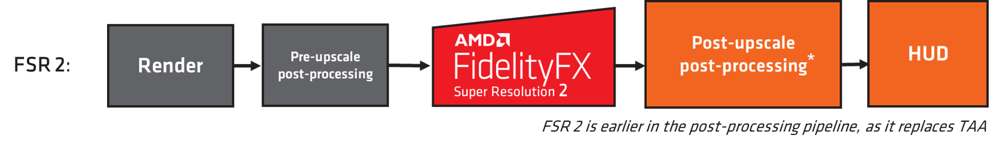
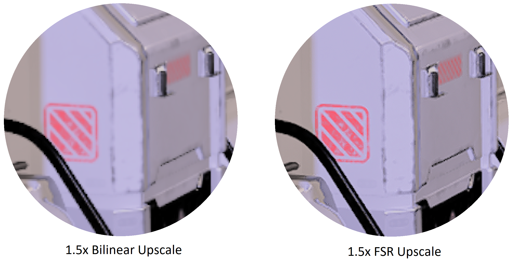

 <br/><br/><br/><br/><br/>
# FidelityFX 超分辨率（FSR 2 和 FSR 1）

*此示例可用于 Microsoft 游戏开发工具包 (2022 年 3 月)。*

# 说明

AMD FidelityFX 超分辨率 (FSR) 是一种优化的高质量解决方案，用于从较低分辨率的输入产生较高分辨率的输出。 FSR 可为硬件光线跟踪等成本高昂的渲染运算提供&ldquo;实用的性能&rdquo;。

此示例包括在场景中同时使用 FSR 2 和 FSR 1 的示例。

FSR 2 是一个临时解决方案，需要多个输入。 它将替换任何游戏管道中的 TAA，因此需要将透视抖动应用于场景的每一帧。 FSR 2 以更高的放大率提供比 FSR 1 高得多的图像质量，但 FSR 2 计算通道本身的成本更高。

FSR 1 是一种空间解决方案，需要一个抗锯齿图像输入。 它使用了一系列尖端算法，特别强调创建高质量的边缘，与直接以原始分辨率渲染相比，性能有了很大提升。

这两种方法都附带了用于质量和性能检查的双线性升级和本机渲染模式。 有一个可移动的放大镜，用于检查图像质量并执行像素级比较。

可在 <https://gpuopen.com/fsr> 的 GPUOpen 上查找关于 FidelityFX 超分辨率的最新信息。


# 生成示例

如果使用 Windows 桌面，请将活动解决方案平台设置为 `Gaming.Desktop.x64`。

如果使用 Xbox Series X|S，请将活动解决方案平台设置为 `Gaming.Xbox.Scarlett.x64`。

如果使用 Xbox One，请将活动解决方案平台设置为 `Gaming.Xbox.XboxOne.x64`。

运行 Windows 桌面版时，请确保系统安装了最新的图形驱动程序。

*有关详细信息，请参阅 *GDK 文档中的&ldquo;&nbsp;__运行示例__*&rdquo;。*

# 使用示例

| 操作 | 游戏板 |
|---|---|
| 旋转视图 | 左控制杆 |
| 放大镜位置 | 右控制杆 |
| 退出 | &ldquo;视图&rdquo;按钮 |
| 升级模式 | A / B 按钮 |
| FSR 质量模式 | X/Y 按钮 |
| 清晰度值 | 左侧/右侧肩按钮 |
| 锐化启用/禁用 | 方向键向上按钮 |
| 色调图曝光 | 右/左扳机键 |
| Mip 偏差调整 | 方向键向左/向右按钮 |
| FSR 2 反应性遮罩输入启用/禁用 | Dpad 向下按钮 |

# 示例说明

平台，示例在 HDR 模式下运行。 在桌面平台上，该示例将仅在 SDR 模式下运行。 此示例以动态解析样式实现，通过这种样式，在进行纵向扩展之前，使用目标解析资源并将其渲染为使用较小分辨率视区。
| | |
|---|---|
|如果 hdr 显示器在 Xbox Series X|S 和 XboxOne 上可用|


有用于本地目标解析渲染、从可选择的低分辨率进行双线性纵向扩展以及从可选质量模式进行 FSR 纵向扩展的模式。

# 实现说明 -- FSR 2

## 工作原理

*可以在示例的 `docs/` 文件夹中找到 FSR 2 的详细内部文档。*

FSR 2 是一种时间放大器。 它的工作原理是替换管道中的 TAA，利用以前的帧数据和当前帧数据来抗锯齿并执行质量提升。

FSR 2 利用许多新的算法技巧来准确恢复可能被其他 TAA 算法模糊化的精简功能。 它需要多个输入 - 场景深度、场景颜色和运动向量。 还有更多可选输入，可以提高提升质量。

相比 FSR 1，FSR 2 可提高质量，尤其是在分辨率较低的情况下，如下所示。 但是，计算工作负载的成本较高。


## 反应性遮罩

有两个可选输入，可帮助出现不存在深度和/或运动向量的场景特征。 这通常发生在粒子效果或其他合成效果（如和反射）中。 强烈建议在集成中生成并使用这些遮罩，以实现最佳质量。

| 无反应性遮罩 | 有反应性遮罩 |
|---|---|
|  |  |

此示例利用 `Reactive Mask` 可选的输入来提高粒子的放大质量。 通过检查要复合的粒子，然后写出单个值来屏蔽当前帧中存在粒子的区域，从而生成遮罩。 在此示例中，粒子从单独的资源复合到场景中，并使用以下反应性遮罩值：

> reactive\[did.xy\] = min (1.0f, length(particleInput)\*8.0f);

通常，你希望反应性遮罩覆盖比场景中区域稍大的区域，这就是值相乘和固定的原因。

如果管道具有可提供前后透明度场景内容的不透明透明通道，则 FSR 2 API 中存在一个实用工具，可以将这些内容用作输入，并输出反应性遮罩以供 FSR 2 使用 - 有关详细信息，请参阅主 FSR 2 文档中的 `ffxFsr2ContextGenerateReactiveMask`。

## 集成

FSR 2 作为开源库提供，带有一个 API，用于创建上下文，该上下文定义了显示尺寸、最大渲染尺寸和标志（例如反转和无限深度缓冲区配置）的各种参数。 main FSR 2 升级工作负载通过 `ffxFsr2ContextDispatch()` API 部署。

上下文采用一组回调，由 ffxFsr2GetInterfaceDX12 函数填充。 在此 GDKX 示例中，此示例由自定义 D3D12X 后端提供，后者是官方 FSR2 源中所提供基本 DX12 后端的略微修改版本。 必须分配内存暂存区域并将其提供给 `ffxFsr2GetInterfaceDX12` 函数。

此示例中的示例方案：

**上下文创建：**

```cpp
m_fsr2_create_params.maxRenderSize.width = resourceSizeWidth;
m_fsr2_create_params.maxRenderSize.height = resourceSizeHeight;
m_fsr2_create_params.displaySize.width = resourceSizeWidth;
m_fsr2_create_params.displaySize.height = resourceSizeHeight;
m_fsr2_create_params.flags =  FFX_FSR2_ENABLE_HIGH_DYNAMIC_RANGE | FFX_FSR2_ENABLE_TEXTURE1D_USAGE |
                              FFX_FSR2_ENABLE_DEPTH_INVERTED | FFX_FSR2_ENABLE_DEPTH_INFINITE |
                              FFX_FSR2_ENABLE_AUTO_EXPOSURE | FFX_FSR2_ENABLE_DYNAMIC_RESOLUTION;

m_fsr2ScratchSize = ffxFsr2GetScratchMemorySizeDX12();
m_fsr2Scratch = malloc(m_fsr2ScratchSize);
ffxFsr2GetInterfaceDX12(&m_fsr2_create_params.callbacks, device, m_fsr2Scratch, m_fsr2ScratchSize);

m_fsr2_create_params.device = device;

ffxFsr2ContextCreate(&m_fsr2Context, &m_fsr2_create_params);
```


**上下文拆解：**

```cpp
if (m_fsr2Scratch)
{
    ffxFsr2ContextDestroy(&m_fsr2Context);
    free(m_fsr2Scratch);
    m_fsr2Scratch = nullptr;
}
```


**升级：**

```cpp
m_fsr2DispatchParams.commandList = ffxGetCommandListDX12(commandList);
m_fsr2DispatchParams.color = ffxGetResourceDX12(&m_fsr2Context, m_tonemapperOutput.Get());
m_fsr2DispatchParams.depth = ffxGetResourceDX12(&m_fsr2Context, m_motionVectorDepth.Get());
m_fsr2DispatchParams.motionVectors = ffxGetResourceDX12(&m_fsr2Context, m_motionVectors.Get());
m_fsr2DispatchParams.exposure = ffxGetResourceDX12(&m_fsr2Context, nullptr);
m_fsr2DispatchParams.reactive = ffxGetResourceDX12(&m_fsr2Context, m_reactive.Get());
m_fsr2DispatchParams.transparencyAndComposition = ffxGetResourceDX12(&m_fsr2Context, nullptr);
m_fsr2DispatchParams.output = ffxGetResourceDX12(&m_fsr2Context, m_upsampleOutput.Get());
m_fsr2DispatchParams.jitterOffset.x = m_jitterX;
m_fsr2DispatchParams.jitterOffset.y = m_jitterY;
m_fsr2DispatchParams.frameTimeDelta = (float)m_deltaTime;
m_fsr2DispatchParams.preExposure = 1.0f;
m_fsr2DispatchParams.reset = m_renderScaleChanged;
m_fsr2DispatchParams.motionVectorScale.x = inWidth;
m_fsr2DispatchParams.motionVectorScale.y = inHeight;
m_fsr2DispatchParams.renderSize.width = (unsigned int)inWidth;
m_fsr2DispatchParams.renderSize.height = (unsigned int)inHeight;
m_fsr2DispatchParams.cameraFovAngleVertical = XM_PIDIV4;
m_fsr2DispatchParams.cameraFar = FLT_MAX;
m_fsr2DispatchParams.cameraNear = 0.1f;
m_fsr2DispatchParams.enableSharpening = m_rcasEnable;

// FSR2 uses a different sharpness range than FSR1

m_fsr2DispatchParams.sharpness = 1.0f - m_rcasSharpness;
ffxFsr2ContextDispatch(&m_fsr2Context, &m_fsr2DispatchParams);
```


**透视抖动：**

我们还要求使用以下透视抖动来实现正确的整合。

```cpp
static int32_t index = 0;
const int32_t jitterPhaseCount = ffxFsr2GetJitterPhaseCount((int32_t)renderWidth, (int32_t)displayWidth);

ffxFsr2GetJitterOffset(&m_jitterX, &m_jitterY, index, jitterPhaseCount);
index++;
```


这可以应用于现有投影矩阵，如下所示：

```cpp
DirectX::XMMATRIX jitterTranslation = XMMatrixTranslation(
    2.0f * m_jitterX / (float)renderWidth, -2.0f * m_jitterY
    (float)renderHeight, 0);

m_proj = m_proj * jitterTranslation;
```


## FSR 2 质量模式

除了固定缩放，FSR 还可以在\"任意缩放\"模式下使用。 此模式通常用于动态解析缩放，因此源解析由固定性能预算确定，以实现最低帧率。 确保将动态分辨率缩放标志传递给此实例中的 FSR 2 上下文创建，并且已针对当前缩放因子正确计算透视抖动。

在 DRS 模式下，我们建议使用 1.5 倍缩放因子（&ldquo;质量&rdquo;模式）是可能的最低的升级。 如果系统一直纵向缩减到本机 1 倍，则 FSR 2 通过的性能影响可能很大，而不会显著提高质量。

| **FSR 2 质量模式** | **Description** | **比例系数** | **输入分辨率** | **输出分辨率** |
|---|---|---|---|---|
| **&ldquo;质量&rdquo;** | **质量**&nbsp;模式提供与本机渲染相等或优于本机渲染的图像质量，并显著提高性能。 | **1.5x** /维度 (2.25x 面积缩放) | 1280x720<br/>1706x960<br/>2293x960<br/>2560x1440 | 1920x1080<br/>2560x1440<br/>3440x1440<br/>3840x2160 |
| **&ldquo;平衡&ldquo;** | ***平衡**&nbsp;模式在图像质量和性能提升之间提供了理想的折衷效果。 | **1.7x** /维度 (2.89x 面积缩放) | 1129x635<br/>1506x847<br/>2024x847<br/>2259x1270 | 1920x1080<br/>2560x1440<br/>3440x1440<br/>3840x2160 |
| **&ldquo;性能&rdquo;** | **性能**模式提供类似于本机渲染的图像质量，并获得重大性能提升。 | **2 .0x**/维度 (4x 面积缩放) | 960x540<br/>1280x720<br/>1720x720<br/>1920x1080 | 1920x1080<br/>2560x1440<br/>3440x1440<br/>3840x2160 |
| **&ldquo;超性能&rdquo;** | ***&ldquo;超性能&rdquo;** 模式提供最高的性能提升，同时仍保持代表本机渲染的图像质量。* | **3.0x** /维度 (9x 面积缩放) | 640 x 360<br/>854 x 480<br/>1147 x 480<br/>1280 x 720 | 1920 x 1080<br/>2560 x 1440<br/>3440 x 1440<br/>3840 x 2160 |

*&ldquo;超性能&rdquo;质量模式是可选模式。*

## 建议

此示例使用 GPUOpen 版本中的基本 FSR 2 库和着色器，但会生成它们并将其与特定的 Xbox 优化 D3D12X 后端组合使用。

**着色器汇编**

FSR 2 为计算工作负载提供了许多不同的排列方式。 出于功能和性能原因，存在这些排列。

在 FSR2_GXDK 项目中，有一个 BuildShaderPermutations.bat 文件。 此生成为自定义生成步骤，使用特定的 GDK 工具链编译着色器。 这也通过 FidelityFX 着色器编译器实用工具可执行文件完成：FidelityFX_SC.exe。 此实用工具生成所有排列，并通过删除重复项来减少输出。

所有工作负载均生成 Wave32。 在 *Xbox 平台*上，使用嵌入 HLSL 根签名。 对于使用 FidelityFX SPD 的工作负载，会禁用波形操作来解决问题。 使用解决方法时几乎没有性能回归。
| | |
|---|---|
|在 *Xbox Series X|S* 上，为使用它的着色器启用了 FP16。|


在*桌面*平台上，启用 FP16，如果着色器模型 6.6 存在，将强制使用 Wave64。

注意：如果通过手动在 BuildShaderPermutation.bat 自定义生成规则中包含定义来启用 XIC，此步骤需要几分钟才能完成。 我们决定不使用 XIC 交付，因为当时看不到任何显著的性能提升，但这对于具有较新着色器编译器版本的未来 GDK 非常有用。

**D3D12X FSR 2 后端**

FSR 2 的 D3D12X 后端是 GPUOpen 上 DX12 桌面后端的修改版本。 它允许针对 Xbox 平台和桌面进行编译。

默认情况下，托管 UAV 资源。 在执行 1080p-\>4K 升级的 X 系列上，这可以按 100us 性能提升的顺序提供。 **MIP 偏差**
| | |
|---|---|
|对于 Xbox X 系列，我们选择性地在某些内部设备上启用 DCC|


对于更高质量的输出，FSR 2 集成应包括 MIP 偏差更改。 此示例应用以下内容：

__*MIP 偏差 = -log2（显示器分辨率/源分辨率）-1*__

> 注意：这与 FSR 1 不同。 将 FSR 1 mip 偏差与 FSR 2 配合使用
> 导致丢失详细信息。*

**颜色空间**

FSR 2 建议使用线性 RGB 颜色空间，但感知空间可能会产生可接受的结果。 我们建议开发人员试验自己的场景。 PQ/HLG 编码不合适。

**清晰度**

在 FSR 2 中，清晰度不同于 FSR 1。 数值为
0.0（最不锐利）到 1.0（最锐利）。

默认情况下，该样本中的锐化功能被禁用，但可以通过游戏手柄启用。

**FSR 动态分辨率**

在 DRS 模式下，我们建议使用 1.5 倍缩放因子（&ldquo;质量&rdquo;模式）是可能的最低的升级。 如果系统一直纵向缩减到本机 1 倍，则 FSR 2 通过的性能影响可能很大，而不会显著提高质量。

## 帧中的位置

FSR 2 应替换游戏管道中的 TAA。



在此示例中，将跳过 TAA，在 FSR 2 使用前，通过色调映射传递抖动的低分辨率场景。

## 比较 FSR 1 与 FSR 2 时的性能缩放

由于 FSR 2 替换了 TAA，因此它在后处理管道中早于 FSR 1，如下所示。


这意味着 FSR 2 游戏管道在更高的输出分辨率下执行了更多的后期处理，这会影响比较这两个解决方案时的性能缩放。 在质量方面，还必须考虑这一点，因为这些升级后的后期处理通过对输出解析数据执行操作。

**编辑 FSR 2 着色器以提升性能**

我们了解，某些开发人员可能会编辑 FSR 2 工作负载，以以牺牲输出质量为代价来释放进一步的性能。 我们建议不要在桌面平台上执行此操作，但是对于主机，我们知道有时需要这样做。 有各种常量可以提高性能，但代价是质量下降，例如，ffx_fsr2_upsample.h 中的 iLanczos2SampleCount。 如果将此值降低到 12，可能会为某些用户带来可接受的质量，但 FSR 2 运行时会减少一些。

# 实现说明 -- FSR 1

## 工作原理

FSR 1 是一种空间放大器。 它的工作原理是采用当前的抗锯齿帧并对其进行纵向扩展以显示分辨率。 FSR 只需要当前帧的数据。 而不需要运动向量或帧历史记录。 FSR 的核心是一种先进算法，用于从源图像中检测和重新创建高分辨率边缘。 这些高分辨率边缘是将当前帧转换为&ldquo;超分辨率&rdquo;图像所需的关键元素。 FSR 提供一致的增量缩放质量，无论帧是否处于移动状态，与其他类型的增量程序相比，它提供的质量更具优势。

FSR 1 由两个主要通道组成：

- 一个名为 Edge-Adaptive 空间上采样 (EASU) 的增量扩展通道，用于执行边缘重建。 在此通道中，将会分析输入帧以进行渐变反转，旨在了解相邻渐变与一组输入像素的差异有多大。 渐变反转强度确定应用于样本的权重，以便在显示器分辨率下重建。

- 一个名为&ldquo;可靠对比度自适应锐化 (RCAS)&rdquo;的锐化通道（提取已增量图像中的像素详细信息）。

在此示例中，两个通道作为计算着色器实现，它们对 gamma2 颜色空间数据进行运算。



## 帧中的位置


FSR 1 在感知色空间中的传递效果最佳，因此应在色调图后集成。 在进行纵向扩展后，应渲染向场景引入噪音或其他高频视觉组件的传递，以避免这些噪音组件被放大。

此示例中采用的是以下帧结构：


示例中的色调图传递将 gamma2 输出写入到 EASU 和 RCAS 使用的 R10G10B10A2_UNORM 资源中，然后放大镜传递。 在 SDR 中，颜色转换传道将 gamma2 转换回线性。 在 HDR 中，连接 HDR 显示器后，颜色转换通道会将 gamma2 转换为 rec2020。

## 必需常量

处理常量的方式是尽可能简化集成。 帮助程序函数填充 4 个整数向量，可在 CPU 或 GPU 上调用。 可以将变量添加到现有常量缓冲区，提取这些变量，然后传递给 EASU/RCAS 函数。

在此示例中，在 CPU 上调用帮助程序，而常量则由单个缓冲区提供。

```cpp
struct FSRConstants
{
    DirectX::XMUINT4 Const0;
    DirectX::XMUINT4 Const1;
    DirectX::XMUINT4 Const2;
    DirectX::XMUINT4 Const3;
};

FSRConstants m_fsrConsts;
```


**EASU**

```cpp
FsrEasuCon(
    reinterpret_cast<AU1*>(&m_fsrConsts.Const0),
    reinterpret_cast<AU1*>(&m_fsrConsts.Const1),
    reinterpret_cast<AU1*>(&m_fsrConsts.Const2),
    reinterpret_cast<AU1*>(&m_fsrConsts.Const3),
    inWidth, inHeight, // Viewport size (top left aligned) in the input image which is to be scaled.
    outWidth, outHeight, // The size of the input image.
    outWidth, outHeight); // The output resolution.
```


上面的示例适用于动态分辨率样式，其中几何图形渲染到较大资源内的视区中。 如果渲染到的资源大小与视区相同，我们将会看到以下内容：

```cpp
FsrEasuCon(
    reinterpret_cast<AU1*>(&m_fsrConsts.Const0),
    reinterpret_cast<AU1*>(&m_fsrConsts.Const1),
    reinterpret_cast<AU1*>(&m_fsrConsts.Const2),
    reinterpret_cast<AU1*>(&m_fsrConsts.Const3),
    inWidth, inHeight, // Viewport size (top left aligned) in the input image which is to be scaled.
    inWidth, inHeight, // The size of the input image.
    outWidth, outHeight); // The output resolution.
```


如果输入经过宽屏幕变形处理，并且视区不是左上角对齐，则会提供 FsrEasuConOffset 函数来适应此情况。

```cpp
void FsrEasuConOffset(
    outAU4 con0,
    outAU4 con1,
    outAU4 con2,
    outAU4 con3,
    AF1 inputViewportInPixelsX,
    AF1 inputViewportInPixelsY,
    AF1 inputSizeInPixelsX,
    AF1 inputSizeInPixelsY,
    AF1 outputSizeInPixelsX,
    AF1 outputSizeInPixelsY,
    AF1 inputOffsetInPixelsX,
    AF1 inputOffsetInPixelsY)
```

**RCAS**

```cpp
FsrRcasCon(reinterpret_cast<AU1*>(&m_fsrConsts.Const0), m_rcasSharpness);
```

浮点锐度值的刻度如下所示：

**{0.0 :=maximum, to N > 0, N 代表锐度减少的停止次数(减半)}**

> *请注意，缩放与 FidelityFX CAS 和 FSR 2 的缩放不同。*

## FSR 1 质量模式

FSR 1 公开质量模式，以描述要应用于源图像的缩放量，具体取决于所需的质量/性能比。

除了固定缩放，FSR 1 还可以在&ldquo;任意缩放&rdquo;模式下使用。 支持介于 1倍和 4倍之间的任意区域缩放系数。 此模式通常用于动态解析缩放，因此源解析由固定性能预算确定，以实现最低帧率。

| **FSR 1 质量模式** | **Description** | **比例系数** | **输入分辨率** | **输出\分辨率** |
|---|---|---|---|---|
| **&ldquo;超高质量&rdquo;** | **超高质量**模式可以生成画质与本地渲染的几乎无法区分的图像。 当需要最高质量时，应选择这一模式* | **1 .3x**/维度 (1.69x 面积缩放) | 1477x831<br/>1970x1108<br/>2646x1108<br/>2954x1662 | 1920x1080<br/>2560x1440<br/>3440x1440<br/>3840x2160 |
| **&ldquo;质量&rdquo;** | **质量**模式可以生成质量可以代表本地渲染的超高分辨率图像，显著提升性能。 | **1 .5x**/维度 (2.25x 面积缩放) | 1280x720<br/>1706x960<br/>2293x960<br/>2560x1440 | 1920x1080<br/>2560x1440<br/>3440x1440<br/>3840x2160 |
| **&ldquo;平衡&ldquo;** | **平衡**模式可以生成质量近似于本地渲染质量的超高分辨率图像，与本地模式相比获得显著的性能增强。 | **1 .7x**/维度 (2.89x 面积缩放) | 1129x635<br/>1506x847<br/>2024x847<br/>2259x1270 | 1920x1080<br/>2560x1440<br/>3440x1440<br/>3840x2160 |
| **&ldquo;性能&rdquo;** | **性能**模式对图像质量的影响十分明显，应仅在一定需要更多性能的情况下才选择。 | **2.0x**/维度(4x 面积缩放) | 960x540<br/>1280x720<br/>1720x720<br/>1920x1080 | 1920x1080<br/>2560x1440<br/>3440x1440<br/>3840x2160 |

我们不建议 FSR 1 使用更高的缩放系数。 ***FSR 2 在这些缩放中性能更好，甚至包括可选的&ldquo;超级性能&rdquo;3.0x 缩放模式。***

> 此示例不支持 FSR 1 超高质量。

## 建议

**格式、编译器选项和浮点路径选项**

此示例使用 32bpp R10G10B10A2_UNORM 资源作为 FSR 路径，从而获得最高性能。 EASU 传递通常与 ALU 绑定，RCAS 则与 MEM 绑定。

当按照本示例实现时，我们推荐以下支持的平台：

| 平台 | 资源类型 | EASU 推荐 | RCAS 推荐 |
|---|---|---|---|
| **Scarlett** | R10 G10B10A2_UNORM | Wave32、Fp16 | Wave32、Fp16 |
|  | R16G 16B16A16_FLOAT | Wave32、Fp16 | Wave32、Fp16 |
| **XboxOne** | R10 G10B10A2_UNORM | Fp32 | Fp32 |
|  | R16G 16B16A16_FLOAT | Fp32 | Fp32 |
| **桌面** | R10 G10B10A2_UNORM | Fp16 | Fp16 |
|  | R16G 16B16A16_FLOAT | Fp16 | Fp16 |

如果由于设备支持，本机 fp16 在桌面平台上不可用，则使用 fp32。

**抗锯齿输入**

FSR 1 需要抗锯齿输入。 如果没有高质量的 AA 可用（如 TAA 或 MSAA 8x），则不建议使用 FSR。 此示例中使用基本 TAA。

**MIP 偏差**

对于更高质量的输出，FSR 1 集成应包括 MIP 偏差更改。 此示例应用以下内容：

__*MIP 偏差 = -log2（显示器分辨率/源分辨率）*__

**颜色空间**

FSR 1 传递的输入应在感知颜色空间（如 sRGB 或 Gamma2）中。 输入中不应有分级，因为这样的分级可能会被放大。

**FSR 1 动态分辨率**

FSR 1 非常适合动态解析，此示例演示了如何设置常量以供使用，从而使输入数据成为较大资源的子集。

在动态分辨率呈现为 100% 的特殊情况下，可以跳过 EASU 传递，同时保留 RCAS 以提供无缝体验。

**RCAS 锐化**

RCAS 的锐化衰减值与 CAS 存在的值不同。

使用 RCAS 时，0.0 是最高级别的锐化， N\>0 则会降低应用的锐度级别。

此示例的默认 RCAS 锐化衰减设置为 0.25。

# 更新历史记录

2021 年 6 月初始版本

2022 年 6 月：使用 FSR 2 更新

2022 年 10 月：已更新到 FSR 2.1.2

2023 年 5 月：已更新到 FSR 2.2.1

# 隐私声明

在编译和运行示例时，将向 Microsoft 发送示例可执行文件的文件名以帮助跟踪示例使用情况。 若要选择退出此数据收集，你可以删除 Main.cpp 中标记为&ldquo;示例使用遥测&rdquo;的代码块。

有关 Microsoft 的一般隐私策略的详细信息，请参阅 [Microsoft 隐私声明](https://privacy.microsoft.com/en-us/privacystatement/)。

# 免责声明

此处包含的信息仅用于信息性目的，且可能发生更改，恕不另行通知。 尽管本文档的准备工作中已采取每个预防措施，但它可能包含技术不准确、遗漏和类型错误，并且 AMD 没有义务更新或以其他方式更正此信息。 Advanced Micro Devices, Inc. 不就本文档内容的准确性或完整性做出任何表示或保证，并且不承担任何类型的责任，包括针对此处所述的 AMD 硬件、软件或其他产品的操作或使用情况的不侵权、适销性或适用性的隐含保证。 本文档不授予任何知识产权的许可，包括默示的或由禁止反言引起的许可。 双方签署的协议或 AMD 的标准销售条款和条件中规了适用于购买或使用 AMD 产品的条款和条件。

AMD、AMD 箭头徽标、Radeon、RDNA、Ryzen 及其组合是 Advanced Micro Devices, Inc. 的商标。 本出版物中使用的其他产品名称仅用于识别目的，可能是其各自公司的商标。

Windows 是 Microsoft Corporation 在美国和/或其他国家/地区的注册商标。

Xbox 是 Microsoft Corporation 在美国和/或其他国家/地区的注册商标。

© 2022 Advanced Micro Devices, Inc. 保留所有权利。


