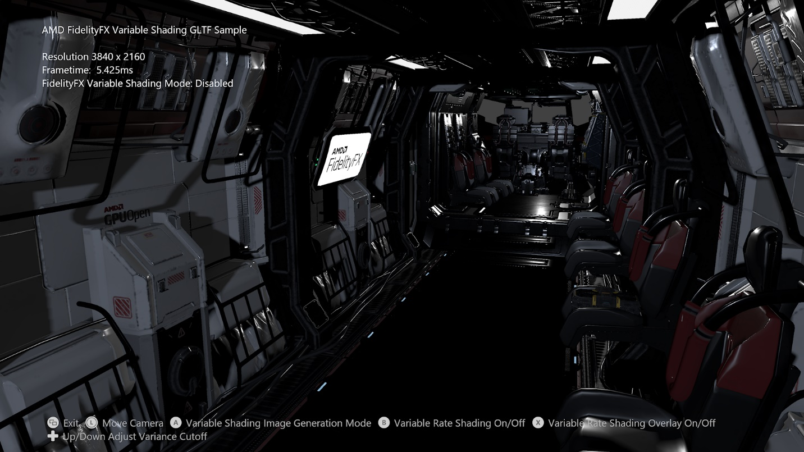
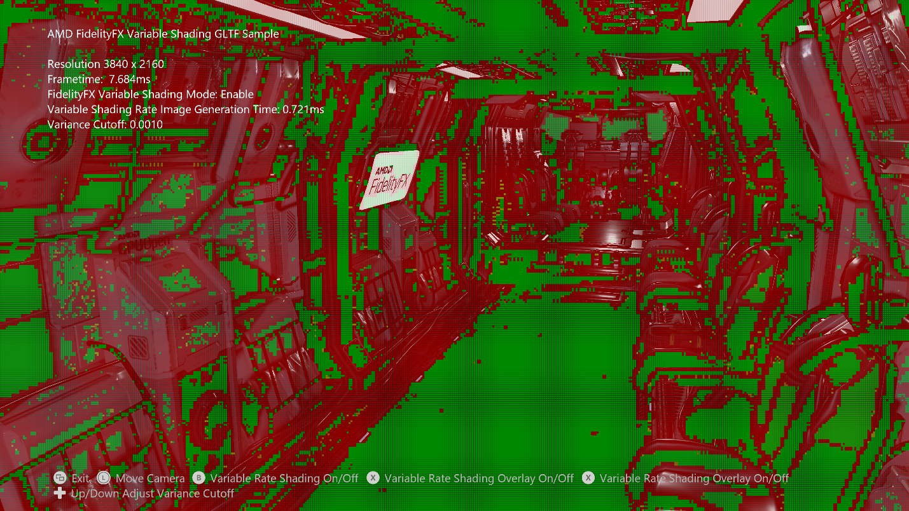

<div style="float: center"> <br/><br/><br/><br/><br/></div>

# FidelityFX 가변 셰이딩 샘플

*이 샘플은 Microsoft 게임 개발 키트와 호환됩니다(2022년 3월).*

# 설명

이 샘플은 FidelityFX 가변 음섀도잉 알고리즘을 장면에 적용하는 방법을 보여줍니다.





# 샘플 빌드

Windows 데스크톱을 사용하는 경우 활성 솔루션 플랫폼을 `Gaming.Desktop.x64`(으)로 설정합니다.

Xbox Series X|S를 사용하는 경우 활성 솔루션 플랫폼을 `Gaming.Xbox.Scarlett.x64`(으)로 설정합니다.

이 샘플은 Xbox One을 지원하지 않습니다.

*자세한 내용은* *GDK 설명서의*__ 샘플 실행을 참조하세요.__

# 샘플 사용

| 동작 | Gamepad |
|---|---|
| 주기형 음영 속도 이미지 생성 모드 | A button |
| 음영 속도 이미지 오버레이 토글 | X 버튼 |
| 뷰 회전 | 왼쪽 엄지스틱 |
| 보기 다시 설정 | 왼쪽 엄지스틱(클릭) |
| 차이 컷오프 증가/감소 | 방향 패드 위/아래 |
| 끝내기 | 보기 버튼 |

# 구현 참고 사항

FidelityFX 가변 셰이딩 기술은 후속 프레임에서 사용할 장면의 광도에 따라 셰이딩 속도 이미지를 생성합니다. 이 기술은 고해상도에서 대역폭 및 계산 요구 사항을 줄이기 위해 유사한 색 출력을 포함하는 기본 형식 표면에서 비용이 많이 드는 픽셀 셰이더 호출 빈도를 줄이는 것을 목표로 합니다.

가변 레이트 셰이딩을 사용하면 기술에서 생성한 셰이딩 속도 이미지를 사용하고 셰이딩 속도 조합기를 적절하게 설정하는 경우 렌더링된 기본 형식이 기본 형식에서 포함하는 타일에 셰이딩 속도 이미지에서 정의하는 셰이딩 속도를 사용합니다.

이 알고리즘의 추가 구현 세부 정보는 <https://gpuopen.com/fidelityfx-variable-shading/>에서, <https://github.com/GPUOpen-Effects/FidelityFX-VariableShading/blob/master/docs/FFX-VariableShading-Introduction.pdf>에서 심층 프레젠테이션을 통해 확인할 수 있습니다.

## 통합

`variance cutoff`을(를) 늘리면 알고리즘에서 낮은 셰이딩 속도에서 더 높은 셰이딩 속도로 전환하기 전에 픽셀 간 광도 변화가 증가합니다. `variance cutoff`을(를) 낮추면 셰이딩 속도가 증가하지만 `variance cutoff`을(를) 늘리면 셰이딩 속도가 감소합니다.

## CPU 쪽 설정

CPU 코드에 파일 ffx_variable_shading.h를 포함합니다.

CPU에서 다음 구조체를 채워야 합니다.

```cpp
struct FFX_VariableShading_CB
{
    uint32_t width, height; // Width and height of scene color source specified by
                            // Texture2D texColor within the shader.
    uint32_t tileSize;      // Tile size returned within
                            // D3D12_FEATURE_DATA_D3D12_OPTIONS6::ShadingRateImageTileSize.

    float varianceCutoff;   // A value between 0.0 and 1.0.
    float motionFactor;     // Currently unused.
};
```


다음 루트 서명에 대해 리소스 설명자를 적절하게 설정해야 합니다.

```cpp
#define ComputeVariableShadingRS \
    "CBV(b0, visibility=SHADER_VISIBILITY_ALL)," \
    "DescriptorTable(SRV(t0 , numDescriptors=1), visibility=SHADER_VISIBILITY_ALL)," \
    "DescriptorTable(UAV(u0, numDescriptors=1), visibility=SHADER_VISIBILITY_ALL)"
```


`b0`은(는) FFX_VariableShading_CB0 CBV 설명자에 대한 기본 셰이더 레지스터에 해당합니다.

`t0`은(는) texColor라는 장면 입력 색을 포함하는 설명자의 기본 셰이더 레지스터에 해당합니다.

`u0`은(는) imgDestination이라는 알고리즘에 의한 셰이딩 속도 이미지 출력의 UAV 설명자에 대한 기본 셰이더 레지스터에 해당합니다.

imgDestination의 예상 크기는 도우미 함수 FFX_VariableShading_GetVrsImageResourceDesc로 확인할 수 있습니다.

예상 디스패치 크기는 도우미 함수 FFX_VariableShading_GetDispatchInfo로 확인할 수 있습니다.

실행할 셰이더의 올바른 변형을 선택하는 것은 `D3D12_FEATURE_DATA_D3D12_OPTIONS6::ShadingRateImageTileSize`(Scarlett의 경우 항상 8) 및 `D3D12_FEATURE_DATA_D3D12_OPTIONS6::AdditionalShadingRatesSupported`에 따라 다릅니다.
셰이더 변형은 VRS_ImageGen_Shader_TileSize8.hlsl입니다. 참고: UI에 나열된 워크로드 타이밍은 전원 프로필로 인해 데스크톱 구성에 따라 달라질 수 있습니다. 가장 정확한 타이밍을 위해서는, PIX 아래의 프로필입니다.
| | |
|---|---|
|(Scarlett의 경우 항상 FALSE). Xbox Series X|S에서는 올바름을 의미함|


# 업데이트 기록

이 샘플은 2021년 1월에 작성되었습니다.

# 개인정보처리방침

샘플을 컴파일하고 실행하는 경우 샘플 사용량을 추적할 수 있도록 샘플 실행 파일의 파일 이름이 Microsoft에 전송됩니다. 이 데이터 수집을 옵트아웃하려면 Main.cpp에서 "샘플 사용량 원격 분석"이라는 레이블이 지정된 코드 블록을 제거할 수 있습니다.

일반적인 Microsoft의 개인 정보 정책에 대한 자세한 내용은 [Microsoft 개인정보처리방침](https://privacy.microsoft.com/en-us/privacystatement/)을 참조하세요.

# 고지 사항

여기에 포함된 정보는 정보 제공의 목적으로만 제공되며 예고 없이 변경될 수 있습니다. 이 문서를 준비하는 동안 모든 예방 조치를 취했지만 기술적인 부정확성, 누락 및 인쇄상의 오류가 포함될 수 있으며 AMD는 이 정보를 업데이트하거나 수정할 의무가 없습니다. Advanced Micro Devices, Inc.는 여기에 설명된 AMD 하드웨어, 소프트웨어 또는 기타 제품의 작동 또는 사용과 관련하여 비침해, 상품성 또는 특정 목적에의 적합성에 대한 묵시적 보증을 포함하여 이 문서 내용의 정확성 또는 완전성과 관련하여 어떠한 진술이나 보증도 하지 않으며 어떤 종류의 책임도 지지 않습니다. 묵시적이거나 금반언에 의해 발생하는 것을 포함하여 이 문서에서는 지적 재산권에 대한 라이선스를 부여하지 않습니다. AMD 제품의 구매 또는 사용에 적용되는 약관 및 제한 사항은 당사자 간의 서명된 계약 또는 AMD의 표준 판매 약관에 명시되어 있습니다.

AMD, AMD Arrow 로고, Radeon, RDNA, Ryzen 및 이들의 조합은 Advanced Micro Devices, Inc.의 상표입니다. 이 간행물에 사용된 기타 제품 이름은 식별 목적으로만 사용되었으며 해당 회사의 상표일 수 있습니다.

Windows는 미국 및/또는 기타 국가에서 Microsoft Corporation의 등록 상표입니다.

Xbox는 미국 및/또는 기타 국가에서 Microsoft Corporation의 등록 상표입니다.

© 2021 Advanced Micro Devices, Inc. All rights reserved.


