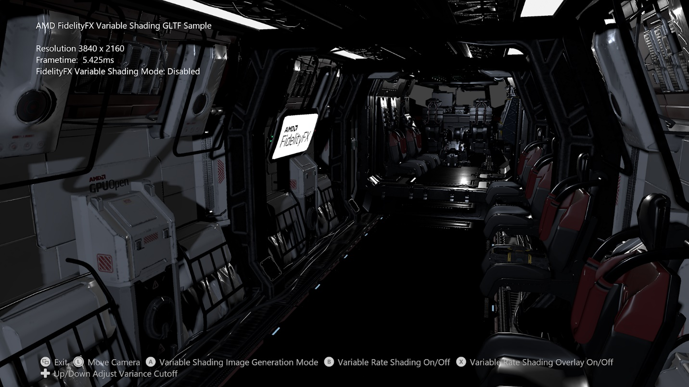

<div style="float: center"> <br/><br/><br/><br/><br/></div>

# FidelityFX 可变底纹示例

*此示例可用于 Microsoft 游戏开发工具包 (2022 年 3 月)*

# 说明

本示例展示了如何将 FidelityFX 可变底纹算法应用到场景中。




# 生成示例

如果使用 Windows 桌面，请将活动解决方案平台设置为 `Gaming.Desktop.x64`。

如果使用 Xbox Series X|S，请将活动解决方案平台设置为 `Gaming.Xbox.Scarlett.x64`。

此示例不支持 Xbox One。

*有关详细信息，请参阅 *GDK 文档中的&ldquo;&nbsp;__运行示例__*&rdquo;。*

# 使用示例

| 操作 | 游戏板 |
|---|---|
| 循环着色率图像生成模式 | A button |
| 切换着色率图像覆盖 | X button |
| 旋转视图 | 左控制杆 |
| 重置视图 | 左控制杆（单击） |
| 增加/减少方差截止时间 | 方向键上/下 |
| 退出 | &ldquo;视图&rdquo;按钮 |

# 实现说明

FidelityFX 可变底纹技术基于场景的亮度生成着色率图像，以便在后续帧中使用。 该技术旨在降低包含相似颜色输出的基元表面上昂贵像素着色器调用频率，以降低高分辨率的带宽和计算要求。

如果启用可变速率着色，则当使用该技术生成的着色率图像，并适当设置着色速率合成器时，呈现的基元将利用由基元覆盖的磁贴的着色速率图像定义的着色速率。

有关此算法的进一步实现详细信息，请访问 <https://gpuopen.com/fidelityfx-variable-shading/>，以及位于 <https://github.com/GPUOpen-Effects/FidelityFX-VariableShading/blob/master/docs/FFX-VariableShading-Introduction.pdf> 的深入解析演示文稿。

## 集成

增加 `variance cutoff` 会在算法从较低着色速率切换到较高着色速率之前，增加像素之间的亮度方差。 降低 `variance cutoff` 将提高着色速率，而增加 `variance cutoff` 会降低着色速率。

## CPU 端设置

将文件 ffx_variable_shading.h 包含在 CPU 代码中。

CPU 需要填写以下结构：

```cpp
struct FFX_VariableShading_CB
{
    uint32_t width, height; // Width and height of scene color source specified by
                            // Texture2D texColor within the shader.
    uint32_t tileSize;      // Tile size returned within
                            // D3D12_FEATURE_DATA_D3D12_OPTIONS6::ShadingRateImageTileSize.

    float varianceCutoff;   // A value between 0.0 and 1.0.
    float motionFactor;     // Currently unused.
};
```


必须为以下根签名适当设置资源描述符：

```cpp
#define ComputeVariableShadingRS \
    "CBV(b0, visibility=SHADER_VISIBILITY_ALL)," \
    "DescriptorTable(SRV(t0 , numDescriptors=1), visibility=SHADER_VISIBILITY_ALL)," \
    "DescriptorTable(UAV(u0, numDescriptors=1), visibility=SHADER_VISIBILITY_ALL)"
```


`b0` 对应于FFX_VariableShading_CB0 CBV 描述符的基着色器寄存器。

`t0` 对应于包含名为 texColor 的场景输入颜色的描述符的基本着色器寄存器。

`u0` 对应于由名为 imgDestination 的算法输出的着色速率图像的 UAV 描述符的基着色器寄存器。

imgDestination 的预期大小可由帮助程序函数 FFX_VariableShading_GetVrsImageResourceDesc 确定。

预期的调度大小可由帮助程序函数 FFX_VariableShading_GetDispatchInfo 确定。

选择要运行的着色器的正确变体取决于 `D3D12_FEATURE_DATA_D3D12_OPTIONS6::ShadingRateImageTileSize`（在 Scarlett 上始终为 8）和 `D3D12_FEATURE_DATA_D3D12_OPTIONS6::AdditionalShadingRatesSupported`
着色器变体为 VRS_ImageGen_Shader_TileSize8.hlsl。 注意：UI 上列出的工作负载计时可能因电源状况而在桌面配置上有所不同，如想获得最准确的计时，请参阅 PIX 下的状况。
| | |
|---|---|
|（在 Scarlett 上始终为 FALSE）。 在 Xbox Series X|S 上，这意味着正确的|


# 更新历史记录

此示例编写于 2021 年 1 月。

# 隐私声明

在编译和运行示例时，将向 Microsoft 发送示例可执行文件的文件名以帮助跟踪示例使用情况。 若要选择退出此数据收集，你可以删除 Main.cpp 中标记为&ldquo;示例使用遥测&rdquo;的代码块。

有关 Microsoft 的一般隐私策略的详细信息，请参阅 [Microsoft 隐私声明](https://privacy.microsoft.com/en-us/privacystatement/)。

# 免责声明

此处包含的信息仅用于信息性目的，且可能发生更改，恕不另行通知。 尽管本文档的准备工作中已采取每个预防措施，但它可能包含技术不准确、遗漏和类型错误，并且 AMD 没有义务更新或以其他方式更正此信息。 Advanced Micro Devices, Inc. 不就本文档内容的准确性或完整性做出任何表示或保证，并且不承担任何类型的责任，包括针对此处所述的 AMD 硬件、软件或其他产品的操作或使用情况的不侵权、适销性或适用性的隐含保证。 本文档不授予任何知识产权的许可，包括默示的或由禁止反言引起的许可。 双方签署的协议或 AMD 的标准销售条款和条件中规了适用于购买或使用 AMD 产品的条款和条件。

AMD、AMD 箭头徽标、Radeon、RDNA、Ryzen 及其组合是 Advanced Micro Devices, Inc. 的商标。 本出版物中使用的其他产品名称仅用于识别目的，可能是其各自公司的商标。

Windows 是 Microsoft Corporation 在美国和/或其他国家/地区的注册商标。

Xbox 是 Microsoft Corporation 在美国和/或其他国家/地区的注册商标。

© 2021 Advanced Micro Devices, Inc. 保留所有权利。


