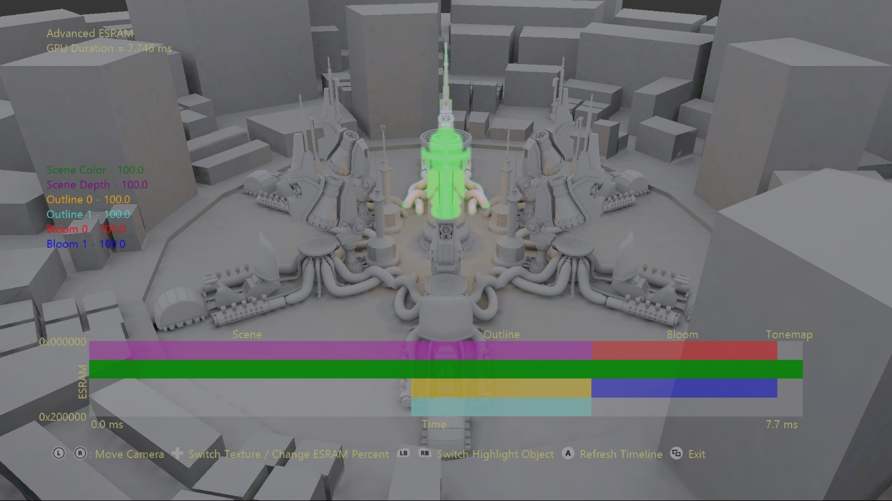
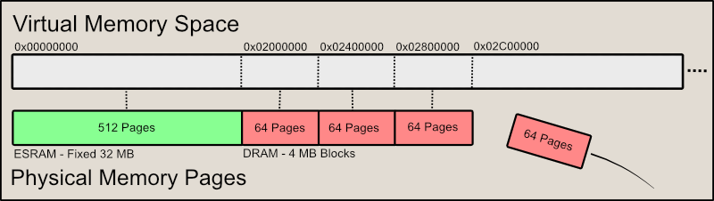
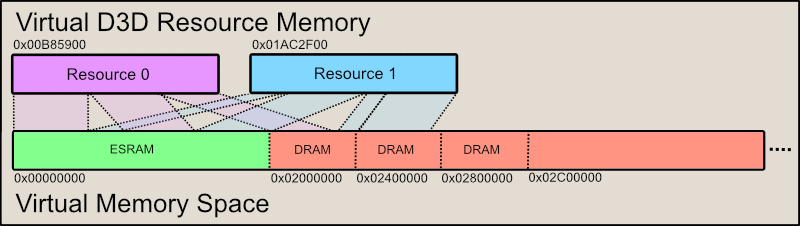

  

#   Advanced ESRAM Sample

*This sample is compatible with the Microsoft Game Development Kit (March 2022)*

# Description

This sample demonstrates the use of advanced DirectX 12.x memory
features to effectively alias memory for D3D resources. The APIs at the
core of this sample are ID3D12CommandQueue::CopyPageMappingsX and
ID3D12CommandQueue::CopyPageMappingsBatchX. These functions provide the
ability to copy CPU page table entries to the GPU TLB on the GPU
timeline allowing virtual D3D resources to be mapped to memory pages on
the fly.

This sample leverages this functionality to implement a transient
resource allocator that maps individual ESRAM & DRAM blocks at the 64 KB
page granularity. This keeps the GPU memory usage of the frame optimally
compact which is used to leverage the full capability of ESRAM. Its
interface mirrors pointed aspects of the XGMemoryLayout's page mapping
functions from the XG Memory library.

Note: Xbox One X & Xbox Series X|S don't have ESRAM. On those platforms
this sample will simply render the scene with all ESRAM options and
visualizations disabled.

# Building the sample

If using an Xbox One devkit, set the active solution platform to `Gaming.Xbox.XboxOne.x64`.

If using an Xbox Series X|S devkit, set the active solution platform to `Gaming.Xbox.Scarlett.x64`.

*For more information, see* __Running samples__, *in the GDK documentation.*

# Using the sample

The main functionality of the sample allows manipulation of where
transient texture resources are allocated. The resources used in the
frame are textures for scene color, scene depth, two for outline, and
two for bloom. The resources' ESRAM composition is displayed on the far
left as a percentage of the resource memory. A visualization of the
ESRAM layout provides immediate feedback of changes to each texture's
ESRAM & DRAM composition. The ESRAM footprint of each resource is
displayed along the Y-axis, while their lifetime is visible along the
X-axis. The GPU timings used along the temporal axis can be refreshed
with the press of a button.

## Controls

| Action                          |  Gamepad                            |
|---------------------------------|------------------------------------|
| Move camera toward/away from origin |  Left Thumbstick Up/Down |
| Orbit camera                    |  Right Thumbstick                   |
| Reset camera                    |  Right Thumbstick (Click)           |
| Cycle Transient Texture         |  D-Pad Left/Right                   |
| Change ESRAM Percentage         |  D-Pad Up/Down                      |
| Cycle Highlighted Object        |  Left/Right Bumper                  |
| Refresh Timeline                |  A Button                           |
| Exit                            |  View Button                        |

# Implementation notes

A large virtual address space is created to map blocks of 64 KB memory
pages (page pools) allocated from ESRAM and DRAM. Page pools are
registered with DirectX12 using ID3D12Device::RegisterPagePoolX, and
unregistered with ID3D12Device::UnregisterPagePoolX when no longer in
use. This mapping serves to stage CPU page table entries for directly
copying to GPU page tables.

The ID3D12CommandQueue::CopyPageMappingsX or
ID3D12CommandQueue::CopyPageMappingsBatchX functions enable page ranges
within these page pools to be mapped to specified GPU virtual addresses
on the GPU timeline. This allows virtual D3D resources to be flexibly
mapped to 64 KB physical pages on the fly. This capability makes memory
aliasing between resources trivial and a whole heap-a-fun!

Figure 1: Memory mapping paradigm used in the sample. ESRAM (if
available) is mapped to the first 32 MB of the virtual address space,
while 4 MB DRAM page pools are appended as needed.

The creation and management of page blocks is performed by the
PageAllocator class. A virtual address range is provided, and the
allocator maps page pools into this range sequentially as needed. The
page pools are then registered with DirectX12 using 'RegisterPagePoolX'.
The usage of the allocators pages is fully tracked -- it allocates pages
from first to last, replaces pages as they're released back.

The TransientCache is responsible for managing the virtual D3D
resources. These are created on demand but are cached to avoid
unnecessary overhead recreating common resources. The memory overhead of
caching these resources is effectively zero since they only allocate
virtual address space. Each resource may only be allocated once per
frame.

This TransientAllocator class uses the page allocators and transient
cache to fulfill resource requests to the user. When a resource is
requested it grabs an instance from the TransientCache. It then
allocates the required number of pages from the PageAllocators, parsing
tokens to determine whether to use ESRAM or DRAM at a page-level
granularity. The proper structures are then generated to later be
supplied to 'CopyPageMappingsBatchX', namely vectors of
D3D12XBOX_PAGE_MAPPING_BATCH and D3D12XBOX_PAGE_MAPPING_RANGE
structures.

Figure 2: Virtual resources being mapped to page ranges within the page
pools to satisfy its memory requirement. These mappings are the result
of the CopyPageMappingsX and CopyPageMappingsBatchX calls. For visual
simplicity only two resources were used in this visualization, and no
memory was aliased. However, memory aliasing is an expected benefit of
this technique.

Due to memory aliasing the TransientAllocator is also responsible for
performing shader and cache flushes where necessary. In DirectX12
flushes are inserted as part of resource barriers. Since we've
circumvented this system to perform memory aliasing we must manually
insert our own flushes. TransientAllocator determines which shader
stages and caches should be flushed by examining the resource's
associated views.

Finally, before the command list using the allocated transient resources
is submitted to its command queue, 'Finalize' must be called on the
TransientAllocator to finish the resource mapping. It's at this point
the CopyPageMappingsBatchX call is placed on the command queue, which
sets up the resources' memory mappings to be used in the subsequent
command list.

# Update history

8/6/2018 -- Sample creation.

12/17/2019 -- Port to Microsoft GDK.

# Privacy Statement

When compiling and running a sample, the file name of the sample
executable will be sent to Microsoft to help track sample usage. To
opt-out of this data collection, you can remove the block of code in
Main.cpp labeled "Sample Usage Telemetry".

For more information about Microsoft's privacy policies in general, see
the [Microsoft Privacy
Statement](https://privacy.microsoft.com/en-us/privacystatement/).
