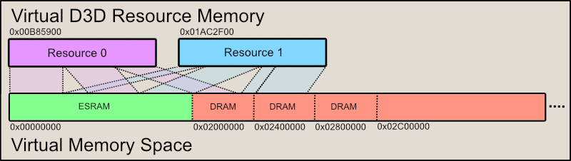

  

#   拡張 ESRAM サンプル

*\* このサンプルは、2019 年 11 月の GXDK と互換性があります。*

# 説明

このサンプルでは、DirectX 12.x の高度なメモリ機能を使用して、D3D
リソースのメモリを効果的にエイリアスする方法を示します。このサンプルの中核となる
API は、ID3D12CommandQueue::CopyPageMappingsX および
ID3D12CommandQueue::CopyPageMappingsBatchX です。これらの関数は、CPU
ページ テーブル エントリを GPU タイムラインの GPU TLB に
コピーする機能を提供し、仮想 D3D リソースをメモリ
ページに即座にマッピングできるようにします。

このサンプルでは、この機能を利用して、個々の ESRAM および DRAM
ブロックを 64 KB のページ単位でマッピングする、一時リソース
アロケーターを実装します。これにより、ESRAM
の全機能を活用するために使用されるフレームの GPU
メモリ使用量が、最適にコンパクトに保たれます。そのインターフェイスは、XG
Memory ライブラリから XGMemoryLayout のページ
マッピング関数のポイントされた側面をミラーリングします。

注: Xbox One X と Scarlett には ESRAM
がありません。これらのプラットフォームでは、このサンプルは、すべての
ESRAM オプションと視覚化を無効にしてシーンをレンダリングします。

# サンプルの使用

このサンプルの主な機能では、一時的なテクスチャ
リソースを割り当てる場所を操作できます。フレームで使用されるリソースは、シーン
カラーとシーンの深度に対するテクスチャ (アウトライン用に 2
つ、ブルーム用に 2 つ) です。リソースの ESRAM 構成は、左端にリソース
メモリの割合で表示されます。ESRAM
レイアウトを視覚化すると、各テクスチャの ESRAM と DRAM
の構成に対する変更が即座にフィードバックされます。各リソースの ESRAM
のフットプリントは Y 軸に沿って表示され、それらの存続時間は X
軸に沿って表示されます。時間軸に沿って使用される GPU
のタイミングは、ボタンを押すと更新できます。

## コントロール​​

| アクション                      |  ゲームパッド                       |
|---------------------------------|------------------------------------|
| カメラを 原点に近づける/原点から遠ざける |  左スティックの上方向/下方向 |
| カメラを回転させる              |  右スティック                       |
| カメラをリセットする            |  右スティック (クリック)            |
| 一時テクスチャを循環させる      |  方向パッドの左/右                  |
| ESRAM の割合を変更する          |  方向パッドの上/下                  |
| 強調表示 されたオブジェクトを循環させる |  左/右バンパー |
| タイムラインを更新する          |  A ボタン                           |
| 終了                            |  ビュー ボタン                      |

# 実装に関する注意事項

ESRAM および DRAM から割り当てられた 64 KB のメモリ ページ (ページ
プール)
のブロックをマッピングするために、大きな仮想アドレス空間が作成されます。ページ
プールは ID3D12Device::RegisterPagePoolX を使用して DirectX12
に登録され、使用されなくなったときに ID3D12Device::UnregisterPagePoolX
を使用して登録が解除されます。このマッピングにより、GPU ページ
テーブルに直接コピーするために CPU ページ テーブル
エントリがステージングされます。

ID3D12CommandQueue::CopyPageMappingsX または
ID3D12CommandQueue::CopyPageMappingsBatchX
関数を使用すると、これらのページ プール内のページ範囲を GPU
タイムライン上の指定された GPU
仮想アドレスにマッピングできます。これにより、仮想 D3D リソースを 64 KB
の物理ページに即座かつ柔軟にマッピングできます。この機能により、リソース間でのメモリのエイリアシングが容易になります。

図 1:このサンプルで使用されるメモリ マッピングのパラダイム。ESRAM
(使用可能な場合) は仮想アドレス空間の最初の 32 MB
にマッピングされ、必要に応じて 4 MB DRAM ページ プールが追加されます。

ページ ブロックの作成と管理は PageAllocator
クラスによって実行されます。仮想アドレス範囲が提供されます。アロケーターは、必要に応じて、ページ
プールをこの範囲に順番にマッピングします。その後、ページ プールは
'RegisterPagePoolX' を使用して DirectX12 に登録されます。アロケーター
ページの使用状況は完全に追跡されます。最初から最後までページの割り当てが行われ、ページは解放された時点で置き換えられます。

TransientCache は、仮想 D3D
リソースを管理します。これらはオンデマンドで作成されますが、共通リソースを再作成するための不必要なオーバーヘッドを避けるためにキャッシュされます。これらのリソースのキャッシュでは、仮想アドレス空間が割り当てられるだけなので、メモリのオーバーヘッドは実質的にゼロです。各リソースは、フレームごとに
1 回だけ割り当てることができます。

この TransientAllocator
クラスは、ユーザーへのリソース要求を実行するために、ページ
アロケーターと一時キャッシュを使用します。これは、リソースが要求されると、TransientCache
からインスタンスを取得します。次に、PageAllocators
から必要な数のページを割り当て、トークンを解析して、ページ
レベルの粒度で ESRAM と DRAM
のどちらを使用するかを決定します。その後、適切な構造体が生成され、後で
'CopyPageMappingsBatchX' (つまり、 D3D12XBOX_PAGE_MAPPING_BATCH と
D3D12XBOX_PAGE_MAPPING_RANGE 構造体のベクトル) に提供されます。

図 2:メモリー要件を満たすためにページ
プール内のページ範囲にマッピングされている仮想リソース。これらのマッピングは、CopyPageMappingsX
および CopyPageMappingsBatchX
呼び出しの結果です。視覚的に分かりやすくするために、この視覚化では 2
つのリソースのみが使用され、メモリはエイリアスされていません。ただし、メモリ
エイリアシングは、この技法の期待される利点です。

メモリ エイリアシングのため、TransientAllocator
は必要に応じてシェーダーとキャッシュのフラッシュも実行します。DirectX12
では、フラッシュはリソース
バリアの一部として挿入されます。ここでは、メモリ
エイリアシングを実行するためにこのシステムを回避しているため、手動で独自のフラッシュを挿入する必要があります。TransientAllocator
は、リソースの関連ビューを調べることで、どのシェーダー
ステージとキャッシュをフラッシュするかを決定します。

最後に、割り当てられた一時リソースを使用するコマンド
リストがそのコマンド キューに送信される前に、TransientAllocator で
'Finalize' を呼び出してリソース
マッピングを完了する必要があります。この時点で、CopyPageMappingsBatchX
呼び出しがコマンド キューに配置され、後続のコマンド
リストで使用されるリソースのメモリ マッピングが設定されます。

# 更新履歴

2018 年 8 月 6 日 -- サンプルの作成。

2019 年 12 月 17 日 -- GXDK および Scarlett に移植。

# プライバシーに関する声明

サンプルをコンパイルして実行すると、サンプルの使用状況の追跡のため、サンプルの実行可能ファイルのファイル名が
Microsoft に送信されます。このデータ収集を無効にするには、「Sample Usage
Telemetry」とラベル付けされた Main.cpp
内のコードのブロックを削除します。

Microsoft のプライバシーに関する声明の詳細については、「[Microsoft
のプライバシーに関する声明](https://privacy.microsoft.com/en-us/privacystatement/)」を参照してください。
