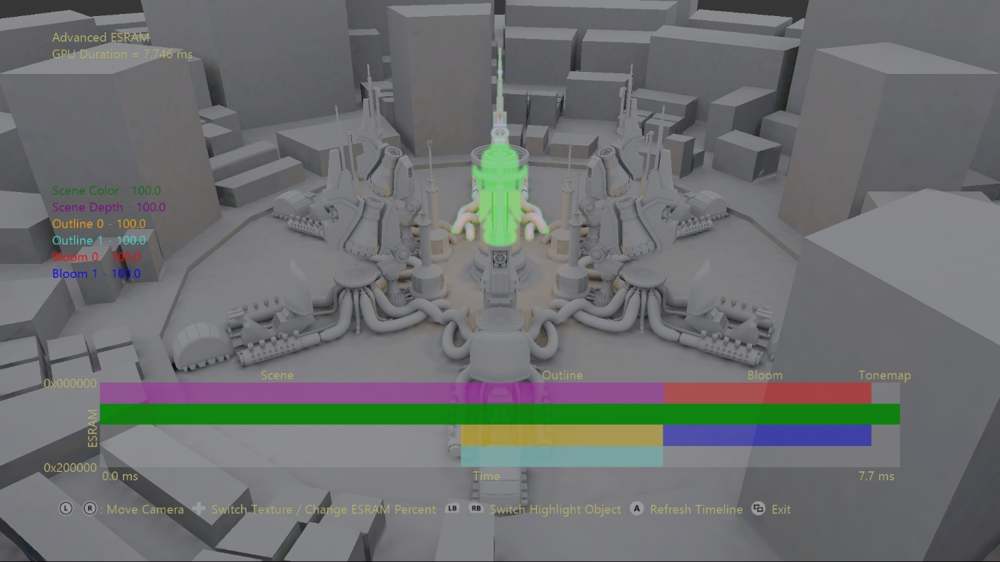
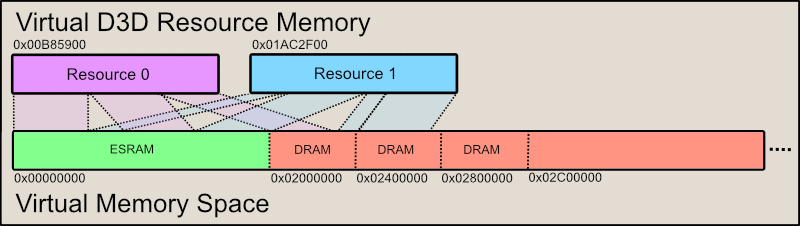

  

#   고급 ESRAM 샘플

*\* 이 샘플은 2019년 11월 GXDK와 호환됩니다.*

# 설명

이 샘플에서는 고급 DirectX 12.x 메모리 기능을 사용하여 D3D 리소스용
메모리에 효과적으로 별칭을 지정하는 방법을 보여 줍니다. 이 샘플의 핵심
API는 ID3D12CommandQueue::CopyPageMappingsX 및
ID3D12CommandQueue::CopyPageMappingsBatchX입니다. 이러한 함수는 CPU
페이지 테이블 항목을 GPU 시간 표시 막대의 GPU TLB에 복사할 수 있는
기능을 제공하여 가상 D3D 리소스를 메모리 페이지에 즉시 매핑할 수 있도록
합니다.

이 샘플에서는 이 기능을 활용하여 64KB 페이지 세분성으로 개별 ESRAM 및
DRAM 블록을 매핑하는 임시 리소스 할당자를 구현합니다. 이렇게 하면
ESRAM의 모든 기능을 활용하는 데 사용되는 프레임의 GPU 메모리 사용량이
최적의 최소 크기로 유지됩니다. 해당 인터페이스는 XG 메모리
라이브러리에서 XGMemoryLayout 페이지 매핑 함수의 지정된 측면을
미러링합니다.

참고: Xbox One X 및 Scarlett에는 ESRAM이 없습니다. 이러한 플랫폼에서 이
샘플은 모든 ESRAM 옵션 및 시각화가 해제된 상태로 장면을 간단히
렌더링합니다.

# 샘플 사용

샘플의 주요 기능을 사용하여 임시 질감 리소스가 할당되는 위치를 조작할 수
있습니다. 프레임에 사용되는 리소스는 장면 색상용 질감, 장면 깊이용 질감,
개요용 질감 2개, 블룸용 질감 2개입니다. 리소스의 ESRAM 컴퍼지션은 리소스
메모리에 대한 백분율로 맨 왼쪽에 표시됩니다. ESRAM 레이아웃을 시각화하여
각 텍스처의 ESRAM 및 DRAM 컴퍼지션에 대한 변경 관련 피드백을 즉시 표시할
수 있습니다. 각 리소스의 ESRAM 공간은 Y축을 따라 표시되고, 수명은 X축을
따라 표시됩니다. 시간 축을 따라 사용되는 GPU 시간은 단추를 눌러 새로
고칠 수 있습니다.

## 컨트롤

| 작업                            |  게임패드                           |
|---------------------------------|------------------------------------|
| 원본 쪽/반대쪽으로 카메라 이동  |  왼쪽 썸스틱을 위/아래로            |
| 카메라 궤도 조작                |  오른쪽 썸스틱                      |
| 카메라 초기화                   |  오른쪽 썸스틱(클릭)                |
| 임시 질감 순환                  |  D-패드 왼쪽/오른쪽                 |
| ESRAM 백분율 변경               |  D-패드 위/아래로                   |
| 강조 개체 순환                  |  왼쪽/오른쪽 범퍼                   |
| 시간 표시 막대 새로 고침        |  A 단추                             |
| 종료                            |  보기 단추                          |

# 구현 참고 사항

ESRAM과 DRAM에서 할당된 64KB 메모리 페이지(페이지 풀) 블록을 매핑하기
위한 대형 가상 주소 공간이 만들어집니다. 페이지 풀은
ID3D12Device::RegisterPagePoolX를 사용하여 DirectX12에 등록되고 더 이상
사용되지 않는 경우 ID3D12Device::UnregisterPagePoolX를 사용하여 등록
취소됩니다. 이 매핑은 GPU 페이지 테이블로 직접 복사하기 위해 CPU 페이지
테이블 항목을 스테이징하게 됩니다.

ID3D12CommandQueue::CopyPageMappingsX 또는
ID3D12CommandQueue::CopyPageMappingsBatchX 함수를 사용하면 이러한 페이지
풀 내의 페이지 범위가 GPU 시간 표시 막대의 지정된 GPU 가상 주소에
매핑되도록 설정됩니다. 따라서 즉시 가상 D3D 리소스를 64KB 물리적
페이지에 유연하게 매핑할 수 있습니다. 이 기능을 사용하면 리소스 간의
메모리 앨리어싱을 간단하게 수행할 수 있습니다.

그림 1: 샘플에 사용되는 메모리 매핑 패러다임. ESRAM(사용 가능한 경우)은
가상 주소 공간의 처음 32MB에 매핑되고, 4MB DRAM 페이지 풀이 필요한 만큼
추가됩니다.

페이지 블록 만들기 및 관리는 PageAllocator 클래스를 통해 수행됩니다.
가상 주소 범위가 제공되고 할당자는 필요에 따라 이 범위에 페이지 풀을
매핑합니다. 그런 다음, \'RegisterPagePoolX\'를 사용하여 DirectX12에
페이지 풀을 등록합니다. 할당자 페이지의 사용은 완전히 추적됩니다.
처음부터 마지막까지 페이지를 할당하고, 페이지의 할당이 다시 취소되면
페이지를 바꿉니다.

TransientCache는 가상 D3D 리소스의 관리를 담당합니다. 이러한 리소스는
필요할 때 생성되지만 공통 리소스를 다시 만들 때 발생하는 불필요한
오버헤드를 방지하기 위해 캐시됩니다. 이러한 리소스를 캐시하는 메모리
오버헤드는 가상 주소 공간만 할당하므로 결과적으로 0이 됩니다. 각
리소스는 프레임당 한 번만 할당될 수 있습니다.

이 TransientAllocator 클래스는 페이지 할당자와 임시 캐시를 사용하여
사용자에 대한 리소스 요청을 수행합니다. 리소스가 요청되면
TransientCache에서 인스턴스를 가져옵니다. 그런 다음, PageAllocators에서
필요한 수의 페이지를 할당하고 토큰을 구문 분석하여 페이지 수준
세분성에서 ESRAM 또는 DRAM를 사용할지를 결정합니다. 나중에
D3D12XBOX_PAGE_MAPPING_BATCH 및 D3D12XBOX_PAGE_MAPPING_RANGE 구조체의
벡터 'CopyPageMappingsBatchX'에 제공될 수 있게 적절한 구조체가
생성됩니다.

그림 2: 메모리 요구 사항을 충족하기 위해 페이지 풀 내의 페이지 범위에
매핑되는 가상 리소스가 매핑됩니다. 이러한 매핑은 CopyPageMappingsX 및
CopyPageMappingsBatchX 호출의 결과입니다. 시각적으로 간단히 표시하기
위해 이 그림에서는 2개의 리소스만 사용되었으며 메모리에는 별칭이
지정되지 않았습니다. 그러나 메모리 앨리어싱에서는 이 기법을 활용하면
유용합니다.

메모리 앨리어싱 때문에 TransientAllocator는 필요한 경우 셰이더 및 캐시
플러시를 수행해야 합니다. DirectX12에서는 리소스 장벽의 일부로 플러시가
삽입됩니다. 이 시스템에서 메모리 앨리어싱을 수행하지 못하게 했으므로
고유한 플러시를 직접 삽입해야 합니다. TransientAllocator는 리소스 관련
보기를 검토하여 플러시할 셰이더 스테이지와 캐시를 결정합니다.

마지막으로, 할당된 임시 리소스를 사용하는 명령 목록을 명령 큐로 제출하기
전에 TransientAllocator에서 \'Finalize\'를 호출하여 리소스 매핑을
완료해야 합니다. 이때 명령 큐에 CopyPageMappingsBatchX 호출이 배치되고,
후속 명령 목록에서 사용할 리소스의 메모리 매핑이 설정됩니다.

# 업데이트 기록

2018년 8월6일 -- 샘플 만들기

2019년 12월 17일 -- GXDK 및 Scarlett으로 이식

# 개인정보처리방침

샘플을 컴파일하고 실행할 때 샘플의 사용을 추적하는 데 도움이 되도록 샘플
실행 파일의 파일 이름이 Microsoft에 전송됩니다. 이 데이터 수집을
옵트아웃하려면 Main.cpp에서 \"샘플 사용 원격 분석\"이라고 레이블이
지정된 코드 블록을 제거할 수 있습니다.

Microsoft의 일반 개인정보취급방침에 대한 자세한 내용은 [Microsoft
개인정보처리방침](https://privacy.microsoft.com/en-us/privacystatement/)을
참조하세요.
