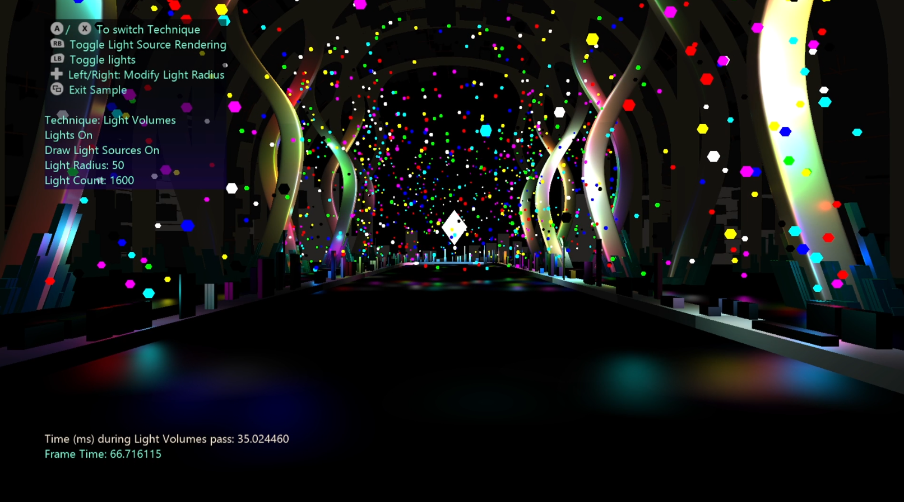

# 高级照明示例

*此示例可用于 Microsoft 游戏开发工具包 (2022 年 3 月)*

# 说明

此示例演示了在处理大量场景指示灯时提高渲染性能的各种技术。

# 生成示例

如果使用 Xbox One 开发工具包，请将活动解决方案平台设置为 `Gaming.Xbox.XboxOne.x64`。

如果使用 Xbox Series X|S，请将活动解决方案平台设置为 `Gaming.Xbox.Scarlett.x64`。

如果在电脑上运行，请将活动解决方案平台设置为 `Gaming.Xbox.Desktop.x64`。

*有关详细信息，请参阅*__运行示例__，详见*GDK 文档。*

# 控件

| 操作 | 游戏板 |
|---|---|
| 在技术之间切换 | A/B |
| 修改光的半径 | 右/左方向键 |
| 切换光 | LB |
| 切换渲染光源（彩色粒子） | RB |
| 使相机四周模式 | 用于向上移动的 LT-RT，向下向右摇杆旋转视图左摇杆以移动翻译 |
| 退出示例。 | &ldquo;视图&rdquo;按钮 |

# 实现说明

此示例演示了以下呈现技术：

- 延迟呈现

- 浅色卷

- 平铺延迟

- 群集延迟

此示例显示这些技术如何相互比较，方法是显示它们在 GPU 中花费的时间以及整个帧所用时间的计时器。

对于 Light 卷，该算法包含在渲染球体 Mesh 上，这些 Mesh 使用光的世界位置和半径在场景上定位和缩放它们。 这样，我们只在球体光栅化的像素上处理特定光。 当然，我们仍需要查看所述像素是否受光的影响（使用位置信息、光衰减和几何缓冲区提供的场景信息）。

光的音量缺点是在光栅化时多个球体重叠时出现，因为我们最终为同一像素调用多个绘图调用。

平铺延迟是解决此问题的解决方案。 我们将屏幕拆分为磁贴，然后将光绑定到这些磁贴中，而不是呈现球体，因此每个磁贴都包含影响它的所有光的列表。 然后，我们可以调度一个计算着色器，该着色器将为每个磁贴分配一个线程组，并执行所有照明计算，跳过没有光的磁贴。

平铺延迟改进了轻量卷，但仍存在一些问题。 一种情况是，由于我们正在查看哪些光会影响磁贴，因此我们可能在不影响该磁贴中的场景元素的光上浪费时间（例如，它们可能比磁贴上最远的元素更远）。 这可以通过定义深度边界来解决，因此我们只考虑场景最小深度和最大深度之间的光。 但另一个问题是深度不连续性：如果同一磁贴具有两个不同深度的对象，则即使它不影响场景中的元素，两者之间的每个光也会被包括在内。

若要解决此问题，显示的第三种方法是群集延迟。 它基本上与平铺原则相同，但它不将屏幕划分为磁贴 （2D），而是将该支流拆分为单元格（3D 群集）。 执行此操作并绑定这些群集上的指示灯，可以保存对不会影响场景中任何内容但位于其深度边界之间的光的处理。

# 说明

- 当前，轻量卷未被模糊剔除。

- 光源不受其他光源的影响，因为现在示例是。

- 如果一个磁贴上的指示灯数超过允许的最大值 （512），则会显示一些项目。 如果半径足够膨胀，则会发生这种情况。

# 更新历史记录

2022/9/26 -- 移植示例。

# 隐私声明

在编译和运行示例时，将向 Microsoft 发送示例可执行文件的文件名以帮助跟踪示例使用情况。 若要选择退出此数据收集，你可以删除 Main.cpp 中标记为&ldquo;示例使用遥测&rdquo;的代码块。

有关 Microsoft 的一般隐私策略的详细信息，请参阅 [Microsoft 隐私声明](https://privacy.microsoft.com/en-us/privacystatement/)。

