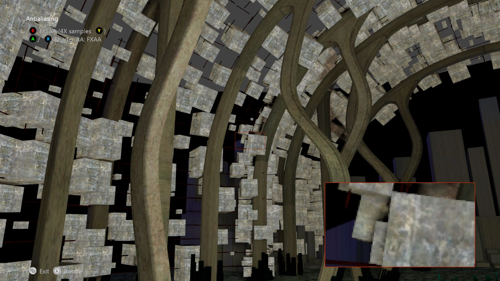

  

#   Antialiasing サンプル

*このサンプルは Microsoft Game Development Kit (2020 年 6 月)
と互換性があります。*

# 説明

# このサンプルでは、さまざまなアンチエイリアシング方法 (SMAA、SMAA2x、FXAA) を示します。

# サンプルのビルド

Xbox One 開発キットを使用している場合、アクティブ ソリューション
プラットフォームを Gaming.Xbox.XboxOne.x64 に設定します。

Xbox Series X|S 開発キットを使用している場合、アクティブ ソリューション
プラットフォームを Gaming.Xbox.Scarlett.x64 に設定します。

*詳細については、GDK
のドキュメントの*「サンプルの実行」*を参照してください。*

# サンプルの使用方法

| 操作                                  |  ゲームパッド                 |
|---------------------------------------|------------------------------|
| AA の手法の循環                       |  A ボタン/X ボタン            |
| ハードウェア AA の切り替え            |  B ボタン                     |
| MSAA 数の循環                         |  Y ボタン                     |
| SMAA エッジ検出手法の選択             |  方向パッド左、下、右方向     |
| ビューの回転                          |  左サムスティック             |
| ビューのリセット                      |  左サムスティック (クリック)  |
| 終了                                  |  ビュー ボタン                |

# 実装上の注意

このサンプルでは、アンチエイリアシングの後処理シェーダー手法を実装します。

## SMAA

SMAA アルゴリズムの詳細については、<http://www.iryoku.com/smaa/>
を参照してください。シーンがレンダリングされ、次の 3
つのパスで実行されるアルゴリズムに渡されます。

-   エッジ検出パス:これは、深度、輝度、またはカラー値を使用して実行できます。深度が最も高速に実行され、結果を向上できます。

-   ブレンドの重みパス

-   ネイバーフッド ブレンド パス

SMAA 2x の場合、シーンは最初に MSAA 2x
を使用してレンダリングされ、次に、マルチサンプルから生成されたメッシュ
レンダリングごとに上記のパスが個別に実行されます。

## FXAA

シーンをレンダリングして、シェーダーに渡します。FXAA
アルゴリズムの詳細については、<http://developer.download.nvidia.com/assets/gamedev/files/sdk/11/FXAA_WhitePaper.pdf>
を参照してください。

*DirectCompute を使用した FXAA の実装については、MiniEngine
のデモを参照してください*。

***これらの手法をタイトルに実装する場合は、ThirdPartyNotices.txt
を必ず読んでください。***

組み込みのマルチサンプリング
ハードウェアの使用の基本のデモについては、**SimpleMSAA**
サンプルを参照してください。MSAA
の詳細な説明については、**マルチサンプリング**についての説明を参照してください。

# 更新履歴

サンプルの元のバージョンは、XSF
ベースのフレームワークを使用して記述されました。2020 年 6 月に ATG
サンプル テンプレートを使用するように書き換えられました。

# プライバシーに関する声明

サンプルをコンパイルして実行する場合、サンプルの使用状況を追跡するために、サンプル実行ファイルのファイル名が
Microsoft に送信されます。このデータ
コレクションからオプトアウトするには、Main.cpp の「Sample Usage
Telemetry」というラベルの付いたコードのブロックを削除します。

全般的な Microsoft のプライバシー ポリシーの詳細については、「[Microsoft
プライバシー
ステートメント](https://privacy.microsoft.com/en-us/privacystatement/)」を参照してください。
