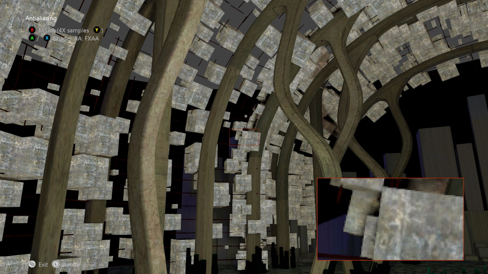

# 앤티앨리어싱 샘플

*이 샘플은 Microsoft 게임 개발 키트(2022년 3월)와 호환됩니다.*

# 설명

이 샘플은 여러 앤티앨리어싱 메서드(SMAA, SMAA2× 및 FXAA)를 보여줍니다.

# 샘플 빌드

Xbox One 개발 키트를 사용하는 경우 활성 솔루션 플랫폼을 `Gaming.Xbox.XboxOne.x64`(으)로 설정합니다.

Xbox Series X|S 개발 키트를 사용하는 경우 활성 솔루션 플랫폼을 `Gaming.Xbox.Scarlett.x64`(으)로 설정합니다.

*자세한 내용은* *GDK 설명서의* __샘플 실행을 참조하세요.__

# 샘플 사용

| 동작 | Gamepad |
|---|---|
| 주기 AA 기술 | A 단추/X 단추 |
| 하드웨어 AA 설정/해제 | B 버튼 |
| 주기 MSAA 수 | Y 버튼 |
| SMAA 에지 검색 기술 선택 | 방향 패드 왼쪽, 아래쪽, 오른쪽 |
| 뷰 회전 | 왼쪽 엄지스틱 |
| 보기 다시 설정 | 왼쪽 엄지스틱(클릭) |
| 끝내기 | 보기 버튼 |

# 구현 참고 사항

이 샘플에서는 앤티앨리어싱을 위한 후처리 셰이더 기술을 구현합니다.

## SMAA

SMAA 알고리즘은 <http://www.iryoku.com/smaa/>에 자세히 설명되어 있습니다. 장면은 렌더링되고 3번의 패스로 실행되는 알고리즘에 전달됩니다.

- 에지 검색 패스: 깊이, 루마 또는 색 값을 사용하여 수행할 수 있습니다. 깊이는 가장 빠르게 실행되며 더 나은 결과를 제공합니다.

- 혼합 가중치 패스

- 주변 혼합 패스

SMAA 2x의 경우 장면이 먼저 MSAA 2x를 사용하여 렌더링된 다음 위의 패스는 다중 샘플에서 생성된 각 메시 렌더링에 대해 별도로 실행됩니다.

## FXAA

장면을 렌더링하고 셰이더에 전달하기만 하면 됩니다. FXAA 알고리즘은 <http://developer.download.nvidia.com/assets/gamedev/files/sdk/11/FXAA_WhitePaper.pdf>에서 자세히 설명합니다.

*DirectCompute를 사용하는 FXAA 구현은 MiniEngine 데모를 참조하세요*.

***타이틀에서 이러한 기술을 구현하려면 ThirdPartyNotices.txt를 읽어야 합니다.***

기본 제공 다중 샘플링 하드웨어 사용의 기본 데모는 **SimpleMSAA** 샘플을 참조하고 MSAA에 대한 자세한 탐색은 **Multisampling**을 참조하세요.

# 업데이트 기록

샘플의 원래 버전은 XSF 기반 프레임워크를 사용하여 작성되었습니다. 2020년 6월에 ATG 샘플 템플릿을 사용하도록 다시
작성되었습니다.

# 개인정보처리방침

샘플을 컴파일하고 실행하는 경우 샘플 사용량을 추적할 수 있도록 샘플 실행 파일의 파일 이름이 Microsoft에 전송됩니다. 이 데이터 수집을 옵트아웃하려면 Main.cpp에서 "샘플 사용량 원격 분석"이라는 레이블이 지정된 코드 블록을 제거할 수 있습니다.

일반적인 Microsoft의 개인 정보 정책에 대한 자세한 내용은 [Microsoft 개인정보처리방침](https://privacy.microsoft.com/en-us/privacystatement/)을 참조하세요.

