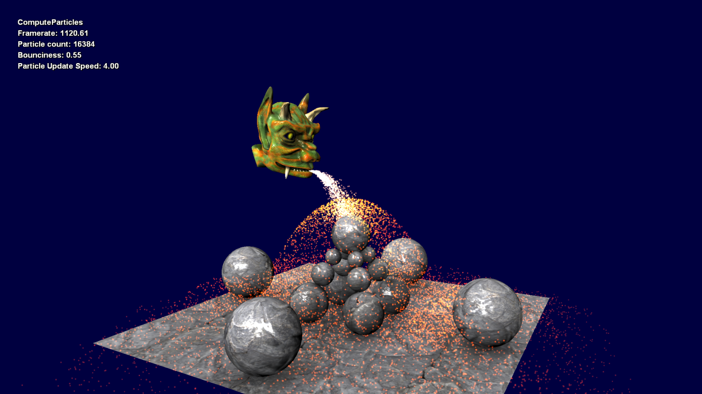

# 计算颗粒

*此示例可用于 Microsoft 游戏开发工具包 (2022 年 3 月)*

# 说明

此示例演示了如何使用计算着色器和追加缓冲区执行基本粒子模拟，表现性地呈现大量粒子。

# 生成示例

如果使用 Xbox One 开发工具包，请将活动解决方案平台设置为 `Gaming.Xbox.XboxOne.x64`。

如果使用 Xbox Series X|S 开发工具包，请将活动解决方案平台设置为 `Gaming.Xbox.Scarlett.x64`。

*有关详细信息，请参阅* __运行示例__，*在 GDK 文档中。*

# 使用示例

此示例使用以下控件。

| 操作 | 游戏板 |
|---|---|
| 退出示例。 | 选择 |
| 增大/减少粒子弹跳 | 右/左扳机键 |
| 旋转相机 | 左和右摇杆 |
| 移动粒子发射器 | 左摇杆和右摇杆 + 右肩 |
| 切换粒子呈现 | A 按钮 |
| 切换粒子更新 | B 按钮 |
| 增大/减少粒子数 | 方向键上/下 |

# 实现说明

此示例演示 D3D11 和计算着色器提供的一些更深奥和有趣的技术。 此示例有三个相关部分。 前两个与粒子的更新和剔除方式相关，第三种是常规呈现管道如何使用计算着色器阶段的结果。

1. **粒子模拟**

AdvanceParticlesCS 计算机着色器模拟阶段包含两个主要步骤。 首先，粒子位置、速度和年龄从 UAV 缓冲区读取，并在世界空间中模拟。 然后，使用暴力破解方法计算针对简化世界几何图形（地面平面和球体）的冲突。 新位置、速度和年龄将写回到同一 UAV 缓冲区，覆盖以前读取的数据。

2. **粒子剔除和写入**

将简单的平面剔除算法应用于每个粒子，以考虑它是否在视图中可见。 当粒子可见时，其位置将追加到追加缓冲区以进行呈现。

可通过使用 `ID3D12Device::CreateUnorderedAccessView(...)` API 为缓冲区资源创建无序访问视图 （UAV） 来使用追加缓冲区，将第二个资源指定为&ldquo;pCounterResource&rdquo;参数。 计数器资源必须至少为 4 个字节才能存储追加缓冲区的当前计数（一个 32 位无符号整数。） 此外，还会为计数器资源创建 UAV，以便使用 `ID3D12GraphicsCommandList::ClearUnorderedAccessViewUint(...)` API 清除每个帧的计数。 创建后，我们只需将缓冲区绑定到声明为 `AppendStructuredBuffer<...>` 的 UAV 着色器槽。

AdvanceParticlesCS 计算着色器模拟活动粒子实例并将其添加到追加缓冲区。 完成后， `ID3D12GraphicsCommandList::CopyBufferRegion(...)` API 用于将粒子计数从计数器资源复制到可用作 `ID3D12GraphicsCommandList::ExecuteIndirect(...)` API 输入的间接参数缓冲区资源。 这使我们只能绘制由 AdvanceParticlesCS 的 frustum-cull 测试所指示的可见粒子。

3. **渲染**

`ID3D12GraphicsCommandList::ExecuteIndirect(...)` API 用于调度粒子呈现。 需要使用 `ID3D12Device::CreateCommandSignature(...)` 创建的命令签名来指定 ExecuteIndirect 将调度的命令类型。 命令类型确定如何解释间接参数缓冲区的内容。 在本例中，命令类型为&ldquo;Draw&rdquo;，它与 `ID3D12GraphicsCommandList::DrawInstanced(...)` API 相关联-- 四个 32 位无符号整数。 我们将 VertexCountPerInstance 硬编码为 4，并将粒子计数复制到每个帧的 InstanceCount 位置。

顶点属性在顶点着色器中硬编码为常量查找表。 顶点 ID （SV_VertexID） 用于索引到此查找表，以访问每个顶点的属性。 实例 ID （SV_InstanceID） 用于索引到粒子实例缓冲区，以访问每个实例的属性。

# 更新历史记录

2019 年 3 月 - 从旧版 Xbox 示例框架移植到新模板。

# 隐私声明

在编译和运行示例时，将向 Microsoft 发送示例可执行文件的文件名以帮助跟踪示例使用情况。 若要选择退出此数据收集，你可以删除 Main.cpp 中标记为&ldquo;示例使用遥测&rdquo;的代码块。

有关 Microsoft 的一般隐私策略的详细信息，请参阅 [Microsoft 隐私声明](https://privacy.microsoft.com/en-us/privacystatement/)。

