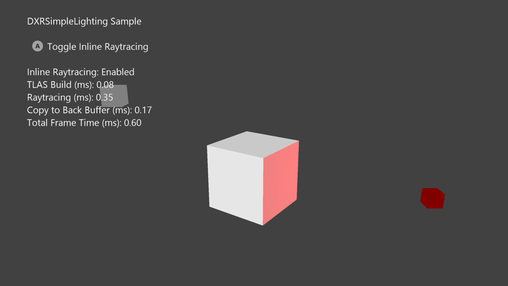

  

#   DXRSimpleLighting Sample

*\* This sample is compatible with the March 2022 Game Development Kit.*

# 

# Description

This sample, inspired by SimpleLighting from the GDK and the [D3D12RaytracingSimpleLighting](https://github.com/microsoft/DirectX-Graphics-Samples/tree/master/Samples/Desktop/D3D12Raytracing/src/D3D12RaytracingSimpleLighting)
PC demo, illustrates how the DirectX Raytracing API (DXR) can be used to light a
cube with two point lights. One of them is a static white light source, and the other glows red, rotating around a third cube placed in the center of the scene. The sample extends the basic use of shader records by
including local root arguments in addition to global root arguments. A mode that showcases the same scene rendered with inline raytracing is included.

# 

# Building the Sample

DXRSimpleLighting targets Xbox Series X and S, but not PC nor any of the Xbox One family of devices. This leaves Gaming.Xbox.Scarlett.x64 as the only possible active solution platform supported by this sample.

*For more information, see* Running samples, *in the GDK documentation.*

# Using the sample

| Action                                 |  Gamepad                     |
|----------------------------------------|------------------------------|
| Toggle Inline Raytracing Mode          |  A Button                    |
| Exit                                   |  View Button                 |

# Implementation notes

This sample employs several fundamental DXR concepts that are further elaborated on in this document. For a comprehensive overview on DXR and how raytracing differs between Xbox and PC, the GDK documentation [includes a section on raytracing](https://developer.microsoft.com/en-us/games/xbox/docs/gdk/rt-overview).

### Acceleration Structures
A single bottom-level acceleration structure (BLAS) object is built once during the sample's resource creation phase and holds geometry details (geometry type, index and vertex buffer information) for one cube. Three instance descriptions of this cube (D3D12_RAYTRACING_INSTANCE_DESC), which represent the scene's main cube and its two lights, get stored in a top-level acceleration structure (TLAS). The TLAS gets rebuilt every frame, updated with new transformation matrices for each instance, reflecting the animated positions and rotations of the larger cube and red light source.

### DXR Shaders
The three shaders used in DXRSimpleLighting can be found in raytracing.hlsl. *MyRaygenShader* traces a ray through the scene's acceleration structure for every pixel in an intermediate buffer that gets displayed by the backbuffer. Each ray is created from a pixel center, transformed from screenspace coordinates into world space, and the world space's origin. 

When the closest intersection is found for a ray within its search extents, *MyClosestHitShader* is invoked and computes a pixel color based on the intersected geometry's properties and using the diffused shading model with the scene's two lights.

If a ray does not intersect with any scene geometry after [TraceRay](https://microsoft.github.io/DirectX-Specs/d3d/Raytracing.html#traceray) is called, *MyMissShader* is run and outputs a background color.

No any-hit shaders are used in this sample.

### Resource Binding
Unlike shaders from the rasterization or compute pipelines, resources can be bound per shader, or shared amongst all DXR shaders via local and global root signatures respectively.

For DXRSimpleLighting, the global root signature stores the scene constant buffer, which is used by all three shaders. This structure holds transformation and positional data for the camera and lights, and ray extents. The local root signature points to the larger cube's constant buffer that holds an albedo value needed for the closest hit shader.

### Debugging and Other Details
To debug raytracing shaders using a GDK older than the June 2023 version, use [SetCompileTimeShaderPdbPathX
(microsoft.com)](https://developer.microsoft.com/en-us/games/xbox/docs/gdk/id3d12device8_setcompiletimeshaderpdbpathx),
which is a part of the ID3D12Device8 Interface. The generated hash is
what needs to be loaded when debugging raytracing shaders in PIX.

For simplicity, different lighting code is guarded by if statements in
the shader instead of creating new shaders with different local root
arguments.

# Known issues

# Update history

11/06/2023 -- Sample Created.
01/23/2024 -- Inline Raytracing version added to the sample.

# Privacy Statement

When compiling and running a sample, the file name of the sample
executable will be sent to Microsoft to help track sample usage. To
opt-out of this data collection, you can remove the block of code in
Main.cpp labeled "Sample Usage Telemetry".

For more information about Microsoft's privacy policies in general, see
the [Microsoft Privacy
Statement](https://privacy.microsoft.com/en-us/privacystatement/).
