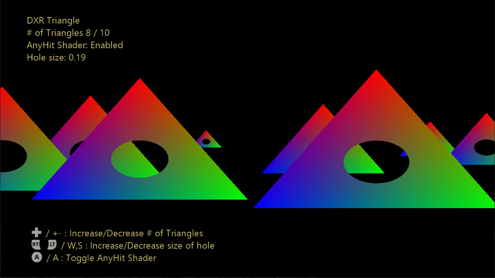

# DXR 三角形のサンプル

*このサンプルは、Microsoft Game Development Kit (2022 年 3 月) および Windows 10 (バージョン 1903) 2019 年 5 月の更新プログラムと互換性があります*

# 説明

このサンプルでは、DXR API の基本的な使用方法を示します。 レイトレーシング パイプライン状態オブジェクト (RTPSO)、シェーダー テーブル、上位レベル / 下位レベル アクセラレーション構造体が作成されます。 また、光線生成、最短衝突、任意の衝突とミス シェーダー、下位レベルのアクセラレータ構造体のインスタンスの使用も示します。

# サンプルのビルド

Project Scarlett を使用している場合は、アクティブなソリューション プラットフォームを `Gaming.Xbox.Scarlett.x64` に設定します。

適切なハードウェアと Windows 10 リリースで PC を使用する場合は、アクティブなソリューション プラットフォームを `Gaming.Deskop.x64` に設定します。

このサンプルでは、Xbox One はサポートされていません。

*詳細については、**GDK ドキュメント*の「__サンプルの実行__」 を参照してください。

# サンプルの使用方法

古典的な「SimpleTriangle」を取り、それをレイトレーシング時代に持ち込み、構成可能な数の三角形が画面を横切ってスライドします。 キーボード/ゲームパッドで A キーを押すと、Any-Hit シェーダーの使用をオンとオフを切り替えることができます。各三角形に穴を開けて、その背後にある三角形を明らかにします。

# Controls

| 操作 | ゲームパッド | キーボード |
|---|---|---|
| Any-Hit シェーダーを切り替える | A | A |
| 三角形の \# を増やす | 方向パッドの上ボタン | \+ |
| 三角形の \# を減らす | 方向パッドの下ボタン | \- |
| 穴のサイズを大きくする | 右トリガー | W |
| 穴のサイズを小さくする | 左トリガー | S |
| Exit | ビュー ボタン | Esc キー |

# 実装メモ

このサンプルは、"CreateStateObject" API を使用してレイトレーシング パイプライン状態オブジェクト (RTPSO) を作成することから始めます。 RTPSO には、Closest-Hit シェーダーと Any-Hit シェーダーで構成される 1 つの Hit-Group が含まれています。 再帰レベルやレイ ペイロード サイズなどのその他の構成プロパティも指定されます。

下位レベル速度構造体 (BLAS) は 1 つの三角形で構成され、現在選択されている三角形の数に応じて、上位レベル アクセラレーション構造体 (TLAS) に 1 ~ 10 回インスタンス化されます。 各インスタンスには、シーン内の独自の位置とサイズが指定されます。 既定では、TLAS と BLAS の両方が、PIX キャプチャに表示されるようにすべてのフレームに構築されます。このフレームを使用する必要があります。 ただし、出荷タイトルでは通常、フレームごとに TLAS をリビルドし、BLAS を長期間 (または永久に) 再利用するだけです。

レイ生成シェーダーは、Z 軸に沿って見える単純な正射投影を設定し、DispatchRays 呼び出しで起動されたスレッドごとに 1 つのレイを発射します。

ミス シェーダーは、全ての三角形を見逃して UAV に黒を書き込むすべての光線に対して呼び出されます (これは、DispatchRays 呼び出しの前に UAV を黒に事前にクリアする代わりに行われます)。

Closest-Hit シェーダーは重心座標を計算し、ピクセルの最終的な色として使用します。

Any-Hit シェーダーは、重心座標空間の三角形 (0.333、0.333、0.333) の中心までの単純な距離を計算し、距離がある程度の許容範囲より小さい場合はヒットを無視するように要求します。 その後、光線は三角形を通過し、z 軸に沿って他の三角形をさらに打つ可能性があります。

# 更新履歴

2019 年 11 月 1 日 -- サンプル作成。

# プライバシーに関する声明

サンプルをコンパイルして実行する場合、サンプルの使用状況を追跡するために、サンプルの実行可能ファイルのファイル名が Microsoft に送信されます。 このデータ コレクションからオプトアウトするには、Main.cpp の "サンプル使用状況テレメトリ" というラベルの付いたコードのブロックを削除します。

Microsoft のプライバシー ポリシー全般の詳細については、「[Microsoft のプライバシーに関する声明](https://privacy.microsoft.com/en-us/privacystatement/)」を参照してください。

