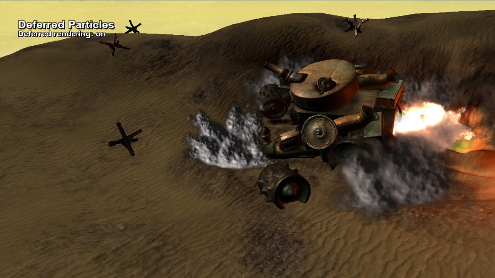

# Deferred Particles

*このサンプルは、Microsoft Game Development Kit と互換性があります (2022 年 3 月)*

# 説明

この DirectX 12 サンプルは、点灯した煙のパーティクルを順方向または遅延方式でレンダリングする方法を示しています。 遅延パスを使用すると、各パーティクルの通常の不透明度、色が遅延バッファーに蓄積されます。 結果は点灯し、最終的なパスでは元のシーンに合成されます。

# サンプルのビルド

Xbox One 開発キットを使用している場合は、アクティブなソリューション プラットフォームを `Gaming.Xbox.XboxOne.x64` に設定します。

Xbox Series X|S 開発キットを使用している場合は、アクティブ ソリューション プラットフォームを `Gaming.Xbox.Scarlett.x64` に設定します。

*詳細については、**GDK ドキュメント*の「__サンプルの実行__」を参照してください。

# サンプルの使用方法

このサンプルでは、次のコントロールを使用します。

| 操作 | ゲームパッド |
|---|---|
| サンプルを終了する | 選択 |
| カメラを移動する | 左スティックと右スティック |
| 順方向/遅延の切り替え | [A] ボタン |
| シミュレーションの一時停止 | [X] ボタン |

# 実装メモ

パーティクル シミュレーション自体は CPU で実行されます。 結果として得られるパーティクルの位置は、レンダリングのために各フレームの GPU メモリにコピーされます。 メモリは、CPU 書き込み可能な GPU 読み取り可能なアップロード ヒープにコミットされた一時的な D3D12 リソース内からサブ割り当てられます。 このメモリへの GPU 仮想アドレスは、`D3D12_VERTEX_BUFFER_VIEW` と `ID3D12GraphicsCommandList::IASetVertexBuffers(...)` を使用して頂点バッファーとして直接参照されます。

2 つのレンダリング モード (順方向と遅延) を使用できます。 順方向パスでは、パーティクルがシーンに直接レンダリングされます。 遅延パスのパーティクル データに従うと、通常のマップと不透明度/カラー マップの 2 つの遅延バッファーに累積されます。 パーティクル レンダリングが完了すると、これらの遅延バッファーを使用してパーティクルを点灯させ、それらをメイン シーンに合成し直します。

パーティクルはシーン ライト (単一の方向ライト) によって点灯するだけでなく、爆発自体の中のポイント ライトによって点灯します。 これらのポイント ライトは無方向性であるため、パーティクルに対する照明の貢献度は、向きではなく、距離に対する 2 次フォールオフに基づいています。

# 更新履歴

2019 年 4 月 -- 従来の Xbox サンプル フレームワークから新しいテンプレートに移植します。

# プライバシーに関する声明

サンプルをコンパイルして実行する場合、サンプルの使用状況を追跡するために、サンプルの実行可能ファイルのファイル名が Microsoft に送信されます。 このデータ コレクションからオプトアウトするには、Main.cpp の "サンプル使用状況テレメトリ" というラベルの付いたコードのブロックを削除します。

Microsoft のプライバシー ポリシー全般の詳細については、「[Microsoft のプライバシーに関する声明](https://privacy.microsoft.com/en-us/privacystatement/)」を参照してください。

