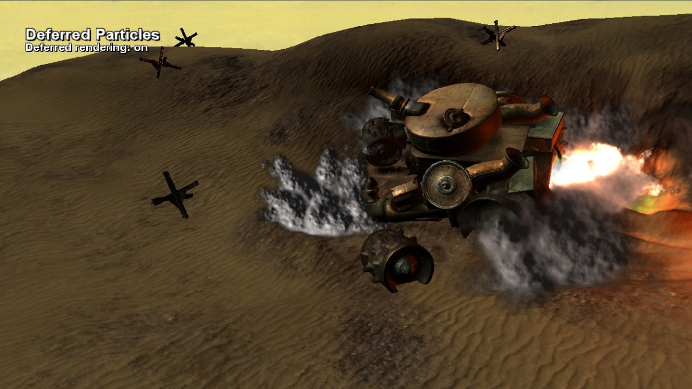

  

#   지연 파티클

*이 샘플은 Microsoft 게임 개발 키트 미리 보기(2019년 11월)와
호환됩니다.*

# 설명

이 D3D12 샘플에서는 정방향 또는 지연 방식으로 밝은 연기 파티클을
렌더링하는 방법을 보여 줍니다. 지연 경로를 활용하는 경우 각 파티클의
표준, 불투명도 및 색상이 지연 버퍼로 누적됩니다. 결과는 밝게 나타낸 후
마지막 패스의 원래 장면에 합성됩니다.

# 샘플 빌드

Xbox One 개발 키트를 사용하는 경우 활성 솔루션 플랫폼을
Gaming.Xbox.XboxOne.x64로 설정하세요.

Project Scarlett을 사용하는 경우 활성 솔루션 플랫폼을
Gaming.Xbox.Scarlett.x64로 설정하세요.

*자세한 내용은 GDK 문서에서* 샘플 실행하기*를 참조하세요.*

# 샘플 사용하기

이 샘플은 다음 컨트롤을 사용합니다.

| 작업                            |  게임패드                           |
|---------------------------------|------------------------------------|
| 샘플 종료                       |  선택                               |
| 카메라 이동                     |  왼쪽/오른쪽 스틱                   |
| 정방향/지연 토글                |  \"A\" 단추                         |
| 시뮬레이션 일시 중지            |  \"X\" 단추                         |

# 

# 

# 구현 참고 사항

파티클 시뮬레이션 자체는 CPU에서 수행됩니다. 결과 파티클 위치는 렌더링을
위해 각 프레임의 GPU 메모리에 복사됩니다. 메모리 일부는 GPU 쓰기 가능,
GPU 읽기 가능인 업로드 힙에 커밋된 임시 D3D12 리소스 내에서 할당됩니다.
이 메모리에 대한 GPU 가상 주소는 D3D12_VERTEX_BUFFER_VIEW 및
ID3D12GraphicsCommandList::IASetVertexBuffers(...)를 사용하여 정점
버퍼로 직접 참조됩니다.

두 가지 렌더링 모드인 정방향 및 지연을 사용할 수 있습니다. 정방향 경로
파티클는 장면에 직접 렌더링됩니다. 지연 경로를 따르면 파티클 데이터가
표준 맵과 불투명/색 맵의 두 가지 지연 버퍼로 누적됩니다. 파티클 렌더링이
완료되면 이러한 지연 버퍼를 사용하여 파티클을 밝게 한 후 주 장면에 다시
합성합니다.

파티클은 장면 광원(단방향 광원) 뿐만 아니라 폭발 자체 내의 점 광원을
통해서도 밝게 켜집니다. 이러한 점 광원은 방향성이 없으므로 파티클에 대한
조명 기여도는 방향이 아니라 거리에 대한 이차 대칭을 기준으로 합니다.

# 업데이트 기록

2019년 4월 -- 기존 Xbox 샘플 프레임워크에서 새 템플릿으로 포팅.

# 개인정보처리방침

샘플을 컴파일하고 실행할 때 샘플의 사용을 추적하는 데 도움이 되도록 샘플
실행 파일의 파일 이름이 Microsoft에 전송됩니다. 이 데이터 수집을
옵트아웃하려면 Main.cpp에서 \"샘플 사용 원격 분석\"이라고 레이블이
지정된 코드 블록을 제거할 수 있습니다.

Microsoft의 일반 개인정보취급방침에 대한 자세한 내용은 [Microsoft
개인정보처리방침](https://privacy.microsoft.com/en-us/privacystatement/)을
참조하세요.
