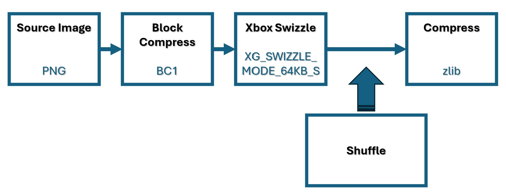
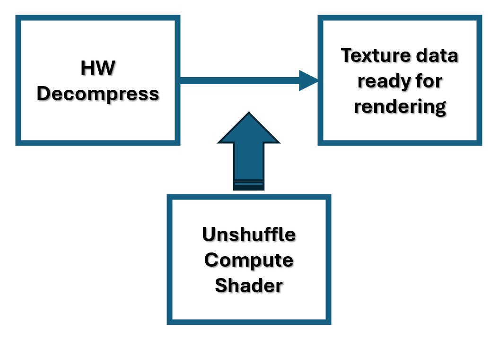

# DirectStorage Texture Shuffling sample

*This sample is compatible with the Microsoft Game Development Kit (March 2024)*

# Description

DirectStorage on Xbox Series X|S provides several special swizzle modes that are compatible with the memory decompression unit (MDU). These modes are designed to provide additional file size savings for compressed texture data when used in conjunction with BCPACK or ZLib based compression.

This sample demonstrates how to use these DirectStorage swizzle modes together with shuffling (deinterleaving) the data of BC1, BC3, BC4 and BC5 textures in specific ways to improve ZLib compression. The sample consists of an offline tool to prepare the texture data, and runtime code with compute shaders to unshuffle the texture data. We've seen up to 10% file size savings using this method.

Disk space savings for the textures in this sample using 4096 x 4096 textures:

| BCn | zlib compressed | Shuffled and zlib compressed |
|-----|-----------------|------------------------------|
| BC1 | 5.9 MB          | 5.1 MB                       |
| BC3 | 4.0 MB          | 3.2 MB                       |
| BC4 | 6.2 MB          | 5.9 MB                       |
| BC5 | 16.1 MB         | 15.2 MB                      |

# Building the sample

This sample is only supported for Xbox Series X|S using `Gaming.Xbox.Scarlett.x64`.

*For more information, see* __Running samples__, *in the GDK documentation.*

# Using the sample

The sample uses the following controls.

| Action                                    |  Gamepad                  |
|-------------------------------------------|---------------------------|
| Exit the sample                           |  View Button              |

# Implementation notes

**Documentation**

For detailed information about DirectStorage Shuffling, refer to the following documentation:

DirectStorage Shuffle Formats: 
- <https://learn.microsoft.com/en-us/gaming/gdk/_content/gc/system/overviews/directstorage/directstorage-shuffles>

Optimizing compressed content by using DirectStorage and XBTC:
- <https://learn.microsoft.com/en-us/gaming/gdk/_content/gc/system/overviews/directstorage/directstorage-compression>

**Shuffle texture data offline**

The offline tool to create new shuffled textures can be found in the Visual Studio project *.\ShuffleTextures\ShuffleTextures.vcxproj*.

This is a command line tool that takes in four file names as input to shuffle and save a BC1, BC3, BC4 and BC5 texture. The sample ships with four already prepared textures that can be found in the folder *.\Assets\Textures*

The following describes the flow of data

1) Convert a source image, e.g. png or jpg, to a block compressed texture format, e.g. BC1, using the *DirectXTex toolkit*.
2) Swizzle the block compressed data to an Xbox native texture tiling mode using the APIs *XGCreateTexture2DComputer()* and *CopyIntoSubresource()*
3) Shuffle (deinterleave) the data using the API *XGShuffleTextureBufferForDirectStorage*
4) Compress the shuffled texture data using the *zlib* library

**Unshuffle texture data at runtime**

At runtime, the texture data needs to be unshuffled to be usable by the GPU. The MDU decompresses the data, but can also partly unshuffle the data, let's call it macro-unshuffling. A compute shader running on the async compute queue is used to do the final micro-unshuffle. This shader processes the data in-place, therefore no intermediate memory buffers are required. These shaders can be found in the folder *.\Shaders*

# Update history

Initial release Aril 2025

# Privacy Statement

When compiling and running a sample, the file name of the sample
executable will be sent to Microsoft to help track sample usage. To
opt-out of this data collection, you can remove the block of code in
Main.cpp labeled "Sample Usage Telemetry".

For more information about Microsoft's privacy policies in general, see
the [Microsoft Privacy
Statement](https://privacy.microsoft.com/en-us/privacystatement/).
