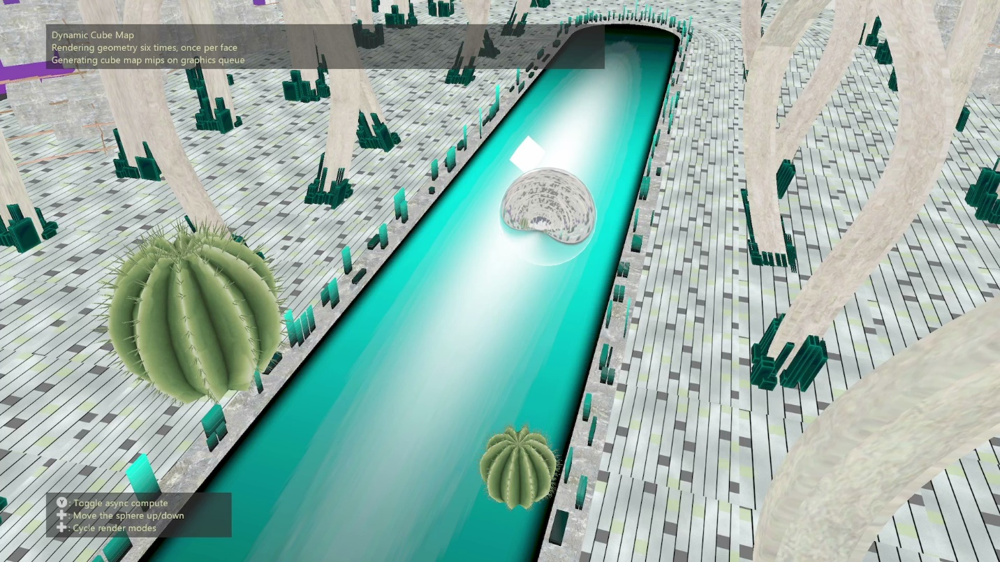

# DynamicCubeMap 샘플

*이 샘플은 Microsoft 게임 개발 키트(2022년 3월)와 호환됩니다.*

# 설명

이 샘플에서는 기하 도형 셰이더, 인스턴스화 및 메시 셰이더를 비롯한 다양한 렌더링 메서드를 사용하여 런타임에 큐브맵으로 렌더링하는 방법을 보여 줍니다.

# 샘플 빌드

Xbox One 개발 키트를 사용하는 경우 활성 솔루션 플랫폼을 `Gaming.Xbox.XboxOne.x64`(으)로 설정합니다.

Xbox Series X|S를 사용하는 경우 활성 솔루션 플랫폼을 `Gaming.Xbox.Scarlett.x64`(으)로 설정합니다.

*자세한 내용은* *GDK 설명서의* __샘플 실행을__ 참조하세요.&nbsp;

# 샘플 사용

왼쪽 및 오른쪽 엄지스틱을 사용하여 카메라를 장면 주위로 이동할 수 있습니다. 방향 패드로 반사 구체를 위아래로 움직일 수 있습니다. 왼쪽 및 오른쪽 방향 패드 단추는 렌더링 모드를 순환합니다. Y 단추는 비동기 컴퓨팅을 켜고 끕니다.

# 컨트롤

| 동작 | Gamepad |
|---|---|
| 비동기 컴퓨팅 켜기/끄기 | Y 버튼 |
| 구체를 위/아래로 이동 | 방향 패드 위/아래 |
| 렌더링 모드 변경 | 방향 패드 왼쪽/오른쪽 |
| 카메라 이동 | 왼쪽 엄지스틱 |
| 카메라 회전 | 오른쪽 엄지스틱 |

# 구현 참고 사항

이 샘플에서는 런타임에 큐브맵으로 장면 기하 도형을 동적으로 렌더링하는 4가지 방법을 보여줍니다.

1. 루프: 장면 기하 도형에 대한 그리기 호출은 적절한 변환 행렬을 사용하여 각 반복 렌더링이 큐브맵의 다른 면에 렌더링되는 루프로 제출됩니다.

2. 기하 도형 셰이더: 기하 도형은 한 번 제출되고, 기하 도형 셰이더의 각 큐브맵 면에 증폭됩니다. 기하 도형 셰이더는 각 큐브맵 면 위로 반복되며, SV_RenderTargetArrayIndex를 사용하여 변형된 기하 도형을 적절한 큐브맵 면으로 보냅니다.

3. 인스턴스화: 기하 도형은 인스턴스 수 6을 사용하여 한 번 제출됩니다. 꼭짓점 셰이더에서 SV_InstanceID는 적절한 변환 행렬을 선택하고, SV_RenderTargetArrayIndex를 사용하여 해당 큐브맵 면에 기하 도형을 할당하는 데 사용됩니다.

4. 메시 셰이더(Scarlett만 해당): 기하 도형은 한 번 제출되고, 증폭 셰이더를 사용하여 각 큐브맵 면에 대한 기하 도형을 복제합니다. 또한 증폭 셰이더는 메시렛 수준에서 컬링을 실행하므로, 메시 셰이더에는 특정 큐브맵 면에 표시되는 메시렛만 전송됩니다. 메시 셰이더는 기하 도형을 변환하고 SV_RenderTargetArrayIndex를 사용하여 적절한 큐브맵 면으로 보냅니다.

기하 도형을 큐브맵에 렌더링한 후 샘플은 컴퓨팅 셰이더를 사용하여 큐브맵에 대한 밉맵 체인을 만듭니다. 비동기 컴퓨팅 모드를 사용하는 경우, 밉 생성은 큐브맵을 사용하지 않는 장면의 일부를 렌더링하는 것과 동시에 비동기 컴퓨트 대기열에서 밉 생성이 이루어집니다.

큐브맵 밉을 생성한 후, 샘플은 큐브맵 텍스처에서 샘플링하는 반사 구체를 렌더링합니다.

# 알려진 문제

일부 기하 도형이 사라지게 하는 증폭 셰이더가 있는 Scarlett 드라이버 버그가 있습니다.

기하 도형에 작은 삼각형 여러 개가 누락되는 Scarlett 드라이버 버그가 있습니다.

2023년 3월 GDK에서 이러한 드라이버 버그가 수정되어 이전 GDK 버전에서는 메시 셰이더 및 기하 도형 셰이더 구현이 비활성화됩니다.

# 업데이트 기록

샘플의 원래 버전은 XSF 기반 프레임워크를 사용하여 작성되었습니다. 2023년 1월에 ATG 샘플 템플릿을 사용하도록 다시 작성되었으며, 렌더링 방법으로 메시 셰이더에 대한 지원도 추가되었습니다.

# 개인정보처리방침

샘플을 컴파일하고 실행하는 경우 샘플 사용량을 추적할 수 있도록 샘플 실행 파일의 파일 이름이 Microsoft에 전송됩니다. 이 데이터 수집을 옵트아웃하려면 Main.cpp에서 "샘플 사용량 원격 분석"이라는 레이블이 지정된 코드 블록을 제거할 수 있습니다.

일반적인 Microsoft의 개인 정보 정책에 대한 자세한 내용은 [Microsoft 개인정보처리방침](https://privacy.microsoft.com/en-us/privacystatement/)을 참조하세요.

