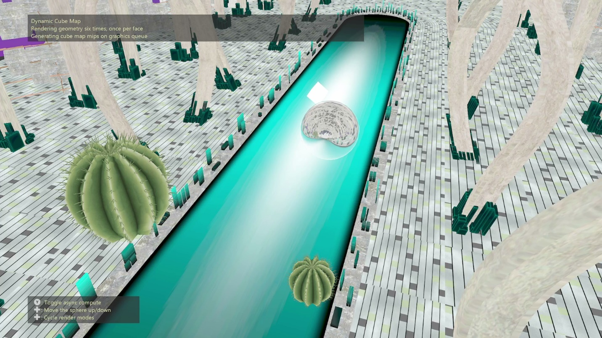

# DynamicCubeMap 示例

*此示例可用于 Microsoft 游戏开发工具包（2022 年 3 月）*

# 说明

此示例演示如何在运行时使用各种呈现方法（包括几何着色器、实例化和网格着色器）呈现到多维数据集映射。

# 生成示例

如果使用 Xbox One 开发工具包，请将活动解决方案平台设置为 `Gaming.Xbox.XboxOne.x64`。

如果使用 Xbox Series X|S，请将活动解决方案平台设置为 `Gaming.Xbox.Scarlett.x64`。

*有关详细信息，请参阅* __运行示例__，*在 GDK 文档中。*

# 使用示例

左右控制杆可用于在场景中移动相机。 方向键可以上下移动反射球体。 左右方向键按钮可循环呈现模式。 Y 按钮可打开和关闭异步计算。

# 控件

| 操作 | 游戏板 |
|---|---|
| 打开/关闭异步计算 | Y button |
| 向上/向下移动球体 | 方向键向上/向下 |
| 更改呈现模式 | 方向键向左/向右 |
| 移动相机 | 左控制杆 |
| 旋转相机 | 右控制杆 |

# 实现说明

此示例演示了在运行时动态地将场景几何图形呈现为立方体贴图的 4 种方法。

1. 循环：场景几何图形的绘制调用在循环中提交，每次迭代使用适当的转换矩阵呈现到立方体贴图的不同面。

2. 几何图形着色器：几何图形提交一次，并放大到几何图形着色器中立方体贴图的每个面。 几何图形着色器在立方体贴图的每个面上循环，并使用SV_RenderTargetArrayIndex 将转换后的几何图形发送到立方体贴图的相应的面。

3. 实例化：使用实例计数 6 提交几何图形一次。 在顶点着色器中，SV_InstanceID 用于选择适当的转换矩阵，并使用 SV_RenderTargetArrayIndex 将几何图形分配给立方体贴图的相应的面。

4. 网格着色器（仅限 Scarlett）：几何图形提交一次，并使用放大着色器为立方体贴图的每个面复制几何图形。 放大着色器还会在 meshlet 级别执行剔除，因此只有在特定立方体贴图面中可见的 meshlet 才会发送到网格着色器。 网格着色器会转换几何图形，并使用 SV_RenderTargetArrayIndex 将其发送到立方体贴图的相应的面。

将几何图形呈现到立方体贴图后，示例使用计算着色器为立方体贴图创建 mipmap 链。 使用异步计算模式时，将在异步计算队列上生成 mip，同时呈现不使用立方体贴图的场景部分。

生成立方体贴图 mip 后，示例呈现从立方体贴图纹理采样的反射球体。

# 已知问题

放大着色器有一个 Scarlett 驱动程序 bug，导致某些几何图形消失。

几何着色器有一个 Scarlett 驱动程序 bug，导致几个小三角形缺失。

这些驱动程序 bug 已在 2023 年 3 月的 GDK 中修复，因此网格着色器和几何图形着色器实现在以前的 GDK 版本中被禁用。

# 更新历史记录

示例的原始版本是使用基于 XSF 的框架编写的。 它在 2023 年 1 月重写为使用 ATG 示例模板，还添加了对网格着色器作为呈现方法的支持。

# 隐私声明

在编译和运行示例时，将向 Microsoft 发送示例可执行文件的文件名以帮助跟踪示例使用情况。 若要选择退出此数据收集，你可以删除 Main.cpp 中标记为&ldquo;示例使用遥测&rdquo;的代码块。

有关 Microsoft 的一般隐私策略的详细信息，请参阅 [Microsoft 隐私声明](https://privacy.microsoft.com/en-us/privacystatement/)。

