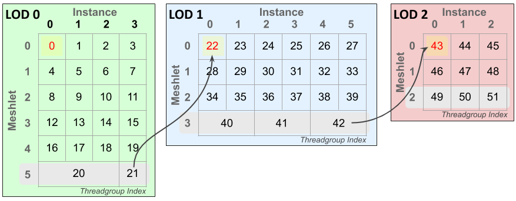

  

#   Dynamic LOD Sample

*This sample is compatible with the Microsoft Game Development Kit
(March 2022) and Windows 10 (Version 2004) May 2020 Update*

# Description

This sample demonstrates how to leverage amplification shaders to do
per-instance frustum culling and mesh level-of-detail (LOD) selection
entirely on the GPU for an arbitrary number of instances. Using the mesh
shader pipeline this technique fits neatly into a single amplification &
mesh shader pipeline state object.

# Building the sample

If using Project Scarlett, set the active solution platform to `Gaming.Xbox.Scarlett.x64`.

If using PC with appropriate hardware and Windows 10 release, set the
active solution platform to `Gaming.Deskop.x64`.

This sample does not support Xbox One.

*For more information, see* __Running samples__, *in the GDK documentation.*

# Using the sample

Use standard controls to drive the camera around. Tinker with
visualization modes and the method in which instances are extrapolated.
Observe the effect instance frustum culling and LOD selection has on the
GPU by disabling culling or forcing LOD choice to level 0 (most
detailed).

# Controls

| Action                       |  Gamepad          |  Keyboard          |
|------------------------------|------------------|-------------------|
| Move Camera  |  Left Thumbstick  |  WASD or Arrow Keys              |
| Rotate Camera                |  Right Thumbstick |  Hold LMB + Mouse  |
| Reset camera  |  Right Thumbstick (Push) |  \- |
| Change Instancing Mode       |  A                |  Tab               |
| Change Render Mode           |  X                |  Spacebar          |
| Change Instancing Level  |  Right Shoulder & Trigger |  +/- |
| Toggle Force LOD 0           |  Y                |  Left Shift        |
| Toggle Culling               |  B                |  Left Control      |
| Exit                         |  View Button      |  Escape            |

# Implementation notes

The amplification shader stage precedes the mesh shader stage in the
mesh shader pipeline. It's a compute-like shader stage whose purpose is
to determine the outstanding geometric workload, populate a payload
buffer of data, and launch the requisite number of mesh shader
threadgroups to process geometry.

CPU-side code generates instances by user input and uploads the instance
buffer to a GPU resource. An array of mesh LODs populate a descriptor
table for shader code to dynamically index into by LOD index. The
amplification shader (AS) is configured to have a group size of one
shader wave -- this avoids the necessity of wave synchronization and
memory barriers. The CPU dispatches enough AS waves to schedule one
instance per thread.

Each thread of the AS threadgroup processes a single instance - culling
against the view frustum and doing an LOD calculation. LOD instance
counts are taken and reorganized using wave intrinsics to generate
payload data for the dispatched mesh shaders (figure 2, left). This
consists of a few different per-LOD instance counts, offsets, and
instance index lists. The total number of meshlets to render determines
the number of mesh shader threadgroups to dispatch using the
DispatchMesh amplification shader intrinsic function.

Figure : Example indexing layout of mesh shader threadgroups across
instances and meshlets. In this scenario four instances are LOD 0, six
instances LOD 1, and three instances LOD 2 requiring 52 mesh shader
threadgroups. The last meshlet of each LOD (highlighted gray) may pack
multiple instances into a single mesh shader threadgroup -- its vertex &
primitive count allowing. The yellow highlighted cells are the first
threadgroup for each LOD, the red value is the global offset of each LOD
level -- this must be subtracted off the threadgroup index to determine
the threadgroup's LOD index. Arrows are to show continuation of
threadgroup IDs across LOD boundaries.

Figure : The payload data (left) passed from each Amplification Shader
threadgroup to its dispatched Mesh Shader threadgroups (example
threadgroup on right.) Using the threadgroup's index the shader can
compute the LOD, meshlet index, and instance index for which it should
process. Group size is the number of threads in a threadgroup, and
meshlet size is the max of a meshlet's vertex and primitive count.

The mesh shader is a simple meshlet rendering shader, but with code to
compute its LOD, meshlet, and instance indices using the payload data.
Meshlet and vertex data is read by indexing into SRV arrays by LOD
index. Multiple instances may be processed in a single threadgroup if
it's the last meshlet of an LOD level to maximum threadgroup
utilization.

# Known Issues

Disabling optimizations (-Od) causes InstancedLodMS.hlsl to be broken on
PC. This is due to a bug in the shader compiler (dxc.exe) in the version
that ships with the Windows SDK (10.0.19041.) This issue has since been
fixed in the latest release available on
[GitHub](https://github.com/microsoft/DirectXShaderCompiler).

# Update history

4/20/2020 -- Sample creation.

4/28/2020 - Updated to use the D3DX12 helpers for mesh shader pipeline
creation

9/2/2021 -- Added note about being broken on PC when disabling
optimizations using Windows SDK dxc

# Privacy Statement

When compiling and running a sample, the file name of the sample
executable will be sent to Microsoft to help track sample usage. To
opt-out of this data collection, you can remove the block of code in
Main.cpp labeled "Sample Usage Telemetry".

For more information about Microsoft's privacy policies in general, see
the [Microsoft Privacy
Statement](https://privacy.microsoft.com/en-us/privacystatement/).
