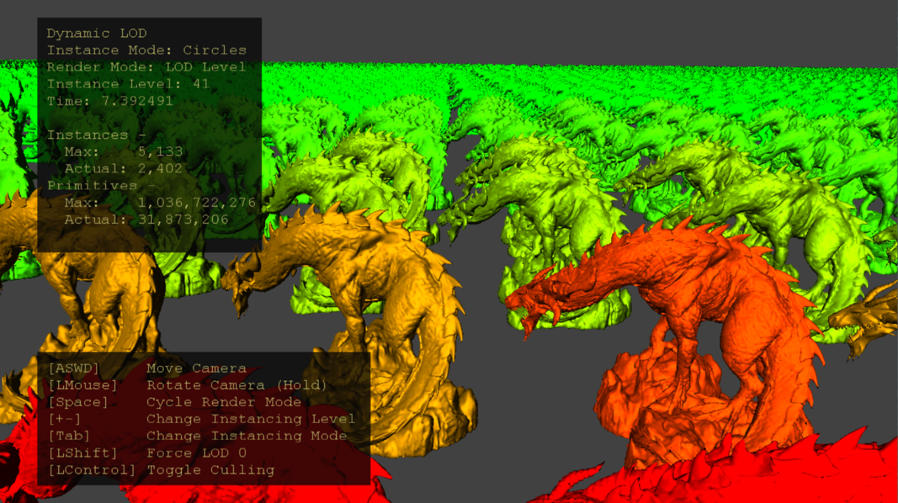
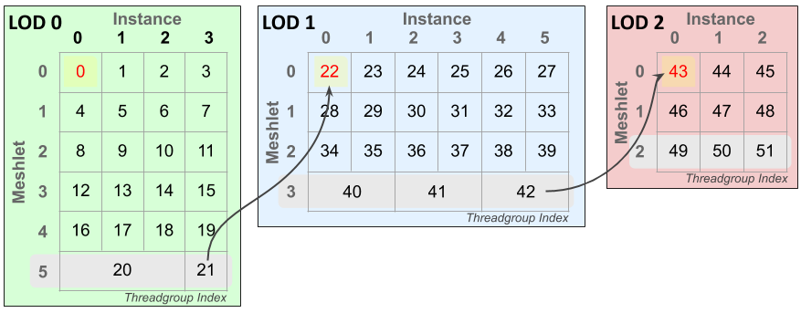
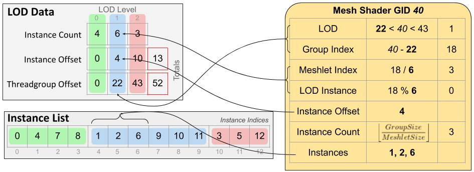

  

#   동적 LOD 샘플

*이 샘플은 Microsoft 게임 개발 키트(2020년 6월) 및 Windows 10(버전 2004)
2020년 5월 업데이트와 호환됩니다.*

# 설명

이 샘플은 증폭 셰이더를 활용하여 임의 수의 인스턴스에 대해 GPU에서
인스턴스별 절두체 컬링 및 메시 LOD(세부 수준) 선택을 수행하는 방법을
보여줍니다. 메시 셰이더 파이프 라인을 사용하는 이 기술은 단일 증폭 및
메시 셰이더 파이프라인 상태 개체에 깔끔하게 맞습니다.

# 샘플 빌드

Project Scarlett를 사용하는 경우 활성 솔루션 플랫폼을
Gaming.Xbox.Scarlett.x64로 설정합니다.

적절한 하드웨어 및 Windows 10 릴리스가 설치된 PC를 사용하는 경우 활성
솔루션 플랫폼을 Gaming.Deskop.x64로 설정합니다.

이 샘플은 Xbox One을 지원하지 않습니다.

*자세한 내용은 GDK 설명서에서* 샘플 실행을 *참조하세요.*

# 샘플 사용

표준 컨트롤을 사용하여 카메라를 이리저리 움직이세요. 시각화 모드와
인스턴스가 외삽되는 방법을 조작합니다. 컬링을 비활성화하거나 LOD 선택을
레벨 0(가장 상세함)으로 강제 설정하여 절두체 컬링 및 LOD 선택이 GPU에
미치는 영향을 관찰하세요.

# 컨트롤

| 작업                         |  게임 패드        |  키보드            |
|------------------------------|------------------|-------------------|
| 카메라 이동  |  왼쪽 엄지스틱  |  WASD 또는 화살표 키                |
| 카메라 회전  |  오른쪽 엄지스틱  |  LMB + 마우스 누르기            |
| 카메라 다시 설정  |  오른쪽 엄지스틱(푸시) |  \- |
| 인스턴스 모드 변경           |  A                |  Tab               |
| 렌더링 모드 변경             |  X                |  스페이스바        |
| 인스턴스 수준 변경  |  오른쪽 어깨 또는 트리거 |  +/- |
| 강제 LOD 0 토글              |  Y                |  왼쪽 시프트       |
| 컬링 토글                    |  B                |  왼쪽 컨트롤       |
| 종료                         |  보기 버튼        |  이스케이프        |

# 구현 참고 사항

증폭 셰이더 단계는 메시 셰이더 파이프라인에서 메시 셰이더 단계보다
선행합니다. 뛰어난 기하학적 워크로드를 결정하고, 데이터의 페이로드
버퍼를 채우고, 기하학적 처리를 위해 필요한 수의 메시 셰이더 스레드
그룹을 시작하는 것이 목적인 컴퓨팅과 유사한 셰이더 단계입니다.

CPU 측 코드는 사용자 입력으로 인스턴스를 생성하고 인스턴스 버퍼를 GPU
리소스에 업로드합니다. 메시 LOD 배열은 셰이더 코드가 LOD 인덱스에 따라
동적으로 인덱싱할 설명자 테이블을 채웁니다. 증폭 셰이더(AS)는 1개의
셰이더 웨이브의 그룹 크기를 갖도록 구성됩니다. 이는 웨이브 동기화 및
메모리 장벽의 필요성을 방지합니다. CPU는 스레드당 하나의 인스턴스를
예약하기에 충분한 AS 웨이브를 발송합니다.

AS 스레드 그룹의 각 스레드는 단일 인스턴스를 처리합니다. 즉, 보기
frustum에 대해 컬링하고 LOD 계산을 수행합니다. LOD 인스턴스 수를
가져와서 웨이브 내장 함수를 사용하여 재구성하여 디스패치된 메시 셰이더에
대한 페이로드 데이터를 생성합니다(그림 2, 왼쪽). 이것은 몇 가지 다른
LOD당 인스턴스 수, 오프셋 및 인스턴스 인덱스 목록으로 구성됩니다.
렌더링할 총 메시렛 수는 DispatchMesh 증폭 셰이더 내장 함수를 사용하여
디스패치할 메시 셰이더 스레드 그룹의 수를 결정합니다.

그림 1: 인스턴스 및 메시렛 전반에 걸친 메시 셰이더 스레드 그룹의 인덱싱
레이아웃 예. 이 시나리오에서 4개의 인스턴스는 LOD 0, 6개의 인스턴스 LOD
1, 52개의 메시 셰이더 스레드 그룹이 필요한 3개의 LOD 2 인스턴스입니다.
각 LOD의 마지막 메시릿(회색으로 강조 표시됨)은 여러 인스턴스를 단일 메시
셰이더 스레드 그룹으로 압축할 수 있습니다. 정점 및 기본 개수가
허용됩니다. 노란색으로 강조 표시된 셀은 각 LOD의 첫 번째 스레드 그룹이고
빨간색 값은 각 LOD 수준의 전역 오프셋입니다. 스레드 그룹의 LOD 인덱스를
결정하려면 스레드 그룹 인덱스에서 이 값을 빼야 합니다. 화살표는 LOD
경계를 넘어 스레드 그룹 ID의 연속을 표시하기 위한 것입니다.

그림 2: 각 증폭 셰이더 스레드 그룹에서 전달된 메시 셰이더 스레드
그룹으로 전달된 페이로드 데이터(왼쪽)(오른쪽의 예제 스레드 그룹) 스레드
그룹의 인덱스를 사용하여 셰이더는 처리해야 하는 LOD, 메시렛 인덱스 및
인스턴스 인덱스를 계산할 수 있습니다. 그룹 크기는 스레드 그룹의 스레드
수이고 메시렛 크기는 메시렛의 정점 및 기본 개수의 최대값입니다.

메시 셰이더는 간단한 메시렛 렌더링 셰이더이지만 페이로드 데이터를
사용하여 LOD, 메시렛 및 인스턴스 인덱스를 계산하는 코드가 있습니다.
메시렛 및 정점 데이터는 LOD 인덱스로 SRV 배열로 인덱싱하여 읽습니다.
스레드 그룹 활용을 최대화하기 위한 LOD 수준의 마지막 메시렛인 경우 단일
스레드 그룹에서 여러 인스턴스를 처리할 수 있습니다.

# 알려진 문제

최적화(-Od)를 비활성화하면 PC에서 InstancedLodMS.hlsl이 손상됩니다. 이는
Windows SDK(10.0.19041)와 함께 제공되는 버전의 셰이더 컴파일러(dxc.exe)
버그 때문입니다. 이후 이 문제는
[GitHub](https://github.com/microsoft/DirectXShaderCompiler)에서
제공되는 최신 릴리스에서 수정되었습니다.

# 업데이트 기록

2020/4/20 -- 샘플 생성.

2020년 4월 28일 - 메시 셰이더 파이프라인 생성에 D3DX12 도우미를
사용하도록 업데이트됨

2021/9/2 -- Windows SDK dxc를 사용하여 최적화를 비활성화할 때 PC에서
손상됨에 대한 메모 추가됨

# 개인정보처리방침

샘플을 컴파일하고 실행하는 경우 샘플 사용량을 추적할 수 있도록 샘플 실행
파일의 파일 이름이 Microsoft에 전송됩니다. 이 데이터 수집을
옵트아웃하려면 \"샘플 사용량 원격 분석\"으로 레이블이 지정된
Main.cpp에서 코드 블록을 제거할 수 있습니다.

Microsoft의 개인정보 정책에 대한 자세한 내용은 [Microsoft
개인정보처리방침](https://privacy.microsoft.com/en-us/privacystatement/)을
참조하세요.
