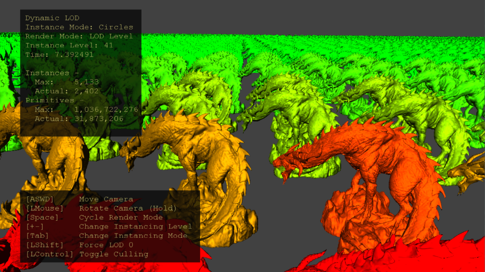

  

#   动态 LOD 示例

*此示例与 Microsoft 游戏开发工具包（2020 年 6 月）和 Windows 10 （版本
2004）2020 年 5 月更新兼容*

# 说明

此示例演示了如何利用放大着色器为任意数量的实例完全在 GPU
上执行每实例视锥剔除和网格详细级别 (LOD)
选择。使用网格着色器管道，该技术可巧妙适应单个放大和网格着色器管道状态对象。

# 生成示例

如果使用 Project Scarlett，请将活动解决方案平台设置为
Gaming.Xbox.Scarlett.x64。

如果使用具有适当硬件和 Windows 10 版本的电脑，请将活动解决方案平台设置为
Gaming.Deskop.x64。

此示例不支持 Xbox One。

*有关详细信息，请参阅 GDK 文档中的*"运行示例"*。*

# 使用示例

使用标准控件驱动相机。使用可视化模式和推断实例的方法进行修补。通过禁用剔除或将
LOD 选择强制设置为 0 级（最详细）来观察实例视锥剔除和 LOD 选择对 GPU
的影响。

# 控制

| 操作                         |  游戏手柄         |  键盘              |
|------------------------------|------------------|-------------------|
| 移动相机                     |  左控制杆         |  WASD 或箭头键     |
| 旋转相机                     |  右控制杆         |  按住 LMB + 鼠标   |
| 重置摄像头                   |  右控制杆（推）   |  \-                |
| 更改实例化模式               |  A                |  Tab               |
| 更改呈现模式                 |  X                |  空格键            |
| 更改实例化级别               |  右肩键和扳机键   |  +/-               |
| 切换强制设置 LOD 0           |  Y                |  左移              |
| 切换剔除                     |  B                |  左 Ctrl           |
| 退出                         |  "视图"按钮       |  退出              |

# 实现说明

放大着色器阶段位于网格着色器管道中的网格着色器阶段之前。这是一个类似于计算的着色器阶段，其目的是确定未完成的几何工作负载、填充数据的有效负载缓冲区，并启动必要数量的网格着色器线程组来处理几何图形。

CPU 端代码通过用户输入生成实例，并将实例缓冲区上传到 GPU 资源。网格 LOD
的数组填充着色器代码的描述符表，以便按 LOD 索引来动态索引。放大着色器
(AS)
配置为具有一个着色器波的组大小，这可以避免必须具有波同步和内存屏障。CPU
调度足够的 AS 波，以按每个线程计划一个实例。

AS 线程组的每个线程处理单个实例 - 根据视图视锥进行剔除并执行 LOD
计算。使用波内部函数获取和重新组织 LOD
实例计数，以便为调度的网格着色器生成有效负载数据（图
2，左）。这包括几个不同的每 LOD 实例计数、偏移量和实例索引列表。要呈现的
meshlet 总数决定了使用 DispatchMesh
放大着色器内部函数调度的网格着色器线程组数。

图 1：跨实例和 meshlet
的网格着色器线程组索引布局示例。在此方案中，有四个实例是 LOD
0，六个实例是 LOD 1，还有三个是需要 52 个网格着色器线程组的 LOD 2
实例。每个 LOD 的最后一个
meshlet（突出显示为灰色）可能会将多个实例打包到单个网格着色器线程组
--其顶点和基元计数允许。突出显示的黄色单元格是每个 LOD
的第一个线程组，红色值是每个 LOD 级别的全局偏移量 -
这必须从线程组索引中减去，以确定线程组的 LOD 索引。箭头用于显示跨 LOD
边界的线程组 ID 的延续。

图
2：从每个放大着色器线程组传递到其调度的网格着色器线程组（右侧的示例线程组）的有效负载数据（左）。
使用线程组的索引，着色器可以计算它应处理的 LOD、meshlet
索引和实例索引。组大小是线程组中的线程数，meshlet 大小是 meshlet
顶点和基元计数的最大值。

网格着色器是一个简单的 meshlet
呈现着色器，但包含用来使用有效负载数据计算其 LOD、meshlet
和实例索引的代码。Meshlet 和顶点数据是通过 LOD 索引将其索引到 SRV
数组中读取的。如果单个线程组是 LOD 级别最大线程组利用率的最后一个
meshlet，则可以在单个线程组中处理多个实例。

# 已知问题

禁用优化 (-Od) 会导致 InstancedLodMS.hlsl 在电脑上发生中断。这是因为
Windows SDK (10.0.19041) 随附版本中的着色器编译器 (dxc.exe) 中存在 bug。
此问题已在 [GitHub](https://github.com/microsoft/DirectXShaderCompiler)
上提供的最新版本中得到修复。

# 更新历史记录

2020/4/20 -- 创建示例。

2020/4/28 - 已更新为使用 D3DX12 帮助程序创建网格着色器管道

2021/9/2 - 添加了有关在使用 Windows SDK dxc
禁用优化时在电脑上受到损坏的说明

# 隐私声明

在编译和运行示例时，将向 Microsoft
发送示例可执行文件的文件名以帮助跟踪示例使用情况。若要选择退出此数据收集，你可以删除
Main.cpp 中标记为"示例使用遥测"的代码块。

有关 Microsoft 的一般隐私策略的详细信息，请参阅 [Microsoft
隐私声明](https://privacy.microsoft.com/en-us/privacystatement/)。
