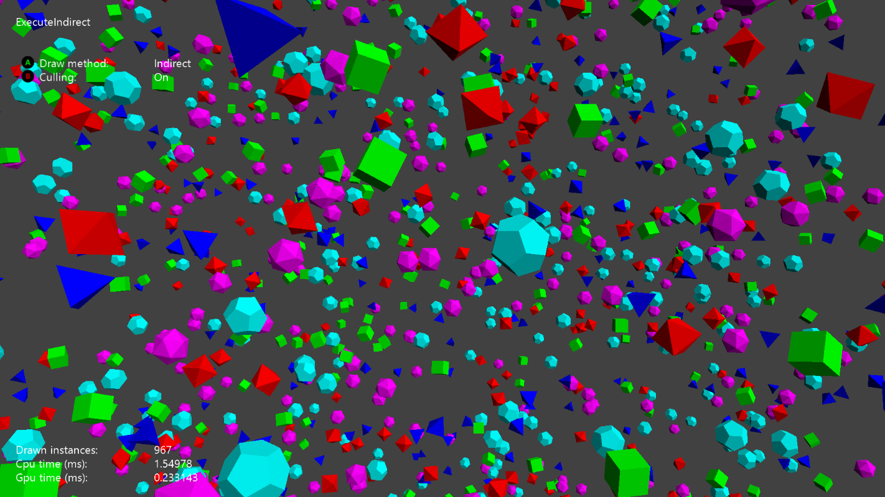

  

#   ExecuteIndirect 샘플

*이 샘플은 Microsoft 게임 개발 키트 미리 보기와 호환됩니다(2020년 4월).*

# 설명

*이 샘플은 비동기적으로 렌더링 명령을 작성하는 D3D12\'s ExecuteIndirect
API를 사용하는 예시를 보여줍니다.*

샘플에서는 카메라 앞에 임의로 배포되는 많은 수의 메시 인스턴스를
만듭니다. 직접 모드에서는 별도의 그리기 호출을 사용하여 각 메시
인스턴스가 그려집니다. 간접 모드에서는 단일 ExecuteIndirect 호출을
사용하여 전체 \"장면\"이 그려집니다.

이 샘플은 두 모드에서 선택적으로 절두체 컬링을 수행합니다. 직접 모드에서
인스턴스는 CPU에서 한 번에 하나씩 컬링됩니다. 간접 모드에서 인스턴스는
GPU 계산을 사용하여 병렬로 컬링됩니다. ExecuteIndirect 호출은 컬링을
통과하는 인스턴스만을 보게 됩니다. 그 외의 인스턴스는 간접 명령 버퍼에
존재하지 않습니다.

# 샘플 빌드하기

Xbox One 개발 키트를 사용하는 경우 활성 솔루션 플랫폼을
Gaming.Xbox.XboxOne.x64로 설정하세요.

Project Scarlett을 사용하는 경우 활성 솔루션 플랫폼을
Gaming.Xbox.Scarlett.x64로 설정하세요.

*자세한 내용은 GDK 문서에서* 샘플 실행하기*를 참조하세요.*

# 샘플 사용하기

이 샘플은 다음 컨트롤을 사용합니다.

| 작업                                   |  게임패드                    |
|----------------------------------------|-----------------------------|
| 토글 직접/간접 그리기                  |  A 버튼                      |
| 토글 컬링 켜기/끄기                    |  B 버튼                      |
| 종료                                   |  보기 버튼                   |

# 알려진 문제

\[없음\]

# 업데이트 기록

XDK 2015년 8월 XDK의 초기 릴리스

2020년 4월 GDK 및 Scarlett 업데이트

# 개인정보처리방침

샘플을 컴파일하고 실행할 때 샘플의 사용을 추적하는 데 도움이 되도록 샘플
실행 파일의 파일 이름이 Microsoft에 전송됩니다. 이 데이터 수집을
옵트아웃하려면 Main.cpp에서 \"샘플 사용 원격 분석\"이라고 레이블이
지정된 코드 블록을 제거할 수 있습니다.

Microsoft의 일반 개인정보취급방침에 대한 자세한 내용은 [Microsoft
개인정보처리방침](https://privacy.microsoft.com/en-us/privacystatement/)을
참조하세요.
