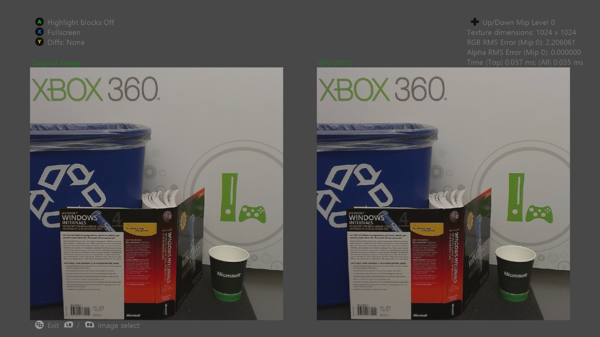

  

#   FastBlockCompress のサンプル

*このサンプルは、Microsoft ゲーム開発キットのプレビュー (2019 年 11 月)
に対応しています。*

# 

# 説明

# このサンプルでは、DirectCompute を使用し、実行時にクラシック *Fast Block Compression* アルゴリズムに基づいて BC1、BC3、BC5 形式に高速テクスチャ圧縮を実施する方法について示します。また、サンプルでは、実行時とオフラインの圧縮モードを切り替えて、表示品質を比較することもできます。

# サンプルの作成

Xbox One の devkit を使用している場合は、アクティブなソリューション
プラットフォームを Gaming.Xbox.XboxOne.x64 に設定します。

Project Scarlett を使用している場合は、アクティブなソリューション
プラットフォームを Gaming.Xbox.Scarlett.x64 に設定します。

*詳細については、*GDK ドキュメントの
「サンプルの実行」を参照してください。

# サンプルの使用

| 動作                        |  ゲームパッド                           |
|-----------------------------|----------------------------------------|
| 前または次の画像            |  左右のバンパー                         |
| 前または次の圧縮方法        |  左右の方向パッド                       |
| 前または次の Mip レベル     |  上下の方向パッド                       |
| カメラの移動                |  右スティック                           |
| 拡大表示/縮小表示           |  左右のトリガー                         |
| 全画面または横並び          |  X                                      |
| ブロックの強調表示          |  A                                      |
| 差分モードの切り替え        |  Y                                      |
| 終了                        |  表示ボタン                             |

# 背景

Xbox One には、専用のアプリ向けに 5 GB
の統合メモリが用意されています。これは、Xbox 360 で使用可能な 512 MB の
10 という大幅な増加です。 残念ながら、IO
帯域幅や記憶域メディアの容量は十分に追いついていません。ブルーレイ
メディアには 49 GB 用意されており、これは Xbox 360 ゲームのディスク
バージョン 3 で使用可能な 7.8 GB の 6.3 倍です。

さらにストリーミング
インストールの導入もあり、ロード時間を最小にし、使用可能な記憶領域にゲーム資産を格納するため、効率的な圧縮方法が重要とされています。

タイトルは、多くの場合、オフラインの画像圧縮形式を使用してゲームのテクスチャをエンコードして、記憶領域を大幅に節約しています。Xbox
One にはハードウェア JPEG デコーダーが組み込まれているため、JPEG
は利用しやすい選択肢となっています。ただし、JPEG
ハードウェアはテクスチャをメモリ内の非圧縮 YUV
形式にデコードするため、レンダリングには最適ではありません。この方法を使用する場合、タイトルはテクスチャを実行時に
GPU でサポートされているいずれかの圧縮形式に再圧縮する必要があります。

このサンプルでは、GPU を使用して、BC1、BC3、BC5
形式のテクスチャを効率的に圧縮します。オフラインのブロック圧縮に使用されていた標準アルゴリズムは、リアルタイムで実行するには遅すぎました。サンプルが使用するアルゴリズムは速度の点で大幅に品質が向上されています。

現在のアルゴリズムのボトルネックはメモリ帯域幅のため、他の手法を使用すると、わずかなパフォーマンス低下で、大幅な品質の向上を実現できる可能性があります。

# 実装に関する注意事項

# DirectCompute 圧縮シェーダーには、1 つの Mip バージョン、2 つの Mips バージョン、 tail Mips バージョンの 3 つのバリエーションがあります。

-   # 1 つの Mip シェーダーは、ソース テクスチャの 1 つの Mip を圧縮します。

-   # 2 つの Mips シェーダーは、ソース テクスチャの 1 つの Mip を読み取り、その Mip をローカルデータストア (LDS) メモリにダウンサンプルします。次に、シェーダーは元のバージョンとダウンサンプルしたバージョンの両方を圧縮し、対応する Mip レベルを出力テクスチャに書き込みます。

# このプロセスでは、2 番目の Mip レベルのソース テクスチャからの読み取りを回避することで、メモリ帯域幅を節約します。ただし実際には、このパフォーマンスの向上は、シェーダーの複雑さが増加したことと、GPR および LDS の使用の増加による占有率の低下で大幅に相殺されています。

-   # tail Mips シェーダーは、異なる Mip レベルで動作する様々なスレッドを選択して、ソース テクニックの 16×16 から 1×1 までの Mip レベルを 1 つのディスパッチ呼び出しに圧縮します。

# 最小の Wavefront サイズは 64 スレッドのため、各 tail Mip を個別のディスパッチ呼び出しに圧縮するやり方では、利用可能なスレッドの多くを無駄にしてしまいます。Wavefront 1 つとディスパッチ呼び出しのみを使用すると、tail Mips シェーダーはこの無駄な作業の大半を回避します。

# Direct3D は、BC 形式のテクスチャを UAV として結束することを許可しないため、compute シェーダーのブロック圧縮テクスチャに直接書き込むことはできません。このサンプルでは、書き込み可能な形式の中間テクスチャをブロック圧縮テクスチャと同じメモリ位置にエイリアスして、この制限を回避します。中間テクスチャのサイズは 1/4 で、各テクセルは、圧縮されたテクスチャ内のブロックに対応します。

# このようにテクスチャ メモリをエイリアスするには、2 つのテクスチャのタイル モードとメモリ レイアウトが正確に一致する必要があります。また、Direct3D はメモリのエイリアスには関与しないため、GPU は、同じメモリ位置にエイリアスされた異なるリソースで動作する複数の描画呼び出しまたはディスパッチ呼び出しを同時にスケジュールする場合があります。

# つまり、中間テクスチャに書き込まれるシェーダーは、エイリアスされたブロック圧縮テクスチャから読み取る描画呼び出しと同時にスケジュールされる場合があります。こうした問題を防ぐには、適切なフェンスを手動で挿入する必要があります。

オフラインのライン圧縮アルゴリズムは
[DirectXTex](https://github.com/Microsoft/DirectXTex/)
に実装されています。

# 代替方法

このサンプルの主な目的は、従来の「JPG/FBC」ソリューションと実行時にディスク上のテクスチャ
ストレージと実行時のメモリ消費を最小限にする他の代替方法を比較するテスト
ケースを示すことです。

-   [Basis Universal]{.underline}
    ([GitHub](https://github.com/BinomialLLC/basis_universal/)) -
    このソリューションは、ディスク上のテクスチャを
    [ETC1](https://github.com/Ericsson/ETCPACK) の 1
    つのバリエーションに圧縮します。これは、実行時に BC7 (モード 6)
    を含む多数の形式に変換できます。これを使用するとディスク上のサイズを縮小すると同時に、幅広いターゲット
    GPU に対応でき、従来の JPG/FBC
    パイプラインと同等またはそれ以上の画像品質が可能となります。.basis
    のマルチ GPU コード変換機能は、モバイルで使用するときにコンソール
    タイトルよりも遥かに便利であり、ディスク領域の節約を評価するのに有効な形式です。

# 参考文献

Microsoft Advanced Technology Group。ファストブロック圧縮サンプル。Xbox
360 SDK。2010 年 2 月。

Tranchida, Jason。[Texture Compression in Real-Time Using the
GPU](http://www.gdcvault.com/play/1012554/Texture-compression-in-real-time)。GDC
2010。2010 年 3 月。

van Waveren, J.M.P[。リアルタイム DXT
圧縮](https://software.intel.com/sites/default/files/23/1d/324337_324337.pdf)。Intel
Software Network。2006 年 5 月。

van Waveren, J.M.P., and Castaño, Ignacio.[リアルタイム YCoCg-DXT
圧縮](https://www.nvidia.com/object/real-time-ycocg-dxt-compression.html)。NVIDIA
開発者サイト。2007 年 9 月

van Waveren, J.M.P., and Castaño, Ignacio.[リアルタイム標準マップ DXT
圧縮](http://developer.download.nvidia.com/whitepapers/2008/real-time-normal-map-dxt-compression.pdf)。NVIDIA
開発者サイト。2008 年 2 月。

# 更新履歴

2019 年 9 月リリース

# プライバシーに関する声明

サンプルをコンパイルして実行すると、サンプルの使用状況を追跡するため、サンプル実行可能ファイルのファイル名が
Microsoft に送信されます。このデータ収集を無効にするには、「Sample Usage
Telemetry」とラベル付けされた Main.cpp
内のコードのブロックを削除します。

Microsoft のプライバシー ステートメントの詳細については、「[Microsoft
のプライバシー
ステートメント](https://privacy.microsoft.com/en-us/privacystatement/)」を参照してください。
