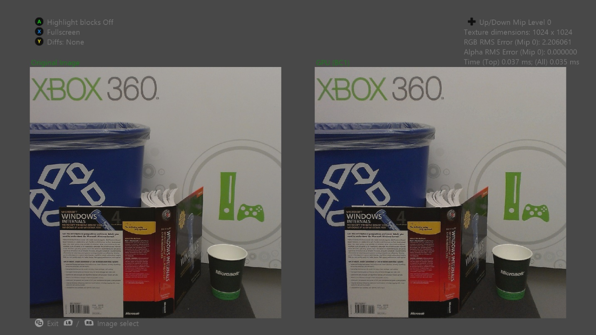

  

#   FastBlockCompress 示例

此示例与 Microsoft 游戏开发工具包预览版（2019 年 11 月）兼容

# 

# 说明

# 此示例演示如何使用 DirectCompute 在运行时基于经典的快速块压缩算法对 BC1、BC3 和 BC5 格式执行快速纹理压缩。该示例还允许你在运行时压缩模式和脱机压缩模式之间切换，以比较视觉质量。

# 构建示例

如果使用 Xbox One 开发工具包，请将活动解决方案平台设置为
Gaming.Xbox.XboxOne.x64。

如果使用 Project Scarlett，请将活动解决方案平台设置为
Gaming.Xbox.Scarlett.x64。

有关详细信息，请参阅 GDK 文档中的"运行示例"。

# 使用示例

| 操作                        |  游戏手柄                               |
|-----------------------------|----------------------------------------|
| 上一个或下一个图像          |  左或右缓冲键                           |
| 上一个或下一个压缩方法      |  向左或向右方向键                       |
| 上一个或下一个 mip 级别     |  向下或向上方向键                       |
| 移动照相机                  |  右摇杆                                 |
| 放大或缩小                  |  左或右扳机键                           |
| 全屏与并排显示              |  X                                      |
| 突出显示方块                |  A                                      |
| 循环差异模式                |  Y                                      |
| 退出                        |  "视图"按钮                             |

# 背景

Xbox One 具有 5 GB 的统一内存可用于独占式应用，这是 Xbox 360 上可用 512
MB 的 10 倍之多。遗憾的是，IO
带宽和存储媒体容量并未保持同步。蓝光媒体将容纳 49 GB，这是 Xbox 360
游戏光盘版本 3 可用 7.8 GB 的 6.3 倍。

这一事实与流安装的引入相结合，意味着有效的压缩方法对于尽量减少负载倍数以及将游戏资产打包到可用存储空间中仍然很重要。

标题通过使用离线图像压缩格式对游戏纹理进行编码，通常可以节省大量存储空间。Xbox
One 具有内置的硬件 JPEG 解码器，这使 JPEG
成为极具吸引力的选择。但是，JPEG 硬件在内存中将纹理解码为未压缩的 YUV
格式，这最佳的呈现格式。如果使用此方法，则标题将需要在运行时将纹理重新压缩为
GPU 支持的块压缩格式之一。

此示例使用 GPU 高效地将纹理压缩为 BC1、BC3 和 BC5
格式。用于离线块压缩的标准算法一直以来都太慢，无法实时运行，并且示例使用的算法为了加快速度严重影响了质量。

由于内存带宽是当前算法的瓶颈，使用其他技术，你可能仅通过很小的性能损失就能实现明显的质量改进。

# 实现说明

# 示例中的每个 DirectCompute 压缩着色器都有三种变体：一个 one mip 版本、一个 two mip 版本和一个 tail mips 版本：

-   # one mip 着色器压缩源纹理的单个 mip。

-   # two mip 着色器将源纹理的单个 mip 和下采样 mip 读取到本地数据存储 (LDS) 内存。接下来，着色器同时压缩原始采样版本和下采样版本，然后着色器将在输出纹理中写入相应的 mip 级别。

# 此过程通过避免从源纹理读取第二个 mip 级别来节省内存带宽。但实际上，由于更高的 GPR 和 LDS 使用率，着色器复杂性的增加和占用率的降低大大抵消了性能的提高。

-   # tail mip 着色器通过选择不同的线程以在不同的 mip 级别上工作，在单个分派调用中压缩源纹理的 16×16 到 1×1 mip 级别。

# 由于最小波前大小是 64 个线程，因此在单独的分派调用中压缩每个 tail mip 的技术将浪费大多数可用线程。通过仅使用一个波前和分派调用，tail mip 着色器可避免大量浪费工作。

# Direct3D 不允许将 BC 格式的纹理作为 UAV 进行绑定，因此不能直接从计算着色器写入块压缩纹理。示例通过将可写格式的中间纹理别名化为与块压缩纹理相同的内存位置来解决此限制。中间纹理是大小的四分之一，每个纹素对应于压缩纹理中的一个块。

# 以这种方式别名化纹理内存需要两个纹理的平铺模式和内存布局之间完全匹配。此外，Direct3D 忽略了内存别名化，因此 GPU 可以同时安排多个对别名化到同一内存位置的不同资源进行操作的绘制或分派调用。

# 换句话说，写入中间纹理的着色器可以与从别名化的块压缩纹理读取的绘制调用同时被调度。若要防止这些危险，应手动插入相应的时限。

[DirectXTex](https://github.com/Microsoft/DirectXTex/)
中实现了脱机行压缩算法。

# 替代方案

此示例的主要用途是提供一个测试案例，将传统的"JPG/FBC"解决方案与其他替代方案进行比较，以最大程度减少运行时的磁盘纹理存储和内存消耗。

-   [Basis Universal]{.underline}
    ([GitHub](https://github.com/BinomialLLC/basis_universal/)) -
    此解决方案将磁盘上的纹理压缩为
    [ETC1](https://github.com/Ericsson/ETCPACK)
    的变体，在运行时可以将其转码为多种不同格式，包括 BC7（模式
    6）。与传统的 JPG/FBC
    管道相比，这可以实现较小的磁盘占用空间，并支持更多目标
    GPU，并且图像质量相似或更好。尽管 .basis 的多 GPU
    转码方面对于移动设备而言比控制台标题要有用得多，但它是一种可节省磁盘空间的重要格式。

# 引用

Microsoft 高级技术组."快速块压缩"示例.Xbox 360 SDK.2010 年 2 月。

Tranchida、Jason.《[Texture Compression in Real-Time Using the
GPU](http://www.gdcvault.com/play/1012554/Texture-compression-in-real-time)》（使用
GPU 实时进行纹理压缩）.GDC 2010.2010 年 3 月。

van
Waveren、J.M.P[.](https://software.intel.com/sites/default/files/23/1d/324337_324337.pdf)《[Real-Time
DXT
Compression](https://software.intel.com/sites/default/files/23/1d/324337_324337.pdf)》（实时
DXT 压缩）.Intel Software Network.2006 年 5 月。

van Waveren、J.M.P. 和 Castaño、Ignacio.《[Real-Time YCoCg-DXT
Compression》（实时 YCoCg-DXT
压缩](https://www.nvidia.com/object/real-time-ycocg-dxt-compression.html)）.NVIDIA
开发人员网站.2007 年 9 月。

van Waveren、J.M.P. 和 Castaño、Ignacio.《[Real-Time Normal Map DXT
Compression](http://developer.download.nvidia.com/whitepapers/2008/real-time-normal-map-dxt-compression.pdf)》（实时普通地图
DXT 压缩）.NVIDIA 开发人员网站.2008 年 2 月。

# 更新历史记录

2019 年 9 月发布

# 隐私声明

在编译和运行示例时，示例可执行文件的文件名将发送给
Microsoft，用于帮助跟踪示例使用情况。要选择退出此数据收集，你可以删除
Main.cpp 中标记为"示例使用遥测"的代码块。

有关 Microsoft 的一般隐私政策的详细信息，请参阅《[Microsoft
隐私声明](https://privacy.microsoft.com/en-us/privacystatement/)》。
