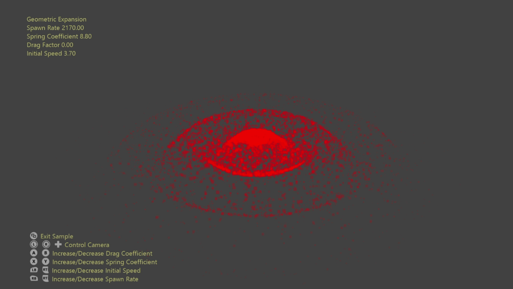

  

#   Geometric Expansion Sample

*This sample is compatible with the Microsoft Game Development Kit
(March 2022) and Windows 10 (Version 2004) May 2020 Update*

# Description

This sample demonstrates the geometric expansion capabilities of mesh
shaders. This is the process whereby sample points are loaded and
procedurally expanded into representative geometry by shader code.
Common cases are full-screen quads, billboarded sprites, particle
trails, decals, etc.

Mesh shaders provide the ability to determine how workloads map to
threadgroups as well as the data-sharing facilities previously unique to
compute shaders. This allows more intuitive implementations and access
to local geometry data.

# Building the sample

If using a Xbox Series X|S devkit, set the active solution platform to `Gaming.Xbox.Scarlett.x64`.

If using a PC with the appropriate hardware and Windows 10 release, set
the active solution platform to `Gaming.Desktop.x64`.

This sample does not support Xbox One.

*For more information, see* __Running samples__, *in the GDK documentation.*

# Using the sample

Beyond moving the camera there are options to manipulate the dynamics
properties of the particle simulation.

# Controls

| Action                       |  Gamepad          |  Keyboard          |
|------------------------------|------------------|-------------------|
| Rotate/translate camera along view vector |  Left Thumbstick  |  Mouse wheel |
| Orbit camera                 |  Right Thumbstick |  Hold LMB + Mouse  |
| Pan Camera  |  Directional Pad  |  WASD or Arrow Keys              |
| Reset camera  |  Right Thumbstick (Push) |  \- |
| Increase/Decrease Spawn Rate  |  Left Shoulder/Trigger |  +/- |
| Increase/Decrease Initial Speed |  Right Shoulder/Trigger |  O/P |
| Increase/Decrease Spring Coefficient |  X/Y  |  K/L |
| Increase/Decrease Drag Factor |  A/B  |  N/M |
| Exit                         |  View Button      |  Escape            |

# Implementation notes

Each frame the particle data is simulated on the CPU and copied to a GPU
resource. A mesh shader then loads the particle data (individual sample
points) and expands them to billboarded quads. Since each quad requires
four vertices & two primitives each thread is responsible for
determining which, if any, vertex & primitive for which it's
responsible.

# Update history

10/31/2019 -- Sample creation.

4/28/2020 - Updated to use the D3DX12 helpers for mesh shader pipeline
creation

10/29/2021 -- Shader bug fix, improved physical dynamics, slight shader
optimizations

# Privacy Statement

When compiling and running a sample, the file name of the sample
executable will be sent to Microsoft to help track sample usage. To
opt-out of this data collection, you can remove the block of code in
Main.cpp labeled "Sample Usage Telemetry".

For more information about Microsoft's privacy policies in general, see
the [Microsoft Privacy
Statement](https://privacy.microsoft.com/en-us/privacystatement/).
