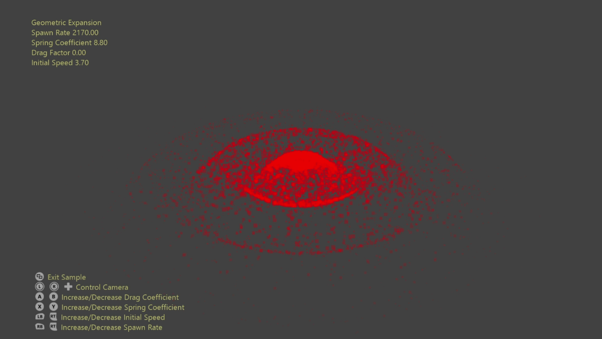

# 幾何学的展開のサンプル

*このサンプルは、Microsoft Game Development Kit (2022 年 3 月) および Windows 10 (バージョン 2004) 2020 年 5 月の更新プログラムと互換性があります*

# 説明

このサンプルでは、メッシュ シェーダーの幾何学的拡張機能を示します。 これは、サンプル ポイントが読み込まれ、シェーダー コードによって代表的なジオメトリに手続き的に拡張されるプロセスです。 一般的なケースは、全画面表示クワッド、ビルボードスプライト、パーティクル軌跡、ステッカーなどです。

メッシュ シェーダーを使用すると、ワークロードがスレッド グループにマップされる方法と、以前はコンピューティング シェーダーに固有のデータ共有機能を決定できます。 これにより、より直感的な実装とローカル幾何学的データへのアクセスが可能になります。

# サンプルのビルド

Xbox Series X|S 開発キットを使用している場合は、アクティブ ソリューション プラットフォームを `Gaming.Xbox.Scarlett.x64` に設定します。

適切なハードウェアと Windows 10 リリースで PC を使用する場合は、アクティブなソリューション プラットフォームを `Gaming.Desktop.x64` に設定します。

このサンプルでは、Xbox One はサポートされていません。

*詳細については、**GDK ドキュメント*の「__サンプルの実行__」 を参照してください。

# サンプルの使用方法

カメラの移動以外にも、パーティクル シミュレーションのダイナミクス プロパティを操作するためのオプションがあります。

# Controls

| 操作 | ゲームパッド | キーボード |
|---|---|---|
| ビュー ベクターに沿ってカメラを回転/翻訳する | 左サムスティック | マウス ホイール |
| オービット カメラ | 右サムスティック | LMB + マウスを長押しする |
| カメラのパン | 方向パッド | WASD キーまたは方向キー |
| カメラを再設定 | 右サムスティック (プッシュ) | \- |
| スポーン率の増減 | 左肩/トリガー | +/- |
| 初期速度の増減 | 右肩/トリガー | O/P |
| ばね係数の増減 | X/Y | K/L |
| ドラッグ係数の増減 | A/B | N/M |
| Exit | ビュー ボタン | Esc キー |

# 実装メモ

各フレームでは、パーティクル データが CPU 上でシミュレートされ、GPU リソースにコピーされます。 メッシュ シェーダーは、パーティクル データ (個々のサンプル ポイント) を読み込み、ビルボードされたクワッドに展開します。 各クワッドには 4 つの頂点 & 2 つのプリミティブが必要であるため、各スレッドは、それが担当するプリミティブ & 頂点を決定する役割を担います。

# 更新履歴

2019 年 10 月 31 日 -- サンプル作成。

2020 年 4 月 28 日 - メッシュ シェーダー パイプラインの作成に D3DX12 ヘルパーを使用するように更新済み

2021 年 10 月 29 日 -- シェーダーのバグ修正、物理ダイナミクスの改善、わずかなシェーダーの最適化

# プライバシーに関する声明

サンプルをコンパイルして実行する場合、サンプルの使用状況を追跡するために、サンプルの実行可能ファイルのファイル名が Microsoft に送信されます。 このデータ コレクションからオプトアウトするには、Main.cpp の "サンプル使用状況テレメトリ" というラベルの付いたコードのブロックを削除します。

Microsoft のプライバシー ポリシー全般の詳細については、「[Microsoft のプライバシーに関する声明](https://privacy.microsoft.com/en-us/privacystatement/)」を参照してください。

