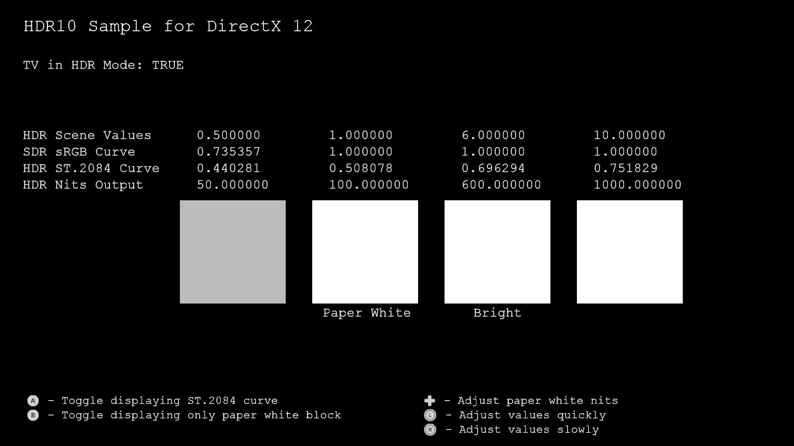
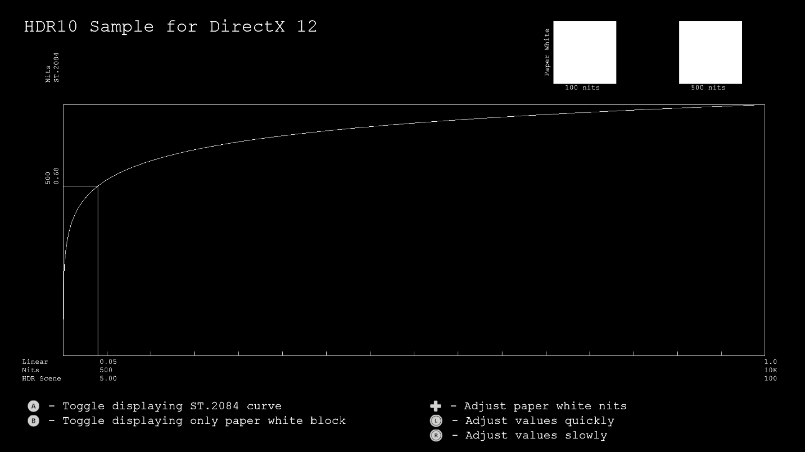

# 간단한 HDR 샘플

*이 샘플은 Microsoft 게임 개발 키트 미리 보기(2019년 11월)와
호환됩니다.*

# 설명

이 샘플에서는 UHD TV를 HDR 모드로 전환하고, UHD TV에서 흰색보다 더 밝게
표시되는 1.0f보다 높은 값으로 HDR 장면을 렌더링합니다. 이 샘플의 목표는
사용할 API, HDR 스왑 체인을 만드는 방식, 1.0f 보다 큰 다른 값이 UHD
TV에서 표시되는 방식을 보여 주는 것입니다.

# 샘플 빌드하기

Xbox One 개발 키트를 사용하는 경우 활성 솔루션 플랫폼을
Gaming.Xbox.XboxOne.x64로 설정하세요.

Project Scarlett을 사용하는 경우 활성 솔루션 플랫폼을
Gaming.Xbox.Scarlett.x64로 설정하세요.

*자세한 내용은 GDK 문서에서* 샘플 실행하기*를 참조하세요.*

# 샘플 사용

이 샘플은 다음 컨트롤을 사용합니다.

| 작업                                           |  게임패드            |
|------------------------------------------------|---------------------|
| ST.2084 곡선 표시 토글                         |  A 단추              |
| 페이퍼 화이트 블록만 표시 토글                 |  B 단추              |
| 페이퍼 화이트 밝기 조정                        |  D-패드              |
| 값 조정                                        |  왼쪽/오른쪽 썸스틱  |
| 종료                                           |  보기 단추           |

# 구현 참고 사항

이 샘플에서는 API를 사용하여 연결된 디스플레이가 HDR을 지원하는지 여부를
확인합니다. 지원하는 경우 디스플레이를 HDR 모드로 전환합니다. 1.0f보다
큰 값을 포함하는 아주 간단한 HDR 장면은 FP16 백 버퍼로 렌더링되고 각각
HDR와 SDR을 위한 두 개의 다른 스왑 체인으로 출력됩니다. 소비자가 HDR
디스플레이를 사용하는 경우에도 GameDVR 및 스크린샷에 SDR 신호가 계속
필요합니다.

이 샘플에는 HDR 및 SDR 스왑 체인을 지원하는
[DeviceResources](https://github.com/Microsoft/DirectXTK12/wiki/DeviceResources)
클래스 버전이 있습니다.

백서 "[HDR on Xbox One](http://aka.ms/hdr-on-xbox-one)"을 참조하세요.

지금까지 게임은 Rec.709 색 기본 형식 및 Rec.709 감마 곡선을 사용하여 SDR
신호를 출력했습니다. UHD 디스플레이의 새로운 기능 중 하나는 WCG(Wider
Color Gamut)입니다. 이를 사용하려면 새 색 공간, Rec.2020 색 기본 형식을
사용해야 합니다. UHD 디스플레이의 또 다른 새 기능은 HDR(High Dynamic
Range)입니다. 이를 사용하려면 다른 곡선인 ST.2084 곡선을 사용해야
합니다. 따라서 HDR 신호를 출력하려면 ST.2084 곡선에서 Rec.2020 색 기본
형식을 사용해야 합니다.

SDR 신호를 표시하기 위해, 간단한 색조 매핑 셰이더를 사용하여 HDR
장면에서 1.0f보다 높은 모든 값을 간단히 클리핑하고, Rec.709 색 기본
형식을 사용하여 8비트 값을 출력합니다. 추가 색조 매핑 연산자에 대해서는
*DirectX Tool Kit for DirectX 12*에서
[PostProcess](https://github.com/Microsoft/DirectXTK12/wiki/PostProcess)
클래스를 참조하세요.

HDR 신호를 표시하기 위해 셰이더를 사용하여 Rec.709 색 기본 형식을
Rec.2020 색 기본 형식으로 회전한 다음, ST.2084 곡선을 적용하여 HDR
디스플레이가 제대로 표시할 수 있는 10비트 값을 출력합니다. HDR
디스플레이에서 출력의 백색도와 밝기는 \"페이퍼 화이트\"를 정의하기 위해
선택한 nits 값에 따라 결정됩니다. SDR 사양은 \"페이퍼 화이트\"를
80nits로 정의하지만 어두운 환경의 영화용입니다. 현재 고객은 더 밝은
흰색(예: 스마트폰의 경우 일조에서 볼 수 있는 550nits 미만, PC 모니터의
경우 200-300nits, SDR TV의 경우 120-150nits)에서 사용됩니다. \"페이퍼
화이트\"에 대한 nits는 D-패드 위쪽/아래쪽을 사용하여 샘플에서 조정할 수
있습니다. 흰색 옆에 밝은 값을 표시하면 착시를 가져올 수 있으므로
\"페이퍼 화이트\" 블록을 보려는 경우에만 A 단추를 사용하여 토글할 수
있습니다.

샘플에는 다음 두 가지 모드가 있습니다.

-   장면의 특정 값을 사용하여 블록 렌더링

-   특정 밝기 값(nits)을 사용하여 ST.2084 곡선 렌더링

# 알려진 문제

여기에서 Project Scarlett용 구현이 제대로 작동하지만 향후 업데이트에서는
자동 색조 매핑을 사용하는 좀 더 쉬운 방법이 제공될 예정입니다. 따라서
Project Scarlett 타이틀에 HDR 이미지만 표시하고, SDR 출력과 GameDVR이
시스템에서 완전히 처리될 수 있습니다.

# 개인정보처리방침

샘플을 컴파일하고 실행할 때 샘플의 사용을 추적하는 데 도움이 되도록 샘플
실행 파일의 파일 이름이 Microsoft에 전송됩니다. 이 데이터 수집을
옵트아웃하려면 Main.cpp에서 \"샘플 사용 원격 분석\"이라고 레이블이
지정된 코드 블록을 제거할 수 있습니다.

Microsoft의 개인 정보 보호 정책에 대한 자세한 내용은 [Microsoft
개인정보처리방침](https://privacy.microsoft.com/en-us/privacystatement/)을
참조하세요.
