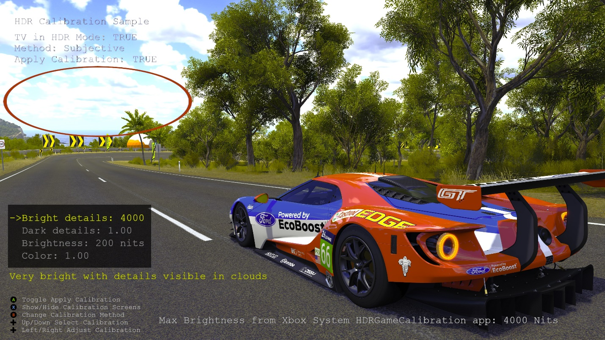

# HDR Calibration Sample

*This sample is compatible with the Microsoft Game Development Kit (March 2022)*

# Description

HDR TVs can vary wildly with regards to HDR capabilities which effect
image quality. Entry level TVs can struggle to physically reproduce HDR,
the peak brightness might not be great, it might use whole panel
illumination instead of local illumination, etc. To compensate for these
differences, games should allow the consumer to calibrate the game's HDR
image. This sample switches an HDR TV to HDR mode and then presents the
user with several calibration options to adjust the visible detail in
brights and darks, the overall brightness and color saturation of the
image. Two different modes are available, subjective calibration where
the user adjusts the image until it looks good, and objective
calibration where test patterns are shown to determine the TV's
capabilities.

# Building the sample

If using an Xbox One devkit, set the active solution platform to `Gaming.Xbox.XboxOne.x64`.

If using Xbox Series X|S, set the active solution platform to `Gaming.Xbox.Scarlett.x64`.

*For more information, see* __Running samples__, *in the GDK documentation.*

# Using the sample

The sample uses the following controls.

| Action                                    |  Gamepad                  |
|-------------------------------------------|--------------------------|
| Toggle apply calibration                  |  A                        |
| Show/hide calibration screens             |  X                        |
| Switch between subjective and objective calibration |  B |
| Select calibration                        |  D-Pad Up/Down            |
| Adjust selected calibration               |  D-Pad Left / Right       |

# Implementation notes

**Detail in Brights** -- HDR values above what the TV can display will
get clipped, therefore losing details in the brights. We need to
determine the maximum perceived brightness of the TV so that the very
bright HDR values in the scene can be mapped to maximum brightness of
the TV. The calibration image renders a value into the scene which
represents 10,000 nits, the maximum brightness of the ST.2084 spec. A
smaller image is then rendered with the current brightness. The user
adjusts the current brightness value until he can no longer distinguish
between the two images. For example, if the TV can display 1,000 nits,
then values rendered into the scene representing brighter pixels than
1,000 nits will still be perceived as 1000 nits. Refer to the
HDRDisplayMapping sample. The MaxToneMapLuminance value from the Xbox
system HDRGameCalibration is use as a good default starting point for
this value. Consumers can access the app from the console Settings,
"Calibrate HDR for games" option.

**Detail in Darks** -- Most games have a video option in a menu to
determine display gamma. This can be used to correct contrast using a
power function in a pixel shader, in order to see the correct amount of
detail in the darks. This adjustment is very important when the TV is in
HDR mode. Without the proper adjustment, the HDR image will looking
"flat" and dull compared to the SDR image. It is important to render the
calibration screen in the center of the screen, because the viewing
angle on some LCD TVs can change the contrast of the image even from a
small angle. For example, if rendering the calibration image on the side
of an LCD screen, the determined display gamma value will be slightly
different from when rendering in the center of the screen. Using a
flashing image works well for this calibration, because it's easier for
the user to determine when the center calibration block becomes
invisible. Note that applying some contrast adjustment will change the
maximum HDR scene value, which is important to do effective HDR display
mapping, therefore the contrast adjustment function also need to be
applied to the maximum scene value going into HDR display mapping.

**Overall Brightness** -- Entry level HDR TVs do not have a great peak
brightness. To be able to show HDR, it must sacrifice the brightness of
the SDR range of the image, which can make the image look worse when
compared to an SDR TV. For example, a good HDR TV will output 100 nits
when rendering 100 nits, but an entry level TV might only output 30 nits
when rendering 100 nits. It is therefore necessary to allow the consumer
to adjust the brightness of the SDR range in the image. This is done by
adjusting the paper white nits value. Note that as paper white goes
higher, the potential range for HDR is reduced. Therefore, it is
recommended to show an HDR image with lots of detail in the brights so
that the consumer can understand the compromise for a brighter SDR range
with a smaller HDR range.

**Color Saturation** -- Display panels of HDR TVs have the capabilities
to produce very bright and colorful images, since they can all produce
colors outside of the Rec.709 color space. When in SDR mode, TVs often
use a color gamut expansion to make the SDR image look more colorful.
When rendering the theoretically correct colors in HDR mode, the image
can often look less colorful than when in SDR mode. A solution to this
problem is to do color gamut expansion within the game. This option
control how much color gamut expansion should be applied.

When using objective calibration with test patterns, take care not to
apply the display gamma or any soft shoulder on the actual brightness
calibration block, because this will change the perceived max brightness
value. The sample simply uses the bounding box of the block to ignore
these, but still apply it to the preview image in the back ground. For
example, when trying to determine the max perceived brightness of the
TV, using a display gamma adjustment will result in the wrong value.

Refer to the white paper "[HDR on Xbox
One](http://aka.ms/hdr-on-xbox-one)", and the HDRDisplayMapping sample.

*The test image is a screenshot captured from* Forza Horizon 3
*developed by Turn 10 Studios and published by Microsoft Studios*

# Known issues

None

# Update history

Initial release June 2019

# Privacy Statement

When compiling and running a sample, the file name of the sample
executable will be sent to Microsoft to help track sample usage. To
opt-out of this data collection, you can remove the block of code in
Main.cpp labeled "Sample Usage Telemetry".

For more information about Microsoft's privacy policies in general, see
the [Microsoft Privacy
Statement](https://privacy.microsoft.com/en-us/privacystatement/).
