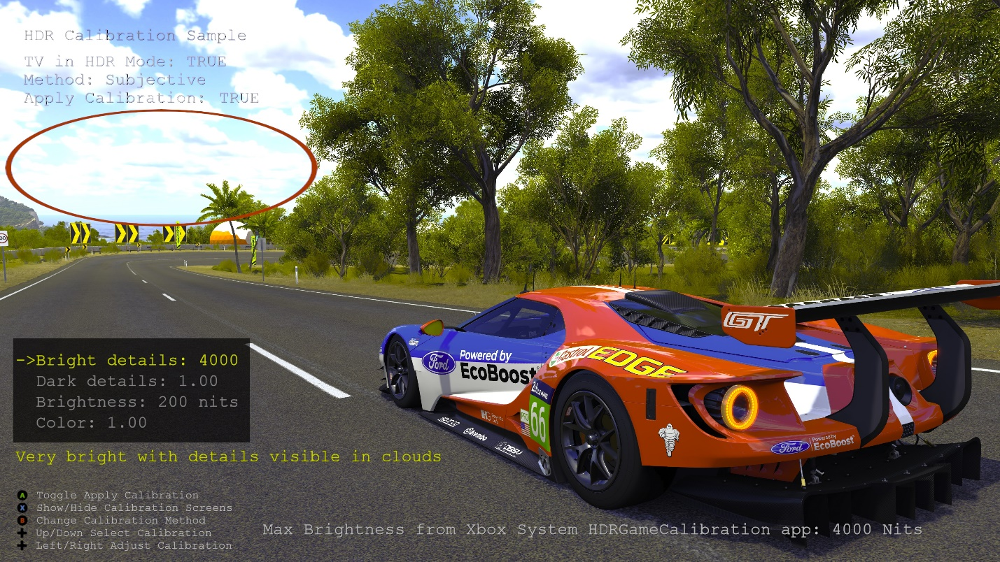

# HDR 校准示例

*此示例可用于 Microsoft 游戏开发工具包 (2022 年 3 月)*

# 说明

HDR 电视可能因 HDR 功能而略有差异，这会影响图像质量。 入门级电视可能难以以物理方式重现 HDR，峰值亮度可能不是很好，它可能会使用整个面板照明而不是局部照明等。 为了抵消这些差异，游戏应允许使用者校准游戏的 HDR 图像。 此示例将 HDR 电视切换到 HDR 模式，然后向用户呈现多个校准选项，以调整暗度和亮度中可见的细节，以及图像的整体亮度和色彩饱和。 有两种不同的模式可用，即由用户调整图像直至显示良好的主观校准，以及显示测试图案以确定电视功能的客观校准。

# 生成示例

如果使用 Xbox One 开发工具包，请将活动解决方案平台设置为 `Gaming.Xbox.XboxOne.x64`。

如果使用 Xbox Series X|S，请将活动解决方案平台设置为 `Gaming.Xbox.Scarlett.x64`。

*有关详细信息，请参阅* __运行示例__，*在 GDK 文档中。*

# 使用示例

该示例使用以下控制。

| 操作 | 游戏板 |
|---|---|
| 切换应用校准 | A |
| 显示/隐藏校准屏幕 | X |
| 在主观校准和客观校准之间切换 | B |
| 选择校准 | 方向键上/下 |
| 调整所选校准 | 方向键向左键/向右键 |

# 实现说明

**明亮区域中的细节** - 电视可显示的亮度以上的 HDR 值将被剪裁，因此将丢失明亮区域中细节。 我们需要确定电视的最大感知亮度，以便场景中非常亮的 HDR 值可以映射到电视的最大亮度。 校准图像将一个值呈现到场景中，该值表示 10,000 尼特，这是 ST.2084 规格的最大亮度。 然后，使用当前亮度呈现较小的图像。 用户会调整当前亮度值，直到他无法再区分这两个图像。 例如，如果电视可以显示 1000 尼特，则呈现到场景中表示比 1000 尼特更亮像素的值仍将被视为 1000 尼特。 请参阅 HDRDisplayMapping 示例。 Xbox 系统 HDRGameCalibration 中的 MaxToneMapLuminance 值用作此值的良好默认起点。 使用者可以从主机设置&ldquo;校准游戏的 HDR&rdquo;选项访问应用。

**黑暗区域中的细节** - 大多数游戏在菜单中有一个视频选项来确定显示灰度。 这可用于在像素着色器中使用幂函数更正对比度，以便在黑暗区域中查看正确数量的细节。 当电视处于 HDR 模式时，此调整非常重要。 如果不进行适当的调整，与 SDR 图像相比，HDR 图像看起来会显得&ldquo;平淡&rdquo;和沉闷。 在屏幕中心呈现校准屏幕非常重要，因为某些 LCD 电视上的观看角度甚至可以在小角度情况下改变图像的对比度。 例如，如果在 LCD 屏幕一侧呈现校准图像，则确定的显示灰度值将与在屏幕中心呈现时略有不同。 使用闪烁图像非常适合此校准，因为用户可以更轻松地确定中心校准块何时变得不可见。 请注意，应用一些对比度调整将更改最大 HDR 场景值，这对于执行有效的 HDR 显示映射非常重要，因此，对比度调整函数还需要应用于进入 HDR 显示映射的最大场景值。

**整体亮度** - 入门级 HDR 电视没有很好的峰值亮度。 为了能够显示 HDR，它必须牺牲图像 SDR 范围的亮度，与 SDR 电视相比，这可能会使图像看起来画质更差。 例如，良好的 HDR 电视在呈现 100 尼特时将输出 100 尼特，但在呈现 100 尼特时，入门级电视可能仅输出 30 尼特。 因此，必须允许使用者调整图像中 SDR 范围的亮度。 这是通过调整纸白色尼特值来实现的。 请注意，随着纸白色的亮度增加，HDR 的潜在范围会减少。 因此，建议显示在明亮区域中有大量细节的 HDR 图像，以便使用者可以了解为了获得更亮的 SDR 范围而使 HDR 范围变小。

**颜色饱和度** -- HDR 电视的显示面板具有生成非常明亮和彩色图像的功能，因为它们都可以在 Rec.709 颜色空间之外生成颜色。 在 SDR 模式下，电视通常使用颜色范围扩展来使 SDR 图像看起来更加彩色。 在 HDR 模式下呈现理论上正确的颜色时，图像的颜色通常比在 SDR 模式下时要少。 解决此问题的一个解决方案是在游戏中进行颜色范围扩展。 此选项控制应应用多少色域扩展。

在测试模式中使用客观校准时，请注意不要在实际亮度校准块上应用显示灰度或任何软肩，因为这会更改感知的最大亮度值。 该示例只是使用块的边界框来忽略这些内容，但仍将其应用于后台的预览图像。 例如，当尝试确定电视的最大感知亮度时，使用显示灰度调整将导致错误的值。

请参阅白皮书&ldquo;[Xbox One 上的 HDR](http://aka.ms/hdr-on-xbox-one)&rdquo;和 HDRDisplayMapping 示例。

*测试图像是从* Forza Horizon 3（*由 Turn 10 Studios 开发，由 Microsoft Studios 发布*）中捕获的屏幕截图

# 已知问题

无

# 更新历史记录

初始版本 2019 年 6 月

# 隐私声明

在编译和运行示例时，将向 Microsoft 发送示例可执行文件的文件名以帮助跟踪示例使用情况。 若要选择退出此数据收集，你可以删除 Main.cpp 中标记为&ldquo;示例使用遥测&rdquo;的代码块。

有关 Microsoft 的一般隐私策略的详细信息，请参阅 [Microsoft 隐私声明](https://privacy.microsoft.com/en-us/privacystatement/)。

