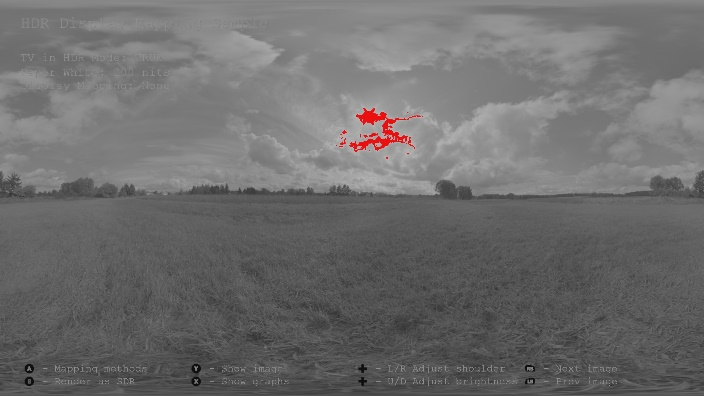
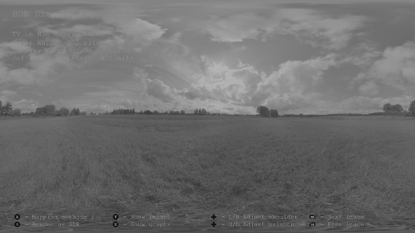

# HDR Display Mapping Sample

*This sample is compatible with the Microsoft Game Development Kit (March 2022)*

# Description

This sample shows that even when rendering a HDR scene on a HDR capable
TV, some tone mapping is still needed, referred to as "HDR display
mapping". HDR display mapping maps values that are brighter than what a
HDR TV can display, into the upper brightness range of the TV's
capabilities, so that details in the very bright areas of the scene
won't get clipped. Refer to the white paper "[HDR Display
Mapping](http://aka.ms/hdr-display-mapping)".


# Building the sample

If using an Xbox One devkit, set the active solution platform to `Gaming.Xbox.XboxOne.x64`.

If using Xbox Series X|S, set the active solution platform to `Gaming.Xbox.Scarlett.x64`.

*For more information, see* __Running samples__, *in the GDK documentation.*

# Using the sample

The sample uses the following controls.

| Action                                    |  Gamepad                  |
|-------------------------------------------|--------------------------|
| Toggle between different mapping methods  |  A button                 |
| Toggle between HDR and SDR rendering      |  B button                 |
| Highlight values brighter than the max brightness of TV |  Y button |
| Toggle displaying graphs / curves         |  X button                 |
| Adjust HDR display mapping soft shoulder  |  D-Pad Left/Right         |
| Adjust overall brightness of scene        |  D-Pad Up/Down            |

# Implementation notes

HDR to SDR tone mapping is needed to be able to visualize bright values
in a HDR scene on a SDR TV. These tone mapping operators, like Reinhard
and Filmic, map values in the following way, so that values brighter
than white will not be clipped

```
[Black..MaxBrightnessOfHDRScene] = [Black..White]
```

This sample shows that even when rendering a HDR scene on a HDR capable
TV, some tone mapping is still needed. We will refer to this as "HDR
display mapping". HDR display mapping maps values in the following way
so that values brighter than the maximum TV brightness won\'t get
clipped

```
[Black..White] = [Black..White]

[White..BrightShoulder] = [White-BrightShoulder]

[BrightShoulder..MaxBrightnessOfHDRScene] = [BrightShoulder..MaxBrightnessOfTV]
```

The reason for this is that different HDR TVs have different maximum
brightness levels, e.g. one TV could output a maximum of 600 nits, but
another could output 2000 nits. If the maximum brightness value of a HDR
scene is 1500 nits, then a TV that can output a maximum brightness of
2000 nits, will be capable of displaying all the values in the HDR
scene. But, on a 600 nits TV, all values above 600 nits will be
naturally clipped by the TV to 600 nits, thus losing all the details in
those bright areas of the scene. In fact, in such a case a simple HDR to
SDR tone mapping will show more details, it will just go up to white,
not bright, but detail in bright areas of the scene is very important to
add to the visual quality.

Implementing HDR display mapping can be done in several ways. This
sample shows how to implement it using the non-linear ST.2084 values,
which can be visualized using the X button in the sample. The following
three point are defined:

1.  **P0**, the start of a soft shoulder, e.g. 500 nits

2.  **P1**, the maximum brightness of the TV, e.g. 1000 nits

3.  **P2**, the maximum brightness of the HDR scene, e.g. 2000 nits

A simple Bezier curve is fitted using P0, P1 and P2.

Because this method is compromising brightness for more detail, it's a
good idea to be able to choose how much brightness is compromised for
detail. The sample therefore has three modes:

-   **None** -- No display mapping, just output the raw HDR values to
    the TV. Notice clipping in the very bright areas

-   **No Clipping** -- Maps the maximum brightness of the scene to the
    maximum brightness of the TV. All the detail can be seen, but the
    image is less bright

-   **Some Clipping** -- Maps the maximum brightness of the scene to
    something slightly brighter than the maximum brightness of the TV,
    e.g. by 200 nits. This allows for detail to be seen with only a
    small amount of clipping, which adds back some of the brightness


The sample also has a useful visualization to highlight bright values in
the scene that will get clipped (red) and values that is at the peak
brightness of the TV (purple).

|                                           |                                                                                                           |
|-------------------------------------------|-----------------------------------------------------------------------------------------------------------|
|  | Image displayed on SDR TV without any tone mapping. Purple pixels indicate all values rendered at 1.0f    |
|  | Image displayed on HDR TV without any HDR display mapping. Red pixels indicate all values in the scene that are brighter than what the TV can display, i.e. bright values that will be clipped.    | 
|  | Image displayed on HDR TV using HDR display mapping. Note that there are no red pixels any more, indicating that the bright values have now been mapped in such a way that it won’t exceed the maximum brightness of the TV. The purple pixels indicate values that are at the maximum brightness of the TV, but not brighter than the TV.    | 
|  | Same as above, but we now allow for some clipping, so that there is a good compromise between detail and brightness    | 

# Known issues

None

# Update history

Initial release March 2016

Updated for DirectX 12 June 2017

# Privacy Statement

When compiling and running a sample, the file name of the sample
executable will be sent to Microsoft to help track sample usage. To
opt-out of this data collection, you can remove the block of code in
Main.cpp labeled "Sample Usage Telemetry".

For more information about Microsoft's privacy policies in general, see
the [Microsoft Privacy
Statement](https://privacy.microsoft.com/en-us/privacystatement/).
